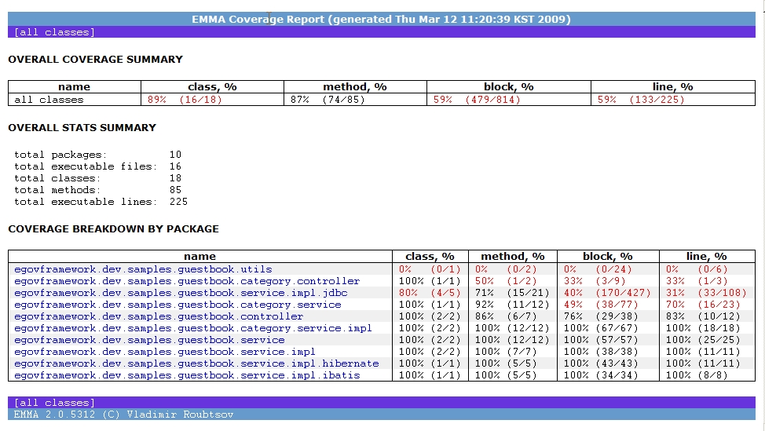

### EMMA에서 생성한 HTML 리포트 샘플

EMMA 리포트에서는 다음의 정보를 제공한다.

#### 통계치 그룹

| OVERALL COVERAGE SUMMARY               | 전체 클래스에 대한 통계치                                                      |
| -------------------------------------- | ------------------------------------------------------------------------------ |
| OVERALL STATS SUMMARY                  | 전반적인 요약 통계치                                                           |
| COVERAGE BREAKDOWN BY PACKAGE          | 패키지별 커버리지 통계치                                                       |
| COVERAGE BREAKDOWN BY SOURCE FILE      | 소스 파일별 커버리지 통계치                                                    |
| COVERAGE BREAKDOWN BY CLASS AND METHOD | 클래스와 메소드별 커버리지 통계치   여기에서 소스코드와의 연결 정보를 보여준다. |

#### 통계치 항목

| name      | 이름                                              |
| --------- | ------------------------------------------------- |
| class, %  | 클래스별 커버리지 백분율                          |
| method, % | 메소드별 커버리지 백분율                          |
| block, %  | basic block(커버리지 기본단위) 별 커버리지 백분율 |
| line, %   | 코드 라인별 커버리지 백분율                       |

#### 리포트 샘플 화면

* EMMA 사이트에서 제공하는 샘플 리포트 : [http://emma.sourceforge.net/coverage_sample_a/index.html](http://emma.sourceforge.net/coverage_sample_a/index.html)
* All classes, packages

  

#### 코드라인 하이라이트

코드 라인별로 테스트 코드 작성 여부를 표시한다

* Green Line : 테스트 코드 있다
* Red Line : 테스트 코드 없다
* Yellow Line : 여러 가지 이유로 애매하다. 예를 들어, 분기가 한 라인에 있어 반만 테스트 코드가 있는 경우.
