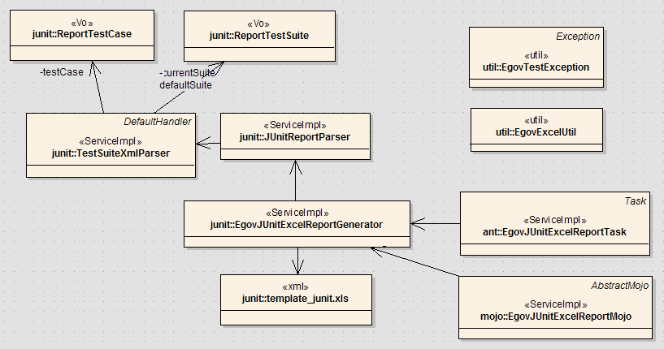
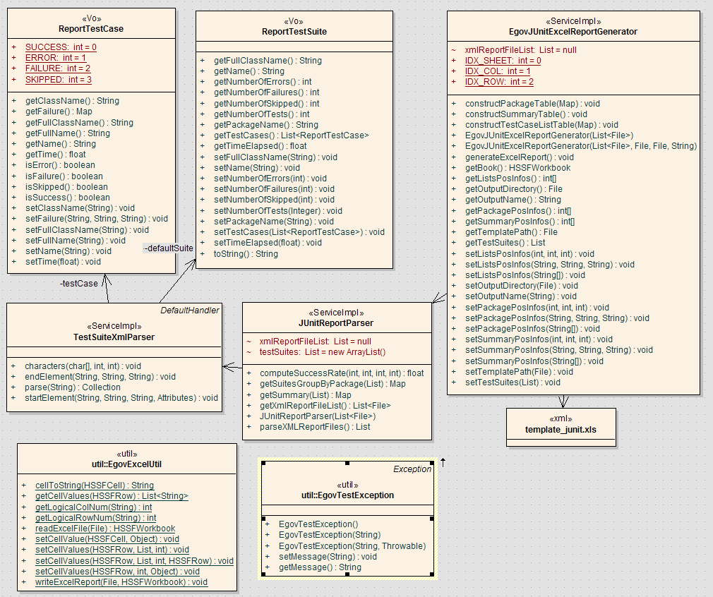
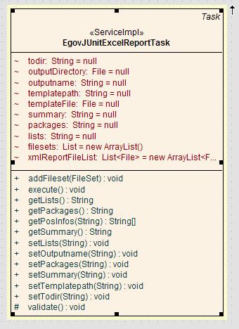
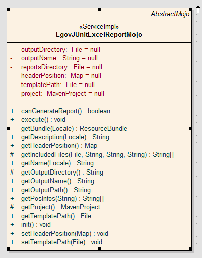

# 테스트 결과 Excel Report 상세

## 개요

JUnit 테스트 결과를 Excel Report로 생성하는 것은 오픈소스를 사용한 것이 아니라 전자정부 개발 프레임워크 개발환경의 테스트 도구에서 자체 개발한 기능이다. 여기에서는 Excel Report 기능에 대한 상세 내용에 대해 설명하도록 한다.

## 기능

JUnit TestCase를 자동화하게 되면 결과를 남기게 되는데, [Test Reporting](./test-reporting.md)에서 관련 내용을 확인할 수 있다. 국내에서는 엑셀 문서를 통한 보고나 관리 작업이 다양하게 일어나므로, 기본적으로 제공하는 Text, XML, HTML 외에 엑셀 형식을 작성할 수 있는 기능을 Ant Task와 Maven Plug-in으로 제공한다.

* Ant와 Maven을 통해 테스트 결과를 엑셀 형식의 문서로 남길 수 있다.
* 엑셀 템플릿의 스타일은 자체적으로 커스터마이즈해서 사용할 수 있다.
* 기본적인 템플릿 엑셀 파일을 제공한다.

자세한 사용법은 [Test Reporting](./test-reporting.md)과 [테스트 결과 Excel 리포트](./excel-test-report.md)를 참조하기 바란다.

## 구성

코드의 구조는 다음과 같다.

### 프로젝트

3개의 프로젝트로 구성되어 있다.

| 프로젝트명                | 빌드 도구     | 설명                                                                                                                                    |
| ------------------------- | ------------- | --------------------------------------------------------------------------------------------------------------------------------------- |
| egovframework-dev-tst     | Maven pom.xml | JUnit Test XML Report 파일을 파싱하고, 템플릿 엑셀 파일을 읽어 들인 후, 값을 매핑하여 엑셀 리포트 파일을 생성하는 핵심 작업을 담당한다. |
| egovframework-dev-tst-ant | Ant build.xml | egovframework-dev-tst.jar 파일을 사용하여 Ant Task를 제공한다.                                                                          |
| egovtest-maven-plugin     | Maven pom.xml | egovframework-dev-tst.jar 파일을 사용하여 Maven Plug-in을 제공한다.                                                                     |

### 패키지

| 프로젝트명                | 패키지명                           | 설명                                                                                                                                       |
| ------------------------- | ---------------------------------- | ------------------------------------------------------------------------------------------------------------------------------------------ |
| egovframework-dev-tst     | egovframework.dev.tst.report.junit | JUnit Test XML Report 파일을 파싱하고, 템플릿 엑셀 파일을 읽어 들여 값을 매핑하여 엑셀 리포트 파일을 생성하는 핵심 작업의 클래스들이 있다. |
| egovframework-dev-tst     | egovframework.dev.tst.report.util  | Exception과 엑셀 처리 유틸리티 클래스가 있다.                                                                                              |
| egovframework-dev-tst-ant | egovframework.dev.tst.report.ant   | Ant Task인 EgovJUnitExcelReportTask 클래스가 있다.                                                                                         |
| egovtest-maven-plugin     | egovframework.dev.tst.mojo         | Maven Plugin인 EgovJUnitExcelReportMojo 클래스가 있다.                                                                                     |

### 전체 클래스 구조

전체 클래스 구조는 다음과 같다.



관계를 설명하면 다음과 같다.

| 프로젝트명                | 클래스                        | 설명                                                                                                            |
| ------------------------- | ----------------------------- | --------------------------------------------------------------------------------------------------------------- |
| egovframework-dev-tst     | ReportTestCase                | 테스트 결과의 최소 단위인 TestCase 정보를 저장하는 VO 클래스이다.                                               |
| egovframework-dev-tst     | ReportTestSuite               | TestCase의 모음인 TestSuite 정보를 저장하는 VO 클래스이다.                                                      |
| egovframework-dev-tst     | TestSuiteXmlParser            | org.xml.sax.helpers.DefaultHandler를 상속받아 JUnit Test XML 파일을 파싱하여 각 VO 클래스에 담는다.             |
| egovframework-dev-tst     | JUnitReportParser             | 저장된 VO 클래스를 이용하여, Summary, Package, TestCase Lists 등 리포팅을 위한 정보를 재구성한다.               |
| egovframework-dev-tst     | EgovJUnitExcelReportGenerator | JUnitReportParser가 구성한 리포팅 정보를 템플릿 엑셀 파일을 읽어 목록을 구성하고 엑셀 리포트 파일을 생성한다.   |
| egovframework-dev-tst     | EgovExcelUtil                 | EgovJUnitExcelReportGenerator에서 엑셀 관련[Apache POI](http://poi.apache.org/)를 사용한 처리 유틸리티 클래스이다. |
| egovframework-dev-tst     | EgovTestException             | Exception 클래스이다.                                                                                           |
| egovframework-dev-tst     | template-junit.xls            | 엑셀 리포트 생성을 위한 기본 템플릿 엑셀 파일이다.                                                              |
| egovframework-dev-tst-ant | EgovJUnitExcelReportTask      | org.apache.tools.ant.Task를 상속하여 구현된 Ant Task 클래스이다.                                                |
| egovframework-dev-tst-ant | egovtest.properties           | Ant Task로 사용하기 위한 Task명을 정의한 프로퍼티 파일이다.                                                     |
| egovtest-maven-plugin     | EgovJUnitExcelReportMojo      | org.apache.maven.plugin.AbstractMojo를 상속하여 구현된 Maven Plug-in 클래스이다.                                |

## egovframework-dev-tst 프로젝트

전체 프로젝트 중에서 핵심이 되는 egovframework-dev-tst 프로젝트에 대해 설명한다.
각 클래스에 대해 설명하면 다음과 같다.



> ✔ egovframework-dev-tst 프로젝트의 클래스 설명은 API 문서와 해당 소스를 참조하기 바란다. 또한 [egovframework-dev-tst 프로젝트 소스 코드](./egovframework-dev-tst-source.md)에서 관련 내용을 확인하기 바란다.

### JUnit Test XML 구조

먼저, JUnit이 테스트 결과 생성하는 XML 파일의 구조에 대해 알아보자. XML 파일이 생성되는 곳은 Maven과 Ant로 사용시 각각 다르지만, TEST-[TestCase Full Name].xml 과 같이 생성된다. XML 구조는 다음과 같다.

- testsuite : 테스트 클래스에 대한 요약 정보를 갖는다.
  Attributes : errors, skipped, tests, time, failures, name
  - properties : 테스트 클래스가 테스트된 환경에 대한 정보를 담는다.
    - property : value
  - testcase : 테스트 클래스의 각 테스트 메소드에 대한 정보를 갖는다.
    Attributes : classname, time, name
    - skipped : @Ignore로 세팅된 테스트 메소드
    - error : 오류 발생시 오류 정보를 담는다.

### EgovJUnitExcelReportGenerator

**EgovJUnitExcelReportGenerator** 클래스는 템플릿 엑셀 파일을 읽어 들여, 테스트 결과 값을 매핑한 뒤 엑셀 리포트로 생성하는 역할을 한다. 이 때, [EgovExcelUtil](#egovexcelutil---엑셀-파일-핸들링)을 사용하여 엑셀 파일을 핸들링한다. 본 클래스와 EgovExcelUtil 클래스는 엑셀 파일을 핸들링하기 위해 엑셀 처리 오픈소스인 [Apache POI](http://poi.apache.org/)를 사용하였다. 자세한 내용은 [Apache POI Quick Guilde](http://poi.apache.org/spreadsheet/quick-guide.html)를 참조하도록 하고, 여기에서는 **EgovJUnitExcelReportGenerator** 클래스를 기준으로 설명하도록 한다.

#### Fields

| 구분                                        | 입력 파라미터                           | 설명                                                                                       | Default                           |
| ------------------------------------------- | --------------------------------------- | ------------------------------------------------------------------------------------------ | --------------------------------- |
| XML로부터 테스트 결과 정보를 갖기 위한 정보 | JUnitReportParser parser                | JUnit XML Parser                                                                           | N/A                               |
| XML로부터 테스트 결과 정보를 갖기 위한 정보 | List <File> xmlReportFileList       | JUnit Test XML 파일 Full Path 목록                                                         | 없으면 오류 처리                  |
| XML로부터 테스트 결과 정보를 갖기 위한 정보 | List <ReportTestSuite> testSuites   | Test Suite Lists                                                                           | N/A                               |
| 엑셀 파일 생성을 위해 필요한 정보           | File templatePath                       | Excel 리포트의 템플릿 리포트 파일의 Full Path                                              | "/template-junit.xls"의 파일 객체 |
| 엑셀 파일 생성을 위해 필요한 정보           | File outputDirectory                    | Excel 파일이 작성될 디렉토리 위치                                                          | 없으면 오류 처리                  |
| 엑셀 파일 생성을 위해 필요한 정보           | String outputName                       | Excel 리포트 파일명                                                                        | "egovtest-junit.xls"              |
| POI 엑셀 파일 정보                          | HSSFWorkbook book                       | POI 엑셀 파일 정보                                                                         | N/A                               |
| 템플릿 엑셀 파일의 각 헤더 위치 정보        | int[] summaryPosInfos                   | Summary 헤더 위치 정보                                                                     | { 0, 0, 3 }                       |
| 템플릿 엑셀 파일의 각 헤더 위치 정보        | int[] packagePosInfos                   | Package 헤더 위치 정보                                                                     | { 0, 0, 7 }                       |
| 템플릿 엑셀 파일의 각 헤더 위치 정보        | int[] listsPosInfos                     | TestCase Lists 헤더 위치 정보                                                              | { 1, 0, 3 }                       |
| 상수                                        | IDX_SHEET = 0, IDX_COL = 1, IDX_ROW = 2 | 템플릿 엑셀 파일의 헤더 위치 정보를 담고 있는 Array의 인덱스 상수. sheet, column, row 순서 |                                   |

#### Constructor

생성자에서 입력 받아야 하는 정보는 다음과 같다.

* List <File> xmlReportFileList : JUnit Test XML 파일의 Full Path List
* File templatePath : 템플릿 엑셀 파일 객체
* File outputDirectory : 파일 생성 위치 객체
* String outputName : 생성될 엑셀 파일 명

생성자에서 입력 받아야 하는 정보는 다음과 같다.

#### Methods

* `<strong>generateExcelReport()</strong>` : Excel 파일을 생성하는 메인 함수. [EgovJUnitExcelReportGenerator](./egovframework-dev-tst-source.md#egovjunitexcelreportgenerator) 참조
* `private void init()` : 필요한 입력 정보를 확인하고 입력되지 않은 정보가 있는 경우 오류 메시지를 출력한다
* `constructSummaryTable()` : Summary Table 항목을 채운다.
* `constructPackageTable(Map suitePackages)` : Package 별 Table 항목을 채운다.
* `constructTestCaseListTable(Map suitePackages)` : TestCase 별 Table list를 채운다.

### EgovExcelUtil - 엑셀 파일 핸들링

엑셀 파일 핸들링을 위해서는 Apache POI의 HSSF 객체를 사용할 것이다. 자세한 소스 코드는 [EgovExcelUtil](./egovframework-dev-tst-source.md#egovexcelutil)을 참조하기 바란다.

* `EgovExcelUtil.readExcelFile` : 엑셀 파일 읽어서 Workbook 생성한다.
* `EgovExcelUtil.writeExcelFile` : 엑셀 파일로 저장한다.
* `EgovExcelUtil.setCellValues` : Cell에 값을 세팅한다.
* `EgovExcelUtil.getLogicalRowNum` : 실제 열 값 (1-based) 값을 논리적인 0 기준의 열 값으로 바꾼다.
* `EgovExcelUtil.getLogicalColNum` : 실제 컬럼명인 알파벳 (e.g, A ~ Z) 값을 논리적인 0 기준의 칼럼값으로 바꾼다.
  ✔ 2자리 칼럼(eg, AA ~ ZZ)까지는 사용할 가능성이 거의 없으므로 현재 구현되지 않았으나 필요할 경우 로직을 구현해야 한다.

#### POI를 이용한 엑셀 파일 핸들링

Apache POI를 이용하면 엑셀 파일에 대한 핸들링을 하는 예는 [Apache POI Quick Guide](http://poi.apache.org/spreadsheet/quick-guide.html)를 참조하기 바란다.

## egovframework-dev-tst-ant 프로젝트

EgovJUnitExcelReportTask 클래스는 다음과 같다. 간략한 소스 소개는 [egovframework-dev-tst-ant 프로젝트 소스 코드](./egovframework-dev-tst-ant-source.md)에서 확인한다.



EgovJUnitExcelReportTask 클래스는 Ant Task 프레임워크에 맞게 구현된 클래스이다. Ant Task의 관점에서 구조를 살펴보자.

1. **build.xml**에서 사용할 구조를 정의한다. 즉, 입력받을 attribute와 기능을 정의한다. - [엑셀 리포트 생성 샘플](./test-reporting.md#엑셀-리포트-생성-샘플) 참조
   * simple build.xml
     ```xml
     <egov-junitreport todir="${testxls.dir}">
         <fileset dir="${testreports.dir}" includes="**/TEST-*.xml" />
     </egov-junitreport>
     ```
   * full setting build.xml
     ```xml
     <egov-junitreport todir="${testxls.dir}"
                       outputname="egovtest-junit-full.xls"
                       templatepath="${basedir}/build/template-kr.xls"
                       summary="0,B,6"
                       packages="0,B,11"
                       lists="1,A,5">
         <fileset dir="${testreports.dir}"
                  includes="**/TEST-*.xml" />
     </egov-junitreport>
     ```
2. `org.apache.tools.ant.Task`를 상속받은 Ant Task 클래스를 작성한다.
   ```java
   public class EgovJUnitExcelReportTask extends Task {
   ```
3. build.xml로부터 입력받을 Attribute를 Field로 선언하고 입력처리할 메소드를 작성한다.
   Attribute를 변수로 선언하고 setter를 만들어 두면 자동으로 값을 설정해준다.
   ```java
   /** Excel 파일이 작성될 디렉토리 위치 */
   String todir;
    
   public void setTodir(String todir) {
       this.todir = todir;
   }
   . . . 중략 . . .
   ```
4. `fileset` 태그로부터 입력받아 생성할 FileSet에 대해 선언하고 입력처리할 메소드를 작성한다.
   ```java
   List filesets = new ArrayList();

   public void addFileset(FileSet fileset) {
    filesets.add(fileset);
   }
   ```
5. `public void execute() throws BuildException` 메소드에서 처리할 기능을 작성한다.

## egovtest-maven-plugin 프로젝트

`EgovJUnitExcelReportMojo` 클래스는 다음과 같다.



`EgovJUnitExcelReportMojo` 클래스는 Maven에 **egovtest**라는 artifactID와 **junit-xls**라는 goal을 통해 엑셀 리포팅 기능을 제공하는 Plugin이다.
Maven에 기능을 제공하는 Plug-in 또한 몇 가지 틀을 갖추면 작성할 수 있다. 자세한 내용은 [http://maven.apache.org/plugin-developers/index.html](http://maven.apache.org/plugin-developers/index.html)을 참조하기 바란다.

### Maven Plugin Project 생성

* New Maven Project를 선택하고, archetype을 선택할 때 **GroupID:org.apache.maven.archetypes, ArtifactID: maven-archetype-mojo**를 선택하면 기본적인 구조를 만들어 준다.
* groupID, artifactID 정의 : **maven-${prefix}-plugin**이나 **${prefix}-maven-plugin** 형태의 이름을 짓도록 한다. 이는 나중에 goal을 호출할 때 prefix를 이용하여 짧게 할 수 있게 해준다.
* pom.xml은 다음과 같이 정의된다.
  ```xml

   
  	<groupId>egovframework.dev</groupId>
  	<artifactId>egovtest-maven-plugin</artifactId>
  	<packaging>maven-plugin</packaging>
  	<version>1.0.0</version>
  	<name>egovtest-maven-plugin Maven Mojo</name>
  	<url>http://maven.apache.org</url>
   
    . . . 중략 . . .
   
  		<dependency>
  			<groupId>org.apache.maven.shared</groupId>
  			<artifactId>maven-plugin-testing-harness</artifactId>
  			<scope>test</scope>
  			<version>1.1</version>
  		</dependency>
  		<dependency>
  			<groupId>org.apache.maven</groupId>
  			<artifactId>maven-plugin-api</artifactId>
  			<version>2.0</version>
  		</dependency>
  ```

### Mojo 클래스 작성

Mojo란 Maven Old Java Object의 약자로 Maven2의 goal을 의미하며, 자세한 내용은 [http://maven.apache.org/guides/introduction/introduction-to-plugins.html](http://maven.apache.org/guides/introduction/introduction-to-plugins.html)를 참조하기 바란다. Mojo를 작성하기 위해서는 미리 몇 가지를 정의해야 한다.

1. 본 Plugin을 사용하는 pom.xml에 설정할 내용을 정의한다. 특히, 디폴트 값과 입력받을 값이나 이름 등을 정의해둔다. - [엑셀 리포트 생성 샘플](./test-reporting.md#엑셀-리포트-생성-샘플) 참조
2. Mojo를 사용할 때 사용될 goal, phase, lifecycle : 이는 빌드 Lifecycle을 참조하기 바란다.
   본 Mojo는 다음과 같이 정의하였다. 이 부분은 클래스 주석으로 정의하면 된다.
   ```java
   /**
    * @goal junit-xls
    * @execute phase="test" lifecycle="egovtest"
    */
   ```
3. 클래스명을 정하고 (보통 Mojo를 끝에 붙인다.) `org.apache.maven.plugin.AbstractMojo`를 상속받는다.
   이 상위 클래스를 상속받을 경우, pom.xml에서 `<build>`…`</build>` 항목 안에서 설정을 할 수 있다.
   ```java
   import org.apache.maven.plugin.AbstractMojo;
    
   public class EgovJUnitExcelReportMojo extends AbstractMojo {}
   ```
4. 입력 받을 파라미터를 정의한다. 이 때 annotation을 사용하여 파라미터명, 디폴트값, 필수값 여부 등을 정의할 수 있다. 따라서 별도의 setter를 작성할 필요는 없다.
   ```java
       /**
        * Excel 파일이 작성될 디렉토리 위치
        * 
        * @parameter expression="${outputDirectory}"
        *            default-value="${project.build.directory}/egovtest"
        * @required
        */
       private File outputDirectory;
    
       /**
        * Excel 리포트 파일명
        * 
        * @parameter expression="${outputName}" default-value="egovtest-junit.xls"
        * @required
        */
       private String outputName;
    
       /**
        * Excel 리포트 생성을 위한 JUnit Test 결과 XML 파일 위치
        * 
        * @parameter expression="${reportsDirectory}"
        *            default-value="${project.build.directory}/surefire-reports"
        */
       // private File[] reportsDirectories;
       private File reportsDirectory;
    
       /**
        * Excel 리포트의 템플릿 리포트 파일의 각 헤더 위치 정보
        * 
        * @parameter expression="${headerPosition}"
        */
       private Map headerPosition;
    
       /**
        * Excel 리포트의 템플릿 리포트 파일의 Full Path
        * 
        * @parameter expression="${templatePath}"
        */
       private File templatePath;
    
       /**
        * Maven Project
        * 
        * @parameter expression="${project}"
        * @required @readonly
        */
       private MavenProject project;
   ```
5. `public void execute()` 메소드에 주요 기능을 작성한다.
   ```java
       public void execute() throws MojoExecutionException, MojoFailureException {
   ...
       }
   ```

## 확장 방안

### 주요 기능 확장

1. egovframework-dev-tst 프로젝트에 주요 기능을 작성하는 클래스를 추가한다.
2. 패키지명은 `egovframework.dev.tst.report.emma`와 같이 report 밑에 서브 패키지를 작성한다.
3. `egovframework.dev.tst.report.junit` 패키지의 클래스와 같이 VO 클래스, XMLParser, ReportParser, ExcelReportGenerator 등의 클래스를 기능에 맞게 작성한다.
4. Maven deploy를 통해 Nexus 서버에까지 deploy 한다.

### Ant Task 추가

주요 기능을 작성하고 난 후 필요에 따라 Ant Task를 작성한다.

1. egovframework-dev-tst-ant 프로젝트에 Ant Task 클래스를 추가한다.
2. `egovframework.dev.tst.report.ant` 패키지 밑에 `Egov<em>JUnit</em>ExcelReportTask`와 같이 클래스명을 작성한다.
3. [egovframework-dev-tst-ant 프로젝트](./egovframework-dev-tst-ant-source.md)를 참조하여 Ant Task를 작성한다.

### Maven Plugin 추가

주요 기능을 작성하고 난 후 필요에 따라 Maven Plugin을 작성한다.

1. egovtest-maven-plugin 프로젝트에 Mojo 클래스를 추가한다.
2. `egovframework.dev.tst.mojo` 패키지 밑에 `Egov<em>JUnit</em>ExcelReportMojo`와 같이 클래스명을 작성한다.
3. [Mojo 클래스 작성](#mojo-클래스-작성)을 참조하여 Mojo 클래스를 작성한다. 이 때, goal만 재정의해서 작성하면 된다. 나머지는 기존 Mojo와 동일하게 쓰면 된다.

## TestCase 설명

본 기능은 3개의 프로젝트가 모두 TDD(Test-driven Development) 방식으로 구현하고자 애썼다. 따라서, 구현 전에 작성했듯, 기능 구현 후에 작성했든 각 클래스에 대한 TestCase들을 작성해 두었고, 각 클래스가 처리해야 할 기능에 집중하여 테스트 코드를 작성하였다.

#### egovframework-dev-tst TestCase

egovframework-dev-tst 프로젝트의 TestCase는 주로 JUnit4와 Unitils를 이용한 일반적인 TestCase이다. 각 테스트 코드에서 사용하는 자료들은 resources 디렉토리에 위치한다. 특히 `JUnitExcelReportGeneratorTest` 클래스는 Apache POI를 사용하여 엑셀 파일이 잘 작성되고 스타일과 헤더값들이 제대로 작성되어 있는지 등을 테스트하는 내용까지 포함되어 있다.

#### egovframework-dev-tst-ant TestCase

egovframework-dev-tst-ant 패키지의 TestCase는 Ant Task를 테스트하기 위한 테스트 코드이다. Ant에서는 Task를 테스트할 수 있도록 JUnit 3.8을 확장한 Test Framework을 제공한다. 이를 통해 build.xml에 설정한 내용이 제대로 수행되는지 확인해 볼 수 있다.

1. 테스트할 build.xml을 작성한다. - 작성 방법은 일반 build.xml 작성과 동일하다. 소스를 직접 참조한다.
2. `org.apache.tools.ant.BuildFileTest`를 상속하여 TestCase를 작성한다.
   ```java
   import org.apache.tools.ant.BuildFileTest;
    
   public class JUnitExcelReportTaskTest extends BuildFileTest
   ```
3. 테스트할 build.xml을 읽어 들여 가상의 프로젝트를 구성한다.
   ```java
   public void setUp() throws Exception {
       configureProject(TestUtil.getBaseDirString(this.getClass()) + "/unit/egovtest-excel-test/build.xml");
   }
   ```
4. `org.apache.tools.ant.BuildFileTest`에서 정의한 다양한 메소드를 활용하여 테스트 코드를 작성한다.

#### egovtest-maven-plugin TestCase

Mojo를 작성할 때도 pom.xml을 테스트할 수 있는 기반을 제공해 준다.

1. 테스트할 pom.xml을 작성한다.
2. `org.apache.maven.plugin.testing.AbstractMojoTestCase` 클래스를 상속받아 TestCase를 작성한다.
   ```java
   import org.apache.maven.plugin.testing.AbstractMojoTestCase;
    
   public class JUnitExcelReportMojoTest extends AbstractMojoTestCase {}
   ```

## 참고자료

* Apache POI : [http://poi.apache.org/](http://poi.apache.org/)
  * Busy Developers' Guide to HSSF and XSSF Features : [http://poi.apache.org/spreadsheet/quick-guide.html](http://poi.apache.org/spreadsheet/quick-guide.html)
* Custom Ant Task 작성
  * Apache Ant Manual : [http://ant.apache.org/manual/](http://ant.apache.org/manual/)
  * Introduction to Custom Ant Tasks : [http://www.developer.com/java/article.php/3630721](http://www.developer.com/java/article.php/3630721)
  * More on Custom Ant Tasks : [http://www.developer.com/java/article.php/3636196](http://www.developer.com/java/article.php/3636196 "http://www.developer.com/java/article.php/3636196")
* Maven Home : [http://maven.apache.org/](http://maven.apache.org/)
  * Write Maven Plugins : [http://maven.apache.org/plugin-developers/index.html](http://maven.apache.org/plugin-developers/index.html)
* [테스트 결과 Excel 리포트](./excel-test-report.md)
