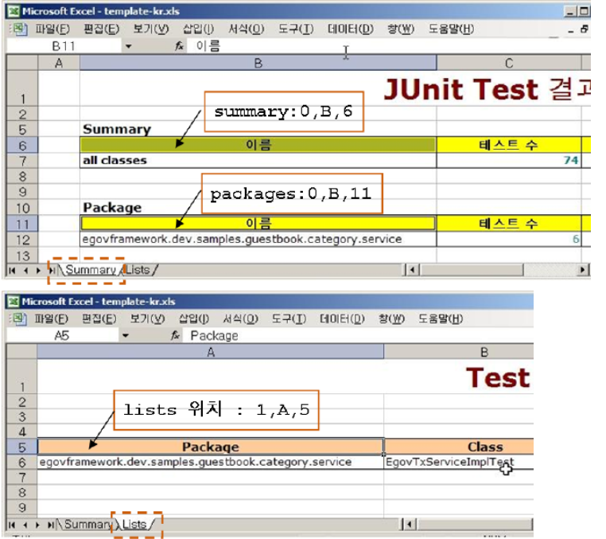
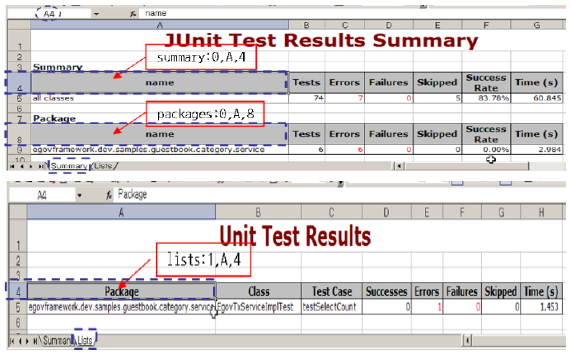
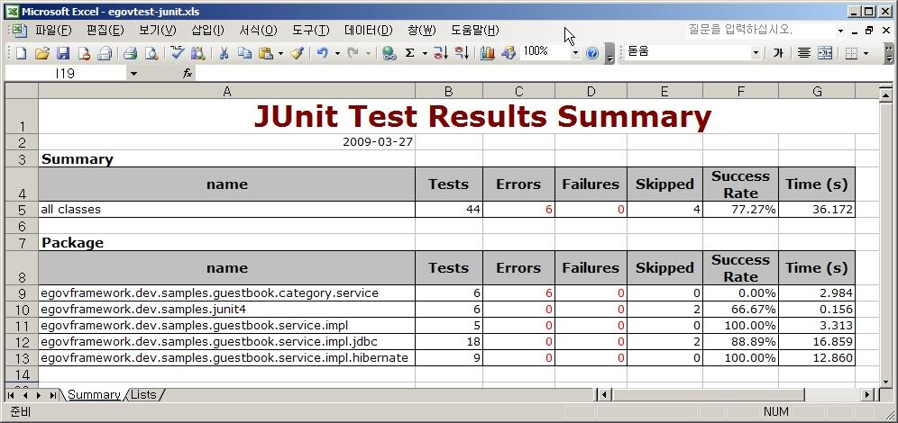
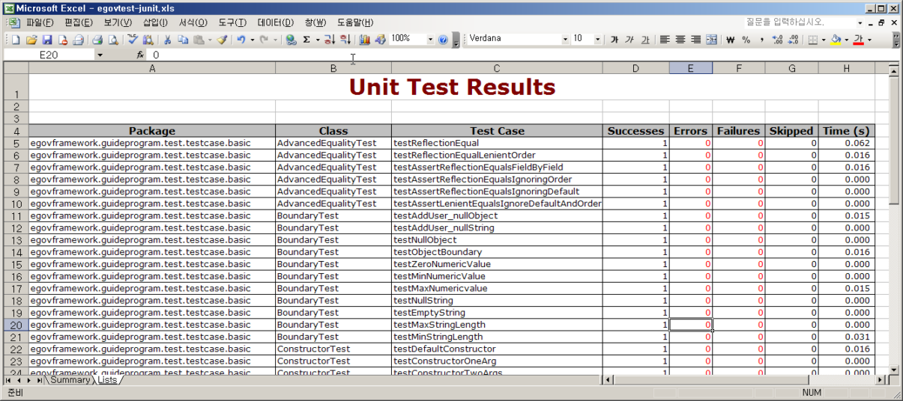
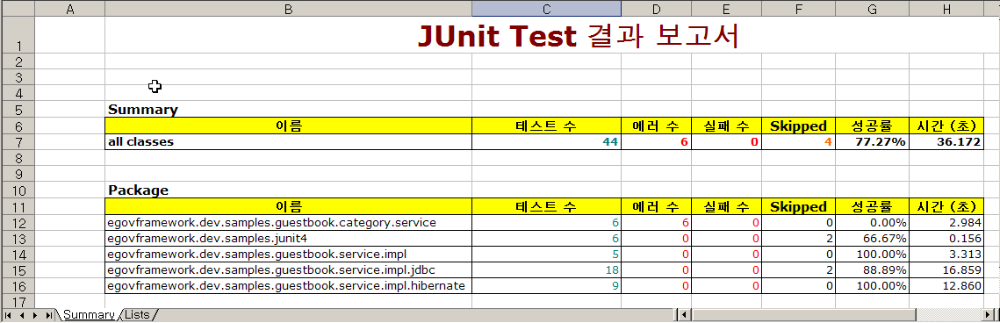
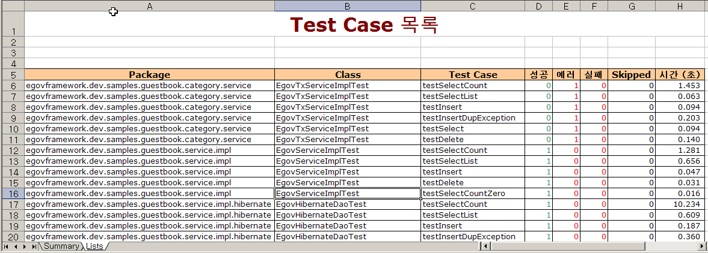

# 테스트 결과 Excel 리포트

테스트 결과를 엑셀 형식으로 리포트하는 기능은 오픈소스가 아닌 전자정부 개발프레임워크 개발환경에서 추가 개발한 내용이다.
기본적으로 Ant나 Maven을 사용할 경우 스타일이 달라지지는 않으며, 별도로 커스터마이즈된 템플릿 엑셀 파일을 사용할 경우 그 스타일에 따른 엑셀 리포트를 만들게 된다. 기본적인 내용은 [엑셀 리포트 생성 방법](./test-reporting.md#엑셀-리포트-생성-방법)을 참조하도록 한다.
테스트 결과 Excel Reporting 유지보수 관련해서는 [테스트 결과 Excel Report 상세](./excel-test-report-detail.md)를 참조하기 바란다.

## 테스트 결과 엑셀 리포트 생성 설정값

Excel 형식의 리포트에서는 디폴트 템플릿을 사용하게 되며, 앞에서 보여준 모습의 Excel 리포트를 생성하게 된다.
그 외에도 다양한 설정이 가능한데, 설정하지 않을 경우 디폴트 값을 사용하게 된다.
엑셀 리포트는 원하는 스타일의 템플릿을 만들고 설정 정보를 지정하면 엑셀 스타일을 커스터마이즈할 수 있어, 프로젝트마다 원하는 모양으로 리포트를 생성할 수 있다. 그 사용법은 다음과 같다.

### Maven 설정값

| Attribute                                                             | Default                                            | 설명                                                                                            |
| --------------------------------------------------------------------- | -------------------------------------------------- | ----------------------------------------------------------------------------------------------- |
| outputDirectory                                                       | ${project.build.directory}/egovtest                | 엑셀 파일이 생성될 디렉토리                                                                     |
| outputname                                                            | egovtest-junit.xls                                 | 엑셀 리포트명                                                                                   |
| templatepath                                                          | template-junit.xls                                 | 템플릿 엑셀 파일 위치 정보 (Full Path), 디폴트는 jar에서 제공됨                                 |
| headerPosition   - summary   - packages   - lists |   "0,A,4"   "0,A,8"   "1,A,4" | Summary, Package, TestCase Lists 정보의   엑셀 테이블 헤더 위치 정보 (sheet, column, row) |
| reportsDirectory                                                      | ${project.build.directory}/surefire-reports        | 테스트 결과 XML 파일 위치                                                                       |

### Ant 설정값

| Attribute    | Default            | 설명                                                                  |
| ------------ | ------------------ | --------------------------------------------------------------------- |
| todir        | 없음               | 엑셀 파일이 생성될 디렉토리                                           |
| outputname   | egovtest-junit.xls | 엑셀 리포트명                                                         |
| templatepath | template-junit.xls | 템플릿 엑셀 파일 위치 정보 (Full Path), 디폴트는 jar에서 제공됨       |
| summary      | "0,A,4"            | Summary 정보의 엑셀 테이블 헤더 위치 정보 (sheet, column, row)        |
| packages     | "0,A,8"            | Package 정보의 엑셀 테이블 헤더 위치 정보 (sheet, column, row)        |
| lists        | "1,A,4"            | TestCase Lists 정보의 엑셀 테이블 헤더 위치 정보 (sheet, column, row) |
| fileset      | 없음               | 테스트 결과 XML 파일 위치                                             |

## 템플릿 파일 커스터마이즈하여 사용하는 방법

엑셀 형식의 리포트를 생성할 경우, 템플릿 파일을 생성하여 리포트의 스타일을 프로젝트마다 변경하여 사용할 수 있다.변경 가능한 내용과 변경할 수 없는 내용은 다음과 같다.

* 변경 가능한 내용 : 엑셀 파일의 전체 스타일, 헤더의 시작 위치
* 변경 불가능한 내용 : 리스팅의 항목 및 순서

| 구분    | 항목                                                                      |
| ------- | ------------------------------------------------------------------------- |
| Summary | Test, Errors, Failures, Skipped, Success Rate, Time (s)                   |
| Package | Test, Errors, Failures, Skipped, Success Rate, Time (s)                   |
| Lists   | Package, Class, Test Case, Successes, Errors, Failures, Skipped, Time (s) |

### 커스터마이즈 템플릿 예

다음 그림과 같이 색이나 내용을 바꾸더라도, 디폴트 템플릿을 참고하여 헤더 정보를 잘 설정한다면, 그 스타일이 그대로 유지가 된다.

### 디폴트 템플릿

## 테스트 결과 생성된 Excel 리포트

테스트 결과 생성된 Excel 리포트의 모습은 다음과 같다.

| 항목         | 설명                                                              |
| ------------ | ----------------------------------------------------------------- |
| Tests        | 전체 TestCase 수                                                  |
| Errors       | 전체 에러가 발생한 TestCase 수                                    |
| Failures     | 전체 실패한 TestCase 수                                           |
| Skipped      | 전체 테스트를 수행하지 않은 TestCase 수 (@Ignore 설정된 TestCase) |
| Success Rate | 전체 성공한 TestCase 백분율                                       |
| Time         | TestCase가 수행되는 걸린 초단위 시간                              |

* 디폴트 설정을 사용한 경우

  * Summary 화면

  

  * TestCase Lists 화면

  
* 커스터마이즈된 템플릿을 사용한 경우

  * Summary 화면

  

  * TestCase Lists 화면

  
