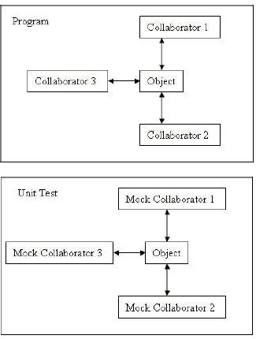
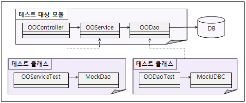

# Mock Support

## 개요

Unit Test Case 작성 시 Mock 객체 (모의 객체)를 사용하는 방법에 대해 가이드한다.

## 설명

### Mock 객체의 의미

Mock 객체([Mock Object - wikipedia](http://en.wikipedia.org/wiki/Mock_object), [mock - 네이버 영어사전](http://endic.naver.com/search.nhn?query_utf=mock&kind=keyword))는 Unit Test의 독립성(isolation)을 높여주기 위해 사용하며, 테스트하고자 코드와 관련이 있는 객체(collaborator)를 흉내내어 Unit Test를 수행할 수 있도록 도와주는 객체이다.   
  
다음과 같이 Program에서 Object라는 객체를 테스트하고자 할 경우, 그 Object는 다른 클래스와 관계를 갖고 있게 마련이다.  
개발자는 Object 하나만을 테스트하고 싶고, 여러 가지 이유로 Collaborator1, Collaborator2, Collaborator3 객체를 사용할 수가 없다고 한다면,  
컴파일에 지장이 없도록 Collaborator를 흉내내는 Mock 객체 (MockCollaborator1, MockCollaborator2, MockCollaborator3)를 생성하고 Object가 사용하는 메소드에 대해서만 원하는 동작을 정의한 뒤, Object를 테스트하는 것이다.  
  


좀더 쉬운 예를 들자면, 테스트 대상 클래스의 컴파일 오류를 없애기 위해서 임시로 Mock 객체를 생성할 수도 있다. 혹은 웹컨테이너나 DB 환경 등을 사용해야 하는데, 그 환경을 구성하기가 어렵다면, 해당 환경을 흉내내는 환경을 Mocking하거나 이미 Mocking한 환경을 사용할 수 있다. 이러한 모든 것들을 Mock이라 한다.

정리하자면, 다음과 같은 경우 Mock 객체를 사용할 수 있다.   

* 진짜 객체를 준비 설정하기 어렵다
* 진짜 객체가 직접 유발시키기 어려운 동작을 한다.
* 진짜 객체가 느리다.
* 진짜 객체가 사용자 인터페이스를 가지거나 사용자 인터페이스 자체다
* 테스트가 진짜 객체에게 그것이 어떻게 사용되었는지 물어보아야 한다.
* 진짜 객체가 아직 존재하지 않는다. (다른 팀이나 새로운 하드웨어 시스템과 함께 일할 때 흔한 문제다)

### 실행환경 기반의 TestCase 개발할 경우 Mock 작성 가이드

실행환경을 사용할 경우 개발자는 다음 그림과 같이 **Controller, Service, DAO 등 Tier 별로 코드를 작성하게 되며 DB를 사용하는 환경이 구성**되게 될 것이다. 이에 대해 Mock을 이용하여 TestCase를 각각 작성하여 **각 TestCase 사이의 독립성을 높이고자** 한다면, 각 테스트 대상에 대해 **테스트 코드**(_OOServiceTest, OODaoTest_)를 작성하고 대상 코드가 사용하는 **Collaboratior**(_OODao, DB_)에 대해 각각 **Mock 객체**(_MockDao, MockJDBC_)를 작성할 수 있다.  
  
혹시 더 관련있는 클래스가 있다면 해당 클래스에 대해서도 Mock을 작성하거나 코드 내에서 Mocking하여 대상 코드의 테스트에 집중할 수 있다. 특히, DB의 경우 실제 DB를 사용하여 테스트하고자 한다면, DB Support를 참조하면 되고, 드물게 JDBC 코딩 관련해서는 Mock을 사용하여 DB 자체에 대한 테스트를 배제하고 Dao에 대한 테스트에만 집중할 수도 있다.  



### Mock 객체 구현 종류

개발자가 Mock을 사용할 경우, 다음과 같은 3가지 경우가 있을 수 있다.

1. **이미 구현된 Mock 객체 사용**  
 JEE 환경의 웹컨테이너나 DB, 메일서버 등은 아주 흔히 사용되는 테스트하기 어려운 환경이다. 이러한 것들은 이미 오픈소스나 상용 S/W로 Mock 환경이나 Mock 객체를 어느 정도 구현하여 제공하기도 한다. 특히 실행환경에서 채택한 Spring에서는 테스트 클래스를 작성하기 쉽도록 다양한 Mock 객체와 유틸리티를 제공한다.  
 예) Spring Test (web, JNDI), [Mockrunner](http://mockrunner.sourceforge.net/)  
 ✔ 사용법과 샘플에 대한 설명은 이미 구현된 Mock 객체 사용을 참조한다.
2. **Mock 라이브러리 사용**  
 간단한 클래스나 인터페이스가 있는 경우, 컴파일 오류를 방지하기 위해서나 타 객체에 대한 의존성을 줄이기 위해 자신의 TestCase 코드 내에서 잠시 타 객체에 대해 Mocking할 수 있도록 제공하는 [다양한 오픈소스](http://www.mockobjects.com/)가 있다. 본 개발환경에서는 [EasyMock](http://www.easymock.org/)을 사용한다.  
 예) <http://www.mockobjects.com/>, [EasyMock](http://www.easymock.org/), [JMock](http://www.jmock.org/), [Mockito](http://code.google.com/p/mockito/) 등  
 ✔ 사용법과 샘플에 대한 설명은 Mock 라이브러리 사용을 참조한다.
3. **Mock으로 사용할 Collaborator를 직접 구현**  
 코드 내에서 자주 Mocking되거나 여러 곳에서 사용되는 클래스나 테스트를 위한 환경을 별도로 작성해놓고 싶은 경우에 직접 Mock 클래스를 생성할 수 있다.  
 예) Commons-mail Mock, SMS Mock 등  
 ✔ 사용법과 샘플에 대한 설명은 Mock으로 사용할 Collaborator를 직접 구현을 참조한다.

## 환경설정

Maven Project 인 경우에는 아래와 같은 dependency 를 설정하면 된다.

```xml
<dependency>
    <groupId>junit</groupId>
    <artifactId>junit</artifactId>
    <version>4.4</version>
    <scope>test</scope>
</dependency>

<dependency>
    <groupId>org.easymock</groupId>
    <artifactId>easymock</artifactId>
    <version>2.4</version>
    <scope>test</scope>
</dependency>

<dependency>
    <groupId>org.easymock</groupId>
    <artifactId>easymockclassextension</artifactId>
    <version>2.4</version>
    <scope>test</scope>
</dependency>

<dependency>
    <groupId>org.dbunit</groupId>
    <artifactId>dbunit</artifactId>
    <version>2.4.3</version>
    <scope>test</scope>
</dependency>

<dependency>
    <groupId>org.unitils</groupId>
    <artifactId>unitils</artifactId>
    <version>2.2</version>
    <scope>test</scope>
</dependency>

<dependency>
<groupId>org.springframework</groupId>
<artifactId>spring-mock</artifactId>
<version>2.0.8</version>
    </dependency>
```

> ✔ **주의**: Springframework 2.5 에서는 JUnit 4.5 버전이 동작하지 않으므로, JUnit 4.4 버전을 사용하도록한다.   
> ✔ **주의**: Test Automation / Test Reporting / Test Coverage 분석 관련하여서는 Test Automation, Test Reporting, Test Coverage 를 참조하도록 한다.
> ✔ 필요할 경우 Maven > Update project configuration 를 수행하여 반영할 수 있다.

## 사용법

Mock을 사용한 예에 대해 가이드 프로그램에 샘플 코드를 포함하였다. Mock 객체 구현 종류에서 설명한 것과 같이 각각에 맞는 샘플에 대해 설명하도록 한다.

### 이미 구현된 Mock 객체 사용

이미 구현되어 있는 Mock 객체는 주로 특정 클래스라기보다 환경을 구성하는 클래스 군(群)이라고 볼 수 있다. 즉, JDBC API에 대한 Mock, Servlet API에 대한 Mock 등이 그것이다. 여기에서는 Spring Test에서 제공하는 Servlet API Mock과 JNDI Mock 사용에 대한 샘플을 설명하도록 하겠다. 자세한 내용은 [Spring Reference - 8.Testing](http://static.springframework.org/spring/docs/2.5.6/reference/testing.html)과 [Spring 2.5.6 API](http://static.springframework.org/spring/docs/2.5.6/api/)를 참조하기 바란다.  
  
* **Servlet API Mock**  
 웹컨테이너의 Http Request/Response 및 HttpSession 등과 같은 Servelet API에 대한 다양한 Mock 객체를 제공하여 웹컨테이너를 Mocking하여 단위테스트에 집중할 수 있게 해준다.
* **JNDI Mock**  
 JNDI Lookup을 사용하고 있는 클래스를 테스트하기 위해 WAS 제품과 같은 Container의 기동 없이 JNDI 서비스를 이용할 수 있도록 JNDI 등록/바인딩/룩업/해지 등의 기능을 제공한다.

#### Servlet API Mock 사용

Controller를 테스트하고자 한다면 기본적으로 웹컨테이너가 필요할 수밖에 없다. 이에 대해 Spring Test에서는 Servlet API를 Mocking한 객체를 제공하고 있다. 전체 샘플은 HttpRequestMockTest 소스에서 확인할 수 있다.  
  
예를 들어, 다음과 같은 Servlet 혹은 Controller 클래스를 테스트하고자 한다고 가정하자.

```java
public class Servlet extends HttpServlet {

    public void service(HttpServletRequest request, HttpServletResponse response)
            throws ServletException {
        request.setAttribute("res", this.getClass().getSimpleName());
    }
}
```

만약 위와 같이 HttpServletRequest와 HttpServletResponse를 사용하는 객체를 테스트하고자 한다면, 두 클래스를 준비해줘야 하나 이는 웹컨테이너의 도움없이는 어렵다. 이런 경우, 웹컨테이너를 준비하고 설정하고 띄우는 등 번거로울 수밖에 없다. Unit Test를 위해 Servlet 클래스가 사용하고 있는 HttpServletRequest와 HttpServletResponse와 같은 인터페이스를 구현한 Mock class가 필요하다. 다행히 이런 환경은 자주 닥치는 경우이기 때문에 Spring에서 web 관련 다양한 Mock Class를 제공하고 있다.  
  
그래서, Servlet을 테스트하는 코드를 작성할 때 그 Mock 클래스를 사용하여 다음과 같이 테스트 코드를 작성한다.

```java
private MockHttpServletRequest request;
private MockHttpServletResponse response;
```

테스트 대상 클래스도 test fixture로 선언한다.

```java
private Servlet servlet;
```

실제로 테스트 대상 코드에서 사용하는 HttpServletRequest와 HttpServletResponse는 Mock 클래스로 대체하여 준비한다.

```java
@Before
public void setUp() {
    servlet  = new Servlet();

    request  = new MockHttpServletRequest();
    response = new MockHttpServletResponse();
}
```

이제 Mock 클래스가 준비되었으니 이를 이용하여 원하는 테스트 코드를 작성하면 된다.

```java
@Test
public void testCallMyServlet() throws Exception {
    servlet.service(request, response);
    assertEquals(servlet.getClass().getSimpleName(), (String) request.getAttribute("res"));
}
```

#### JNDI Mock 사용

웹서비스를 사용하거나 DB 연결 정보를 JNDI 정보로부터 가져올 경우 JNDI가 등록된 WAS 환경을 필요로 하게 된다. 이에 대해 Spring Test에서는 JNDI를 Mocking한 간단한 객체를 제공하고 있다. 전체 샘플은 JNDIMockTest 소스에서 확인할 수 있다.  
  
예를 들어, 다음과 같은 JNDI를 사용하여 DB 연결 정보를 가져오는 클래스를 테스트하고자 한다고 가정하자.

```java
/** name */
private static final String name = "java:comp/env/jdbc/myDS";

public DataSource createDataSource() {
    DriverManagerDataSource dataSource = new DriverManagerDataSource();
    dataSource.setDriverClassName("org.hsqldb.jdbcDriver");
    dataSource.setUrl("jdbc:hsqldb:sampledb");
    dataSource.setUsername("sa");

    return dataSource;
}
```

테스트 코드는 다음과 같이 작성할 수 있다.

```java
/**
 * Binding 하고자 하는 객체를 얻어와 주어진 이름으로 바인딩을 하는 테스트 초기 셋업 메소드
 */
@BeforeClass
public static void setUp() throws Exception {
    Object objectToBind = createDataSource();

    SimpleNamingContextBuilder.emptyActivatedContextBuilder().bind(name, objectToBind);
}

/**
 * Binding 한 객체에 대한 lookup 이 제대로 실행되는지 확인하는 테스트
 * 
 * @throws Exception
 */
@Test
public void testBindedObjectIsNull() throws Exception {
    DataSource dataSource;

    dataSource = (DataSource) new InitialContext().lookup(name);
    Assert.assertNotNull("Binded object is dataSource.", dataSource);
}
```

JNDI 부분은 위와 같이 작성하고 계속해서 필요한 테스트 코드를 작성해 나가면 된다.

### Mock 라이브러리 사용

테스트 대상 코드가 사용하는 간단한 클래스나 인터페이스에 대해 Mock 클래스를 작성하고 있기보다는 관심있는 메소드에 대해서만 Mocking하여 내가 테스트하는 일에 지장이 없도록 할 수 있는 Mock Framework이 몇 가지 있다. 그 중 EasyMock을 사용할 수 있는데, 본 개발환경에서는 EasyMock과 함께 Unitils를 함께 사용할 경우 더욱 간단하게 Mocking할 수 있다. EasyMock 사용에 대해서는 [EasyMock Documentation](http://www.easymock.org/Documentation.html)이나 각종 관련 블로그를 확인하기 바란다. 

#### EasyMock 사용 예

여기에서는 EasyMock과 Unitils를 함께 사용한 코드에 대해 설명하도록 하겠다. EasyMockTest 소스에서 전체 소스를 확인하고 비교해보기 바란다. Unitils의 Mock 지원 관련해서는 [Unitils Tutorial - Testing with Mock objects](http://unitils.sourceforge.net/tutorial.html#Testing_with_mock_objects)와 [EasyMock Support](http://unitils.sourceforge.net/tutorial.html#EasyMock_support)를 참조하기 바란다.  
  
같은 경우에 대해 EasyMock만을 사용하여 개발한 경우에 대해서는 EasyMock만 사용한 경우를 참조하여 비교해보기 바란다.  
  
본 샘플에서는 CollaboratorDao를 사용하고 있는 EasyMockService에 대한 테스트 코드 예를 담았다. Mock으로 만드는 대상은 인터페이스만 있으면 충분하므로 CollaboratorDao은 인터페이스이고 그 구현 클래스는 어떤 것이 와도 상관이 없다.

테스트 대상 코드(EasyMockService)는 다음과 같다. selectList와 insert 메소드를 갖고 있고, 각각 CollaboratorDao의 selectList와 insert 메소드를 호출하고 있다.

```java
@Service("easyMockService")
public class EasyMockService {

    @Resource(name="collaboratorDao")
    private CollaboratorDao collaboratorDao;

    public List<BoardVO> selectList() throws Exception {
        List<BoardVO> result =  collaboratorDao.selectList();
        return result;
    }

    public void insert(BoardVO vo) throws Exception {
        collaboratorDao.insert(vo);
    }

}
```

CollaboratorDao는 다음과 같은 인터페이스이다.

```java
public interface CollaboratorDao {
    List<BoardVO> selectList();
    void insert(BoardVO vo);
}
```

테스트 코드는 다음과 같이 작성할 수 있다.

1. Unitils 기반 하에 테스트를 수행할 것임을 선언한다.  
   ```java
   @RunWith(UnitilsJUnit4TestClassRunner.class)  
   public class EasyMockTest {  
       . . .  
   }
   ```

2. Mock 대상을 선언한다.  
   * `@Mock` : Mock으로 정의함  
   * `@InjectIntoByType` : CollaboratorDao가 Service 클래스에 Inject됨.  
   
   ```java
   @Mock  
   @InjectIntoByType  
   private CollaboratorDao mockDao;
   ```

3. 테스트 대상 클래스를 선언한다.  
   * `@TestedObject` : 테스트 대상 클래스로 Mock 객체가 Inject될 대상이다.  
   
   ```java
   @TestedObject  
   private EasyMockService service;
   ```

4. Mocking하고자 하는 메소드를 정의한다.  
   이는 테스트 대상 메소드와 관련된 메소드에 대해 미리 정의를 해두는 것이다. 해당 메소드의 signature를 정의하고 리턴값이 있는 경우 리턴값을 정해놓고 그 데이터를 이용하여 테스트를 진행하는 것이다.  
   
   * Mocking 대상 메소드가 리턴값을 갖지 않는 경우는 다음과 같이 한다.  
     ```java
     mockDao.insert(board);  
     EasyMockUnitils.replay();
     ```
   
   * Mocking 대상 메소드가 리턴값을 갖는 경우는 다음과 같이 한다.  
     ```java
     expect(mockDao.selectList()).andReturn(Arrays.asList(new BoardVO(101), new BoardVO(102)));  
     EasyMockUnitils.replay();
     ```

5. 테스트 대상 메소드를 실행하고 이후 테스트를 확인하는 등의 코드를 작성한다.  
   ```java
   // 테스트 대상 메소드를 실행한다.  
   List<BoardVO> selectList = service.selectList();  

   // 결과를 확인한다.  
   assertNotNull("테스트 대상이 잘 생성되었는지 확인", selectList);  
   assertPropertyLenientEquals("id", Arrays.asList(101, 102), selectList);
   ```

### Mock으로 사용할 Collaborator를 직접 구현

가이드 프로그램에는 프로젝트에서 필요로 하는 공통된 Mock 클래스를 작성하는 경우에 대해 샘플 코드를 담았다. EmailMockTest와 JDBCMockTest가 그것인데, 그 내용을 일일이 설명하기보다는 Mock을 직접 작성하는 경우의 일반적인 방법에 대해서만 간단히 언급하도록 하겠다. 그 외에는 일반적인 코드를 작성하는 것과 다르지 않다.

1. Mocking하고자 하는 인터페이스를 상속받는 클래스를 생성한다.
2. 인터페이스에 정의된 메소드를 구현하되 테스트 대상에서 사용하는 메소드만 구현한다.  
   이 때, 구현 내용은 원하는 데이터를 단순히 리턴하거나 일부 필요한 로직만 구현하는 정도이면 된다.

## 참고자료

* Mock Objects : <http://www.mockobjects.com>
* EasyMock : <http://www.easymock.org>
* EasyMock Documentation : <http://www.easymock.org/Documentation.html>
* Spring 2.5.6 Reference - 8.Testing : <http://static.springframework.org/spring/docs/2.5.6/reference/testing.html>
* Spring 2.5.6 API : <http://static.springframework.org/spring/docs/2.5.6/api/>
* Unitils Tutorial - Testing with Mock objects : <http://unitils.sourceforge.net/tutorial.html#Testing%5Fwith%5Fmock%5Fobjects>
* Unitils Tutorial - EasyMock Support : <http://unitils.sourceforge.net/tutorial.html#EasyMock%5Fsupport>
* Unitils Guildelines <http://unitils.sourceforge.net/guidelines.html>
