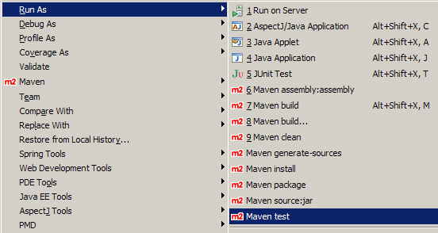
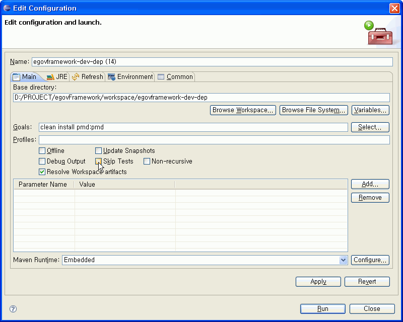

## 이클립스에서 Maven 실행하기

이클립스에서 Maven을 실행하기 위해서는 [m2eclipse](http://m2eclipse.sonatype.org/index.html)가 설치되어 있어야 하고, m2eclipse를 사용하여 실행하는 방법에 대해 설명하도록 한다.

* **기본적인 Maven goal 실행** : Context Menu에서 Run As 에서 실행 - **clean, install, package, test** 등 수행 가능

* **별도의 goal 실행**
  1. Context Menu에서 **Run As > Maven build…** 선택
  2. Goals에 원하는 goal 입력
  3. Run 클릭

| Name           | Run As Maven 이름                                              |
| -------------- | -------------------------------------------------------------- |
| Base directory | 적용될 프로젝트 디렉토리                                       |
| Goals          | 실행할 goal. 여러 개를 수행할 경우, space를 이용하여 구분한다. |
