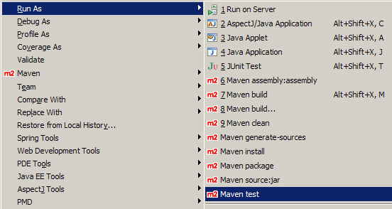
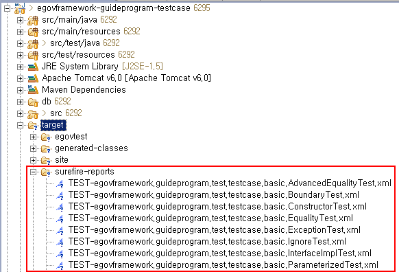
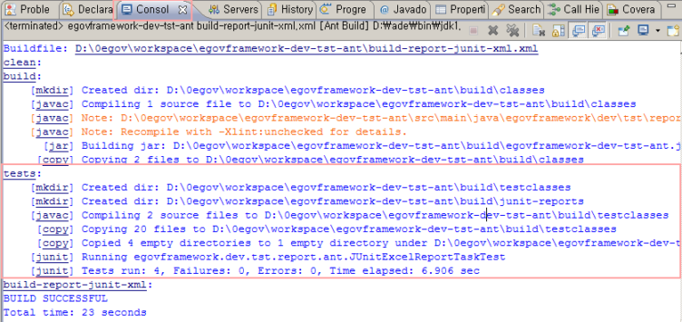
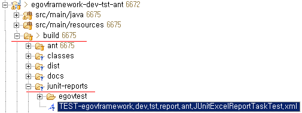

# Run TestSuite

## 개요

작성된 TestSuite 클래스나, TestCase 들을 Ant나 Maven 같은 빌드도구를 사용하여 자동으로 수행할 수 있는 방법에 대해 설명한다.
테스트 결과 리포트가 생성되는데, 이는 [Test Reporting](./test-reporting.md)에서 자세하게 설명하도록 한다.

## 설명

개발자가 단위테스트 클래스인 TestCase를 작성하고 나면, 개별적으로 테스트를 수행하여 결과를 볼 수 있다.
그러나, 일단 코드로 작성된 TestCase들은 빌드도구를 사용하여 자동화된 테스트를 수행할 수 있다.
빌드도구는 Ant와 Maven을 사용할 수 있으며, 이클립스에서는 각각 Ant와 Maven의 Plug-in을 사용하여 GUI 환경에서 테스트할 수 있고, CI 서버에 등록하면 동일한 프로세스를 서버단에서 수행한 뒤 CI 서버에서 리포트를 merge할 수 있도록 XML 파일을 제공할 수 있다.

Ant와 Maven 모두 다음과 같은 프로세스로 수행하면 된다.

1. 테스트하기 위한 스크립트 작성 (Ant - build.xml, Maven - pom.xml)
2. 이클립스 Plug-in을 이용하여 개발자 환경에서 테스트 수행
3. 테스트 결과 XML 리포트 확인
4. CI 서버에 등록하고, 테스트를 수행하도록 설정 후, CI 서버에 병합된 리포트 확인

✔ 여기에서는 CI 서버에 등록하고 확인하는 방법에 대해서는 설명하지 않도록 한다.

## 환경설정

* Ant, Maven Eclipse Plugin 설치
* JUnit Eclipse Plugin 설치
* TestSuite 작성을 위한 라이브러리 추가 (pom.xml) : [Unit Test 작성을 위한 pom.xml dependency](./pom-dependency-for-write-unittest.md) 설정 참고

## 사용법

### Maven을 사용한 테스트 자동화

Maven을 사용하여 개인빌드를 하는 경우, 다음과 같이 테스트를 자동화할 수 있다.

1. pom.xml 작성 : [Test Automation을 위한 pom.xml 설정 샘플](#test-automation을-위한-pomxml-설정-샘플--test) : test와 같이 작성한다.
2. m2eclipse로 테스트 수행 : Run As > Maven test 선택하여 실행한 뒤, Console View에서 **BUILD SUCCESSFUL**을 확인한다.



3. XML 리포트 확인 : **`<reportFormat>`xml`</reportFormat>`** 항목에 xml, txt를 명시할 수 있으며, **TEST-{TestcaseFullName}.xml** 식의 파일이 생성된다.



### Ant를 사용한 테스트 자동화

Ant를 사용하여 개인빌드를 하는 경우, 다음과 같이 테스트를 자동화할 수 있다.

1. build.xml 작성 : [Test Automation을 위한 build.xml 설정 샘플 : junit](#test-automation을-위한-buildxml-설정-샘플--junit)과 같이 작성한다.
2. 이클립스에서 테스트 수행

   1. [이클립스에서 Ant를 이용하여 target](./run-ant-on-eclipse.md)을 수행한다.
   2. Console View에서 실행 결과를 확인한다.

   
3. XML 리포트 확인 : junit task에서 **`<formatter type="xml"/>`** 항목에 xml, txt, brief를 설정할 수 있으며, 위의 예에서는 build/junit-reports 디렉토리 밑에 TEST-{TestcaseFullName}.xml 식의 파일이 생성된다.



## 샘플

Maven과 Ant의 Script의 작성 예는 다음과 같다.

### Test Automation을 위한 pom.xml 설정 샘플 : test

test 수행을 위한 pom.xml 설정 샘플은 다음과 같다.

```xml
<build>
	<!-- 테스트를 수행하려면 goal이 'test'이다. -->
	<plugins>
		<!-- test -->
		<plugin>
			<groupId>org.apache.maven.plugins</groupId>
			<artifactId>maven-surefire-plugin</artifactId>
			<configuration>
				<skipTests>false</skipTests>
				<forkMode>always</forkMode>
				<reportFormat>xml</reportFormat>
				<excludes>
					<exclude>**/Abstract*.java</exclude>
				</excludes>
				<includes>
					<include>**/*Test.java</include>
				</includes>
			</configuration>
		</plugin>
	</plugins>
</build>
```

### Test Automation을 위한 build.xml 설정 샘플 : junit

```xml
<property name="testreports.dir" value="build/junit-reports" />
. . . 중략 . . .
<junit forkmode="perBatch" printsummary="true" haltonfailure="yes" haltonerror="yes">
    <classpath refid="master-classpath" />
    <classpath refid="test-classpath" />
    <classpath path="${testbuild.dir}" />

    <formatter type="xml" />

    <batchtest fork="yes" todir="${testreports.dir}">
        <fileset dir="${testbuild.dir}">
            <include name="**/*Test.class" />
            <exclude name="**/Abstract*Test.class" />
        </fileset>
    </batchtest>
</junit>
```

## 참고자료

* Maven Surefire Plugin Home : [http://maven.apache.org/plugins/maven-surefire-plugin/](http://maven.apache.org/plugins/maven-surefire-plugin/)
* Maven Surefire Report Plugin Home : [http://maven.apache.org/plugins/maven-surefire-report-plugin/](http://maven.apache.org/plugins/maven-surefire-report-plugin/)
* Ant JUnit Task : [http://ant.apache.org/manual/OptionalTasks/junit.html](http://ant.apache.org/manual/OptionalTasks/junit.html)
* Ant JUnit Report Task : [http://ant.apache.org/manual/OptionalTasks/junitreport.html](http://ant.apache.org/manual/OptionalTasks/junitreport.html)
