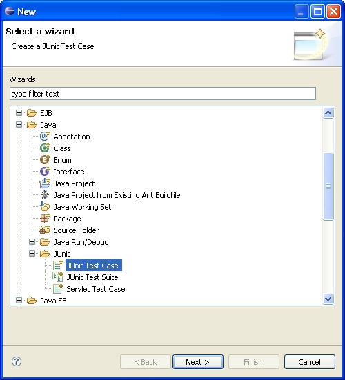
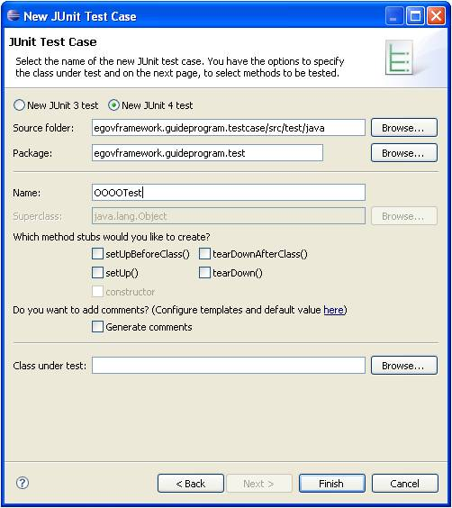
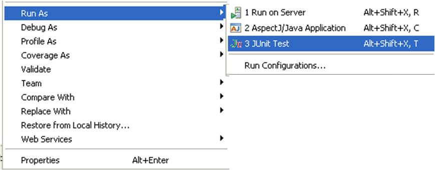
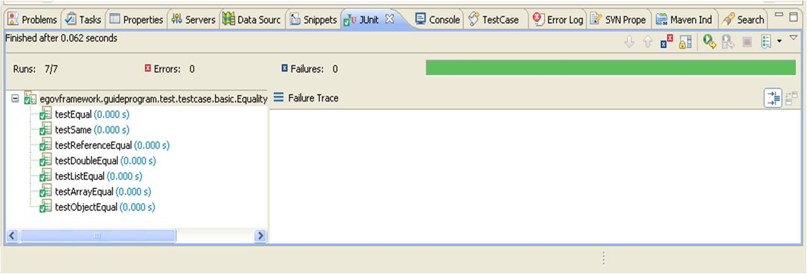

# JUnit Test Case

## 개요

JUnit 을 이용하여 Unit Test Case 를 작성하고 실행하는 방법을 안내한다.

## 설명

Unit Test Case 를 작성하기 위해 알아야 할 기본적인 내용은 다음과 같다.
자세한 사용법과 예제 프로그램은 본 문서 아래 부분에서 설명하도록 한다.
추가적으로, Mocking 이나 DAO 테스트 관련하여서는 각각 [Mock Support](./mock-support.md), [DB Support](./db-support.md) 를 참조하도록 한다.

| 테스트 종류        | 설명                                                                                                                                                                                             | 비고                             |
| ------------------ | ------------------------------------------------------------------------------------------------------------------------------------------------------------------------------------------------ | -------------------------------- |
| Constructor Test   | 단순한 로직의 경우 굳이 테스트하지 않는다. 단, 값을 초기화하거나 Load 하는 경우가 있는 때에는 테스트를 수행한다.                                                                                 |                                  |
| Setter/Getter Test | 단순한 Set/Get 은 굳이 테스트 하지 않는다. 로직이 있는 경우에는 로직을 별도의 메소드로 분리하고 이를 테스트하는 것이 바람직하다.                                                                 |                                  |
| Boundary Test      | Null 에 대한 확인, Default 값에 대한 확인, 범위가 있는 경우 MIN/MAX 값에 대한 확인이 목적이다. 이 경우 결국엔 NullPointer 가 발생하지 않도록 방어로직 혹은 검증 로직을 보완하는 것이 바람직하다. |                                  |
| Equality Test      | value, reference, 숫자, 리스트/배열, Value Object 간의 비교 등이 목적이다. 여기서 중요한 것은 Override 된 equals method 를 제대로 작성 했는지 확인하는 것이다.                                   |                                  |
| Exception Test     | 예상한 Exception 이 발생하는지 확인                                                                                                                                                              | 이것은 오로지 JUnit4 에만 해당함 |

## 환경설정

Maven Project 인 경우에는 아래와 같은 dependency 를 설정하면 된다.

```XML
        <dependency>
            <groupId>junit</groupId>
            <artifactId>junit</artifactId>
            <version>4.4</version>
            <scope>test</scope>
        </dependency>
 
        <dependency>
            <groupId>org.unitils</groupId>
            <artifactId>unitils</artifactId>
            <version>2.2</version>
            <scope>test</scope>
        </dependency>
```

> ✔ 주의: Springframework 2.5 에서는 JUnit 4.5 버전이 동작하지 않으므로, JUnit 4.4 버전을 사용하도록한다.
> ✔ 표준프레임워크 현재 적용버전은 다음을 참고하도록 한다. [적용버전확인](http://www.egovframe.go.kr/EgovOSS.jsp?menu=1&submenu=2&leftsub=3)

## 사용법

기본적인 JUnit 사용법은 다음과 같다.

### Test Case 생성

일반적인 Java Class 를 **New** 하는 식으로도 작성할 수 있으며, JUnit 라이브러리가 사용된 경우 자동으로 JUnit Test Case 로 인식한다.

아래는 Eclipse New Wizard 를 이용해 Test Case 를 생성하는 방법이다.

1. JUnit 을 사용하기 위한 Wizard 를 선택하고 **Next**를 클릭한다.



2. Test Case 의 이름을 입력하고 **Finish**를 클릭한다.
   Test Case 의 이름은 보통 대상 프로그램 뒤에 Test 를 붙인다.
   만약, 대상 프로그램 별로 Test 코드가 여러 개일 경우에는 OOOOTest_xxxx 와 같은 식으로 _ 를 붙여서 구분한다.
   이러한 Naming 의 규칙은 정해진 것은 아니나 일반적인 경우이니 참조하면 된다.



3. Stub method 생성을 클릭한 경우 아래와 같이 생성된다. (테스트 클래스 전체 실행 전후, 테스트 메소드 각각의 실행 전후에 처리를 제어하는 방법이다.)
   ```java
   public class OOOOTest {

       @BeforeClass
       public static void setUpBeforeClass() throws Exception {
       }

       @AfterClass
       public static void tearDownAfterClass() throws Exception {
       }

       @Before
       public void setUp() throws Exception {
       }

       @After
       public void tearDown() throws Exception {
       }

   }

   ```

### Test Case 실행

Eclipse IDE에서 다음과 같은 방법으로 테스트를 실행할 수 있다.



1. 테스트 프로그램 오른 쪽 버튼 클릭 후 Run As… 를 이용하여 수행한다.

### Test Case 결과 확인

아래와 같은 화면으로 테스트 수행 결과를 확인할 수 있으며, 성공적으로 수행한 경우에 Green Bar 가 나타나며, 실패한 경우에는 Red Bar 로 실패 원인을 확인할 수 있다.



* 녹색 표시: 테스트 성공
* 빨간색 표시: 테스트 실패
* 오류 메시지: 실패한 테스트의 상세 정보

## 샘플

JUnit 4를 이용해 단위 테스트를 개발하는 경우 기본적인 가이드 프로그램이다. 또한, JUnit 4 와 함께 사용하여 유용한 유틸을 제공하는 Unitils 를 활용하는 모습도 일부 포함한다.

### Constructor Test

단순한 로직의 경우 굳이 테스트하지 않는다. 단, 값을 초기화하거나 Load 하는 경우가 있는 때에는 테스트를 수행한다.

### Setter / Getter Test

단순한 Set/Get 은 굳이 테스트 하지 않는다. 로직이 있는 경우에는 로직을 별도의 메소드로 분리하고 이를 테스트하는 것이 바람직하다.

### Boundary Test

Null 에 대한 확인, Default 값에 대한 확인, 범위가 있는 경우 MIN/MAX 값에 대한 확인이 목적이다. 이 경우 결국엔 NullPointer 가 발생하지 않도록 방어로직 혹은 검증 로직을 보완하는 것이 바람직하다.

### Exception Test

원하는(예상하고 있는) 예외가 실제로 발생하는지 확인한다. try/catch 문이 아닌 단순 어노테이션 설정만으로 간단하게 확인할 수 있다.

```java
@Test (expected = IndexOutOfBoundsException.class)
public void testException() {
       throw new IndexOutOfBoundsException();
}
```

### Equality Test

#### value와 reference 비교

```java
@Test
public void testReferenceEqual() {
      String string1 = new String("somevalue");
      String string2 = string1;
      assertEquals("두 객체의 값이 같음", string1, string2); 
      assertSame("두 객체의 주소값이 같음", string1, string2);  
}
```

#### 숫자 값 비교 (기본적인 비교는 동일하나, 소숫점 자리 이하 비교)

```java
@Test
public void testDoubleEqual() {
      double value1 = 10 / 3;
      double value2 = 3.33;
      assertEquals("소수 둘째자리까지 같음", value1, value2, 2);
}
```

#### List/Array의 비교

JUnit 의 기본 기능은 순서가 같을 경우에만 “True”를 리턴한다.

```java
@Test
public void testListEqual() {
      List<Integer> value1 = Arrays.asList(3, 2, 1);
      List<Integer> value2 = Arrays.asList(3, 2, 1);
      assertEquals("두 리스트의 값과 순서가 같음", value1, value2);
}
 
@Test
public void testArrayEqual() {
      String[] value1 = new String[] {"A", "B", "C"};
      String[] value2 = new String[] {"A", "B", "C"};
      assertArrayEquals("두 배열의 값과 순서가 같음", value1, value2);
}
```

✔ Unitils 를 추가로 활용하여 순서와 디폴트 값과 상관없이 비교한다.

```java
@Test
public void testReflectionEqualLenientOrder() {
      List<Integer> myList = Arrays.asList(3, 2, 1);
 
      assertReflectionEquals(Arrays.asList(3, 2, 1), myList);
 
      assertReflectionEquals("순서 무시하고 값이 같은지 비교", Arrays.asList(1, 2, 3), myList, LENIENT_ORDER);
}
 
@Test
public void testAssertReflectionEqualsIgnoringDefault() {
      assertReflectionEquals("디폴트 값 무시하고 같은지 비교",
 
      new UserVo(1, "name", null), new UserVo(1, "name", "description1"), IGNORE_DEFAULTS);
}
```

#### Value Object 의 비교

JUnit 만을 사용하는 경우에는 Value Object 를 비교하기 위해서는 각각의 attribute 단위로 하나하나 비교해야 한다.

```java
 @Test
 public void testObjectEqual() {
      UserVo user1 = new UserVo(100, "name", "description");
      UserVo user2 = new UserVo(100, "name", "description");
 
      assertEquals(user1.getId(), user2.getId());
      assertEquals(user1.getName(), user2.getName());
      assertEquals(user1.getDescription(), user2.getDescription());
 }
```

✔ Unitils 를 함께 사용하는 경우에는 attribute 단위로 자동으로 하나하나 비교해 주므로 편리하다.

```java
@Test
public void testAssertReflectionEqualsFieldByField() {
 
      UserVo user1 = new UserVo(100, "name", "description");
      UserVo user2 = new UserVo(100, "name", "description");
 
      assertReflectionEquals("객체를 구성하는 attribute를 하나하나 자동으로 비교", user1, user2);
}
```

### 테스트 수행 전후 처리

메소드 혹은 클래스 단위로 테스트 수행 전후 처리를 수행한다.
JUnit3.8에서는 setUp(), tearDown()이라는 메소드로 처리했었는데 현재는 아래의 Annotation 으로 제어가 쉬워졌다.

| Annotation | 실행 시점 | 설명 |
|------------|-----------|------|
| `@BeforeClass` | 클래스 시작 시 1회 | 단위 테스트 안의 모든 메소드 실행 전에 단 한번만 수행 |
| `@AfterClass` | 클래스 종료 시 1회 | 단위 테스트 안의 모든 메소드 실행이 된 후 마지막에 단 한번만 수행 |
| `@Before` | 각 메소드 실행 전 | 단위 테스트 안의 각 메소드가 실행될 때마다 실행 전에 수행 |
| `@After` | 각 메소드 실행 후 | 단위 테스트 안의 각 메소드가 실행될 때 마다 실행 후에 수행 |

아래는 StringBuffer 를 선언해두고, 실행이 될 때마다 특정 스트링을 Append 하여 전체 순서를 알아볼 수 있는 예제이다.

```java
public class SetupTest {
 
     static StringBuffer sb;
 
     @BeforeClass
     public static void doBeforeClass() {
          sb = new StringBuffer();
          sb.append("BeforeClass/");
 
          assertEquals("BeforeClass/", sb.toString());
     }
 
     @Before
     public void doBeforeMethod() {
          sb.append("BeforeMethod/");
     }
 
     @After
     public void doAfterMethod() {
          sb.append("AfterMethod/");
     }
 
     @AfterClass
     public static void doAfterClass() {
          sb.append("AfterClass/");
          assertEquals("BeforeClass/BeforeMethod/testFirst/AfterMethod/BeforeMethod/testSecond/AfterMethod/AfterClass/", sb.toString());
     }
 
     @Test
     public void testFirst() {
          assertEquals("BeforeClass/BeforeMethod/", sb.toString());
          sb.append("testFirst/");
          assertEquals("BeforeClass/BeforeMethod/testFirst/", sb.toString());
     }
 
     @Test
     public void testSecond() {
          assertEquals("BeforeClass/BeforeMethod/testFirst/AfterMethod/BeforeMethod/", sb.toString());
          sb.append("testSecond/");
          assertEquals("BeforeClass/BeforeMethod/testFirst/AfterMethod/BeforeMethod/testSecond/", sb.toString());
     }
}
```

### Parameterized Test

파라미터 값만 바꿔가면서 동일한 테스트를 반복해서 수행하고 싶을 때 유용하다. 아래 예제는 비밀번호에 대해 유효한지를 체크하는 프로그램을 테스트하는 것인데, 입력 값을 여러개로 지정한 후 한번에 테스트하는 모습이다.

```java
@RunWith(Parameterized.class)
public class ParameterizedTest {
 
     private String password;
     private boolean isValid;
     private static PasswordValidator validator;
 
     @BeforeClass
     public static void setUp() {
          validator = new PasswordValidator();
     }
 
     public ParameterizedTest(String password, boolean isValid) {
          this.password = password;
          this.isValid = isValid;
     }
 
     @Parameters
     public static Collection passwords() {
          return Arrays.asList(new Object[][] { { "1234qwer", true }, {"12345678", false}, {"1q2w3e4r", true} });
     }
 
     @Test
     public void isValidPasswordWithParams() {
          assertEquals(validator.isValid(this.password), this.isValid);
     }
```

테스트 대상인 Inner Class

```java
class PasswordValidator {
 
     public boolean isValid(String password) {
          boolean result = false;
          int letterCnt = 0;
          int digitCnt = 0;
 
          for (int i = 0; i < password.length(); i++) {
               char c = password.charAt(i);
               if (Character.isLetter(c)) letterCnt++;
               else if (Character.isDigit(c)) digitCnt++;
          }
 
          // 8자리 이상이고(입력 때 체크되지만) 문자와 숫자가 적어도 한 개씩은 있어야 함
          if (password.length() >= 8 && letterCnt > 0 && digitCnt > 0)
               result = true;
 
              return result;
          }
}
```

### Timeout Test

테스트에 걸리는 시간을 지정하여, 해당 시간이 넘은 경우 Fail 처리할 수 있다.

```java
@Test (timeout = 1)
public void testTimeout() {
}
```

### Test Ignore

테스트를 SKIP 하고 싶을 때 사용한다. 클래스/메소드 단위 모두 가능하다.

#### 테스트 클래스 전체 SKIP

```java
@Ignore("테스트 수행하지 않도록 설정 함 (실제론 상세 원인을 표시)")
public class OOOOTest {
    @Test
    public void testIgnored() {
        assertTrue("모든 테스트 메소드는 실행이 되지 않음", true);
    }
}
```

#### 테스트 클래스 내부의 특정 테스트 메소드 SKIP

```java
@Ignore("테스트 수행하지 않도록 설정 함 (실제론 상세 원인을 표시)")
@Test
public void testIgnore() {
    assertTrue("이 테스트 메소드는 실행이 되지 않음", true);
}
```

## 참고자료

* [JUnit 공식 사이트](http://www.junit.org/)