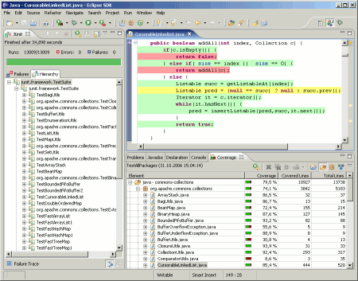

# Test Coverage

## 개요

Test Coverage는 개발자가 작성한 테스트 코드가 대상 소스 코드에 대해 테스트하는 코드를 작성했는지 그 커버하는 정도를 백분률과 코드 라인을 통해 알려주는 것을 말하며, Test Coverage를 분석하고 그 결과를 리포팅하는 것에 대해 설명한다.

## 설명

Test Coverage는 개발자가 작성한 코드에 대해 상응하는 테스트를 갖는 소스 코드의 비율을 평가하는 작업으로 다음과 같은 개념을 이해하는 것이 좋다.

* **instrument** : 테스트 대상 코드를 실행하거나 JUnit Test를 수행하거나(EMMA), 컴파일을 수행하는(Cobertura) 동안 대상 코드에 테스트 코드 정보를 삽입하는 작업을 일컫는다.
* **Test Coverage report** : Test Coverage 결과 리포팅 (XML, HTML 등)
  기본적으로 XML과 HTML 형식을 지원하며, EMMA는 TXT, XML, HTML 형식을 모두 지원한다.

### Test Coverage Tool

Test Coverage를 수행하는 데는 다양한 툴이 있고, 각각 평가하는 나름의 로직을 갖고 있으며, 리포팅 또한 그 로직에 상응하는 형태라고 볼 수 있다. 따라서, 필요에 맞는 도구를 잘 선택하면 된다.

본 개발환경에서는 라이선스를 고려하여 EMMA와 EclEmma를 선택했다.
그러나, 코드를 수정하지 않고 툴로서 사용하기만 한다면 Cobertura를 사용하는 것도 괜찮다.

| 구분            | 툴 이름                                                                                                                                    |
| --------------- | ------------------------------------------------------------------------------------------------------------------------------------------ |
| 상용            | [Clover](http://www.cenqua.com/clover "http://www.cenqua.com/clover")                                                                            |
| 오픈소스        | [Cobertura](http://cobertura.sourceforge.net/ "http://cobertura.sourceforge.net"), [EMMA](http://emma.sourceforge.net/ "http://emma.sourceforge.net/") |
| Eclipse Plug-in | [EclEmma](http://www.eclemma.org/ "http://www.eclemma.org/"), [Coverlipse](http://coverlipse.sourceforge.net/ "http://coverlipse.sourceforge.net/")    |

#### Cobertura 특징

본 개발환경에서 채택은 하지 않았지만, 고려대상 중 하나였던 Cobertura의 특징은 다음과 같다.

* Home : [http://cobertura.sourceforge.net/](http://cobertura.sourceforge.net/ "http://cobertura.sourceforge.net/")
* 라이선스 : Apache Software License (Cobertura ant task), GPL 2.0
* 테스트 코드가 액세스한 코드의 백분율을 계산하는 무료 자바 툴로서 jcoverage에 기반을 둔다.
* ant나 Maven, command line에서 실행 가능하다.
* 대상 코드를 컴파일한 뒤 자바 바이트코드로 instrument한다.
* HTML, XML 형태의 보고서를 생성한다.
* class, package, all classes에 대해 라인과 분기에 대한 백분율을 알려준다.
* class, package, all classes에 대해 [McCabe&#39;s cyclomatic 코드 복잡도](http://www.arisa.se/compendium/node96.html "http://www.arisa.se/compendium/node96.html")를 알려준다.
* HTML 결과에서 다음 항목에 대해 정렬(ascending, decending) 제공 : 클래스명, 커버된 라인 백분율, 커버된 분기 백분율
* 보고서를 UTF-8로 설정하여 저장한다

### Test Coverage - EMMA

EMMA는 오픈소스로서 라이선스는 CPL (Common Public License) v1.0 이다.
Ant와 Maven에서 실행 가능하며, Command-line에서도 사용 가능하다.

#### EMMA 특징

* Home page : [http://emma.sourceforge.net/](http://emma.sourceforge.net/ "http://emma.sourceforge.net/")
* Coverage instrument를 클래스 로드 되기 전이나 로드 중에 할 수 있다.
* 지원 Coverage 타입은 class, method, line, [basic block](http://emma.sourceforge.net/faq.html#q.blockcoverage "http://emma.sourceforge.net/faq.html#q.blockcoverage")  이다.
* Coverage 통계는 method, class, package, all classes 별로 제공한다.
* Output Report type : Text, HTML, XML. HTML은 소스코드와의 링크를 제공한다.
* HTML 리포트에서 Coverage 항목에 대해 하이라이트 기능을 제공한다.
* 개별 .class 파일이나 전체 .jar 파일을 instrument할 수 있음
* 매우 빠르다. 메모리도 자바 클래스 당 수백 바이트 정도
* 이클립스에서 EclEmma라는 Plugin을 통해 사용할 수 있다.

#### EMMA를 이용한 Test Coverage 프로세스

* TestCase 작성
* EclEmma로 이클립스에서 Test Coverage 평가
* 빌드 Script를 작성하여 Test Coverage 자동 수행
* 리포트 생성

#### EMMA Test Coverage HTML 리포트

* 생성 디렉토리 : Ant에서는 지정하는 곳에, Maven에서는 디폴트로 target/site/emma/index.html, coverage.xml
* Summary : class, method, block, line 별로 백분률로 표시함. [EMMA HTML 리포트 샘플](#emma-html-리포트-샘플) 참조

## 환경설정

* EclEmma Eclipse Plugin 설치
* Ant, Maven Eclipse Plugin 설치

## 사용법

### EclEmma 사용법

자세한 내용은 [EclEmma Home](http://www.eclemma.org/userdoc/index.html "http://www.eclemma.org/userdoc/index.html")을 참조하기 바란다.

1. EclEmma 설치
   1. eGovFrame 통합메뉴에서 Configuration > Customize Development Tool 선택
   2. 리스트에서 EclEmma를 선택하여 설치를 진행한다.
2. Test Coverage 실행 :
   * 툴바 이용 : EclEmma를 설치하면 툴바에 다음과 같은 아이콘이 생기고, **Coverage As** 나 **Coverage Configuration** 메뉴를 통해 실행할 수 있다.

     
   * Context Menu 이용 : 프로젝트나 테스트 코드를 선택하고 오른쪽 버튼을 클릭하여 Context Menu에서 **Coverage As > JUnit Test** 를 통해 수행할 수 있다.
3. Coverage View 확인 : JUnit Test를 수행하면서 Test Coverage instrument 작업이 끝나면 Coverage View에 결과가 나타나며, 해당 항목을 더블클릭하면 해당 소스가 에디터 View를 통해 열린다.

    

### Maven으로 EMMA 실행하기

1. pom.xml 작성 : [Maven을 이용한 EMMA 설정 샘플](#maven을-이용한-emma-설정-샘플) 참조
2. Maven 실행 : [이클립스에서 Maven 실행하기](./run-maven-on-eclipse.md) 참조
   * instrument : goal - **emma:instrument**
   * instrument + HTML Report : goal - **emma:emma**
3. 리포트 확인 : **target/site/emma** 디렉토리 밑에서 coverage.xml 및 index.html (emma:emma) 리포트를 확인할 수 있다

### Ant로 EMMA 실행하기

Ant에서 EMMA를 쓰는 일은 조금 까다롭다. 따라서, Ant 수행에 대해서는 [EMMA 사이트](http://emma.sourceforge.net/userguide_single/userguide.html#introANT)와 [Using EMMA With ANT For JUnit Test Coverage Reporting](http://wiki.metawerx.net/wiki/UsingEMMAWithANTForJUnitTestCoverageReporting)를 참조하기 바란다.

1. build.xml 작성 : [Ant를 이용한 EMMA 설정 샘플](#ant를-이용한-emma-설정-샘플) 참조
2. Ant의 target 실행 : [이클립스에서 Ant 실행하기](./run-ant-on-eclipse.md)를 참조하여 설정된 target을 실행한다.
3. 리포트 확인 : 지정된 위치 즉, **outfile**에 설정한 리포트를 확인할 수 있다

## 샘플

### Maven을 이용한 EMMA 설정 샘플

전체 설정 내용은 [EMMA 실행을 위한 pom.xml 설정 샘플](./pom-example-for-run-emma.md)을 참조하기 바란다.

1. instrument : Test Coverage 분석만 하고 XML 결과까지만 남길 경우
   ```xml
   <build>
       <plugins>
           <!-- test -->
           <plugin>
               <groupId>org.apache.maven.plugins</groupId>
               <artifactId>maven-surefire-plugin</artifactId>
               <configuration>
                   <skipTests>false</skipTests>
                   <forkMode>always</forkMode>
                   <reportFormat>xml</reportFormat>
               </configuration>
           </plugin>
           <!-- EMMA   -->
           <plugin>
               <groupId>org.codehaus.mojo</groupId>
               <artifactId>emma-maven-plugin</artifactId>
               <version>1.0-alpha-1</version>
           </plugin>
       </plugins>
   </build>
   ```
2. Test Coverage HTML 리포트 생성
   ```xml
   <reporting>
       <plugins>
           <!-- EMMA Coverage Reporting -->
           <plugin>
               <groupId>org.codehaus.mojo</groupId>
               <artifactId>emma-maven-plugin</artifactId>
               <inherited>true</inherited>
           </plugin>
       </plugins>
   </reporting>
   ```

### Ant를 이용한 EMMA 설정 샘플

전체 설정 내용은 [EMMA 실행을 위한 build.xml 설정 샘플](./build-example-for-run-emma.md)을 참조하기 바란다.

1. instrument : Test Coverage 분석만 하고 XML 결과까지만 남길 경우
   ```xml
   <!-- EMMA 세팅 생략 -->
   <target name="emma-jars" depends="build" description="Uses Emma to instrument the jar files">
       <emma enabled="${emma.enabled}">
           <instr mode="fullcopy"
                  outdir="${basedir}/build/temp"
                  merge="yes"
                  filter="egovframework.dev.tst.*"
                  metadatafile="${artifactsDir}/test-coverage/coverage.em">
               <instrpath>
                   <fileset dir="build/" includes="${ant.project.name}.jar" />
               </instrpath>
           </instr>
       </emma>
   </target>
    
   <target name="test.with.emma" depends="emma-jars">
      . . . 중략 . . .
       <junit fork="yes"
              printsummary="yes"
              haltonfailure="no"
              failureproperty="test.failed"
              errorproperty="test.failed"
              dir="${basedir}">
           <classpath>
               <path refid="master-classpath" />
               <path refid="test-classpath" />
               <path refid="emma.lib" />
               <fileset dir="${basedir}/build/temp/lib"
                        includes="${ant.project.name}.jar" />
               <pathelement location="${testbuild.dir}" />
           </classpath>
    
           <formatter type="xml" />
           <batchtest fork="yes" todir="${artifactsDir}/test-results/xml">
               <fileset dir="${testbuild.dir}">
                   <include name="**/*Test.class" />
               </fileset>
           </batchtest>
       </junit>
   </target>
   ```
2. Test Coverage 리포트 생성
   ```xml
   <!-- Test Code Coverage Report  -->
   <target name="emmareport" depends="test.with.emma">
       <move file="${basedir}/coverage.ec"
             todir="${artifactsDir}/test-coverage" />
       <emma description="now we can generate the emma report"
             enabled="${emma.enabled}">
           <report sourcepath="${src.dir}"
                   sort="+name,+method,+class"
                   metrics="method:70,line:80,class:100"
                   depth="method"
                   columns="name,class,method,block,line"
                   encoding="UTF-8">
               <infileset dir="${artifactsDir}/test-coverage"
                          includes="*.em, *.ec" />
               <!-- XML Report -->
               <xml outfile="${artifactsDir}/test-coverage/coverage.xml" />
               <!-- Text Report -->
               <txt outfile="${artifactsDir}/test-coverage/coverage.txt" />
               <!-- HTML Report -->
               <html outfile="${artifactsDir}/test-coverage/coverage.html" />
           </report>
       </emma>
   </target>
   ```

### EMMA HTML 리포트 샘플

* [EMMA에서 생성한 Test Coverage HTML 리포트의 샘플](./emma-test-report.md)

## 참고자료

* EMMA Home : [http://emma.sourceforge.net/](http://emma.sourceforge.net/)
* EclEmma Home : [http://www.eclemma.org/](http://www.eclemma.org/)
* Maven EMMA plugin : [http://emma.sourceforge.net/maven-emma-plugin/](http://emma.sourceforge.net/maven-emma-plugin/)
