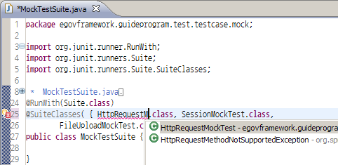
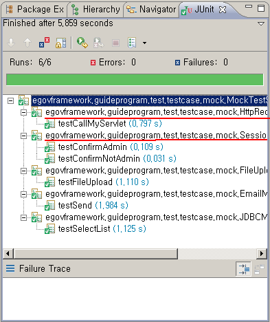

# Write TestSuite

## 개요

Test Automation을 위해 기존에 작성된 다수의 TestCase 들을 몇 개 그룹으로 묶는 방법을 설명한다.

## 설명

**TestSuite**은 개발자가 작성한 다수의 TestCase를 그룹으로 묶거나 모아서 한꺼번에 테스트를 수행할 수 있도록 JUnit 3.8에서 제공하던 클래스이다.
JUnit4에서는 TestSuite 클래스를 더이상 지원하지 않으며, 단지 다수의 TestCase를 특징에 따라 한꺼번에 수행할 수 있도록 그룹으로 묶는 개념으로 생각하는 것이 좋겠다.
따라서, JUnit3.8에서는 TestSuite Class를 작성하곤 했지만, JUnit4에서는 작성할 수는 있지만 잘 쓰지 않고, 빌드도구를 사용하는 방법을 많이 사용한다.

> ✔ TestSuite을 작성하는 경우는 보통 기존 TestCase를 그룹핑하고자 하는 경우이며, Unit Test를 넘어 Integration Test까지 가는 경우, 그룹핑 뿐 아니라 TestCase 간의 Dependency를 설정하고자 할 때 쓰이게 된다. 따라서, Unit Test까지만 작성하고 테스트하는 경우에는 TestSuite으로 따로 묶지 않는 경우가 많다. [TestNG](http://testng.org/)라는 툴에서는 Integration Test를 위해 TestCase 간의 의존성이나 순서, 그룹으로 묶기 등의 기능을 제공한다.

## 환경설정

* JUnit Eclipse Plugin 설치
* TestSuite 작성을 위한 라이브러리 추가 (pom.xml) : [Unit Test 작성을 위한 pom.xml dependency 설정](./pom-dependency-for-write-unittest.md) 참고

## 사용법

TestSuite을 작성하는 방법은 다음과 같이 2가지가 있다.

### TestSuite Class 작성

JUnit4에서 TestSuite을 작성하는 방법은 다음과 같다.

1. Eclipse에서 일반 Java Class를 생성한다.
2. 기존에 작성된 TestCase Class 목록을 다음과 같이 입력한다.

 

3. 작성이 완료되면 Test Case 실행 방법과 동일하게 테스트한다.
   다음 그림과 같이 TestSuite을 수행하면, 여러 개의 TestCase가 한꺼번에 순차적으로 수행된다.

 

> ✔ TestSuite을 작성하는 경우는 보통 기존 TestCase를 그룹핑하고자 하는 경우이며, Unit Test를 넘어 Integration Test까지 가는 경우, 그룹핑 뿐 아니라 TestCase 간의 Dependency를 설정하고자 할 때 쓰이게 된다. 따라서, Unit Test까지만 작성하고 테스트하는 경우에는 TestSuite 클래스를 따로 작성하지 않는 경우가 많다.

### 빌드도구로 TestSuite 작성

빌드도구에서 수행할 테스트케이스를 지정하여 Test Suite을 구성할 수 있다.

* Maven - pom.xml : [Maven에서 Test Suite 작성 샘플](#maven에서-test-suite-작성-샘플) 참조
* Ant - build.xml : [Ant에서 Test Suite 작성 샘플](#ant에서-test-suite-작성-샘플)과 같이 junit task에 `<batchtest/>`를 이용하여 테스트 대상을 그룹핑할 수 있다.

## 샘플

### TestSuite class 작성 샘플

```java
@RunWith(Suite.class)
@SuiteClasses( { HttpRequestMockTest.class, SessionMockTest.class, 
        FileUploadMockTest.class, EmailMockTest.class, JDBCMockTest.class })
public class MockTestSuite {
 
}
```

### Maven에서 Test Suite 작성 샘플

```xml
<build>
    <plugins>
        <!-- test -->
        <plugin>
            <groupId>org.apache.maven.plugins</groupId>
            <artifactId>maven-surefire-plugin</artifactId>
            <configuration>
            . . .
                <excludes>
                    <exclude>**/Abstract*.java</exclude>
                </excludes>
                <includes>
                    <include>**/*Test.java</include>
                </includes>
            </configuration>
        </plugin>
    </plugins>
</build>
```

### Ant에서 Test Suite 작성 샘플

```xml
<junit ... >
    . . . 중략 . . .
    <batchtest fork="yes" todir="${testreports.dir}">
        <fileset dir="${testbuild.dir}">
             <include name="**/*Test.class" />
             <exclude name="**/Abstract*Test.class" />
             <exclude name="**/*SuiteTest.class" />
        </fileset>
    </batchtest>
</junit>
```

## 참고자료

* JUnit Home : [http://junit.org/](http://junit.org/)
* JUnit FAQ : [http://junit.sourceforge.net/doc/faq/faq.html](http://junit.sourceforge.net/doc/faq/faq.html)
* Maven Surefire Plugin : [http://maven.apache.org/plugins/maven-surefire-plugin/](http://maven.apache.org/plugins/maven-surefire-plugin/)
