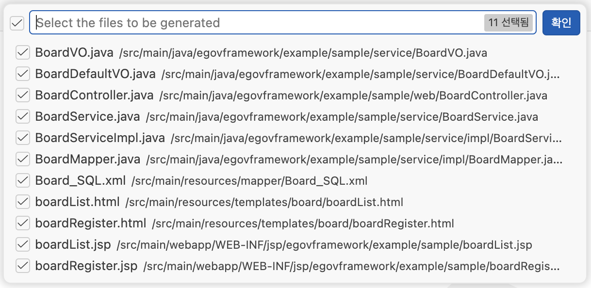

# Generate CRUD Code

## 개요

본 문서는 eGovFrame Initializr in VSCode 확장의 CRUD Code Generation 기능 중 **Generate CRUD Code** 기능을 안내한다.

**Generate CRUD Code**는 DDL의 테이블 구조를 분석하여 eGovFrame 표준 아키텍처에 맞는 CRUD 코드 파일 전체를 자동으로 생성하는 핵심 기능이다. Java 계층(VO, Service, Controller, Mapper)과 SQL 매핑 파일(MyBatis XML), 뷰 템플릿(Thymeleaf HTML, JSP)을 한 번에 생성한다.

## 실행 조건

다음 항목이 모두 입력되어야 **Generate CRUD Code** 버튼이 활성화된다.

| 항목 | 설명 |
|---|---|
| DDL | 유효한 `CREATE TABLE` 문 입력 완료 |
| Package Name | 패키지 이름 입력 완료 |
| Output Path | 출력 경로 입력 완료 |

## 유효성 검사

버튼 클릭 시 다음 항목에 대해 유효성 검사가 수행된다. 오류가 있으면 오류 목록이 표시되며 생성이 진행되지 않는다.

| 항목 | 검사 규칙 |
|---|---|
| Package Name | 필수 입력, 소문자 시작, 소문자·숫자·점(`.`)만 허용, 점으로 끝날 수 없음 |
| Output Path | 필수 입력 |

## 생성 가능한 파일 목록

Generate CRUD Code 버튼 클릭시 상단에 생성 가능한 파일 목록 다이얼로그가 뜬다. 기본적으로 모든 템플릿이 선택된 상태이고, 체크박스를 통해 특정 템플릿만 선택적으로 생성할 수도 있다.



## 생성되는 파일 목록

DDL의 테이블명을 기반으로 클래스명이 결정되며, 아래 규칙에 따라 변환된다.

- 테이블명의 `snake_case`를 `PascalCase`로 변환하여 클래스명으로 사용한다.
  - 예) `BOARD_NOTICE` → `BoardNotice`

### Java 파일

| 파일 | 위치 | 설명 |
|---|---|---|
| `클래스명VO.java` | `service/` | Value Object 클래스. DDL 컬럼을 Java 필드로 매핑하며, getter/setter를 포함한다. |
| `DefaultVO.java` | `service/` | 페이징·검색 공통 필드를 담은 기본 Value Object 클래스. `클래스명VO`의 부모 클래스이다. |
| `클래스명Service.java` | `service/` | 서비스 인터페이스. insert/update/delete/select/selectList/selectListTotCnt 메서드를 선언한다. |
| `클래스명ServiceImpl.java` | `service/impl/` | 서비스 구현 클래스. `EgovAbstractServiceImpl`을 상속하며, ID Generation 서비스를 통해 PK를 채번한다. |
| `클래스명Controller.java` | `web/` | 컨트롤러 클래스. 목록 조회, 등록 화면, 등록, 수정 화면, 수정, 삭제 요청을 처리하는 핸들러 메서드를 포함한다. |
| `클래스명Mapper.java` | `service/impl/` | MyBatis 매퍼 인터페이스. `클래스명_SQL.xml`과 연동된다. |

### 설정 파일

| 파일 | 위치 | 설명 |
|---|---|---|
| `클래스명_SQL.xml` | `mapper/` | MyBatis SQL 매핑 파일. INSERT, UPDATE, DELETE, SELECT, SELECT LIST, SELECT COUNT 쿼리를 포함한다. |

### 뷰 템플릿

| 파일 | 위치 | 설명 |
|---|---|---|
| `클래스명List.html` | `templates/클래스명(소문자 시작)/` | Thymeleaf 목록 페이지 |
| `클래스명Regist.html` | `templates/클래스명(소문자 시작)/` | Thymeleaf 등록/수정 페이지 |
| `클래스명List.jsp` | `WEB-INF/jsp/패키지명/` | JSP 목록 페이지 |
| `클래스명Regist.jsp` | `WEB-INF/jsp/패키지명/` | JSP 등록/수정 페이지 |

## 디렉터리 구조

패키지 이름이 `egovframework.example.sample`이고 테이블명이 `BOARD`인 경우, 출력 경로 아래에 다음과 같은 구조로 파일이 생성된다.

```
src/
└── main/
    ├── java/
    │   └── egovframework/example/sample/
    │       ├── service/
    │       │   ├── BoardVO.java
    │       │   ├── DefaultVO.java
    │       │   └── BoardService.java
    │       ├── service/impl/
    │       │   ├── BoardServiceImpl.java
    │       │   └── BoardMapper.java
    │       └── web/
    │           └── BoardController.java
    ├── resources/
    │   ├── mapper/
    │   │   └── Board_SQL.xml
    │   └── templates/board/
    │       ├── BoardList.html
    │       └── BoardRegist.html
    └── webapp/
        └── WEB-INF/jsp/egovframework/example/sample/
            ├── BoardList.jsp
            └── BoardRegist.jsp
```

## 생성 코드 상세

### VO 클래스 (`클래스명VO.java`)

- DDL의 각 컬럼이 Java 필드로 매핑된다.
- 컬럼명은 `snake_case` → `camelCase`로 변환된다 (예: `REGIST_DATE` → `registDate`).
- SQL 데이터 타입은 아래 기준으로 Java 타입으로 변환된다.

| SQL 타입 | Java 타입 |
|---|---|
| `INT`, `INTEGER`, `TINYINT`, `SMALLINT` | `int` |
| `BIGINT` | `long` |
| `FLOAT` | `float` |
| `DOUBLE`, `DECIMAL`, `NUMERIC` | `double` |
| `BOOLEAN`, `BOOL`, `BIT` | `boolean` |
| `DATE`, `DATETIME`, `TIMESTAMP` | `java.util.Date` |
| `CHAR`, `VARCHAR`, `TEXT` 등 | `String` |

- `DefaultVO`를 상속하므로 페이징·검색 관련 필드(pageIndex, pageUnit, pageSize 등)를 별도로 선언하지 않아도 사용 가능하다.

### ServiceImpl 클래스

- `EgovAbstractServiceImpl`을 상속한다.
- 등록(insert) 시 `egovIdGnrService`(ID Generation 서비스)를 통해 PK 값을 자동으로 채번하여 설정한다.
- PK 컬럼이 복수인 경우 코드 내 주석(`// egovframe-Todo`)으로 추가 검토가 필요한 부분을 안내한다.

### Controller 클래스

다음 URL 패턴의 핸들러 메서드가 생성된다 (테이블명 `Board` 기준).

| HTTP 메서드 | URL | 설명 |
|---|---|---|
| GET | `/board/boardList.do` | 목록 조회 (페이징 포함) |
| POST | `/board/addBoardView.do` | 등록 화면 조회 |
| POST | `/board/addBoard.do` | 등록 처리 |
| POST | `/board/updateBoardView.do` | 수정 화면 조회 |
| POST | `/board/updateBoard.do` | 수정 처리 |
| POST | `/board/deleteBoard.do` | 삭제 처리 |

### MyBatis SQL Mapper XML

`클래스명_SQL.xml`에는 다음 쿼리가 포함된다.

| SQL ID | 설명 |
|---|---|
| `insert클래스명` | INSERT 쿼리. 모든 컬럼을 대상으로 한다. |
| `update클래스명` | UPDATE 쿼리. PK를 WHERE 조건으로 사용한다. |
| `delete클래스명` | DELETE 쿼리. PK를 WHERE 조건으로 사용한다. |
| `select클래스명` | 단건 SELECT 쿼리. PK로 조회한다. |
| `select클래스명List` | 목록 SELECT 쿼리. 검색 조건(searchCondition, searchKeyword)과 페이징(LIMIT/OFFSET)을 지원한다. |
| `select클래스명ListTotCnt` | 목록 전체 건수 조회 쿼리. |
