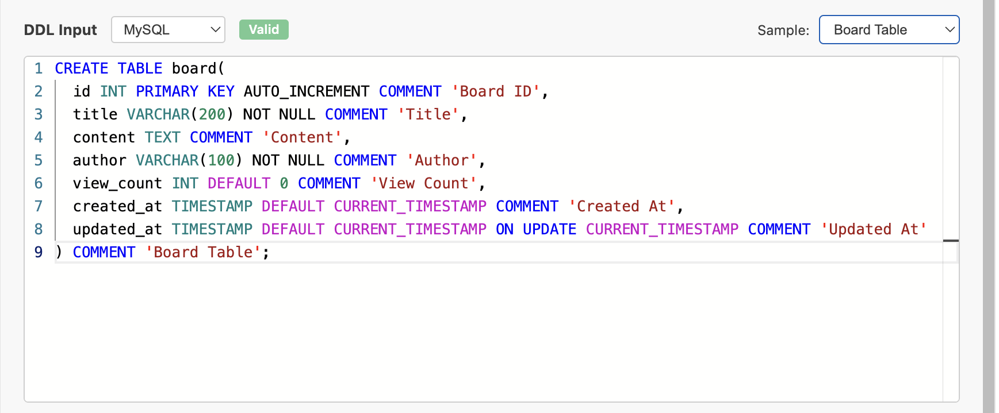
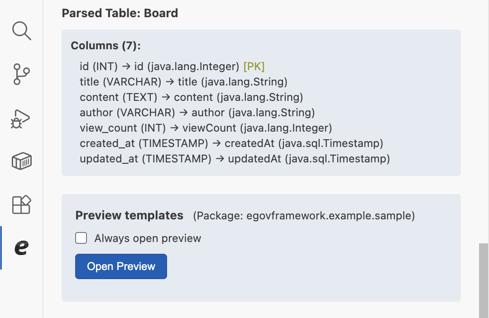
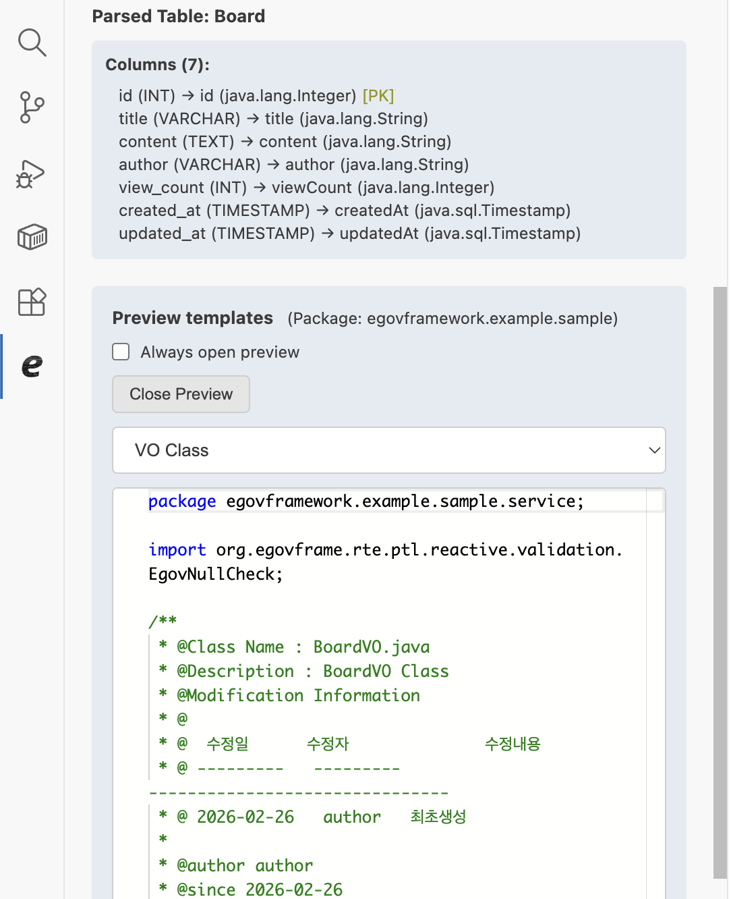
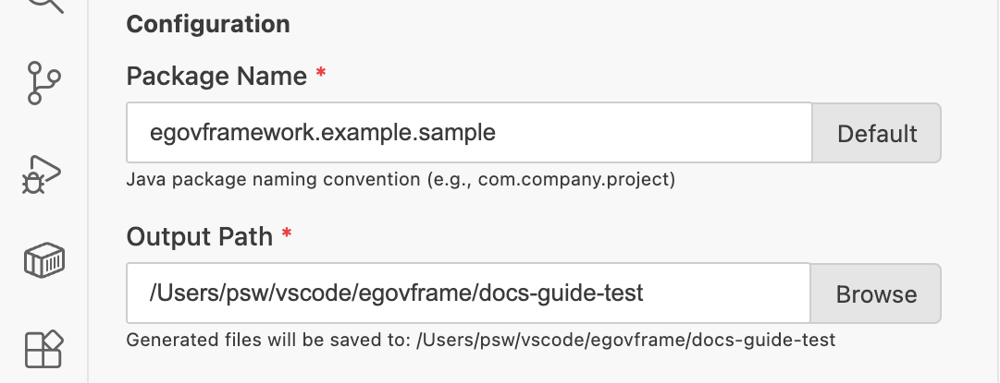
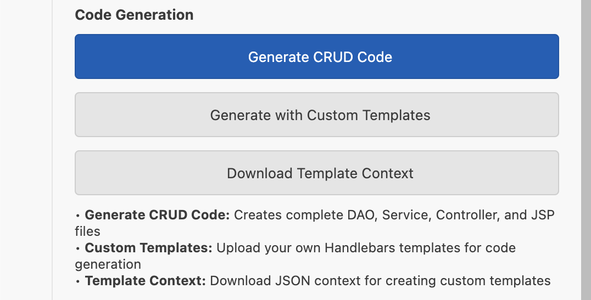

# CRUD Code Generation

## 개요

본 문서는 eGovFrame Initializr in VSCode 확장의 **CRUD Code Generation** 기능을 안내한다.

CRUD Code Generation 기능을 사용하면 DDL(Data Definition Language) 문으로부터 eGovFrame CRUD 관련 코드를 자동으로 생성할 수 있다. MySQL과 PostgreSQL DDL 문법을 지원하며, Handlebars 템플릿 엔진을 사용하여 코드를 생성한다.

사이드바에서 eGovFrame Initializr 아이콘을 클릭한 뒤 **코드 생성기(Code Generator)** 탭을 선택한다.

## 사용 방법

코드 생성은 다음 순서로 진행한다.

1. DDL 입력
2. 코드 미리보기 확인 (선택)
3. 설정 입력
4. 코드 생성

### 1단계: DDL 입력

**DDL Input** 영역에 `CREATE TABLE` 문을 입력한다. Monaco Editor 기반의 편집기를 제공하므로 SQL 문법 강조(Syntax Highlighting)와 실시간 오류 감지를 지원한다.

#### SQL 방언 선택

DDL Input 제목 옆의 드롭다운에서 사용할 SQL 방언을 선택한다.

| 옵션 | 설명 |
|---|---|
| MySQL | MySQL 문법으로 DDL 검증 및 코드 생성 |
| PostgreSQL | PostgreSQL 문법으로 DDL 검증 및 코드 생성 |
| Generic | 기본 SQL 구문 검증만 지원 (MySQL/PostgreSQL 전용 문법 미지원) |

> `Generic` 방언은 기본적인 SQL 유효성 검사만 수행하므로, 가능하면 MySQL 또는 PostgreSQL을 선택한다.

#### 샘플 DDL 선택

DDL Input 우측 **Sample** 드롭다운에서 미리 제공된 샘플 DDL을 선택하면 에디터에 자동으로 입력된다. 샘플은 선택한 SQL 방언에 맞는 항목만 표시된다. **Enter directly**를 선택하면 에디터를 초기화하여 직접 입력할 수 있다.

#### 실시간 DDL 검증

DDL을 입력하면 자동으로 유효성 검사가 수행된다. 입력을 멈춘 뒤 약 0.5초 후에 검증이 실행되며, SQL 방언을 변경하면 즉시 재검증된다.

- 유효한 DDL: `Valid` 배지가 표시된다.
- 유효하지 않은 DDL: `Invalid` 배지와 함께 오류 위치(라인, 컬럼) 및 오류 메시지가 표시된다.

DDL 검증에 성공하면 에디터 아래에 **파싱된 테이블 정보**가 표시된다. 테이블 이름과 각 컬럼의 이름, 데이터 타입, Java 타입, PK 여부를 확인할 수 있다.

### 2단계: 코드 미리보기 확인 (선택)

유효한 DDL이 입력되면 **Preview templates** 영역이 나타난다. 코드를 생성하기 전에 생성될 코드를 미리 확인할 수 있다.

#### 미리보기 열기

**Open Preview** 버튼을 클릭하면 미리보기가 생성되고 Monaco Editor로 확인할 수 있다. **Always open preview** 체크박스를 선택하면 DDL이 유효해질 때마다 자동으로 미리보기가 갱신된다.

#### 미리보기 템플릿 선택

미리보기 드롭다운에서 확인할 파일 종류를 선택한다.

| 옵션 | 설명 |
|---|---|
| VO Class | Value Object 클래스 (`TableNameVO.java`) |
| Default VO Class | 기본 Value Object 클래스 (`DefaultVO.java`) |
| Controller Class | 컨트롤러 클래스 (`TableNameController.java`) |
| Service Interface | 서비스 인터페이스 (`TableNameService.java`) |
| ServiceImpl Class | 서비스 구현 클래스 (`TableNameServiceImpl.java`) |
| Mapper Interface | 매퍼 인터페이스 (`TableNameMapper.java`) |
| MyBatis Mapper XML | MyBatis SQL 매핑 파일 (`TableName_SQL.xml`) |
| Thymeleaf List Page | Thymeleaf 목록 페이지 (`TableNameList.html`) |
| Thymeleaf Register Page | Thymeleaf 등록/수정 페이지 (`TableNameRegist.html`) |
| JSP List Page | JSP 목록 페이지 (`TableNameList.jsp`) |
| JSP Register Page | JSP 등록/수정 페이지 (`TableNameRegist.jsp`) |

**Close Preview** 버튼을 클릭하면 미리보기 영역을 닫을 수 있다.

### 3단계: 설정 입력

유효한 DDL이 입력되면 **Configuration** 영역이 나타난다.

#### 패키지 이름 (Package Name)

- 생성될 Java 파일들의 패키지 이름을 입력한다.
- 기본값은 VS Code Settings의 **기본 패키지 이름** 설정값이다.
- **Default** 버튼을 클릭하면 기본값으로 초기화된다.
- 소문자로 시작해야 하며, 소문자·숫자·점(`.`)만 사용 가능하고 점으로 끝날 수 없다.
  - 예) `egovframework.example.sample`

#### 출력 경로 (Output Path)

- 생성된 코드 파일들이 저장될 디렉터리 경로를 입력한다.
- **Browse** 버튼을 클릭하면 파일 탐색기에서 디렉터리를 선택할 수 있다.
- VS Code에 워크스페이스가 열려 있는 경우 워크스페이스 경로가 기본값으로 설정된다.

### 4단계: 코드 생성

**Code Generation** 영역에서 생성 방식을 선택하여 코드를 생성한다.

| 버튼 | 설명 | 상세 안내 문서 |
|---|---|---|
| **Generate CRUD Code** | 기본 eGovFrame CRUD 코드 생성 | [Generate CRUD Code](./vscode-code-generation-generate-crud-code.md) |
| **Generate with Custom Templates** | 사용자 정의 Handlebars 템플릿으로 코드 생성 | [Generate with Custom Templates](./vscode-code-generation-custom-templates.md) |
| **Download Template Context** | 템플릿 작성에 사용할 컨텍스트 JSON 다운로드 | [Download Template Context](./vscode-code-generation-template-context.md) |
