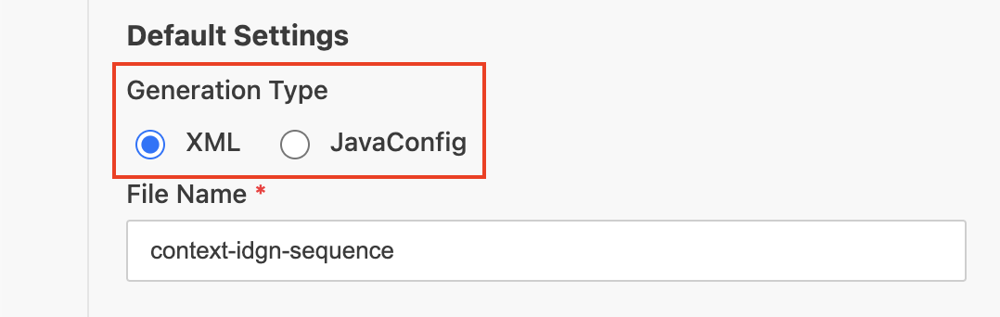
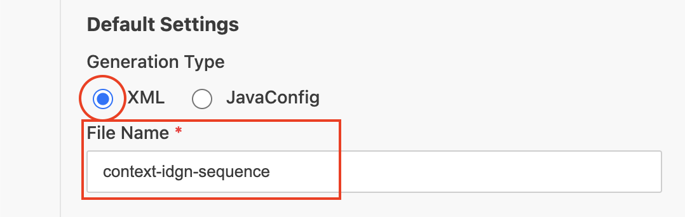
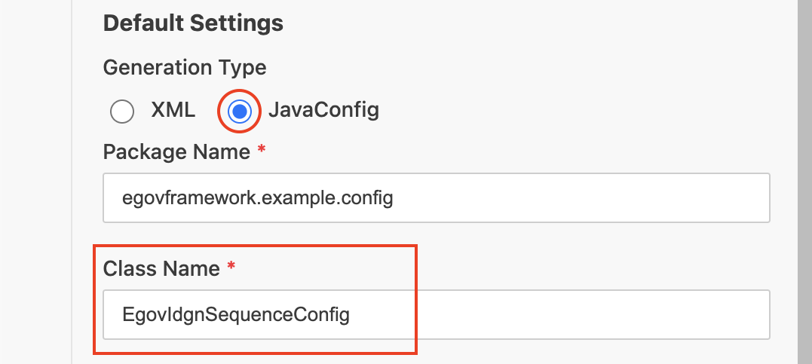
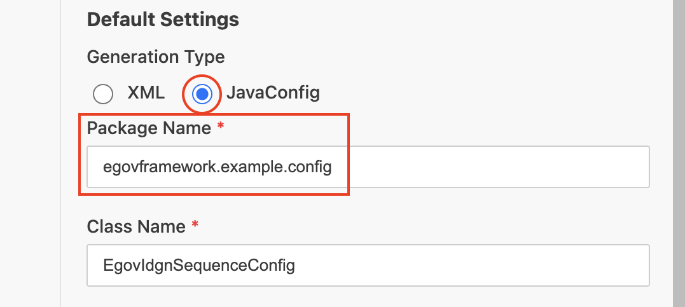

# Common Configuration

## 개요

본 문서는 eGovFrame Initializr in VSCode 확장의 Configuration Generation 기능에서 모든 설정 유형의 폼에 **공통으로 포함되는 설정 항목**을 안내한다.

각 카테고리별 세부 설정 항목은 하위 페이지에서 확인할 수 있다.

## 공통 설정 항목

### Generation Type (출력 형식)

생성할 설정 파일의 형식을 선택한다. 설정 유형에 따라 지원 형식이 다르다.

| 형식 | 설명 | 생성 파일 확장자 |
|---|---|---|
| XML | Spring XML 설정 파일 | `.xml` |
| JavaConfig | Java 기반 설정 클래스 | `.java` |
| YAML | YAML 설정 파일 | `.yml` |
| Properties | Properties 설정 파일 | `.properties` |

각 설정 유형에서 지원하는 형식은 [지원 파일 형식 요약](./vscode-config-generation#지원-파일-형식-요약)에서 확인할 수 있다.

### 파일 이름 / 클래스 이름

Generation Type에 따라 입력 항목의 레이블과 규칙이 달라진다.

#### XML / YAML / Properties 형식 — File Name

- 생성될 파일의 이름을 입력한다 (확장자 제외).
- 영문자, 숫자, 하이픈(`-`), 언더스코어(`_`)만 허용된다.
- 기본값 예시: `context-datasource`, `log4j2-console`

#### JavaConfig 형식 — Class Name

- 생성될 Java 클래스의 이름을 입력한다.
- **PascalCase** 형식이어야 하며, 대문자로 시작해야 한다.
- 영문자와 숫자만 허용된다.
- 기본값 예시: `EgovDataSourceConfig`, `EgovLog4j2ConsoleConfig`

### 패키지 이름 (JavaConfig 전용)

JavaConfig 형식 선택 시 **Package Name** 항목이 추가로 표시된다.

- 소문자로 시작해야 하며, 소문자·숫자·점(`.`)만 허용된다.
- 점(`.`)으로 끝날 수 없다.
- 기본값: `egovframework.example.config`

## 유효성 검사

**Generate** 버튼 클릭 시 다음 항목에 대해 유효성 검사가 수행된다. 오류가 있으면 오류 메시지가 표시되며 생성이 진행되지 않는다.

| 항목 | 검사 규칙 |
|---|---|
| Package Name (JavaConfig 전용) | 소문자 시작, 소문자·숫자·점만 허용, 점으로 끝날 수 없음 |
| File Name (XML/YAML/Properties) | 영문자·숫자·하이픈·언더스코어만 허용 |
| Class Name (JavaConfig) | 대문자 시작, 영문자·숫자만 허용 |
| 필수 항목 | 각 설정 유형별 필수 입력 항목이 모두 채워져 있어야 함 |
| 파일 중복 | 출력 폴더에 같은 이름의 파일이 이미 존재하면 생성 중단 |

## 폼 화면 구성

각 설정 유형의 폼은 다음과 같은 공통 구성을 가진다.

1. **가이드 패널** — 해당 설정에 대한 eGovFrame 공식 문서 링크, 요구 사양(Spring Framework 버전, JDK 버전), 필요 의존성 목록을 제공한다.
2. **Default Settings** — Generation Type, File Name(또는 Class Name), Package Name(JavaConfig 전용) 항목을 입력한다.
3. **Configuration** — 각 설정 유형에 특화된 상세 설정 항목을 입력한다.
4. **하단 버튼**
   - **Generate** — 유효성 검사 통과 후 출력 폴더 선택 대화상자를 열고 파일을 생성한다.
   - **Cancel** — 폼을 닫고 설정 목록 화면으로 돌아간다.
