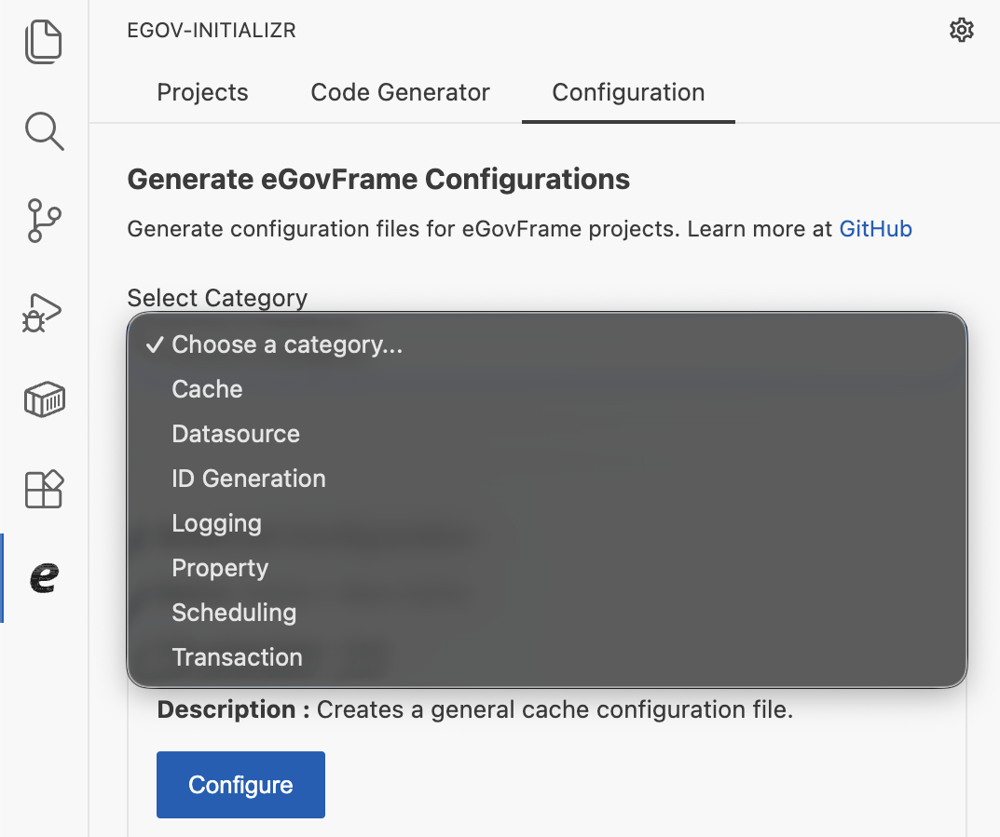
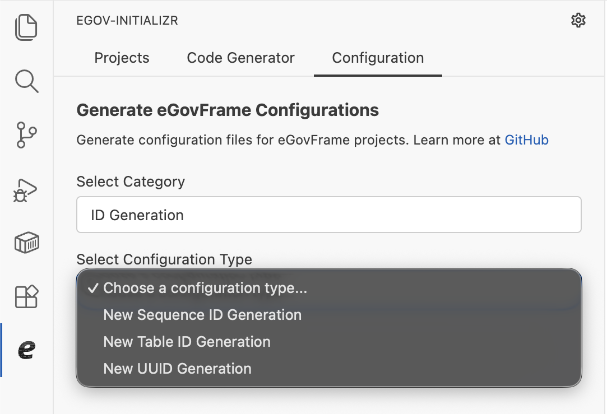
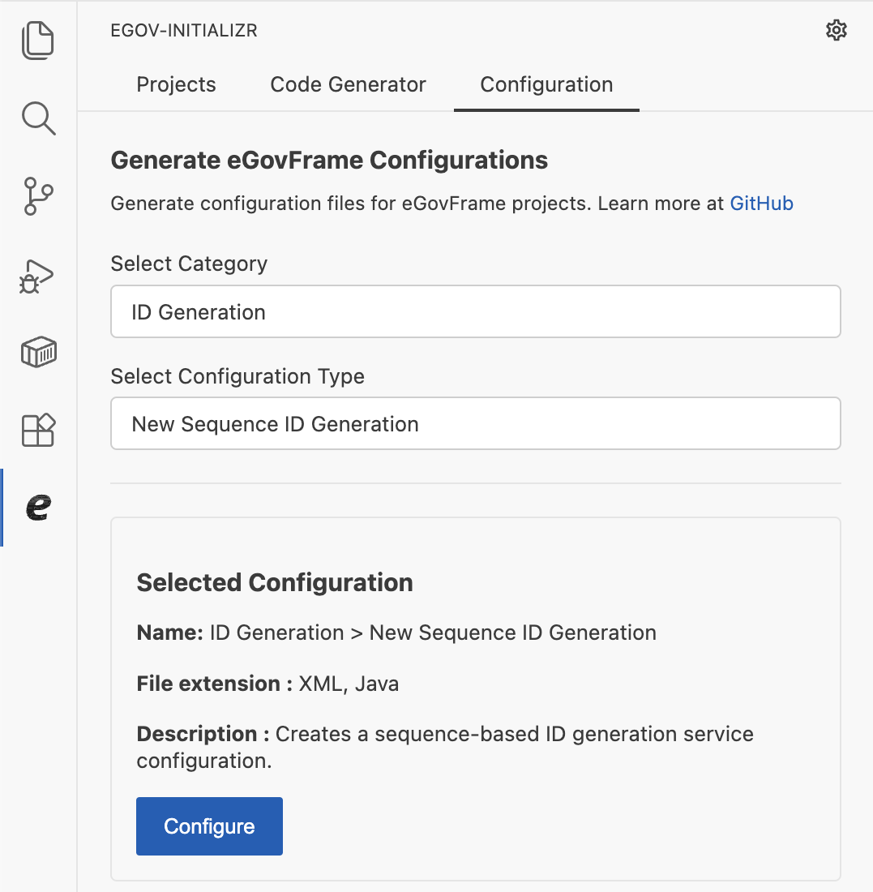
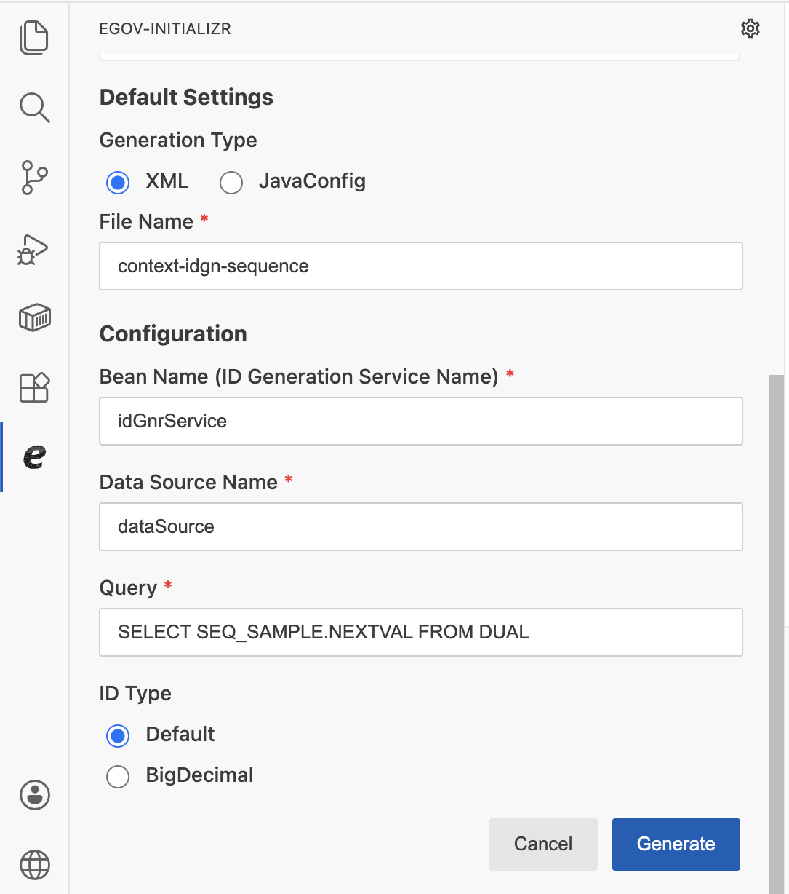

# Configuration Generation

## 개요

본 문서는 eGovFrame Initializr in VSCode 확장의 **Configuration Generation** 기능을 안내한다.

Configuration Generation 기능을 사용하면 eGovFrame 프로젝트에 필요한 다양한 Spring 설정 파일을 폼 입력만으로 손쉽게 생성할 수 있다. Datasource, Logging, Cache, Transaction, Scheduling, ID Generation, Property 등 7개 카테고리의 설정 유형을 제공하며, XML, JavaConfig, YAML, Properties 형식으로 출력할 수 있다.

사이드바에서 eGovFrame Initializr 아이콘을 클릭한 뒤 **설정(Configuration)** 탭을 선택한다.

## 사용 방법

설정 파일 생성은 다음 순서로 진행한다.

1. 카테고리 선택
2. 설정 유형 선택
3. 설정 입력 후 파일 생성

### 1단계: 카테고리 선택

**Select Category** 드롭다운에서 생성할 설정 파일의 카테고리를 선택한다.

| 카테고리 | 설명 |
|---|---|
| Cache | 캐시 설정 |
| Datasource | 데이터소스 설정 |
| ID Generation | ID 생성 서비스 설정 |
| Logging | 로깅(Log4j2) 설정 |
| Property | 프로퍼티 설정 |
| Scheduling | 스케줄링 설정 |
| Transaction | 트랜잭션 설정 |

### 2단계: 설정 유형 선택

카테고리를 선택하면 **Select Configuration Type** 드롭다운이 나타난다. 생성할 설정 유형을 선택한다.

선택된 설정 유형의 이름, 지원 파일 형식, 설명이 하단에 표시된다. **Configure** 버튼을 클릭하면 설정 입력 폼으로 이동한다.

### 3단계: 설정 입력 후 파일 생성

각 설정 유형에 맞는 폼에서 값을 입력하고 **Generate** 버튼을 클릭한다. 파일을 저장할 폴더를 선택하면 설정 파일이 생성된다.

- 이미 같은 이름의 파일이 존재하는 경우 중복 오류 메시지가 표시되며 생성이 중단된다.
- **Cancel** 버튼을 클릭하면 설정 목록 화면으로 돌아간다.

## 공통 설정 항목

[Common Configuration](./vscode-config-generation-common/) 참고

## 설정 유형별 항목

| 카테고리 | 상세 안내 |
|---|---|
| Cache | [Cache Configuration](./vscode-config-generation-cache/) |
| Datasource | [Datasource Configuration](./vscode-config-generation-datasource/) |
| ID Generation | [ID Generation Configuration](./vscode-config-generation-id-generation/) |
| Logging | [Logging Configuration](./vscode-config-generation-logging/) |
| Property | [Property Configuration](./vscode-config-generation-property/) |
| Scheduling | [Scheduling Configuration](./vscode-config-generation-scheduling/) |
| Transaction | [Transaction Configuration](./vscode-config-generation-transaction/) |

## 지원 파일 형식 요약

| 카테고리 / 설정 유형 | XML | JavaConfig | YAML | Properties |
|---|:---:|:---:|:---:|:---:|
| Cache > New Cache | ✓ | | | |
| Cache > New Ehcache Configuration | ✓ | ✓ | | |
| Datasource > New Datasource | ✓ | ✓ | | |
| Datasource > New JNDI Datasource | ✓ | ✓ | | |
| ID Generation > New Sequence ID Generation | ✓ | ✓ | | |
| ID Generation > New Table ID Generation | ✓ | ✓ | | |
| ID Generation > New UUID Generation | ✓ | ✓ | | |
| Logging > New Console Appender | ✓ | | ✓ | ✓ |
| Logging > New File Appender | ✓ | | ✓ | ✓ |
| Logging > New Rolling File Appender | ✓ | | ✓ | ✓ |
| Logging > New Time-Based Rolling File Appender | ✓ | | ✓ | ✓ |
| Logging > New JDBC Appender | ✓ | | ✓ | |
| Property > New Property | ✓ | ✓ | | |
| Scheduling > New Detail Bean Job | ✓ | ✓ | | |
| Scheduling > New Method Invoking Job | ✓ | ✓ | | |
| Scheduling > New Simple Trigger | ✓ | ✓ | | |
| Scheduling > New Cron Trigger | ✓ | ✓ | | |
| Scheduling > New Scheduler | ✓ | ✓ | | |
| Transaction > New Datasource Transaction | ✓ | ✓ | | |
| Transaction > New JPA Transaction | ✓ | ✓ | | |
| Transaction > New JTA Transaction | ✓ | ✓ | | |
