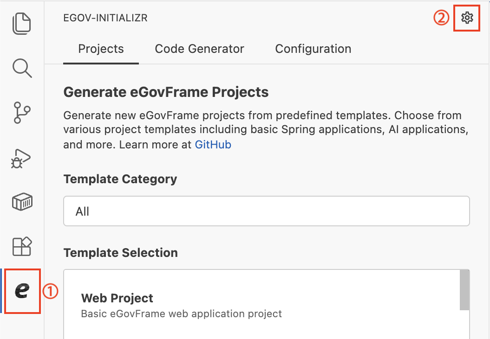
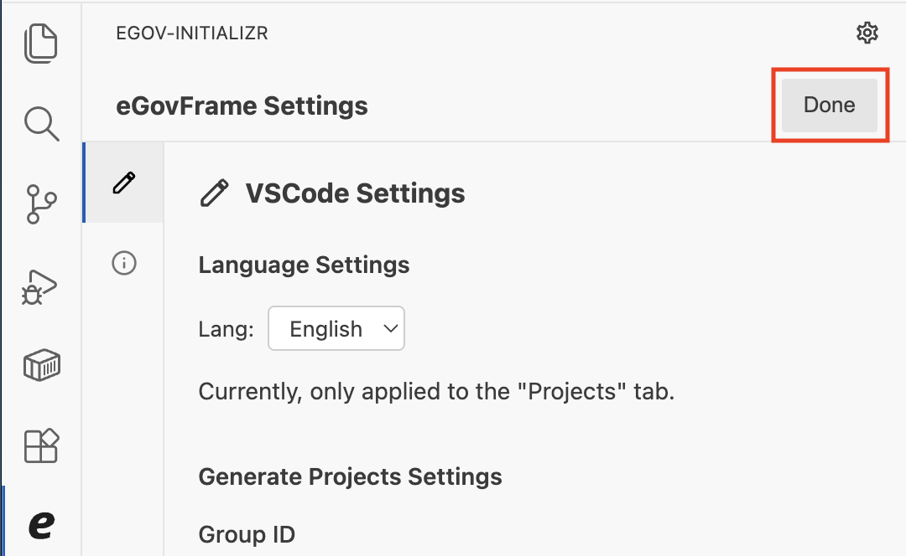
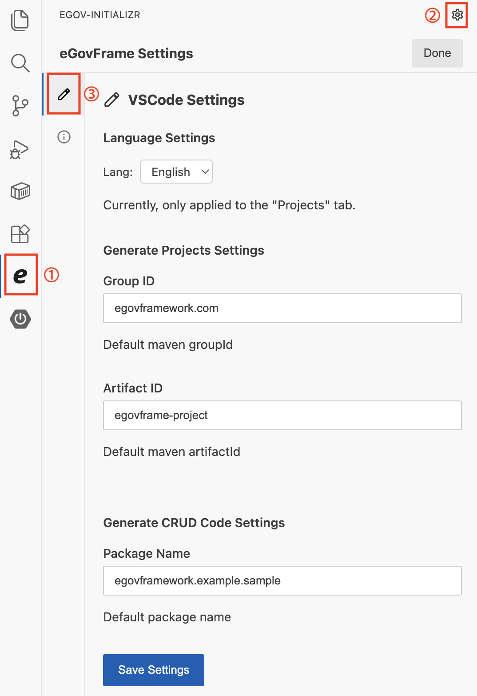
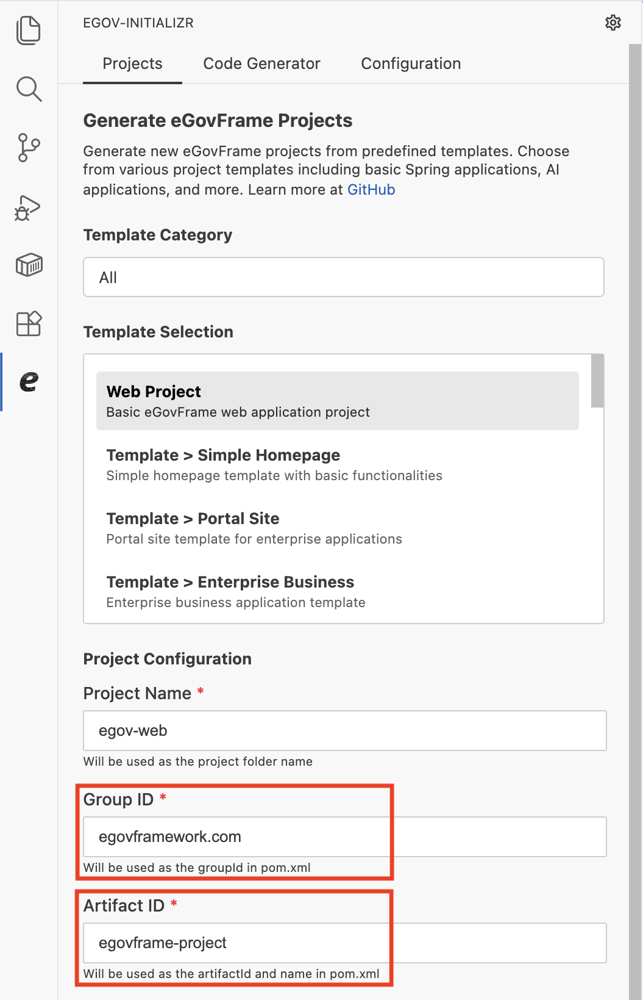
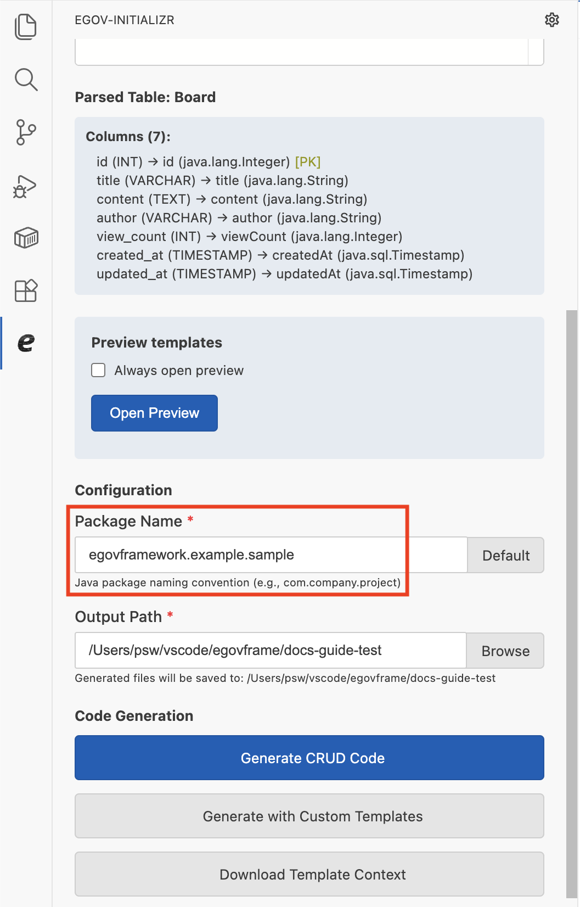
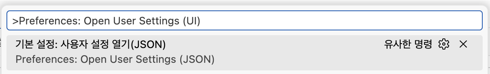
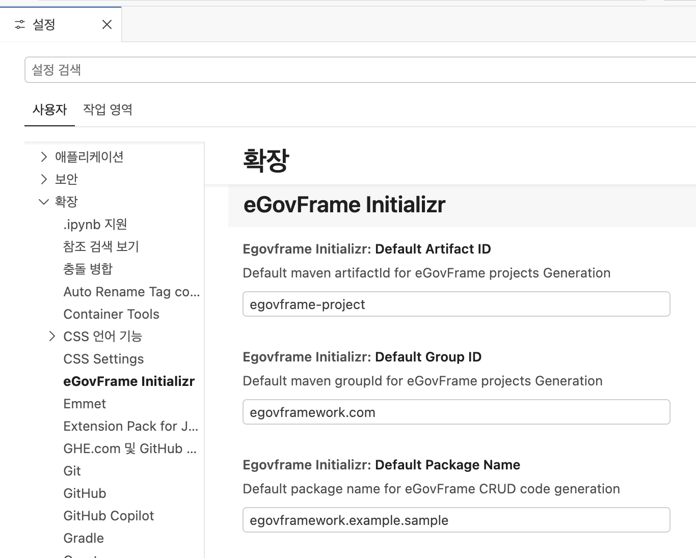
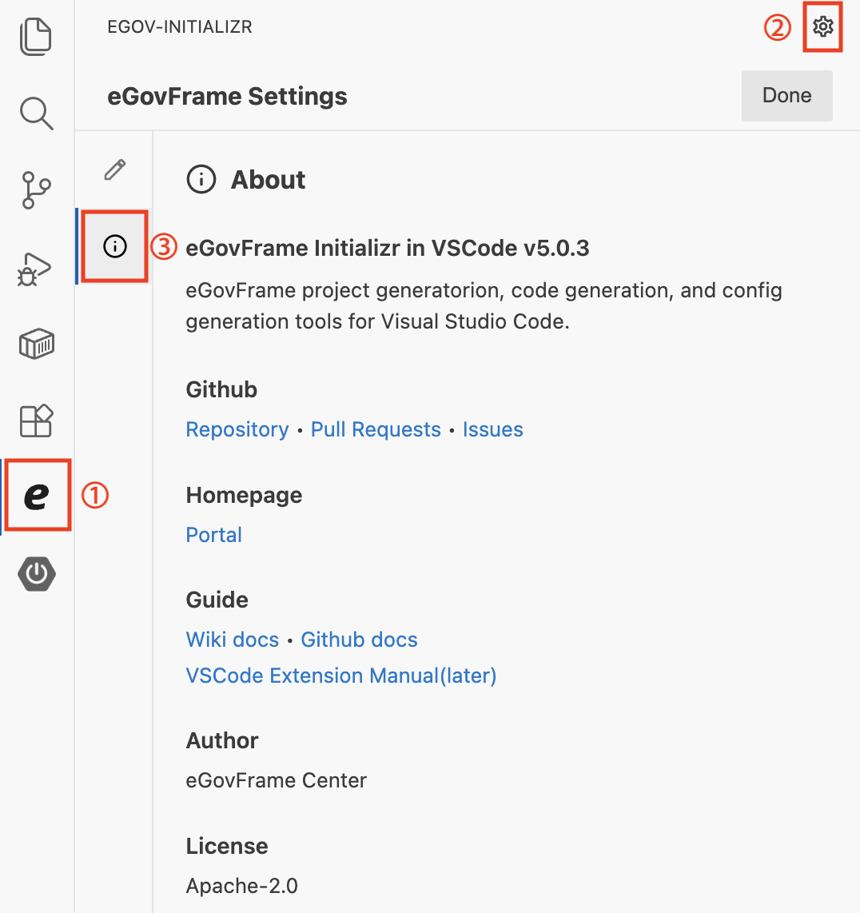

# eGovFrame Initializr Settings

## 개요

본 문서는 eGovFrame Initializr in VSCode 확장의 **eGovFrame Settings** 화면을 안내한다.

eGovFrame Settings 화면은 **VSCode Settings**와 **About** 두 탭으로 구성된다.

**VSCode Settings 탭**에서는 다음 기본값을 설정하고 저장할 수 있다.
- Group ID 기본값 (Project Generation에 반영)
- Artifact ID 기본값 (Project Generation에 반영)
- Package Name 기본값 (CRUD Code Generation에 반영)

**About 탭**에서는 다음 정보를 확인할 수 있다.
- Extension 이름 및 버전
- Extension 설명
- Github 링크 (Repository, Pull Requests, Issues)
- Homepage 링크 (eGovFrame 포털)
- Guide 링크 (Wiki docs, Github docs)
- 저작권자(Author)
- License

## eGovFrame Settings 화면 열기 및 닫기

### 화면 열기

사이드바에서 eGovFrame Initializr 아이콘 클릭 → 우측 상단 ⚙️ 아이콘 클릭

### 화면 닫기

eGovFrame Settings 화면 우측 상단의 **Done** 버튼을 클릭하면 이전 탭 화면으로 돌아간다.

## VSCode Settings 탭

eGovFrame Settings 화면의 좌측 사이드바에서 연필(✏️) 아이콘 항목(**VSCode Settings**)을 클릭한다.

### Language Settings

Extension 화면에 표시할 언어를 설정한다.

| 항목 | 설명 | 기본값 여부 |
|---|---|---|
| `en` | 영어 | O |
| `ko` | 한국어 | X |

### Projects Generation Settings

Project Generation 기능의 기본값을 설정한다.

| 항목 | 설명 | 기본값 |
|---|---|---|
| Group ID | Maven `pom.xml`의 `groupId` 기본값 | `egovframework.com` |
| Artifact ID | Maven `pom.xml`의 `artifactId` 기본값 | `egovframe-project` |

설정한 값은 **Projects** 탭의 Group ID, Artifact ID 입력란 기본값으로 반영된다.

### CRUD Code Generation Settings

CRUD Code Generation 기능의 기본값을 설정한다.

| 항목 | 설명 | 기본값 |
|---|---|---|
| Package Name | Java 패키지 이름 기본값 | `egovframework.example.sample` |

설정한 값은 **Code Generator** 탭의 Package Name 입력란 기본값으로 반영된다.

> **※ Default 버튼**
>
> Code Generator 탭에서 Package Name을 수정하더라도, 입력란 우측 **Default** 버튼을 클릭하면 여기서 설정한 기본값으로 다시 초기화된다.

### 설정 저장

값을 입력한 후 **Save Settings** 버튼을 클릭하면 설정이 저장된다.

- 저장 성공 시 성공 메시지가 3초 동안 표시된다.
- 저장 실패 시 오류 메시지가 5초 동안 표시된다.
- 유효하지 않은 값이 있으면 오류 목록이 표시되며 저장이 진행되지 않는다.

### VS Code User Settings에서 설정하기

eGovFrame Settings 화면 외에 VS Code의 User Settings 화면에서도 동일한 설정을 확인하고 변경할 수 있다.

명령 팔레트(Command Palette)를 열고 `Preferences: Open User Settings (UI)` 명령을 실행한다.
- Windows/Linux: `Ctrl + Shift + P` → `Preferences: Open User Settings (UI)`
- macOS: `Cmd + Shift + P` → `Preferences: Open User Settings (UI)`

**확장** → **eGovFrame Initializr** 항목을 클릭한다.

Group ID, Artifact ID, Package Name 설정 내용은 위와 동일하다.

## About 탭

eGovFrame Settings 화면의 좌측 사이드바에서 정보(ℹ️) 아이콘 항목(**About**)을 클릭한다.

다음 정보와 링크를 확인할 수 있다.

| 섹션 | 내용 |
|---|---|
| Extension 이름 및 버전 | Extension 이름과 현재 버전 |
| Extension 설명 | Extension의 기능 설명 |
| Github | Repository · Pull Requests · Issues 링크 |
| Homepage | eGovFrame 포털 링크 |
| Guide | Wiki docs · Github docs 링크 |
| Author | 저작권자 |
| License | 라이선스 |
