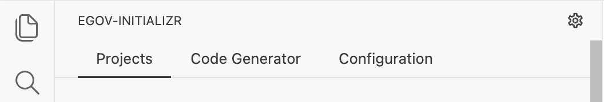
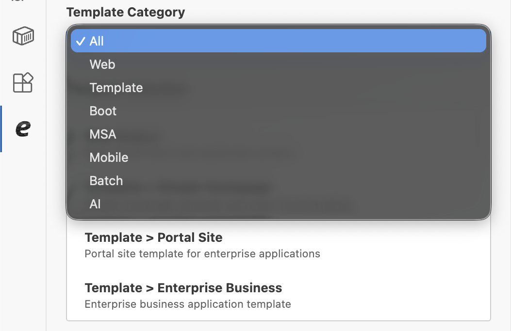
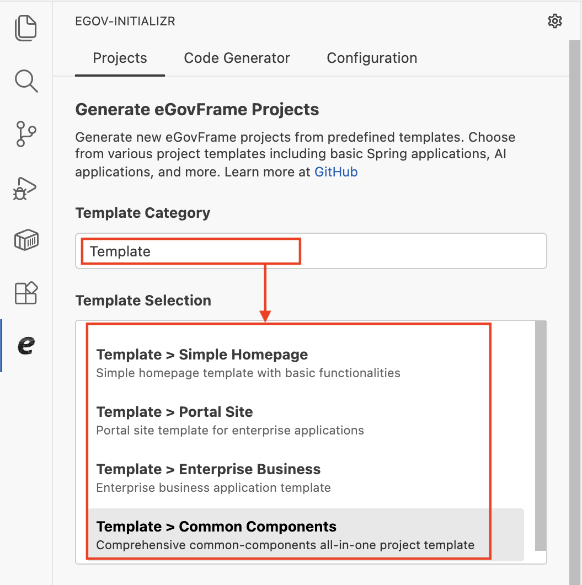
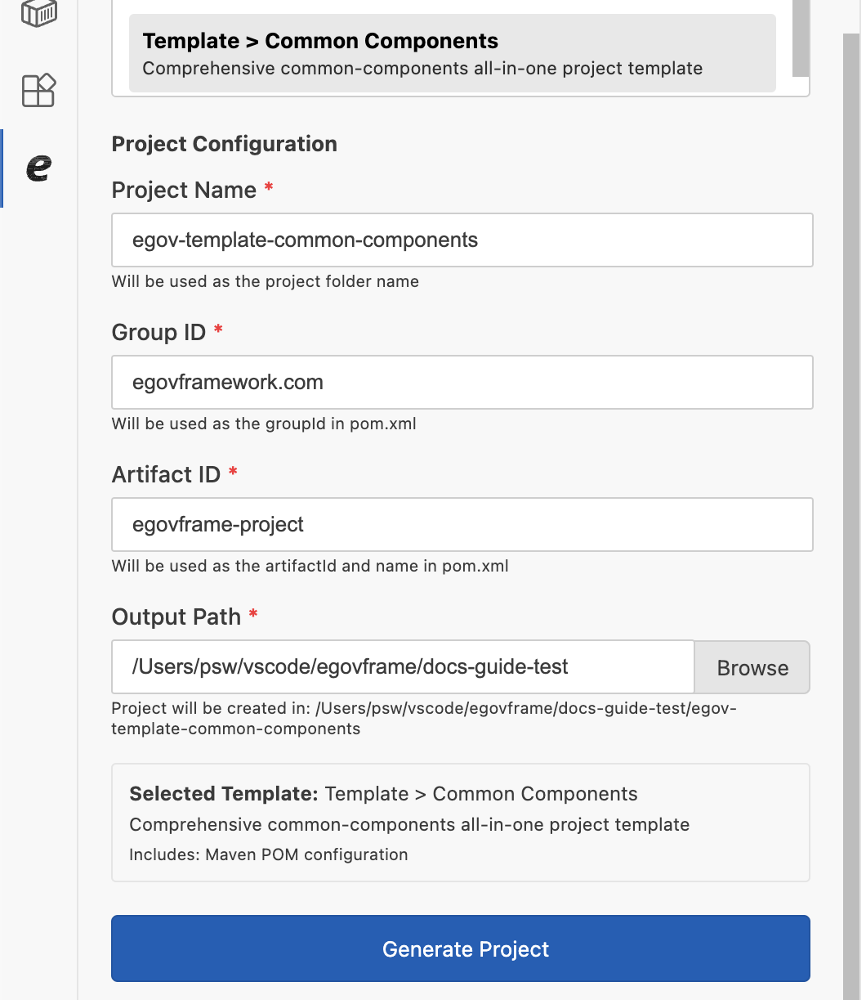
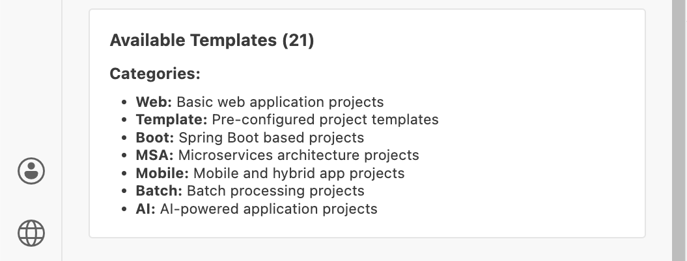

# Project Generation

## 개요

본 문서는 eGovFrame Initializr in VSCode 확장의 **Project Generation** 기능을 안내한다.

Project Generation 기능을 사용하면 미리 정의된 템플릿을 선택하여 eGovFrame 프로젝트를 손쉽게 생성할 수 있다. 기본 웹 애플리케이션부터 Spring Boot, MSA, 모바일, 배치, AI 프로젝트까지 다양한 템플릿을 제공한다.

사이드바에서 eGovFrame Initializr 아이콘을 클릭하면 **프로젝트(Projects)** 탭이 기본으로 표시된다.

## 사용 방법

프로젝트 생성은 다음 순서로 진행한다.

1. 템플릿 카테고리 선택
2. 템플릿 선택
3. 프로젝트 설정 입력
4. 프로젝트 생성

### 1단계: 템플릿 카테고리 선택

**템플릿 카테고리(Template Category)** 드롭다운에서 생성할 프로젝트의 유형을 선택한다.

| 카테고리 | 설명 |
|---|---|
| All | 전체 템플릿 표시 |
| Web | 기본 웹 애플리케이션 프로젝트 |
| Template | 미리 구성된 프로젝트 템플릿 |
| Boot | Spring Boot 기반 프로젝트 |
| MSA | 마이크로서비스 아키텍처 프로젝트 |
| Mobile | 모바일 및 하이브리드 앱 프로젝트 |
| Batch | 배치 처리 프로젝트 |
| AI | AI 기반 애플리케이션 프로젝트 |

### 2단계: 템플릿 선택

카테고리를 선택하면 해당 카테고리에 속한 템플릿 목록이 **템플릿 선택(Template Selection)** 영역에 표시된다. 생성할 프로젝트에 맞는 템플릿을 클릭하여 선택한다.

선택된 템플릿은 강조 표시되며, 템플릿의 이름과 설명을 확인할 수 있다.

#### 제공 템플릿 목록

**Web**

| 템플릿 | 설명 |
|---|---|
| Web Project | 기본 eGovFrame 웹 애플리케이션 프로젝트 |

**Template**

| 템플릿 | 설명 |
|---|---|
| Template > Simple Homepage | 기본 기능을 포함한 심플 홈페이지 템플릿 |
| Template > Portal Site | 대규모 서비스용 포털 사이트 템플릿 |
| Template > Enterprise Business | 기업 내부 업무 시스템 템플릿 |
| Template > Common Components | 공통 컴포넌트 올인원 프로젝트 템플릿 |

**Boot**

| 템플릿 | 설명 |
|---|---|
| Boot Web Project | Spring Boot 기반 웹 프로젝트 |
| Boot Template > Simple Homepage (Backend) | Spring Boot 심플 홈페이지 백엔드 |
| Boot Template > Simple Homepage (Frontend) | 심플 홈페이지용 React 기반 프론트엔드 |

**MSA**

| 템플릿 | 설명 |
|---|---|
| MSA Boot Template > Common Components (KRDS) | KRDS 적용 MSA 공통 컴포넌트 |
| MSA Boot Template > Portal (Backend) | MSA 포털 백엔드 서비스 |
| MSA Boot Template > Portal (Frontend) | MSA 포털 프론트엔드 애플리케이션 |

**Mobile**

| 템플릿 | 설명 |
|---|---|
| Mobile Web Project | 모바일 웹 애플리케이션 프로젝트 |
| Mobile Common Components Project | 하이브리드 앱을 지원하는 모바일 공통 컴포넌트 프로젝트 |
| DeviceAPI Web Project | 디바이스 API 연동 웹 프로젝트 |

**Batch**

| 템플릿 | 설명 |
|---|---|
| Boot Batch Template > Scheduler (File) | 파일 기반 배치 스케줄러 프로젝트 |
| Boot Batch Template > CommandLine (File) | 파일 기반 커맨드라인 배치 프로젝트 |
| Boot Batch Template > Web (File) | 파일 기반 웹 배치 프로젝트 |
| Boot Batch Template > Scheduler (DB) | DB 기반 배치 스케줄러 프로젝트 |
| Boot Batch Template > CommandLine (DB) | DB 기반 커맨드라인 배치 프로젝트 |
| Boot Batch Template > Web (DB) | DB 기반 웹 배치 프로젝트 |

**AI**

| 템플릿 | 설명 |
|---|---|
| AI > RAG Project (SpringAI) | Spring AI와 Redis Stack을 활용한 RAG 프로젝트 |
| AI > RAG Project (Lanchain4j) | Lanchain4j와 PostgreSQL을 활용한 RAG 프로젝트 |

### 3단계: 프로젝트 설정 입력

템플릿을 선택하면 **프로젝트 설정(Project Configuration)** 영역이 나타난다. 각 항목을 입력한다.

#### 프로젝트 이름 (Project Name)

- 생성될 프로젝트의 **폴더 이름**으로 사용된다.
- 프로젝트 이름을 입력하면 **그룹 ID**와 **아티팩트 ID**가 자동으로 채워진다.
  - 점(`.`)이 없는 경우: 아티팩트 ID에 입력값이 그대로 설정된다.
  - 점(`.`)이 포함된 경우: 마지막 점을 기준으로 앞 부분은 그룹 ID, 뒷 부분은 아티팩트 ID로 설정된다.
  - 예) `com.example.my-app` 입력 시 → 그룹 ID: `com.example`, 아티팩트 ID: `my-app`

#### 그룹 ID (Group ID)

- Maven `pom.xml`의 `groupId`로 사용된다.
- Maven POM 설정이 포함된 템플릿에서만 표시된다.
- 소문자, 숫자, 점(`.`)만 사용 가능하며, 소문자로 시작해야 한다.
- 기본값은 VS Code Settings의 **기본 그룹 ID** 설정값이다.

#### 아티팩트 ID (Artifact ID)

- Maven `pom.xml`의 `artifactId` 및 `name`으로 사용된다.
- Maven POM 설정이 포함된 템플릿에서만 표시된다.
- 소문자, 숫자, 하이픈(`-`)만 사용 가능하며, 소문자로 시작해야 한다.
- 기본값은 VS Code Settings의 **기본 아티팩트 ID** 설정값이다.

> **Boot Template > Simple Homepage (Frontend)**, **MSA Boot Template** 계열 등 Maven POM이 없는 템플릿은 그룹 ID와 아티팩트 ID 항목이 표시되지 않는다.

#### 출력 경로 (Output Path)

- 프로젝트가 생성될 상위 디렉터리 경로를 입력한다.
- 실제 프로젝트는 `출력 경로/프로젝트 이름` 위치에 생성된다.
- **찾아보기(Browse)** 버튼을 클릭하면 파일 탐색기에서 디렉터리를 선택할 수 있다.
- VS Code에 워크스페이스가 열려 있는 경우 워크스페이스 경로가 기본값으로 설정된다.

#### 선택된 템플릿 정보

입력 영역 하단에 현재 선택된 템플릿의 이름과 설명이 표시된다. Maven POM 설정이 포함된 템플릿의 경우 `포함: Maven POM 설정` 안내 문구가 함께 표시된다.

### 4단계: 프로젝트 생성

모든 항목을 입력한 후 **프로젝트 생성(Generate Project)** 버튼을 클릭한다.

- 필수 항목이 모두 입력되어야 버튼이 활성화된다.
- 생성이 진행되는 동안 버튼은 비활성화되고 진행 상태 메시지가 표시된다.
- 생성이 완료되면 성공 또는 실패 메시지가 표시된다.
  - 성공 시: `✅ Project generated successfully at: [생성된 경로]`
  - 실패 시: `❌ Generation failed: [오류 메시지]`

## 유효성 검사

**프로젝트 생성** 버튼 클릭 시 다음 항목에 대해 유효성 검사가 수행된다. 오류가 있으면 오류 목록이 표시되며 생성이 진행되지 않는다.

| 항목 | 검사 규칙 |
|---|---|
| 프로젝트 이름 | 필수 입력 |
| 그룹 ID | 필수 입력, 소문자 시작, 소문자·숫자·점만 허용, 점으로 끝날 수 없음 (pomFile 포함 템플릿만 해당) |
| 아티팩트 ID | 필수 입력, 소문자 시작, 소문자·숫자·하이픈만 허용 (pomFile 포함 템플릿만 해당) |
| 출력 경로 | 필수 입력 |
| 템플릿 | 필수 선택 |

## 사용 가능한 템플릿 정보

화면 하단의 **사용 가능한 템플릿(Available Templates)** 영역에서 전체 템플릿 수와 카테고리별 설명을 확인할 수 있다.

