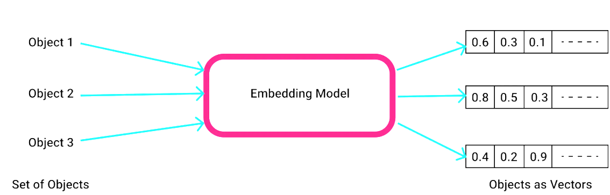
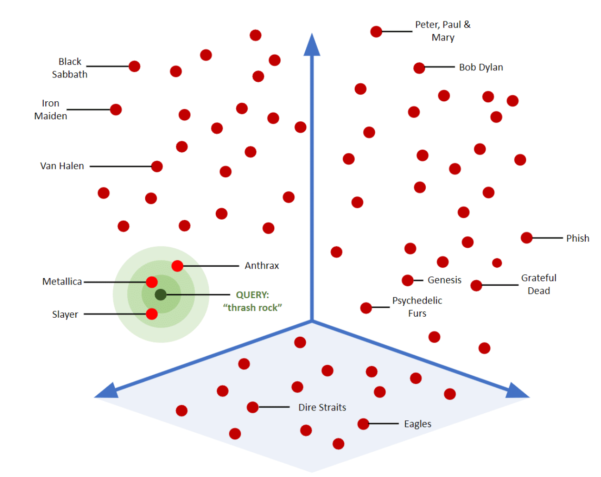

# AI 개요

## 개요

이 문서에서는 AI 통합에 필요한 기본 개념과 핵심 용어를 설명한다. LLM(Large Language Model), Embedding, Vector Store 등 AI 애플리케이션 개발에 필수적인 개념들을 다룬다.

---

## LLM (Large Language Model)

**LLM(Large Language Model)** 은 대규모 텍스트 데이터로 학습된 인공지능 모델로, 자연어를 이해하고 생성할 수 있다.

**주요 특징:**
- **자연어 이해**: 사용자의 질문이나 명령을 이해
- **텍스트 생성**: 문맥에 맞는 자연스러운 응답 생성
- **다양한 태스크**: 번역, 요약, 질의응답, 코드 생성 등

<br/>

**대표적인 LLM:**

| 모델 | 제공자 | 특징 |
|------|--------|------|
| GPT-4 | OpenAI | 상용 API, 높은 성능 |
| Claude | Anthropic | 상용 API, 안전성 강조 |
| Llama | Meta | 오픈소스, 로컬 실행 가능 |
| Qwen | Alibaba | 오픈소스, 다국어 지원 |
| Gemma | Google | 오픈소스, 경량 모델 |

### Ollama

Ollama는 로컬 환경에서 오픈소스 LLM을 쉽게 실행할 수 있게 해주는 도구이다.

**주요 특징:**
- 다양한 오픈소스 모델 지원 (Llama, Qwen, Gemma 등)
- 간단한 명령어로 모델 다운로드 및 실행
- REST API 제공 (기본 포트: 11434)
- GPU 가속 지원

<br/>

**기본 사용법:**
```bash
# 모델 다운로드
ollama pull <model-name>

# Hugging Face에서 모델 다운로드
ollama pull hf.co/<username>/<model-repository>

# 모델 실행
ollama run <model-name>

# 설치된 모델 목록
ollama list
```

---

## Embedding

**Embedding**은 텍스트, 이미지 등의 데이터를 고차원 벡터(숫자 배열)로 변환하는 기술이다. 의미적으로 유사한 데이터는 벡터 공간에서 가까운 위치에 배치된다.



**활용 분야:**
- **유사도 검색**: 의미적으로 유사한 문서 검색
- **클러스터링**: 유사한 문서 그룹화
- **추천 시스템**: 사용자 관심사 기반 추천
- **RAG**: 질문과 관련된 문서 검색

### ONNX (Open Neural Network Exchange)

**ONNX**는 딥러닝 모델을 다양한 프레임워크 간에 호환 가능하게 만드는 표준 포맷이다.

**장점:**
- 프레임워크 독립적 (PyTorch → Java 사용 가능)
- 로컬 실행으로 외부 API 불필요
- 빠른 추론 속도

<br/>

**ONNX 변환 예시:**
```bash
# Python 환경에서 Hugging Face 모델을 ONNX로 변환
pip install optimum onnx onnxruntime

optimum-cli export onnx -m sentence-transformers/ko-sroberta-multitask ./output
```

---

## Vector Store

**Vector Store**는 Embedding 벡터를 저장하고 유사도 검색을 수행하는 전문 데이터베이스이다.

**주요 기능:**
- **벡터 저장**: 고차원 벡터 데이터 저장
- **유사도 검색**: 코사인 유사도, 유클리드 거리 등으로 유사 벡터 검색
- **메타데이터 관리**: 벡터와 함께 원본 텍스트, 출처 등 저장



<br/>

- 내부적으로 유사도를 계산하여 threshold 값 이상의 문서를 반환하게 된다.

<br/>

**주요 Vector Store:**

| 이름 | 특징 | Spring AI | LangChain4j |
|------|------|-----------|-------------|
| **Redis Stack** | 인메모리, 빠른 속도 | O | O |
| **PGVector** | PostgreSQL 확장, SQL 호환 | O | O |
| **Chroma** | 오픈소스, 경량 | O | O |
| **Pinecone** | 클라우드 서비스, 관리형 | O | O |
| **Milvus** | 대규모 분산 처리 | O | O |

---

## 상세 가이드

- [RAG 및 고급 개념](./ai-rag-concepts.md)
RAG, ETL Pipeline, Chunking, Chat Memory, Query Compression, GGUF 포맷 등 고급 개념을 설명한다.

## 참고자료

* https://docs.spring.io/spring-ai/reference/
* https://docs.langchain4j.dev/
* https://ollama.ai/
* https://huggingface.co/
* https://onnx.ai/
