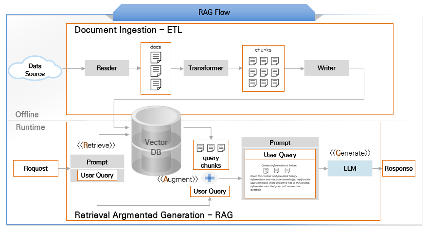

# RAG 및 고급 개념

## 개요

이 문서에서는 RAG(Retrieval-Augmented Generation), ETL Pipeline, Chunking, Chat Memory, Query Compression, GGUF 포맷 등 AI 통합의 고급 개념을 설명한다.

---

## RAG (Retrieval-Augmented Generation)

**RAG(Retrieval-Augmented Generation)** 는 LLM의 응답 생성 시 외부 지식 베이스에서 관련 정보를 검색하여 컨텍스트로 제공하는 기법이다.

**LLM의 한계:**
- 학습 데이터 이후 정보 부재 (지식 컷오프)
- 특정 도메인 지식 부족
- 환각(Hallucination) - 사실과 다른 정보 생성

<br/>

**RAG의 해결:**
- 최신 정보 제공 가능
- 도메인 특화 문서 활용
- 출처 기반 답변으로 신뢰성 향상



---

## ETL Pipeline

RAG 시스템에서 문서를 Vector Store에 저장하는 과정을 **ETL Pipeline**이라 한다.

| 단계 | 설명 | 구성 요소 |
|------|------|----------|
| **Extract** | 문서 읽기 | DocumentReader (PDF, Markdown 등) |
| **Transform** | 문서 변환 | 정규화, 청킹, 메타데이터 추가 |
| **Load** | 저장 | Embedding 생성 → Vector Store 저장 |

---

## 청킹 (Chunking)

긴 문서를 적절한 크기로 분할하는 과정이다.

**청킹 전략:**
- **고정 크기**: 일정 토큰/문자 수로 분할
- **문장 기반**: 문장 단위로 분할
- **의미 기반**: 단락/섹션 단위로 분할

<br/>

**청크 크기 선택:**

| 크기 | 장점 | 단점 |
|------|------|------|
| 작음 (500~1000) | 정밀한 검색 | 컨텍스트 부족 |
| 큼 (4000~8000) | 충분한 컨텍스트 | 노이즈 증가 |
| 권장 (2000~4000) | 균형 | - |

---

## Chat Memory

**Chat Memory**는 대화 히스토리를 저장하고 관리하는 기능이다. 멀티턴 대화에서 맥락을 유지하는 데 필수적이다.

**저장소 옵션:**

**Spring AI** 와 **LangChain4j**와 같은 라이브러리에서는 **Chat Memory**를 위한 추상화를 제공하고 있다.

| 저장소 | 특징 | 적합한 경우 |
|--------|------|------------|
| **In-Memory** | 휘발성, 빠름 | 개발/테스트 |
| **Redis** | 인메모리 DB, TTL 지원 | 세션 기반 대화 |
| **PostgreSQL** | 영구 저장, 트랜잭션 | 대화 이력 보관 필요 시 |

<br/>

- 이 외에도 버전 업데이트에 따라 추가 중에 있다.

---

## Query Compression

**Query Compression**은 대화 히스토리를 기반으로 후속 질문을 독립적인 질문으로 변환하는 기법이다.

```
이전 대화:
  User: "Tell me about OpenAI."
  AI: "OpenAI is an AI research company based in San Francisco."

후속 질문: "Who is the CEO?"

    ▼ Query Compression

압축 결과: "What is the name of CEO of OpenAI?"
```

**효과:**
- **검색 정확도 향상**: 명확한 키워드로 벡터 검색
- **맥락 독립성**: 후속 질문도 독립적으로 검색 가능
- **RAG 품질 개선**: 관련 문서 더 정확히 검색

---

## GGUF 포맷

**GGUF (Georgi Gerganov Unified Format)** 는 Georgi Gerganov에 의해 개발된 딥러닝 모델 저장용 단일 파일 포맷이다.

**특징:**
- 파일 내에 모델의 가중치(weight) 텐서 값들과 메타데이터가 Key-Value 형식으로 저장
- 메타데이터는 모델의 구조, 버전, 텐서 개수 등을 포함
- 16-bit 부동 소수점뿐만 아니라 8-bit, 6-bit, 5-bit, 4-bit, 3-bit, 2-bit까지 다양한 양자화된 텐서 타입 지원

<br/>

**양자화 (Quantization):**

양자화란 각 가중치의 표현에 필요한 비트 수를 줄여 모델의 크기를 작게 만들고, 메모리 사용량을 줄이며 경우에 따라서는 추론 속도를 높일 수 있도록 하는 기법이다.

| 양자화 레벨 | 크기 | 품질 | 용도 |
|------------|------|------|------|
| Q8_0 | 가장 큼 | 가장 높음 | 품질 우선 |
| Q5_K_M | 중간 | 높음 | 균형 |
| Q4_K_M | 작음 | 적당 | 일반 권장 |
| Q3_K_M | 더 작음 | 낮음 | 메모리 제한 시 |
| Q2_K | 가장 작음 | 가장 낮음 | 극한 환경 |

<br/>

**Ollama에서 GGUF 사용:**

```bash
# Modelfile 작성
FROM hyperclova.gguf

SYSTEM """
너는 친절한 한국어 인공지능 비서야.
"""

PARAMETER temperature 0.4
PARAMETER top_p 0.9

# 모델 등록
ollama create mymodel -f Modelfile

# 실행
ollama run mymodel
```

---

## 참고자료

* https://docs.spring.io/spring-ai/reference/
* https://docs.langchain4j.dev/
* https://ollama.ai/
* https://huggingface.co/
