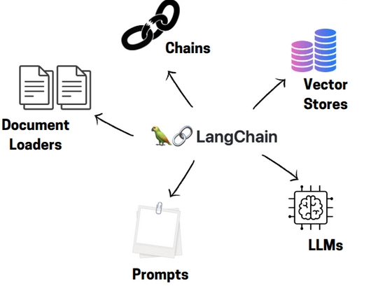
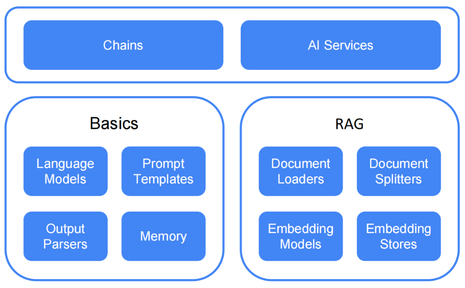

# LangChain4j 소개

## 개요

**LangChain4j**는 Java 기반 LLM 애플리케이션 개발 프레임워크로, Python의 LangChain에서 영감을 받아 Java 생태계에 최적화된 AI 통합 솔루션을 제공한다.



LangChain4j는 다음과 같은 핵심 목표를 가지고 있다.

1. **Java 생태계 통합**
    - Spring Boot와의 자연스러운 통합
    - Java 개발자 친화적인 API 설계

<br />

2. **Reflection 기반 프록시 AI 서비스**
    - 인터페이스 정의만으로 AI 서비스 구현
    - 어노테이션 기반 프롬프트 관리

<br />

3. **유연한 구성**
    - Spring Boot 자동 구성(`langchain4j-spring-boot-starter`) 지원
    - 명시적 빈 생성을 통한 세밀한 제어도 가능
    - 외부 설정 파일 지원

<br />

4. **광범위한 통합 생태계**
    - 20개 이상의 LLM 프로바이더 지원 (OpenAI, Anthropic, Ollama, Azure OpenAI, AWS Bedrock 등)
    - 30개 이상의 벡터 저장소 지원 (PGVector, Redis, Chroma, Pinecone 등)
    - Spring Boot, Quarkus, Helidon, Micronaut 등 다양한 프레임워크 통합

---

## 주요 특징

### AiServices Reflection 기반 프록시

인터페이스 정의만으로 AI 서비스를 구현할 수 있다.

```java
// 인터페이스 정의
public interface RagChatbot {

    @SystemMessage("당신은 지식 기반 질의응답 시스템입니다...")
    Flux<String> streamChat(@UserMessage String query);
}

// Reflection 기반 프록시 생성
RagChatbot bot = AiServices.builder(RagChatbot.class)
    .streamingChatModel(model)
    .contentRetriever(retriever)
    .chatMemory(memory)
    .build();
```

**장점:**
- 인터페이스만 정의하면 LangChain4j가 런타임에 구현체 생성
- `@SystemMessage`, `@UserMessage` 어노테이션으로 프롬프트 자동 구성
- ContentRetriever, ChatMemory가 자동으로 연결

### 네이티브 스트리밍

langchain4j-reactor를 통해 Flux를 네이티브로 지원한다.

```java
// 인터페이스에서 Flux<String> 반환
@SystemMessage(RAG_SYSTEM_PROMPT)
Flux<String> streamChat(@UserMessage String query);

// 컨트롤러에서 직접 사용
@GetMapping(value = "/stream", produces = MediaType.TEXT_EVENT_STREAM_VALUE)
public Flux<String> stream(@RequestParam String message) {
    return chatbot.streamChat(message);
}
```

### Vector Store 영구 저장

| 저장소 | 테이블명 | 용도 |
|--------|----------|------|
| **Vector Store** | document_embeddings | 문서 임베딩 벡터 저장 |
| **Chat Memory** | chat_memory | 대화 히스토리 저장 |
| **Session** | chat_sessions | 세션 메타데이터 저장 |

---

## 핵심 기능

| 기능 | 설명 | 구현 방식 |
|------|------|----------|
| **Chat** | 텍스트 대화 | AiServices + StreamingChatModel |
| **Embedding** | 텍스트 벡터화 | EmbeddingModel |
| **RAG** | 검색 증강 생성 | ContentRetriever 자동 연결 |
| **Streaming** | 실시간 응답 | Flux\<String\> 네이티브 |
| **Tool Calling** | LLM이 Java 메서드 호출 | @Tool 어노테이션 |
| **Structured Output** | JSON → Java 객체 매핑 | 자동 파싱 |
| **Agent** | 자율적 작업 수행 | AI 에이전트 |
| **MCP** | Model Context Protocol | Anthropic MCP 지원 |

<br/>

**고급 기능:**
- **ContentRetriever**: 질문과 관련된 문서 자동 검색, EmbeddingStoreContentRetriever를 통한 벡터 검색
- **ChatMemoryStore**: 대화 히스토리 영구 저장
- **MessageWindowChatMemory**: 채팅 이력 관리, maxMessages 초과 시 오래된 메시지 자동 삭제

---

## 추상화 단계

LangChain4j는 LLM 기반 애플리케이션의 기본 요소에 접근하기 위한 저수준 API와 LLM과 상호작용하기 위한 고수준 API를 제공하고 있다.




---

## 응용 분야

**대화형 AI:** 문서 기반 질의응답(RAG), 멀티턴 대화, 실시간 스트리밍 응답을 지원하는 고객 지원 챗봇 구현

**지식 관리 시스템:** PDF, Markdown 등 다양한 형식 지원, 벡터 검색을 통한 의미 기반 검색, 세션별 대화 히스토리 관리

**엔터프라이즈 AI 애플리케이션:** API 파라미터로 LLM 모델을 동적으로 전환하여 용도별 최적 모델 사용

---

## 표준프레임워크의 LangChain4j 공식 지원

전자정부 표준프레임워크 5.0.0부터는 `egovframe-boot-starter-parent`에 LangChain4j 의존성 버전 관리를 공식 포함하였다.

| 구분 | artifactId | 관리 버전 |
|------|--------|----------|
| **정식 릴리즈** | langchain4j | 1.8.0 |
| **정식 릴리즈** | langchain4j-ollama | 1.8.0 |
| **정식 릴리즈** | langchain4j-redis | 1.8.0 |
| **정식 릴리즈** | langchain4j-spring-boot-starter | 1.8.0 |
| **Beta** | langchain4j-pgvector | 1.8.0-beta15 |
| **Beta** | langchain4j-embeddings | 1.8.0-beta15 |
| **Beta** | langchain4j-reactor | 1.8.0-beta15 |
| **Beta** | langchain4j-easy-rag | 1.8.0-beta15 |
| **Beta** |  langchain4j-document-parser-apache-pdfbox | 1.8.0-beta15 |

parent 선언만으로 별도 BOM 없이 LangChain4j를 사용할 수 있다.

```xml
<parent>
    <groupId>org.egovframe.boot</groupId>
    <artifactId>egovframe-boot-starter-parent</artifactId>
    <version>5.0.0</version>
    <relativePath/>
</parent>

<!-- 버전 명시 없이 바로 사용 가능 -->
<dependency>
    <groupId>dev.langchain4j</groupId>
    <artifactId>langchain4j</artifactId>
</dependency>
```

> eGovFrame 5.0.0부터는 Spring AI와 LangChain4j를 모두 공식 지원하여, 프로젝트 요구사항에 따라 선택할 수 있다.

---

## LangChain4j 지원

- [샘플 프로젝트](./langchain4j-sample-project.md)
전자정부 표준프레임워크 기반 LangChain4j RAG 샘플 프로젝트를 설명한다.

- [핵심 구현](./langchain4j-sample-implementation.md)
AiServices 패턴, ChatbotFactory, PersistentChatMemoryStore, ContentRetriever 구현을 설명한다.

## 참고자료

* https://docs.langchain4j.dev/
* https://github.com/langchain4j/langchain4j
* https://github.com/langchain4j/langchain4j-examples
