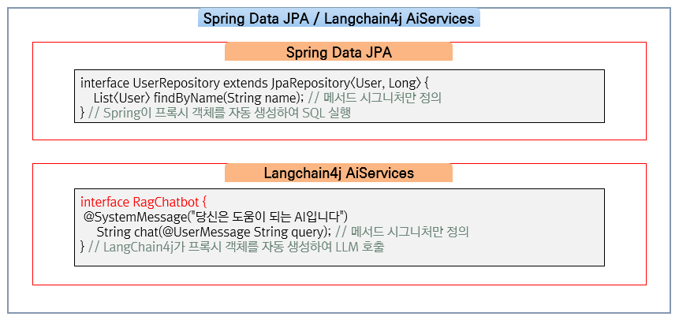
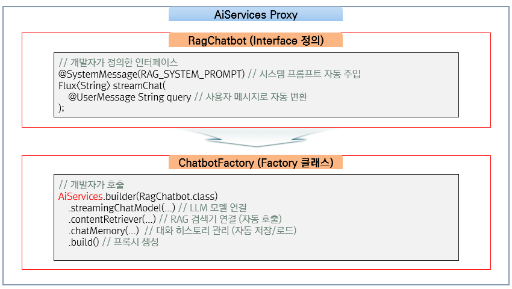
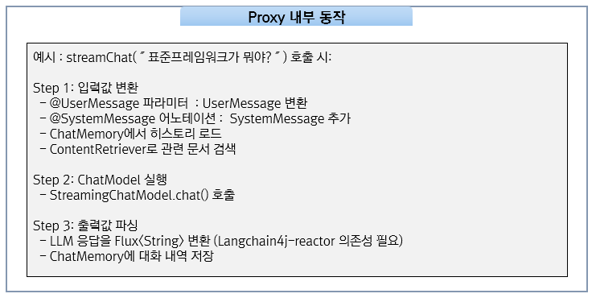

# 핵심 구현

## 개요

이 문서에서는 LangChain4j RAG 샘플 프로젝트의 핵심 구현을 설명한다. AiServices 패턴, ChatbotFactory, PersistentChatMemoryStore, ContentRetriever 구현을 다룬다.

---

## AiServices 패턴

AiServices는 LangChain4j의 **고수준 추상화**로, **인터페이스만 정의하면 LangChain4j가 구현체를 자동 생성**하는 방식이다. Spring Data JPA에서 Repository 인터페이스만 정의하면 구현체가 자동 생성되는 것과 동일한 패턴이다.



**왜 AiServices가 필요한가?**

Low-level API를 직접 사용하면 보일러플레이트 코드가 많아진다:

```java
// Low-level API 방식 - 복잡하고 반복적인 코드
ChatModel model = OllamaChatModel.builder().modelName("llama3").build();

List<ChatMessage> messages = new ArrayList<>();
messages.add(SystemMessage.from("당신은 도움이 되는 AI입니다"));
messages.add(UserMessage.from(userQuery));

// 메모리 관리, RAG, 응답 파싱 등을 모두 직접 구현해야 함
Response<AiMessage> response = model.generate(messages);
String answer = response.content().text();
```

```java
// AiServices 방식 - 선언적이고 간결한 코드
interface Assistant {
    @SystemMessage("당신은 도움이 되는 AI입니다")
    String chat(@UserMessage String query);
}

Assistant assistant = AiServices.builder(Assistant.class)
        .chatModel(model)
        .chatMemory(memory)         // 메모리 자동 관리
        .contentRetriever(retriever) // RAG 자동 적용
        .build();

String answer = assistant.chat(userQuery);  // 깔끔한 비즈니스 로직
```

**AiServices의 주요 기능:**

| 기능 | 설명 | 빌더 메서드 |
|------|------|-------------|
| **시스템 프롬프트** | AI의 역할/성격 정의 | `@SystemMessage` 어노테이션 |
| **사용자 입력** | 사용자 메시지 전달 | `@UserMessage` 어노테이션 |
| **대화 메모리** | 이전 대화 기억 | `.chatMemory()` |
| **RAG** | 외부 문서 검색 후 답변 | `.contentRetriever()` |
| **도구 호출** | 외부 함수 실행 (Function Calling) | `.tools()` |
| **스트리밍** | 실시간 응답 출력 | `Flux<String>` 반환 타입 |

> **핵심:** 개발자는 "무엇을 할지"만 인터페이스로 정의하고, "어떻게 할지"는 LangChain4j가 프록시를 통해 자동 처리한다.

**샘플 프로젝트 적용 - RagChatbot.java:**

```java
public interface RagChatbot {

    String RAG_SYSTEM_PROMPT = """
            당신은 지식 기반 질의응답 시스템입니다.
            사용자의 질문에 대해 제공된 문서 내용을 기반으로
            정확하고 도움이 되는 답변을 제공하세요.
            제공된 문서에 관련 정보가 없는 경우, 솔직하게 모른다고 답변하세요.
            답변은 한국어로 제공하세요.
            """;

    @SystemMessage(RAG_SYSTEM_PROMPT)
    Flux<String> streamChat(@UserMessage String query);

    @SystemMessage(RAG_SYSTEM_PROMPT)
    String chat(@UserMessage String query);
}
```

**공식 문서의 AI Services 동작 흐름:**

아래 이미지는 LangChain4j 공식 문서에서 제공하는 AI Services의 내부 처리 과정이다. 인터페이스 메서드 호출 시 프록시가 어떻게 메시지를 조합하고 LLM을 호출하는지 보여준다.





---

## ChatbotFactory

```java
@Slf4j
@Component
public class ChatbotFactory {

    private final ContentRetriever contentRetriever;
    private final PersistentChatMemoryStore chatMemoryStore;
    private final OllamaStreamingChatModel defaultStreamingModel;

    @Value("${langchain4j.ollama.base-url}")
    private String ollamaBaseUrl;

    @Value("${chat.memory.max-messages:20}")
    private int maxMessages;

    public RagChatbot createRagChatbot(String modelName, String sessionId) {

        // 1. 모델 선택: 지정된 모델 또는 기본 모델 사용
        StreamingChatModel streamingModel = isDefaultModel(modelName)
                ? defaultStreamingModel
                : createStreamingModel(modelName);

        log.info("RAG 챗봇 생성 - 모델: {}, 세션: {}", modelName, sessionId);

        // 2. AiServices로 Reflection 기반 프록시 생성
        return AiServices.builder(RagChatbot.class)
                .streamingChatModel(streamingModel)
                .contentRetriever(contentRetriever)
                .chatMemory(createChatMemory(sessionId))
                .build();
    }

    private MessageWindowChatMemory createChatMemory(String sessionId) {
        return MessageWindowChatMemory.builder()
                .id(sessionId)
                .maxMessages(maxMessages)
                .chatMemoryStore(chatMemoryStore)
                .build();
    }

    private StreamingChatModel createStreamingModel(String modelName) {
        return OllamaStreamingChatModel.builder()
                .baseUrl(ollamaBaseUrl)
                .modelName(modelName)
                .temperature(0.4)
                .timeout(Duration.ofSeconds(60))
                .build();
    }
}
```

---

## PersistentChatMemoryStore

- LangChain4j의 Chat Memory는 **기본적으로 인메모리(In-Memory)**에만 대화 내역을 저장한다. 즉, 애플리케이션이 재시작되면 모든 대화 기록이 사라진다.

- 영속화가 필요한 경우, `ChatMemoryStore` 인터페이스를 구현하여 원하는 저장소(PostgreSQL, Redis, MongoDB 등)에 대화 내역을 저장할 수 있다.

<br/>

**ChatMemoryStore 인터페이스:**

LangChain4j가 정의한 `ChatMemoryStore` 인터페이스는 3개의 메서드로 구성된다:

```java
public interface ChatMemoryStore {

    // 저장된 메시지 조회 (LLM 호출 전에 히스토리 로드)
    List<ChatMessage> getMessages(Object memoryId);

    // 메시지 저장/갱신 (사용자 메시지, AI 응답 추가 시 호출)
    void updateMessages(Object memoryId, List<ChatMessage> messages);

    // 메시지 삭제 (ChatMemory.clear() 호출 시)
    void deleteMessages(Object memoryId);
}
```

| 메서드 | 호출 시점 | 설명 |
|--------|----------|------|
| `getMessages()` | LLM 호출 전 | memoryId로 저장된 대화 히스토리를 조회 |
| `updateMessages()` | 메시지 추가 시 | 사용자 메시지, AI 응답 각각 추가될 때 호출 (총 2회) |
| `deleteMessages()` | clear() 호출 시 | 대화 내역 초기화 시 호출 |

> **참고:** `memoryId`는 여러 사용자 또는 대화 세션을 구분하는 식별자다. 이 샘플에서는 `sessionId`를 memoryId로 사용한다.

**PersistentChatMemoryStore.java 핵심 코드:**

```java
@Slf4j
@Component
@RequiredArgsConstructor
public class PersistentChatMemoryStore implements ChatMemoryStore {

    private final ChatMemoryRepository chatMemoryRepository;

    @Override
    @Transactional(readOnly = true)
    public List<ChatMessage> getMessages(Object memoryId) {
        String sessionId = memoryId.toString();

        List<ChatMemoryEntity> entities = chatMemoryRepository
                .findBySessionIdOrderByCreatedAtAsc(sessionId);

        return entities.stream()
                .map(this::convertToLangChain4jMessage)
                .filter(Objects::nonNull)
                .collect(Collectors.toList());
    }

    @Override
    @Transactional
    public void updateMessages(Object memoryId, List<ChatMessage> messages) {
        String sessionId = memoryId.toString();

        // 1. 기존 메시지 전체 삭제 (교체 방식)
        chatMemoryRepository.deleteBySessionId(sessionId);

        // 2. 새 메시지 전체 저장
        for (ChatMessage message : messages) {
            ChatMemoryEntity entity = convertToEntity(sessionId, message);
            if (entity != null) {
                chatMemoryRepository.save(entity);
            }
        }
    }

    private ChatMessage convertToLangChain4jMessage(ChatMemoryEntity entity) {
        return switch (entity.getMessageType()) {
            case "USER" -> UserMessage.from(entity.getContent());
            case "ASSISTANT" -> AiMessage.from(entity.getContent());
            case "SYSTEM" -> SystemMessage.from(entity.getContent());
            default -> null;
        };
    }
}
```

---

## PostgreSQL 테이블 구조

```sql
-- chat_memory 테이블 (JPA 자동 생성)
CREATE TABLE chat_memory (
    id BIGSERIAL PRIMARY KEY,
    session_id VARCHAR(255) NOT NULL,
    message_type VARCHAR(50) NOT NULL,          -- USER, ASSISTANT, SYSTEM
    content TEXT NOT NULL,
    created_at TIMESTAMP DEFAULT NOW()
);

CREATE INDEX idx_chat_memory_session ON chat_memory(session_id);

-- chat_sessions 테이블 (세션 메타데이터)
CREATE TABLE chat_sessions (
    session_id VARCHAR(255) PRIMARY KEY,
    title VARCHAR(255),
    created_at TIMESTAMP DEFAULT NOW(),
    last_message_at TIMESTAMP
);

-- document_embeddings 테이블 (PGVector 자동 생성)
CREATE TABLE document_embeddings (
    id UUID PRIMARY KEY,
    embedding vector(768),
    text TEXT,
    metadata JSONB
);
```

---

## 역할 분담 요약

| 역할 | 담당 | 설명 |
|------|------|------|
| **저장 시점 결정** | LangChain4j (AiServices) | LLM 응답 완료 후 자동 호출 |
| **슬라이딩 윈도우** | LangChain4j (MessageWindowChatMemory) | maxMessages 초과 시 오래된 메시지 삭제 |
| **실제 DB 저장** | 우리 코드 (PersistentChatMemoryStore) | updateMessages()로 PostgreSQL에 저장 |

**핵심 요약:**
- 우리는 "어디에 저장할지"만 구현
- "언제 저장할지"는 LangChain4j가 자동으로 관리
- Spring AI와 동일한 패턴 (인터페이스 이름과 저장 방식만 다름)

---

## Spring AI와의 주요 차이

Spring AI와 LangChain4j는 모두 Java 기반 LLM 통합 프레임워크이며, 전자정부 표준프레임워크 5.0.0부터 모두 공식 지원한다. 두 프레임워크는 각각 다른 설계 철학을 가지고 있다.

**아키텍처 패턴 비교:**

| 항목 | Spring AI | LangChain4j |
|------|-----------|-------------|
| **핵심 패턴** | Advisor Chain | AiServices (Reflection 기반 프록시) |
| **구현 방식** | ChatClient + Advisor 체인 | 인터페이스 + 어노테이션 |
| **시스템 프롬프트** | `.system("...")` 메서드 | `@SystemMessage` 어노테이션 |
| **사용자 메시지** | `.user("...")` 메서드 | `@UserMessage` 어노테이션 |
| **RAG 적용** | `RetrievalAugmentationAdvisor` | `contentRetriever()` 빌더 메서드 |
| **메모리 관리** | `MessageChatMemoryAdvisor` | `chatMemory()` 빌더 메서드 |
| **스트리밍** | `Flux<ChatResponse>` | `Flux<String>` (langchain4j-reactor) |

<br/>

**Chat Memory 비교:**

| 항목 | Spring AI | LangChain4j |
|------|-----------|-------------|
| **인터페이스** | `ChatMemoryRepository` | `ChatMemoryStore` |
| **구현체** | `JdbcChatMemoryRepository` (제공) | `PersistentChatMemoryStore` (직접 구현) |
| **저장 방식** | 메시지별 INSERT | 전체 교체 (DELETE + INSERT) |
| **직렬화** | JSON (text 컬럼) | 타입별 컬럼 저장 |
| **자동 저장 주체** | `MessageChatMemoryAdvisor` | `AiServices Reflection 기반 프록시` |

<br/>

**LangChain4j 특징 정리:**

| 특징 | 설명 |
|------|------|
| **AiServices 선언적 패턴** | 인터페이스 정의만으로 AI 서비스 구현, Spring Data JPA와 유사한 개발 경험 |
| **Flux 네이티브 스트리밍** | langchain4j-reactor로 변환 없이 `Flux<String>` 직접 반환 |
| **유연한 구성** | 프로젝트 요구사항에 맞게 자동 구성 또는 명시적 빈 생성 선택 가능 |
| **eGovFrame 5.0.0 공식 지원** | egovframe-boot-starter-parent에서 의존성 버전 관리 |

---

## 참고자료

* https://docs.langchain4j.dev/
* https://github.com/langchain4j/langchain4j
* https://docs.langchain4j.dev/tutorials/ai-services - AI Services 패턴 가이드
* https://docs.langchain4j.dev/tutorials/chat-memory#persistence - Chat Memory 영속화 구현 가이드
