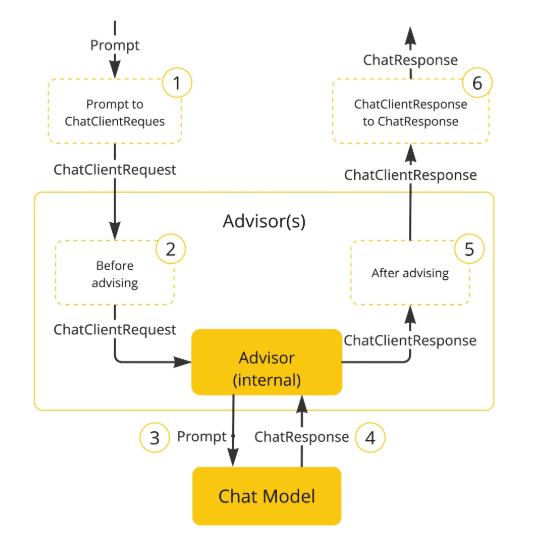

# Advisor 패턴

## 개요

이 문서에서는 Spring AI에서 제공하는 Advisor 패턴에 대해 설명한다. AI 기반 상호작용을 가로채서 수정 및 기능을 보완하는 동작을 수행하는 방법을 다룬다.

---

## Advisor란?

Spring AI에서 제공하는 Advisor를 사용하여 AI 기반 상호작용을 가로채서 수정 및 기능을 보완하는 동작을 수행할 수 있다.



**활용 분야:**
- 반복적인 생성형 AI 패턴의 캡슐화
- LLM 전송 데이터 변환
- 다양한 모델 사용을 위한 이식성 제공

---

## Advisor 적용 예시

```java
ChatMemory chatMemory = ...;  // Chat Memory
VectorStore vectorStore = ...; // Vector Store

var chatClient = ChatClient.builder(chatModel)
    .defaultAdvisors(
        // 대화 이력을 프롬프트에 포함시키는 Advisor
        MessageChatMemoryAdvisor.builder(chatMemory).build(),
        // RAG Advisor
        QuestionAnswerAdvisor.builder(vectorStore).build()
    )
    .build();

var conversationId = "678";

String response = this.chatClient.prompt()
    // 런타임 시 Advisor의 파라미터 설정
    .advisors(advisor -> advisor.param(ChatMemory.CONVERSATION_ID, conversationId))
    .user(userText)
    .call()
    .content();
```

---

## QuestionAnswerAdvisor

RAG를 자동화하는 Advisor로, 문서 검색 및 컨텍스트 주입을 자동 처리한다.
`spring-ai-advisors-vector-store` 모듈에 속하는 단순 RAG용 Advisor이다. 
빠르게 시작할 수 있지만 커스터마이징은 제한적이다.


```xml
<dependency>
    <groupId>org.springframework.ai</groupId>
    <artifactId>spring-ai-advisors-vector-store</artifactId>
</dependency>
```

```java
// 기본 사용
ChatClient.builder(chatModel).build().prompt()
    .advisors(QuestionAnswerAdvisor.builder(vectorStore).build())
    .user(question)
    .call().content();

// 커스터마이징 범위: PromptTemplate 교체 + SearchRequest 파라미터 조정
QuestionAnswerAdvisor.builder(vectorStore)
    .promptTemplate(customTemplate)
    .searchRequest(SearchRequest.builder().topK(5).similarityThreshold(0.7).build())
    .build();

// 런타임 필터 (동적 조건 검색)
chatClient.prompt()
    .advisors(a -> a.param(QuestionAnswerAdvisor.FILTER_EXPRESSION, "type == 'Spring'"))
    .user(question).call().content();
```

**특징:**
- 자동 문서 검색
- 컨텍스트 주입
- 프롬프트 자동 구성

---

## RetrievalAugmentationAdvisor

모듈식 아키텍처를 기반으로 하는 RAG 구현으로, 각 단계를 커스텀 가능하다.

```xml
<dependency>
    <groupId>org.springframework.ai</groupId>
    <artifactId>spring-ai-rag</artifactId>
</dependency>
```

```java
// 유사도 값을 0.5로 한 RAG Advisor 생성
Advisor ragAdvisor = RetrievalAugmentationAdvisor.builder()
    .documentRetriever(
        VectorStoreDocumentRetriever.builder()
            .similarityThreshold(0.50)
            .vectorStore(vectorStore)
            .build()
    )
    .build();

// ChatClient 호출 코드 내에서 삽입되어 동작
String answer = chatClient.prompt()
        .advisors(ragAdvisor)
        .user("Spring AI란?")
        .call()
        .content();
```

---

## Query Transformer

**RewriteQueryTransformer:** LLM을 활용하여 사용자 쿼리를 재작성한다. 모호하거나 장황한 쿼리에 유용하다.

```java
Advisor ragAdvisor = RetrievalAugmentationAdvisor.builder()
    .queryTransformers(
        RewriteQueryTransformer.builder()
            .chatClientBuilder(chatClientBuilder)
            .build()
    )
    .documentRetriever(
        VectorStoreDocumentRetriever.builder()
            .similarityThreshold(0.50)
            .vectorStore(vectorStore)
            .build()
    )
    .build();
```

---

**CompressionQueryTransformer:** 대화 기록과 후속 쿼리를 독립형 쿼리로 압축한다.

```java
Query query = Query.builder()
        .text("And what is its second largest city?")
        .history(
            new UserMessage("What is the capital of Denmark?"),
            new AssistantMessage("Copenhagen is the capital of Denmark.")
        )
        .build();

QueryTransformer queryTransformer = CompressionQueryTransformer.builder()
        .chatClientBuilder(chatClientBuilder)
        .build();

Query transformedQuery = queryTransformer.transform(query);
```

**활용:**
- 대화 기록이 길 때
- 후속 질문이 맥락 의존적일 때

---

<br/>

**TranslationQueryTransformer:** 쿼리를 지정 언어로 변환한다.

```java
// 덴마크어 질의를 영어로 번역
Query query = new Query("Hvad er Danmarks hovedstad?");

QueryTransformer queryTransformer = TranslationQueryTransformer.builder()
        .chatClientBuilder(chatClientBuilder)
        .targetLanguage("english")
        .build();

Query transformedQuery = queryTransformer.transform(query);
```

**활용:**
- Embedding 모델이 특정 언어로 훈련된 경우
- 다국어 지원 시스템

---

## 추가 커스터마이징

**Empty Context 허용 설정:**
```java
.queryAugmenter(ContextualQueryAugmenter.builder()
    .allowEmptyContext(true).build())
```

**메타데이터 필터링:**
```java
VectorStoreDocumentRetriever.builder()
    .vectorStore(vectorStore)
    .filterExpression("category == 'framework'").build();
```

## 참고자료

* https://docs.spring.io/spring-ai/reference/api/advisors.html
