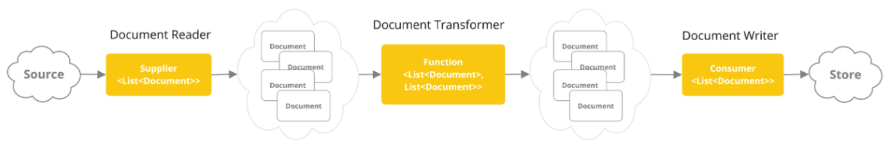

# ETL Pipeline

## 개요

이 문서에서는 Spring AI의 ETL Pipeline에 대해 설명한다. 문서를 RAG 시스템에서 사용 가능한 형태로 준비하는 일련의 과정인 Extract, Transform, Load 단계를 다룬다.

---

## ETL이란?

**E**xtract (추출) + **T**ransform (변환) + **L**oad (적재)

문서를 RAG 시스템에서 사용 가능한 형태로 준비하는 일련의 과정이다.

---

## ETL Pipeline 구성 요소



**DocumentReader:**
```java
public interface DocumentReader extends Supplier<List<Document>> {
    default List<Document> read() {
        return get();
    }
}
```
- **역할**: 다양한 형식의 파일을 Document 객체로 변환
- **지원 형식**: Plain text, JSON, HTML, Markdown, PDF 등

<br/>

**DocumentTransformer**
```java
public interface DocumentTransformer extends Function<List<Document>, List<Document>> {
    default List<Document> transform(List<Document> documents) {
        return apply(documents);
    }
}
```
- **역할**: Document 객체 가공
- **주요 작업**: 분할, 메타데이터 추가, 정규화

<br/>

**DocumentWriter**
```java
public interface DocumentWriter extends Consumer<List<Document>> {
    default void write(List<Document> documents) {
        accept(documents);
    }
}
```
- **역할**: 변환된 Document를 Vector Store에 저장
- **포함 작업**: Embedding 수행 및 저장

---

## Document Reader

**JsonReader:** JSON 파일에서 특정 키의 값을 추출하여 Document로 변환한다.

```java
@Component
class MyJsonReader {

    private final Resource resource;

    MyJsonReader(@Value("classpath:bikes.json") Resource resource) {
        this.resource = resource;
    }

    List<Document> loadJsonAsDocuments() {
        JsonReader jsonReader = new JsonReader(
            this.resource,
            "description",   // 추출할 JSON 키
            "content"        // 추출할 JSON 키
        );
        return jsonReader.get();
    }
}
```

**주요 생성자:**
- `JsonReader(Resource resource)`
- `JsonReader(Resource resource, String... jsonKeysToUse)`
- `JsonReader(Resource resource, JsonMetadataGenerator, String... jsonKeysToUse)`

---

<br/>

**TextReader:** 일반 텍스트 파일을 Document로 변환한다.

```java
@Component
class MyTextReader {

    private final Resource resource;

    MyTextReader(@Value("classpath:text-source.txt") Resource resource) {
        this.resource = resource;
    }

    List<Document> loadText() {
        TextReader textReader = new TextReader(this.resource);
        textReader.getCustomMetadata().put("filename", "text-source.txt");

        return textReader.read();
    }
}
```

**주요 생성자:**
- `TextReader(String resourceUrl)`
- `TextReader(Resource resource)`

---

<br/>

**JsoupDocumentReader (HTML):** HTML 파일에서 특정 선택자의 내용을 추출한다.

```java
@Component
class MyHtmlReader {

    private final Resource resource;

    MyHtmlReader(@Value("classpath:/my-page.html") Resource resource) {
        this.resource = resource;
    }

    List<Document> loadHtml() {
        JsoupDocumentReaderConfig config = JsoupDocumentReaderConfig.builder()
            .selector("article p")           // 추출할 CSS 선택자
            .charset("ISO-8859-1")          // 인코딩
            .includeLinkUrls(true)          // Link URL을 메타데이터에 포함
            .metadataTags(List.of("author", "date"))  // 메타 태그 추출
            .additionalMetadata("source", "my-page.html")  // 커스텀 메타데이터
            .build();

        JsoupDocumentReader reader = new JsoupDocumentReader(this.resource, config);
        return reader.get();
    }
}
```

---

**MarkdownDocumentReader:** Markdown 파일을 구조화하여 Document로 변환한다.

```java
@Component
class MyMarkdownReader {

    private final Resource resource;

    MyMarkdownReader(@Value("classpath:code.md") Resource resource) {
        this.resource = resource;
    }

    List<Document> loadMarkdown() {
        MarkdownDocumentReaderConfig config = MarkdownDocumentReaderConfig.builder()
            // 마크다운 가로줄(---)에 따라 새 Document로 분할
            .withHorizontalRuleCreateDocument(true)
            // 코드 블록을 분리할지 여부
            .withIncludeCodeBlock(false)
            // 블록 인용문을 분리할지 여부
            .withIncludeBlockquote(false)
            // 커스텀 메타데이터
            .withAdditionalMetadata("filename", "code.md")
            .build();

        MarkdownDocumentReader reader = new MarkdownDocumentReader(this.resource, config);
        return reader.get();
    }
}
```

---

**PagePdfDocumentReader:** PDF를 페이지 단위로 분할하여 Document를 생성한다.

```java
@Component
public class MyPagePdfDocumentReader {

    List<Document> getDocsFromPdf() {

        PagePdfDocumentReader pdfReader = new PagePdfDocumentReader(
            "classpath:/sample1.pdf",
            PdfDocumentReaderConfig.builder()
                .withPageTopMargin(0)
                .withPageExtractedTextFormatter(
                    ExtractedTextFormatter.builder()
                        .withNumberOfTopTextLinesToDelete(0)
                        .build()
                )
                .withPagesPerDocument(1)  // 페이지당 Document 수
                .build()
        );

        return pdfReader.read();
    }
}
```

**특징:**
- Apache PdfBox 라이브러리 사용
- 페이지 단위로 Document 생성

---

<br/>

**ParagraphPdfDocumentReader:** PDF 카탈로그(목차) 정보를 사용하여 단락별로 분할한다.

```java
@Component
public class MyParagraphPdfDocumentReader {

    List<Document> getDocsFromPdfWithCatalog() {

        ParagraphPdfDocumentReader pdfReader = new ParagraphPdfDocumentReader(
            "classpath:/sample1.pdf",
            PdfDocumentReaderConfig.builder()
                .withPageTopMargin(0)
                .withPageExtractedTextFormatter(
                    ExtractedTextFormatter.builder()
                        .withNumberOfTopTextLinesToDelete(0)
                        .build()
                )
                .withPagesPerDocument(1)
                .build()
        );

        return pdfReader.read();
    }
}
```

**특징:**
- PDF 목차 정보 활용
- 의미 있는 단락 단위 분할

---

## Document Transformer

**TokenTextSplitter:** 토큰 수에 따라 문서를 청크(chunk)로 분할한다.

```java
@Component
class MyTokenTextSplitter {

    public List<Document> splitDocuments(List<Document> documents) {
        TokenTextSplitter splitter = new TokenTextSplitter();
        return splitter.apply(documents);
    }

    public List<Document> splitCustomized(List<Document> documents) {
        TokenTextSplitter splitter = new TokenTextSplitter(
            1000,    // defaultChunkSize
            400,     // minChunkSizeChars
            10,      // minChunkLengthToEmbed
            5000,    // maxNumChunks
            true     // keepSeparator
        );
        return splitter.apply(documents);
    }
}
```

**사용 이유:**
- AI 모델의 컨텍스트 창 크기 제한
- 적절한 크기로 분할하여 효율적인 검색

<br/>

**주요 파라미터:**
- `defaultChunkSize`: 청크 크기
- `minChunkSizeChars`: 최소 청크 크기
- `minChunkLengthToEmbed`: Embedding할 최소 길이
- `maxNumChunks`: 최대 청크 수
- `keepSeparator`: 구분자 유지 여부

---

<br/>

**KeywordMetadataEnricher:** LLM을 사용하여 문서에서 키워드를 추출하고 메타데이터로 추가한다.

```java
@Component
class MyKeywordEnricher {

    private final ChatModel chatModel;

    MyKeywordEnricher(ChatModel chatModel) {
        this.chatModel = chatModel;
    }

    List<Document> enrichDocuments(List<Document> documents) {
        // 기본 설정
        KeywordMetadataEnricher enricher = KeywordMetadataEnricher.builder(chatModel)
                .keywordCount(5)
                .build();

        // 또는 커스텀 템플릿 사용
        KeywordMetadataEnricher customEnricher = KeywordMetadataEnricher.builder(chatModel)
               .keywordsTemplate(new PromptTemplate(
                   "Extract 5 important keywords from the following text and separate them with commas:\n{context_str}"
               ))
               .build();

        return enricher.apply(documents);
    }
}
```

**활용:**
- 메타데이터 기반 검색 향상
- 문서 분류 및 필터링

---

<br/>

**SummaryMetadataEnricher:** LLM을 사용하여 문서 요약문을 생성하고 메타데이터로 추가한다.

```java
@Configuration
class EnricherConfig {

    @Bean
    public SummaryMetadataEnricher summaryMetadata(OpenAiChatModel aiClient) {
        return new SummaryMetadataEnricher(
            aiClient,
            List.of(
                SummaryType.PREVIOUS,  // 이전 문서 요약
                SummaryType.CURRENT,   // 현재 문서 요약
                SummaryType.NEXT       // 다음 문서 요약
            )
        );
    }
}

@Component
class MySummaryEnricher {

    private final SummaryMetadataEnricher enricher;

    MySummaryEnricher(SummaryMetadataEnricher enricher) {
        this.enricher = enricher;
    }

    List<Document> enrichDocuments(List<Document> documents) {
        return this.enricher.apply(documents);
    }
}
```

**특징:**
- 현재 문서뿐 아니라 인접 문서 요약도 생성 가능
- 문서 간 맥락 파악에 유용

---

## Document Writer

DocumentWriter는 ETL 과정의 마지막 단계로, 변환된 Document를 Vector Store에 저장한다.

```java
public interface DocumentWriter extends Consumer<List<Document>> {
    default void write(List<Document> documents) {
        accept(documents);
    }
}
```

**주요 작업:**
- Embedding 수행
- Vector Store에 저장
- 메타데이터 함께 저장

<br/>

**일반적인 구현:**
```java
@Component
class MyVectorStoreWriter implements DocumentWriter {

    private final VectorStore vectorStore;
    private final EmbeddingModel embeddingModel;

    @Override
    public void accept(List<Document> documents) {
        // Embedding은 VectorStore가 내부적으로 수행
        vectorStore.add(documents);
    }
}
```

## 참고자료

* https://docs.spring.io/spring-ai/reference/api/etl-pipeline.html
