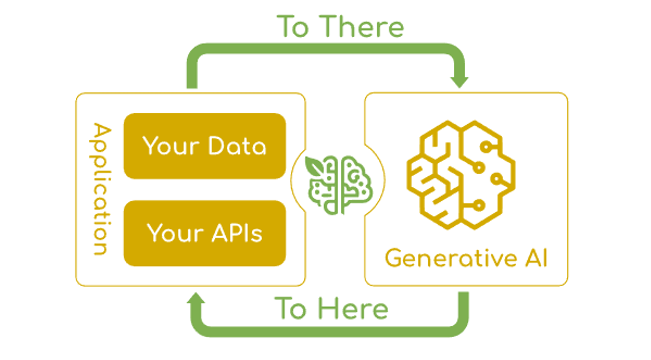

# Spring AI 소개

## 개요

**Spring AI**는 기존 Spring 생태계 내에 포함되며 AI 기능을 쉽게 통합할 수 있도록 지원하는 프레임워크이다.



Spring AI는 다음과 같은 핵심 목표를 가지고 있다:

1. **다양한 AI 모델 제공자에 대한 통합 인터페이스**
    - Spring Framework에 친화적인 방식으로 제공
    - 이식 가능한(Portable) API를 통한 모델 간 전환 용이

<br />

2. **AI 통합의 핵심 과제 해결**
    - 기존 데이터와 API를 AI 모델과 연결하는 문제 해결
    - 엔터프라이즈 환경에서 AI 기능을 자연스럽게 구현

<br />

3. **Spring 개발자 친화적 설계**
    - 기존 Spring 개발 패턴과 일관성 유지
    - 최소한의 학습 비용으로 AI 기능 통합

---

## 등장 배경

**1. AI 기술의 대중화**

ChatGPT 출시 이후 AI 기술은 급속한 확산과 발전을 이루고 있으며, 기존 애플리케이션에 AI 기능 통합 필요성이 증가하고 있다.

**2. Java 생태계의 필요성**

Spring AI 등장 이전에는 AI 관련 프레임워크가 Python 중심(LangChain, LlamaIndex 등)이었으며, Java/Spring 기반 기업 시스템에 AI 통합 시 기술 파편화가 발생했다. Spring AI는 Java 생태계에서도 이식성과 모듈형 설계를 갖춘 AI 프레임워크를 제공한다.

**3. AI 모델 및 벡터 DB의 파편화 해소**

다양한 AI 서비스 제공 벤더(OpenAI, Anthropic, Google 등)와 여러 Vector Database(Redis, Pinecone, Weaviate 등)에 대해 통일된 추상화 계층을 제공하여 벤더 변경 시 최소한의 코드 수정으로 일관된 개발 경험을 제공한다.

---

## 주요 특징

### Portable API

다양한 AI 제공자를 지원한다: OpenAI (GPT-4, GPT-3.5 등), Anthropic (Claude), Google (Gemini), Ollama (로컬 LLM), Hugging Face, Azure OpenAI 등. 동일한 코드로 여러 모델을 사용할 수 있으며 설정 파일만 변경하여 제공자를 전환할 수 있다.

### Spring Native Integration

```java
@Configuration
public class AIConfig {

    @Bean
    public ChatModel chatModel() {
        // Spring Bean으로 자동 관리
    }
}
```

```yml
# application.yml
spring:
  ai:
    ollama:
      base-url: http://localhost:11434
      chat:
        model: llama3.2
```

Spring Boot Starter를 제공하며 최소한의 설정으로 즉시 사용 가능하다.

### 기존 방식과의 비교

**기존 방식 (OpenAI SDK 직접 사용):**
```java
OpenAI client = new OpenAI(apiKey);
ChatCompletionRequest request = ChatCompletionRequest.builder()
    .model("gpt-4")
    .messages(List.of(new ChatMessage("user", "Hello")))
    .build();
ChatCompletionResult result = client.createChatCompletion(request);
```

**Spring AI 방식:**
```java
@Autowired
private ChatModel chatModel;

public String chat(String message) {
    return chatModel.call(message);
}
```

application.yml 설정만으로 제공자 전환이 가능하고, Spring Bean으로 자동 관리되어 개발 및 유지보수가 용이하다.

### 제공 기능

- **POJO 매핑**: AI 모델 출력 결과를 Java 객체로 자동 역직렬화, 타입 안전성 확보
- **Function Calling**: LLM이 Java 메서드를 직접 호출, 외부 시스템과의 통합 용이
- **Prompt Caching**: 반복적인 프롬프트 캐싱으로 비용 절감
- **Observability**: Micrometer 통합으로 메트릭 및 트레이싱 지원
- **Vector Store 통합**: Redis Stack, Chroma, Pinecone, Weaviate, PostgreSQL (PGvector) 지원

---

## 핵심 기능

| 기능 | 설명 | 지원 제공자 |
|------|------|-------------|
| **Chat** | 텍스트 대화 | OpenAI, Anthropic, Ollama 등 |
| **Embedding** | 텍스트 벡터화 | OpenAI, Ollama, Azure 등 |
| **Image** | 이미지 생성 | OpenAI (DALL-E), Stability AI |
| **Audio** | 음성/텍스트 변환 | OpenAI (Whisper, TTS) |
| **Multimodal** | 이미지 + 텍스트 | OpenAI (GPT-4V), Anthropic (Claude) |

<br/>

**고급 기능:**
- **Function Calling**: LLM에게 Java 메서드 호출 위임, 외부 API 및 데이터베이스와의 동적 연동
- **Structured Output**: JSON 형식의 구조화된 응답, 타입 안전한 데이터 처리
- **Streaming**: 실시간 스트리밍 응답
- **RAG**: 검색 증강 생성, 문서 기반 Q&A 시스템 구현

---

## 응용 분야

**대화형 AI:** 고객 지원 챗봇, 사내 헬프데스크, 가상 비서 등 24/7 자동 응답 시스템 구현

**문서 기반 Q&A (RAG):** 매뉴얼, 가이드, 정책 문서 기반 자동 응답 및 지식베이스 구축

**콘텐츠 생성 및 자동화:** 보고서 자동 작성, 이메일 및 공문 초안 생성, 코드 생성 및 리뷰

---

## 표준프레임워크의 Spring AI 공식 지원

표준프레임워크 5.0.0 부터는 `egovframe-boot-starter-parent`에 Spring AI 의존성 버전 관리를 공식 포함하였다.

| artifactId | 관리 버전 |
|-----------|----------|
| spring-ai-advisors-vector-store | 1.0.1 |
| spring-ai-client-chat | 1.0.1 |
| spring-ai-markdown-document-reader | 1.0.1 |
| spring-ai-pdf-document-reader | 1.0.1 |
| spring-ai-rag | 1.0.1 |
| spring-ai-starter-model-chat-memory-repository-jdbc | 1.0.1 |
| spring-ai-starter-model-ollama | 1.0.1 |
| spring-ai-starter-model-transformers | 1.0.1 |
| spring-ai-starter-vector-store-pgvector | 1.0.1 |
| spring-ai-starter-vector-store-redis | 1.0.1 |

<br/>

parent 선언만으로 별도 BOM 없이 Spring AI를 사용할 수 있다.

```xml
<parent>
    <groupId>org.egovframe.boot</groupId>
    <artifactId>egovframe-boot-starter-parent</artifactId>
    <version>5.0.0</version>
    <relativePath/>
</parent>

<!-- 버전 명시 없이 바로 사용 가능 -->
<dependency>
    <groupId>org.springframework.ai</groupId>
    <artifactId>spring-ai-starter-model-ollama</artifactId>
</dependency>
```

> eGovFrame 5.0.0부터는 Spring AI와 LangChain4j를 모두 공식 지원하여, 프로젝트 요구사항에 따라 선택할 수 있다.

---

## Spring AI 지원

- [핵심 API 가이드](./springai-core-apis.md)
ChatModel, ChatClient 등 핵심 API 사용법을 설명한다.

- [RAG 아키텍처](./springai-rag-architecture.md)
검색 증강 생성(RAG) 시스템의 기본 개념을 설명한다.

- [ETL Pipeline](./springai-etl-guide.md)
DocumentReader, DocumentTransformer, DocumentWriter의 개념과 사용법을 설명한다.

- [Advisor 패턴](./springai-advisor-guide.md)
QuestionAnswerAdvisor, RetrievalAugmentationAdvisor, Query Transformer를 설명한다.

- [샘플 프로젝트](./springai-sample-project.md)
전자정부 표준프레임워크 기반 RAG 샘플 프로젝트를 설명한다.

- [환경 설정 가이드](./springai-setup-guide.md)
개발 환경 구성 및 실행 방법을 설명한다.

## 참고자료

* https://docs.spring.io/spring-ai/reference/
* https://spring.io/projects/spring-ai
