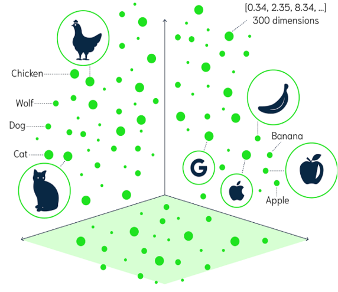
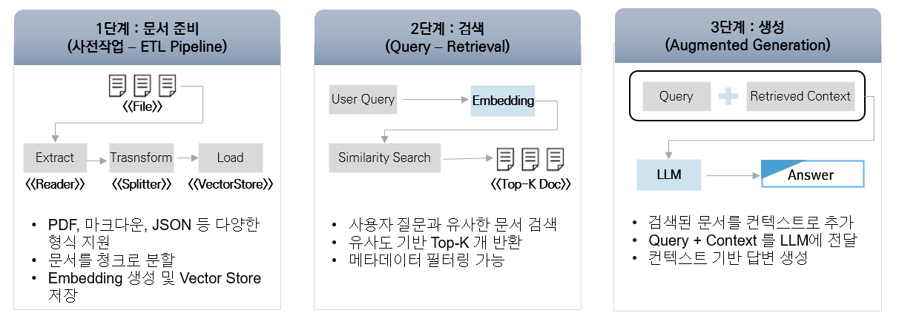

# RAG 아키텍처

## 개요

RAG(Retrieval-Augmented Generation)는 외부 지식을 검색하여 AI 모델의 응답에 활용하는 기법이다. 이 문서에서는 Vector Store와 RAG의 기본 개념을 설명한다.

---

## Vector Store

### Vector Database란?

**Vector Database**는 Embedding을 통해 생성된 Vector를 저장하고 검색하기 위한 전문 데이터베이스이다.



### 주요 특징

**유사도 기반 검색**
- Vector 간 거리 계산을 통한 유사 문서 검색
- 코사인 유사도, 유클리드 거리 등 다양한 메트릭 지원

<br/>

**RAG의 핵심 구성 요소**
- 문서 검색 증강 생성의 기반
- 대규모 문서 컬렉션에서 빠른 검색

<br/>

**메타데이터 필터링**
- 문서 속성 기반 필터링
- 세밀한 검색 제어 가능

---

### Spring AI 지원 Vector Store

| 제공자 | 의존성 |
|--------|--------|
| Apache Cassandra | spring-ai-starter-vector-store-cassandra |
| Elasticsearch | spring-ai-starter-vector-store-elasticsearch |
| MariaDB | spring-ai-starter-vector-store-mariadb |
| MongoDB Atlas | spring-ai-starter-vector-store-mongodb-atlas |
| OpenSearch | spring-ai-starter-vector-store-opensearch |
| PGvector | spring-ai-starter-vector-store-pgvector |
| Redis | **spring-ai-starter-vector-store-redis |
| Qdrant | spring-ai-starter-vector-store-qdrant |

**참고**: 지원 Vector Store는 점진적으로 추가되고 있으며, [공식 문서](https://docs.spring.io/spring-ai/reference/api/vectordbs.html)에서 최신 정보 확인 가능

---

### VectorStore 인터페이스

**Spring AI 1.0.x**
- 검색 기능이 VectorStore에 통합

<br/>

**Spring AI 1.1.x 이후**
- 검색 기능이 `VectorStoreRetriever`로 분리
- `VectorStore`는 `VectorStoreRetriever`를 상속

<br/>

```java
// Spring 1.1.x 이후
public interface VectorStore extends DocumentWriter, VectorStoreRetriever {

    default String getName() {
        return this.getClass().getSimpleName();
    }

    void add(List<Document> documents);

    void delete(List<String> idList);

    void delete(Filter.Expression filterExpression);

    default void delete(String filterExpression) { ... }

    default <T> Optional<T> getNativeClient() {
        return Optional.empty();
    }
}
```

**주요 메서드:**
- `add()`: 문서 추가
- `delete()`: 문서 삭제
- `search()`: 유사 문서 검색 (VectorStoreRetriever에서 상속)

---

## RAG (Retrieval Augmented Generation)

### RAG란?

**Retrieval** (검색) + **Augmented** (증강) + **Generation** (생성)

외부 지식을 검색하여 AI 모델의 응답에 활용하는 기법으로, AI 모델이 가지는 한계를 해결한다.

---

### RAG가 해결하는 문제점

**환각(Hallucination) 문제**
- LLM은 학습 데이터의 패턴을 기반으로 답변 생성
- 사실과 다른 그럴듯한 답변을 생성할 수 있음
- **RAG 해결책**: 실제 문서 기반 답변으로 정확성 확보

<br/>

**시간적 제약**
- LLM은 학습 시점 이후의 데이터에 대한 응답 어려움
- 최신 정보 반영 불가
- **RAG 해결책**: 최신 문서를 검색하여 최신 정보 제공

<br/>

**도메인 특화 지식 부족**
- 특정 도메인의 심도 있는 지식을 모두 포함하기 어려움
- 조직 내부 정보 접근 불가
- **RAG 해결책**: 도메인 특화 문서 데이터베이스 구축 및 활용

<br/>

**Fine Tuning 대비 장점**
- Fine Tuning은 대규모 데이터셋과 자원 필요
- **RAG 장점**: 상대적으로 적은 비용으로 효과적인 결과

---

### RAG의 3단계 프로세스



**1단계: Indexing (인덱싱)**
- 문서를 Embedding Model로 벡터화
- Vector Store에 저장
- 메타데이터 함께 저장

<br/>

**2단계: Retrieval (검색)**
- 사용자 질문을 벡터화
- Vector Store에서 유사 문서 검색
- 상위 K개 문서 추출

<br/>

**3단계: Generation (생성)**
- 검색된 문서를 컨텍스트로 포함
- LLM에 전달하여 답변 생성
- 문서 기반의 정확한 답변 제공

---

## 상세 가이드

- [ETL Pipeline](./springai-etl-guide.md)
DocumentReader, DocumentTransformer, DocumentWriter의 개념과 사용법을 설명한다.

- [Advisor 패턴](./springai-advisor-guide.md)
QuestionAnswerAdvisor, RetrievalAugmentationAdvisor, Query Transformer를 설명한다.

## 참고자료

* https://docs.spring.io/spring-ai/reference/api/vectordbs.html
* https://docs.spring.io/spring-ai/reference/api/etl-pipeline.html
* https://docs.spring.io/spring-ai/reference/api/advisors.html
