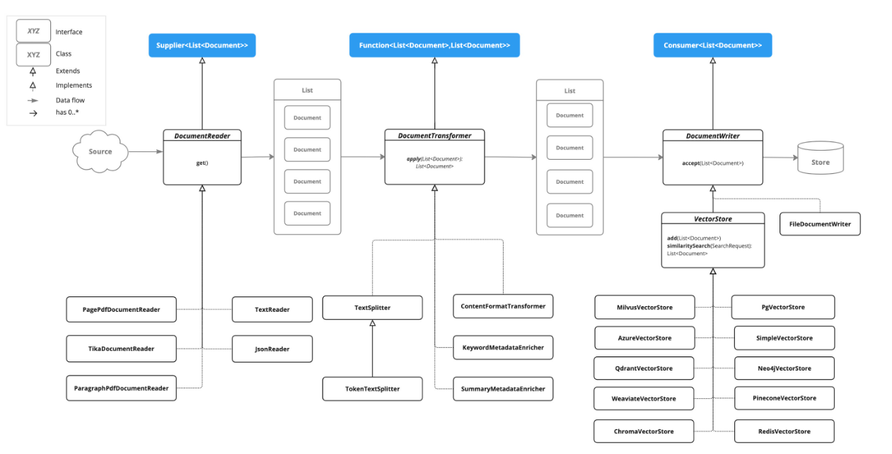

# ETL 구현

## 개요

이 문서에서는 Spring AI RAG 샘플 프로젝트의 ETL Pipeline 구현을 설명한다. 문서 읽기, 변환, 저장의 각 단계별 구성 요소와 코드를 다룬다.

---

## ETL Pipeline 구성



### ETL 구성 요소

| 클래스 | 역할 | 인터페이스 |
|--------|------|-----------|
| **EgovMarkdownReader** | Markdown 파일 읽기 | DocumentReader |
| **EgovPdfReader** | PDF 파일 읽기 (페이지별 분할) | DocumentReader |
| **EgovContentFormatTransformer** | HTML 태그 제거, 공백/줄바꿈 정규화, 특수문자 정리 | DocumentTransformer |
| **EgovEnhancedDocumentTransformer** | 문서 분할, 키워드 추출, 요약 생성 | DocumentTransformer |
| **EgovVectorStoreWriter** | Vector Store에 적재 (Embedding 포함) | DocumentWriter |

---

## EgovMarkdownReader

Markdown 파일을 읽어 Document 객체로 변환한다.

```java
@Slf4j
@Component
public class EgovMarkdownReader implements DocumentReader {

    @Value("${spring.ai.document.path}")
    private String documentPath;

    @Override
    public List<Document> get() {
        List<Document> documents = new ArrayList<>();
        PathMatchingResourcePatternResolver resolver =
            new PathMatchingResourcePatternResolver();

        try {
            Resource[] resources = resolver.getResources(documentPath);

            for (Resource resource : resources) {
                Document doc = processMarkdownResource(resource);
                if (doc != null) {
                    documents.add(doc);
                }
            }
        } catch (IOException e) {
            log.error("마크다운 문서 로드 중 오류 발생", e);
            return List.of();
        }

        return documents;
    }

    private Document processMarkdownResource(Resource resource) {
        // Markdown 파싱 로직
        // ...
    }
}
```

---

## EgovPdfReader

Spring AI의 `PagePdfDocumentReader`를 활용하여 PDF를 페이지 단위로 읽는다.

```java
@Slf4j
@Component
public class EgovPdfReader implements DocumentReader {

    @Value("${spring.ai.document.pdf-path}")
    private String pdfDocumentPath;

    @Value("${spring.ai.document.pdf.page-top-margin:0}")
    private int pageTopMargin;       // 페이지 상단 여백

    @Value("${spring.ai.document.pdf.pages-per-document:1}")
    private int pagesPerDocument;    // 문서당 페이지 수

    @Override
    public List<Document> get() {
        PathMatchingResourcePatternResolver resolver =
            new PathMatchingResourcePatternResolver();
        Resource[] resources = resolver.getResources(pdfDocumentPath);

        List<Document> allDocuments = new ArrayList<>();

        for (Resource resource : resources) {
            // Spring AI의 PagePdfDocumentReader 사용
            PagePdfDocumentReader pdfReader = new PagePdfDocumentReader(
                resource,
                PdfDocumentReaderConfig.builder()
                    .withPageTopMargin(pageTopMargin)
                    .withPagesPerDocument(pagesPerDocument)
                    .build()
            );

            List<Document> documents = pdfReader.read();

            // 커스텀 ID 생성 (pdf-파일명_페이지번호)
            List<Document> documentsWithCustomIds =
                createDocumentsWithCustomIds(documents, resource.getFilename());
            allDocuments.addAll(documentsWithCustomIds);
        }

        return allDocuments;
    }
}
```

---

## EgovContentFormatTransformer

문서 내용을 정제하고 정규화한다.

```java
@Slf4j
@Component
public class EgovContentFormatTransformer implements DocumentTransformer {

    private final ContentFormatTransformer contentFormatTransformer;

    // 정규화 설정
    @Value("${spring.ai.document.normalization.enabled}")
    private boolean normalizationEnabled;

    @Value("${spring.ai.document.normalization.remove-html-tags}")
    private boolean removeHtmlTags;

    @Value("${spring.ai.document.normalization.normalize-whitespace}")
    private boolean normalizeWhitespace;

    // 정규식 패턴
    private static final Pattern CODE_BLOCK_PATTERN =
        Pattern.compile("```[\\s\\S]*?```");
    private static final Pattern SPECIAL_CHARS_PATTERN =
        Pattern.compile("[^\\uAC00-\\uD7AF...a-zA-Z0-9\\s\\n\\t\\-_.,()...]");

    @Override
    public List<Document> apply(List<Document> documents) {
        if (!normalizationEnabled) {
            return documents;
        }

        // 1. Spring AI 포맷팅
        List<Document> formattedDocuments =
            contentFormatTransformer.apply(documents);

        // 2. 커스텀 정규화
        return applyCustomNormalization(formattedDocuments);
    }

    private Document applyCustomNormalizationToDocument(Document document) {
        String normalizedContent = document.getText();

        // 1. HTML 태그 제거
        if (removeHtmlTags) {
            normalizedContent = normalizedContent.replaceAll("<[^>]*>", "");
        }

        // 2. 공백 정규화
        if (normalizeWhitespace) {
            normalizedContent = normalizedContent.replaceAll("\\s+", " ");
        }

        // 3. 줄바꿈 정규화
        // 4. 코드 블록 제거
        // 5. 특수문자 정리
        // ...

        return new Document(
            document.getId(),
            normalizedContent.trim(),
            document.getMetadata()
        );
    }
}
```

---

## EgovEnhancedDocumentTransformer

문서를 청크로 분할하고, 선택적으로 키워드 추출 및 요약을 생성한다.

```java
@Slf4j
@Component
public class EgovEnhancedDocumentTransformer implements DocumentTransformer {

    private final OllamaChatModel ollamaChatModel;
    private final SummaryMetadataEnricher summaryEnricher;
    private KeywordMetadataEnricher keywordEnricher;

    @Value("${spring.ai.document.chunk-size}")
    private int chunkSize;                        // 청크 크기

    @Value("${spring.ai.document.enable-summary}")
    private boolean enableSummary;                // 요약 생성 여부

    @Value("${spring.ai.document.enable-keywords}")
    private boolean enableKeywords;               // 키워드 추출 여부

    public EgovEnhancedDocumentTransformer(OllamaChatModel ollamaChatModel) {
        this.ollamaChatModel = ollamaChatModel;

        // 요약 생성기 초기화
        this.summaryEnricher = new SummaryMetadataEnricher(
            ollamaChatModel,
            List.of(SummaryType.PREVIOUS, SummaryType.CURRENT, SummaryType.NEXT)
        );
    }

    @Override
    public List<Document> apply(List<Document> documents) {

        // 1단계: 문서 분할
        TokenTextSplitter textSplitter = new TokenTextSplitter(
            chunkSize, minChunkSizeChars,
            minChunkLengthToEmbed, maxNumChunks, true
        );
        List<Document> splitDocs = textSplitter.apply(documents);

        // 2단계: 키워드 추출 (선택적)
        List<Document> docsWithKeywords = splitDocs;
        if (enableKeywords) {
            if (keywordEnricher == null) {
                keywordEnricher = new KeywordMetadataEnricher(
                    ollamaChatModel, keywordCount
                );
            }
            docsWithKeywords = keywordEnricher.apply(splitDocs);
        }

        // 3단계: 요약 생성 (선택적)
        if (enableSummary && docsWithKeywords.size() >= summaryMinChunks) {
            return summaryEnricher.apply(docsWithKeywords);
        }

        return docsWithKeywords;
    }
}
```

**주의사항:**
- 키워드 추출 및 요약 생성은 LLM 호출이 필요하므로 인덱싱 시간이 증가한다.
- 대규모 문서 처리 시 비용과 시간을 고려하여 선택적으로 사용한다.

---

## EgovVectorStoreWriter

변환된 Document를 Vector Store에 저장한다.

```java
@Slf4j
@Component
public class EgovVectorStoreWriter implements DocumentWriter {

    private final VectorStore vectorStore;

    public EgovVectorStoreWriter(VectorStore vectorStore) {
        this.vectorStore = vectorStore;
    }

    @Override
    public void accept(List<Document> documents) {
        if (documents == null || documents.isEmpty()) {
            log.warn("적재할 문서가 없습니다.");
            return;
        }

        try {
            // Vector Store가 내부적으로 Embedding 수행
            vectorStore.add(documents);
            log.info("{}개 문서가 Vector Store에 저장되었습니다.", documents.size());
        } catch (Exception e) {
            log.error("Vector Store 저장 중 오류 발생", e);
            throw new RuntimeException("문서 저장 실패", e);
        }
    }
}
```

---

## 문서 처리 설정

### application.yml

```yaml
spring:
  ai:
    document:
      # 문서 경로
      path: file:C:/workspace-test/upload/data/**/*.md
      pdf-path: file:C:/workspace-test/upload/data/**/*.pdf

      # 청킹 설정
      chunk-size: 4000              # 청크 크기 (토큰)
      min-chunk-size-chars: 350     # 최소 청크 크기 (문자)
      max-num-chunks: 500           # 최대 청크 수
      min-chunk-length-to-embed: 50 # 임베딩 최소 길이

      # 문서 정규화
      normalization:
        enabled: true
        remove-html-tags: true
        normalize-whitespace: true
        normalize-newlines: true
        remove-code-blocks: false   # 기술 문서용: 코드 유지
        clean-special-chars: true

      # 요약/키워드 설정 (LLM 호출 필요)
      enable-summary: false         # 요약 생성
      enable-keywords: false        # 키워드 추출
      keyword-count: 5

      # PDF 설정
      pdf:
        page-top-margin: 0
        pages-per-document: 1
```

## 참고자료

* https://docs.spring.io/spring-ai/reference/api/etl-pipeline.html
* https://github.com/eGovFramework/egovframe-ai-rag
