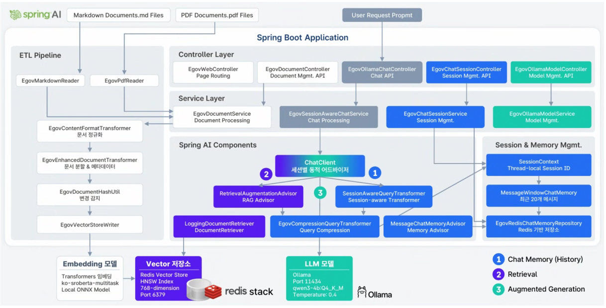
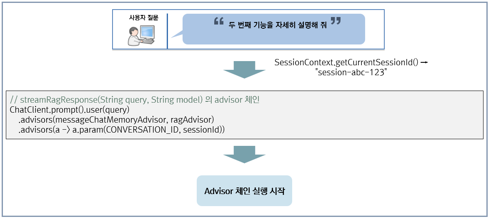
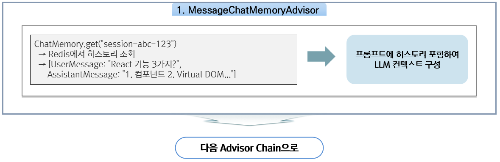
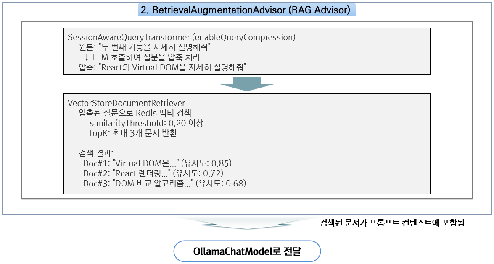
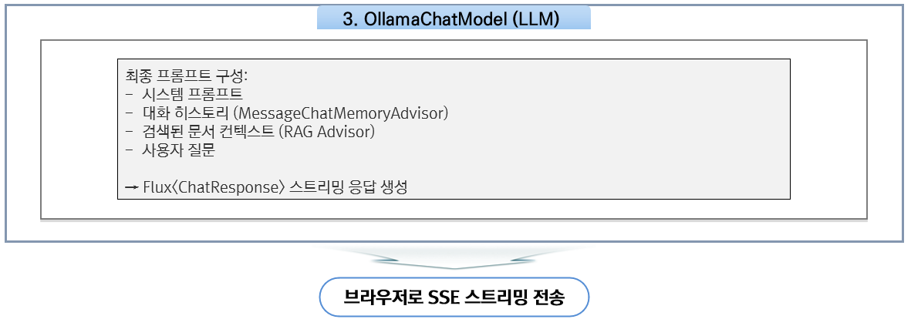
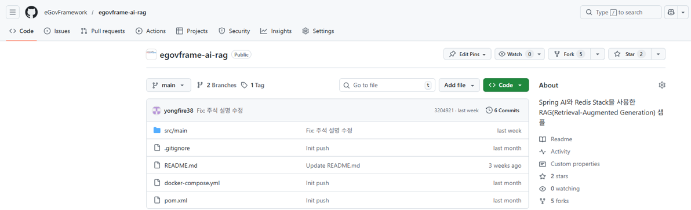
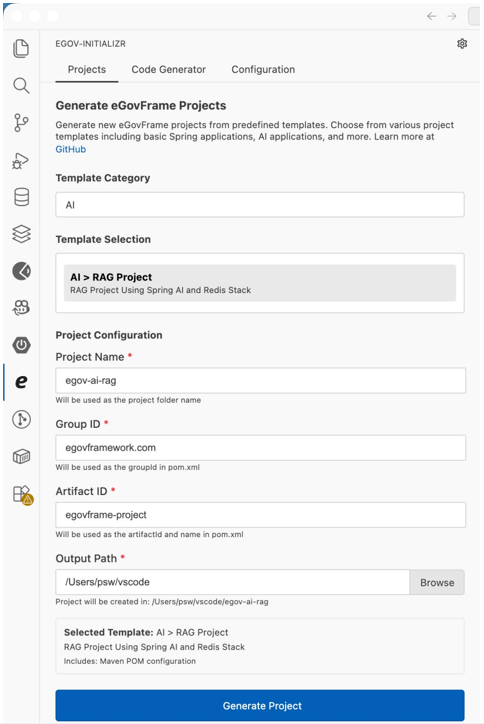

# 샘플 프로젝트

## 개요

전자정부 표준프레임워크 기반의 **문서 기반 질의응답 시스템**을 구현한 실습 프로젝트이다.

**주요 기능:** 채팅 애플리케이션(일반/컨텍스트 기반 대화, 멀티턴 세션), RAG(문서 기반 질의 응답, 벡터 검색), 문서 처리(PDF/Markdown 지원, Embedding 생성), 스트리밍 응답(Reactive Streams 기반)

---

## 기술 스택

| 항목 | 기술 | 버전 및 비고 |
|------|------|-------------|
| **Framework** | Spring Boot + eGovFrame | 3.x + 5.0.0 |
| **AI** | Spring AI | 1.0.1 |
| **Vector Store** | Redis Stack | Latest |
| **LLM** | Ollama | qwen3-4b:Q4_K_M |
| **Embedding** | ONNX Runtime | ko-sroberta-multitask |
| **Chat Memory** | Redis | - |

---

## 의존성 관리

본 프로젝트는 `egovframe-boot-starter-parent` 5.0.0을 parent로 사용한다. eGovFrame 5.0.0에서 Spring AI 의존성 버전을 공식 관리하므로, 별도의 BOM 선언이나 버전 명시 없이 간결하게 사용할 수 있다.

```xml
<parent>
    <groupId>org.egovframe.boot</groupId>
    <artifactId>egovframe-boot-starter-parent</artifactId>
    <version>5.0.0</version>
    <relativePath/>
</parent>

<dependencies>
    <!-- 버전 명시 불필요 - egovframe-boot-starter-parent가 관리 -->
    <dependency>
        <groupId>org.springframework.ai</groupId>
        <artifactId>spring-ai-starter-model-ollama</artifactId>
    </dependency>
    <dependency>
        <groupId>org.springframework.ai</groupId>
        <artifactId>spring-ai-starter-vector-store-redis</artifactId>
    </dependency>
    <dependency>
        <groupId>org.springframework.ai</groupId>
        <artifactId>spring-ai-starter-model-transformers</artifactId>
    </dependency>
    <dependency>
        <groupId>org.springframework.ai</groupId>
        <artifactId>spring-ai-advisors-vector-store</artifactId>
    </dependency>
    <dependency>
        <groupId>org.springframework.ai</groupId>
        <artifactId>spring-ai-rag</artifactId>
    </dependency>
    <dependency>
        <groupId>org.springframework.ai</groupId>
        <artifactId>spring-ai-pdf-document-reader</artifactId>
    </dependency>
    <dependency>
        <groupId>org.springframework.ai</groupId>
        <artifactId>spring-ai-markdown-document-reader</artifactId>
    </dependency>
    <!-- ... -->
</dependencies>
```

egovframe-boot-starter-parent 5.0.0이 관리하는 Spring AI 의존성:

| artifactId | 버전 |
|-----------|------|
| spring-ai-advisors-vector-store | 1.0.1 |
| spring-ai-client-chat | 1.0.1 |
| spring-ai-markdown-document-reader | 1.0.1 |
| spring-ai-pdf-document-reader | 1.0.1 |
| spring-ai-rag | 1.0.1 |
| spring-ai-starter-model-chat-memory-repository-jdbc | 1.0.1 |
| spring-ai-starter-model-ollama | 1.0.1 |
| spring-ai-starter-model-transformers | 1.0.1 |
| spring-ai-starter-vector-store-pgvector | 1.0.1 |
| spring-ai-starter-vector-store-redis | 1.0.1 |

> **참고**: 일반적인 Spring AI 프로젝트에서는 Spring AI BOM을 사용하여 버전을 관리하지만, 표준프레임워크 프로젝트에서는 parent POM이 이를 대신한다.

---

## 전체 아키텍처



---

## 프로젝트 구조

```
egovframe-spring-ai-rag/
|-- src/main/java/com/example/chat/
|   |-- config/                              # 설정 클래스
|   |   |-- EgovRagConfig.java               # RAG 설정
|   |   |-- EgovChatMemoryConfig.java        # Chat Memory 설정
|   |   |-- EgovRedisConfig.java             # Redis 설정
|   |   |-- etl/                             # ETL 파이프라인
|   |   |   |-- EgovETLPipelineConfig.java   # ETL 빈 설정
|   |   |   |-- readers/                     # 문서 리더
|   |   |   |   |-- EgovMarkdownReader.java
|   |   |   |   +-- EgovPdfReader.java
|   |   |   |-- transformers/                # 문서 변환기
|   |   |   |   |-- EgovEnhancedDocumentTransformer.java
|   |   |   |   +-- EgovContentFormatTransformer.java
|   |   |   +-- writers/
|   |   |       +-- EgovVectorStoreWriter.java
|   |   +-- rag/transformers/
|   |       +-- EgovCompressionQueryTransformer.java  # 질문 압축
|   |
|   |-- controller/                          # REST 컨트롤러
|   |   |-- EgovOllamaChatController.java    # 채팅 API
|   |   |-- EgovChatSessionController.java   # 세션 API
|   |   +-- EgovDocumentController.java      # 문서 API
|   |
|   |-- service/                             # 서비스 계층
|   |   |-- EgovSessionAwareChatService.java
|   |   |-- EgovChatSessionService.java
|   |   +-- impl/
|   |       +-- EgovSessionAwareChatServiceImpl.java
|   |
|   |-- repository/
|   |   +-- EgovRedisChatMemoryRepository.java  # Redis 메모리 저장소
|   |
|   +-- context/
|       +-- SessionContext.java              # ThreadLocal 세션 관리
|
|-- src/main/resources/
|   |-- application.yml                      # 애플리케이션 설정
|   |-- model/                               # ONNX 모델 설정
|   |   |-- model.onnx
|   |   +-- tokenizer.json
|   +-- templates/
|       +-- chat.html                        # 채팅 UI
|
|-- docker-compose.yml                       # Redis Stack 설정
+-- pom.xml
```

---

## 주요 구현 기능 - RAG Flow









---

## 프로젝트 생성 방법

**GitHub에서 클론:**
```bash
git clone https://github.com/eGovFramework/egovframe-ai-rag.git
cd egovframe-ai-rag
```



**표준프레임워크 VS Code Extension 사용:** VS Code에서 표준프레임워크 Extension 설치 → Project Tab에서 'AI RAG Project' 선택 → 프로젝트 명/경로 설정 → 'Generate Project' 버튼 클릭



---

## 상세 가이드

- [ETL 구현](./springai-sample-etl.md)
ETL Pipeline 구현 - DocumentReader, DocumentTransformer, DocumentWriter를 설명한다.

- [RAG 구현](./springai-sample-rag.md)
RAG 구성 - Advisor Chain, Query Compression, VectorStoreDocumentRetriever를 설명한다.

- [세션 관리](./springai-sample-session.md)
세션 관리 - Chat Memory, Redis 저장, 세션 생명주기를 설명한다.

---

## 참고자료

* https://github.com/eGovFramework/egovframe-ai-rag
* https://docs.spring.io/spring-ai/reference/
