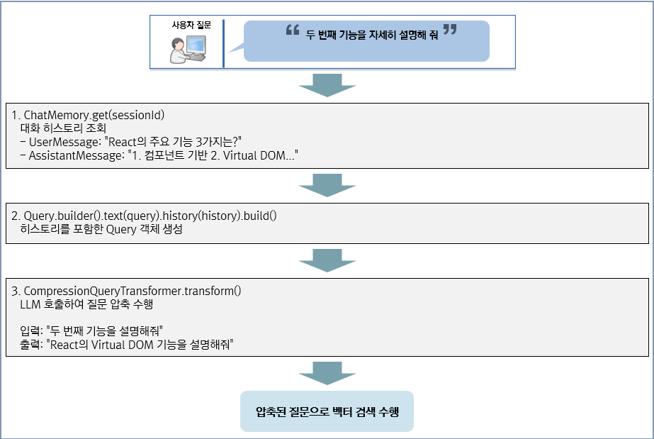

# RAG 구현

## 개요

이 문서에서는 Spring AI RAG 샘플 프로젝트의 RAG 구성을 설명한다. EgovRagConfig, Advisor Chain 실행 흐름, Query Compression 구현을 다룬다.

---

## EgovRagConfig

RAG 관련 빈을 생성하고 설정하는 Configuration 클래스이다.

```java
@Slf4j
@Configuration
public class EgovRagConfig {

    @Value("${rag.similarity.threshold}")
    private double similarityThreshold;   // yml에서 주입: 0.20

    @Value("${rag.top-k}")
    private int topK;                     // yml에서 주입: 3

    // ChatClient 빈 생성
    @Bean
    public ChatClient chatClient(OllamaChatModel chatModel) {
        return ChatClient.builder(chatModel).build();
    }

    // VectorStoreDocumentRetriever 빈 생성
    @Bean
    public VectorStoreDocumentRetriever vectorStoreDocumentRetriever(
            RedisVectorStore redisVectorStore) {
        return VectorStoreDocumentRetriever.builder()
                .similarityThreshold(similarityThreshold)  // 0.20 이상만 반환
                .topK(topK)                                 // 최대 3개 문서
                .vectorStore(redisVectorStore)
                .build();
    }

    // RAG Advisor 생성 메서드
    public static Advisor createRagAdvisor(
            String sessionId,
            EgovCompressionQueryTransformer compressionTransformer,
            VectorStoreDocumentRetriever documentRetriever,
            boolean enableQueryCompression) {

        if (enableQueryCompression) {
            // 질문 압축 모드
            SessionAwareQueryTransformer transformer =
                new SessionAwareQueryTransformer(compressionTransformer, sessionId);

            return RetrievalAugmentationAdvisor.builder()
                    .queryTransformers(transformer)
                    .documentRetriever(documentRetriever)
                    .build();
        } else {
            // 비압축 모드
            return RetrievalAugmentationAdvisor.builder()
                    .documentRetriever(documentRetriever)
                    .build();
        }
    }
}
```

---

## Advisor Chain 실행 흐름

RAG 채팅 요청 시 Advisor Chain이 다음 순서로 실행된다.


---

## RAG vs Simple 채팅 비교

| 항목 | RAG 채팅 | 일반 채팅 |
|------|----------|----------|
| Advisor | MessageChatMemoryAdvisor + RAG Advisor | MessageChatMemoryAdvisor만 |
| 문서 검색 | Redis 벡터 검색 | 없음 |
| 질문 압축 | 활성화 시 수행 | 없음 |
| 응답 품질 | 문서 기반 정확한 답변 | LLM 일반 지식 기반 |

---

## EgovCompressionQueryTransformer

대화 기록과 후속 쿼리를 독립형 쿼리로 압축하는 Query Transformer이다.

```java
@Slf4j
@Component
public class EgovCompressionQueryTransformer {

    private final ChatMemory chatMemory;
    private final ChatClient chatClient;

    public EgovCompressionQueryTransformer(ChatMemory chatMemory, ChatClient chatClient) {
        this.chatMemory = chatMemory;
        this.chatClient = chatClient;
    }

    public Query transformWithSessionId(Query query, String sessionId) {

        // 1. 세션 히스토리 조회 (Redis에서)
        List<Message> conversationHistory = chatMemory.get(sessionId);

        if (conversationHistory.isEmpty()) {
            return query;  // 히스토리 없으면 원본 반환
        }

        // 2. 히스토리를 Query에 포함
        Query queryWithHistory = Query.builder()
            .text(query.text())
            .history(conversationHistory)
            .build();

        // 3. Spring AI의 CompressionQueryTransformer로 압축 수행
        CompressionQueryTransformer compressionTransformer =
            CompressionQueryTransformer.builder()
                .chatClientBuilder(chatClient.mutate()
                    .defaultOptions(ChatOptions.builder()
                        .temperature(0.0)  // 정확한 압축을 위해 낮은 temperature
                        .build()))
                .build();

        return compressionTransformer.transform(queryWithHistory);
    }
}
```

---

## 질문 압축 예시

- 사용자가 선행 질문으로 `React의 주요 기능 3가지는?` 이라고 질문을 하고 답변을 받은 이후 추가 질문을 할 경우의 예시이다.



---

## 질문 압축 ON/OFF 비교

| 설정 | 장점 | 단점 |
|------|------|------|
| `enable-query-compression: true` | 후속 질문의 검색 정확도 향상 | LLM 호출 추가로 응답 시간 증가 |
| `enable-query-compression: false` | 빠른 응답 | "그것", "두 번째" 같은 참조 해석 불가 |

---

## RAG 설정

### application.yml

```yaml
rag:
  enable-query-compression: true   # 질문 압축 활성화
  similarity:
    threshold: 0.20                # 유사도 임계값
  top-k: 3                         # 반환할 최대 문서 수
```

### 주요 파라미터 튜닝 가이드

| 파라미터 | 설명 | 권장값 |
|---------|------|--------|
| `similarity.threshold` | 유사도 임계값 (낮을수록 더 많은 결과) | 0.20~0.30 |
| `top-k` | 검색 결과 개수 | 3~5 |
| `enable-query-compression` | 질문 압축 활성화 | true |

## 참고자료

* https://docs.spring.io/spring-ai/reference/api/advisors.html
* https://github.com/eGovFramework/egovframe-ai-rag
