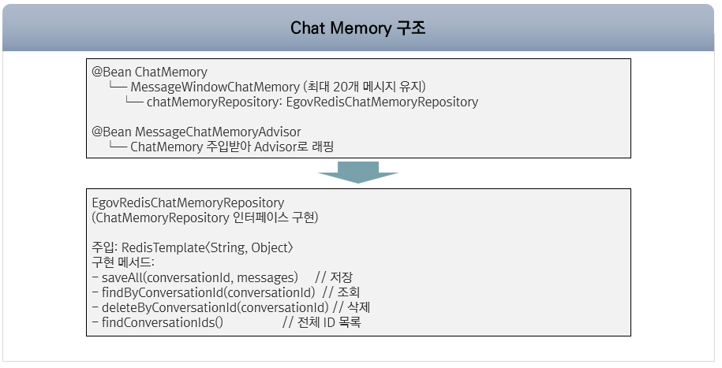
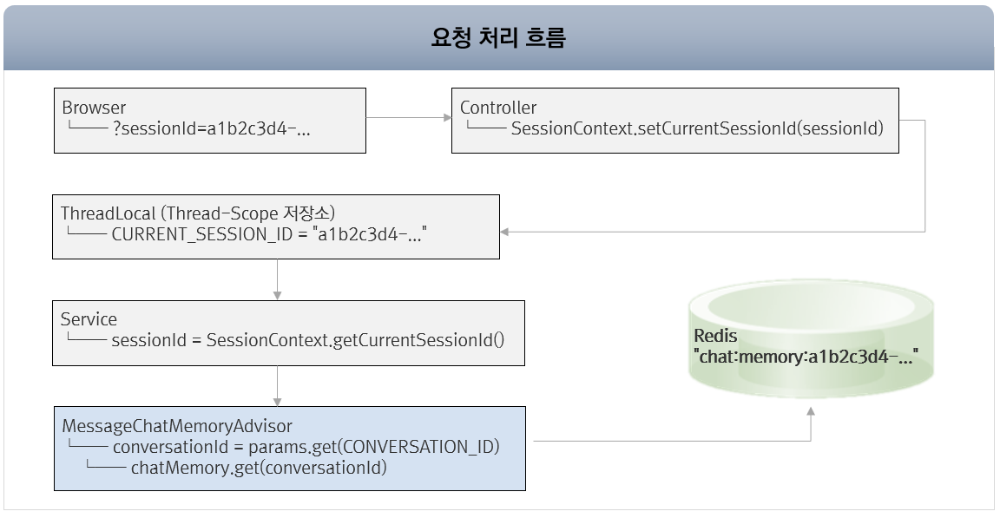
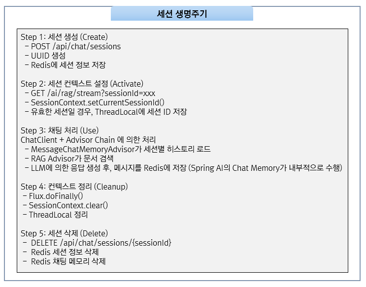

# 세션 관리

## 개요

이 문서에서는 Spring AI RAG 샘플 프로젝트의 세션 관리를 설명한다. Chat Memory 아키텍처, Redis 저장소 구현, 세션 생명주기를 다룬다.

---

## Chat Memory 아키텍처



---

## 요청 처리 흐름



---

## EgovChatMemoryConfig

Chat Memory 관련 빈을 생성하는 Configuration이다.

```java
@Configuration
public class EgovChatMemoryConfig {

    @Value("${chat.memory.max-messages:20}")
    private int maxMessages;

    @Bean
    public ChatMemory chatMemory(EgovRedisChatMemoryRepository repository) {
        return MessageWindowChatMemory.builder()
                .chatMemoryRepository(repository)  // Redis 기반 저장소
                .maxMessages(maxMessages)          // 최대 20개 메시지
                .build();
    }

    @Bean
    public MessageChatMemoryAdvisor messageChatMemoryAdvisor(ChatMemory chatMemory) {
        return MessageChatMemoryAdvisor.builder(chatMemory).build();
    }
}
```

---

## SessionContext

ThreadLocal을 사용한 세션 관리 유틸리티이다.

```java
public class SessionContext {

    private static final ThreadLocal<String> CURRENT_SESSION_ID = new ThreadLocal<>();

    // Controller에서 호출 - 세션 ID 설정
    public static void setCurrentSessionId(String sessionId) {
        CURRENT_SESSION_ID.set(sessionId);
    }

    // Service에서 호출 - 세션 ID 조회
    public static String getCurrentSessionId() {
        String sessionId = CURRENT_SESSION_ID.get();
        return sessionId != null ? sessionId : "default";
    }

    // 스트리밍 완료 후 호출 - 메모리 정리
    public static void clear() {
        CURRENT_SESSION_ID.remove();
    }
}
```

---

## 세션 생명주기



---

## EgovRedisChatMemoryRepository

Redis를 사용한 대화 이력 저장소이다.

```java
@Slf4j
@Component
public class EgovRedisChatMemoryRepository implements ChatMemoryRepository {

    private final RedisTemplate<String, Object> redisTemplate;
    private final ObjectMapper objectMapper;

    private static final String CHAT_MEMORY_KEY_PREFIX = "chat:memory:";

    /**
     * 메시지 저장
     * Spring AI Message 객체 -> Map -> JSON -> Redis
     */
    @Override
    public void saveAll(String conversationId, List<Message> messages) {
        String key = CHAT_MEMORY_KEY_PREFIX + conversationId;

        // Message 객체를 Map으로 변환
        List<Map<String, Object>> simpleMessages = messages.stream()
            .map(this::messageToMap)
            .collect(Collectors.toList());

        String messagesJson = objectMapper.writeValueAsString(simpleMessages);
        redisTemplate.opsForValue().set(key, messagesJson);
    }

    /**
     * 메시지 조회
     * Redis JSON -> Map 리스트 -> Spring AI Message 객체
     */
    @Override
    public List<Message> findByConversationId(String conversationId) {
        String key = CHAT_MEMORY_KEY_PREFIX + conversationId;
        Object value = redisTemplate.opsForValue().get(key);

        if (value == null) return new ArrayList<>();

        List<Map<String, Object>> simpleMaps = objectMapper.readValue(
            value.toString(),
            new TypeReference<List<Map<String, Object>>>() {}
        );

        return simpleMaps.stream()
            .map(this::mapToMessage)
            .filter(Objects::nonNull)
            .collect(Collectors.toList());
    }

    private Map<String, Object> messageToMap(Message message) {
        Map<String, Object> map = new HashMap<>();
        map.put("messageType", message.getMessageType().name());

        if (message instanceof UserMessage) {
            map.put("content", ((UserMessage) message).getText());
        } else if (message instanceof AssistantMessage) {
            map.put("content", ((AssistantMessage) message).getText());
        } else if (message instanceof SystemMessage) {
            map.put("content", ((SystemMessage) message).getText());
        }
        return map;
    }

    private Message mapToMessage(Map<String, Object> map) {
        String messageType = (String) map.get("messageType");
        String content = (String) map.get("content");

        return switch (messageType) {
            case "USER" -> new UserMessage(content);
            case "ASSISTANT" -> new AssistantMessage(content);
            case "SYSTEM" -> new SystemMessage(content);
            default -> null;
        };
    }
}
```

---

## Redis 저장 구조

```
Redis 데이터 구조:

1. 세션 목록 (Set)
   Key: chat:sessions:list
   Value: ["session-abc-123", "session-def-456", ...]

2. 세션 정보 (Hash)
   Key: chat:session:{sessionId}:info
   Fields:
     - title: "새 채팅"
     - createdAt: "2025-01-26T10:00:00"
     - lastMessageAt: "2025-01-26T10:30:00"

3. 채팅 메모리 (String - JSON)
   Key: chat:memory:{sessionId}
   Value: [
     {"messageType": "USER", "content": "React가 뭐야?"},
     {"messageType": "ASSISTANT", "content": "React는 Facebook에서 개발한..."},
     {"messageType": "USER", "content": "그것의 주요 특징은?"},
     {"messageType": "ASSISTANT", "content": "React의 주요 특징은..."}
   ]

4. 벡터 데이터 (Hash)
   Key: doc:{document-id}
   Fields:
     - content: 문서 내용
     - embedding: 768차원 float 배열
     - metadata: {"source": "readme.md", "type": "markdown", ...}
```

---

## Chat Memory 설정

### application.yml

```yaml
chat:
  memory:
    max-messages: 20                # 최대 대화 히스토리
```

## 참고자료

* https://docs.spring.io/spring-ai/reference/api/chat-memory.html
* https://github.com/eGovFramework/egovframe-ai-rag
