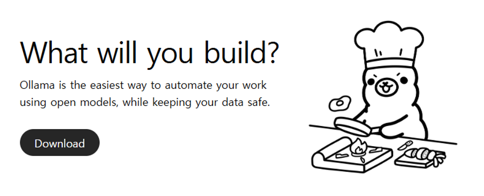
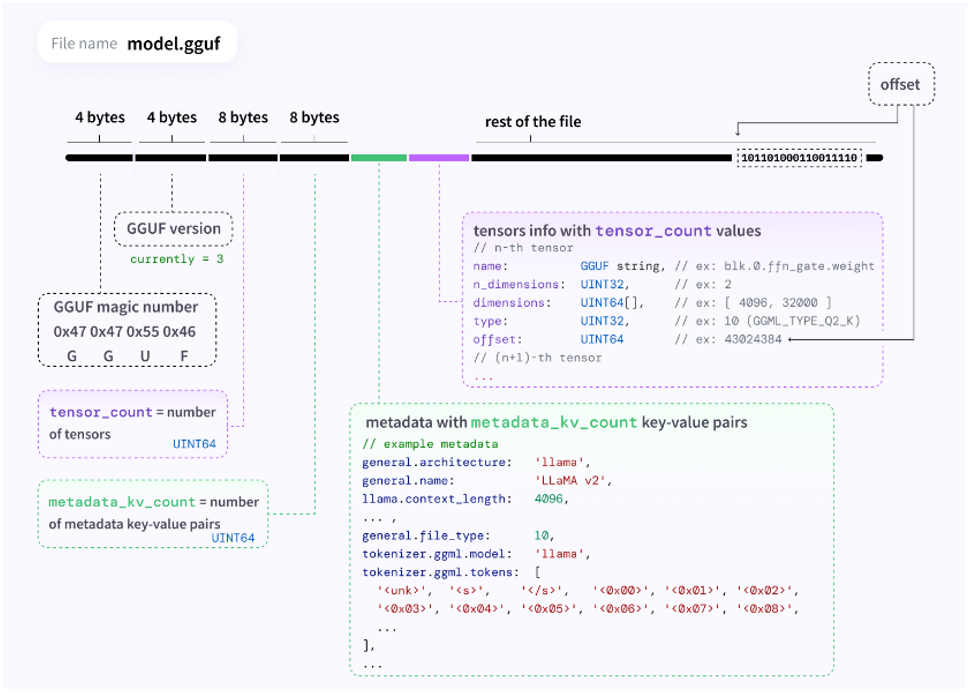
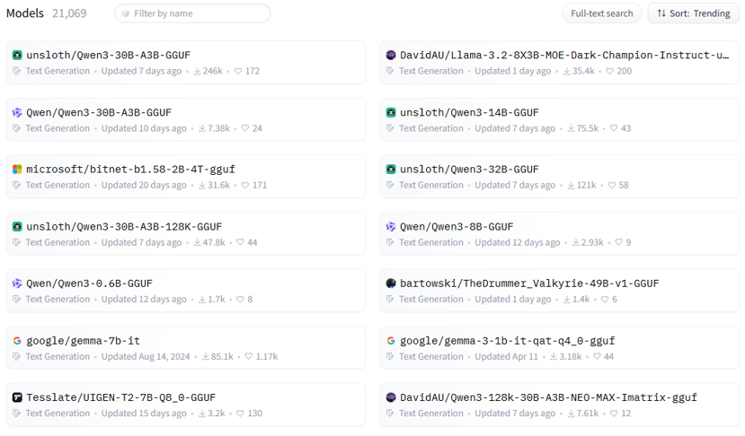
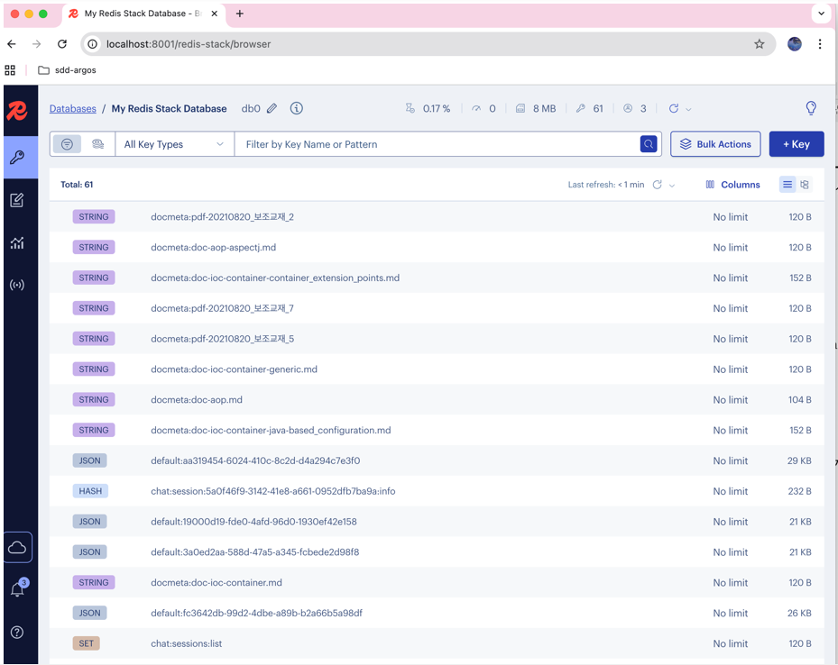
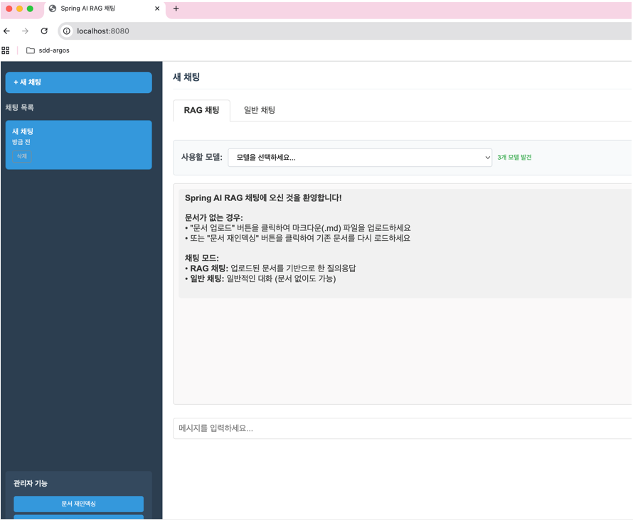

# 환경 설정

## 개요

이 문서에서는 Spring AI RAG 프로젝트 실행을 위한 개발 환경 구성 방법을 설명한다. Ollama, Embedding 모델, Redis Stack 설치 및 설정, 애플리케이션 설정, 프로젝트 실행 방법을 다룬다.

---

## 시스템 요구사항

| 소프트웨어 | 버전 | 용도 |
|-----------|------|------|
| **JDK** | 17 이상 | Java 애플리케이션 실행 |
| **Maven** | 3.8.4 이상 | 빌드 도구 |
| **Docker** | 최신 버전 | Redis Stack 컨테이너 |
| **Docker Compose** | 최신 버전 | 컨테이너 오케스트레이션 |
| **Ollama** | 최신 버전 | LLM 실행 |
| **Anaconda** | 최신 버전 | (선택) Embedding 모델 Export |

---

## Ollama 설치 및 설정

[Ollama 공식 사이트](https://ollama.com/download)에서 운영체제에 맞는 인스톨러를 다운로드하여 설치한다.



### 온라인 환경에서 모델 준비

```bash
# 모델 검색
# Ollama: https://ollama.com/search
# Hugging Face: https://huggingface.co/

# 모델 설치 (pull)
ollama pull llama3.2

# 모델 설치 및 실행 (run)
ollama run llama3.2

# 설치된 모델 목록 확인
ollama list
```

---

### 폐쇄망 환경에서 모델 준비

폐쇄망에서는 GGUF 형식의 모델을 준비하고 Modelfile을 작성해야 한다. GGUF는 딥러닝 모델 저장용 단일 파일 포맷으로, 다양한 양자화된 텐서 타입(8-bit, 4-bit 등)을 지원한다. 



<br/>

[Hugging Face](https://huggingface.co/)에서 GGUF 형식 모델을 제공하므로 검색하여 미리 다운로드한다.



**Modelfile 예시:**

```dockerfile
FROM hyperclova.gguf

# 시스템 역할 정의
SYSTEM """
너는 친절하고 똑똑한 한국어 인공지능 비서야.
사용자의 질문에 대해 오직 **한국어**로, **간결하고 핵심적인 답변**만 해.
영어로 절대 대답하지 마.
"""

# 프롬프트 템플릿
TEMPLATE """
### 질문:
{{ .Prompt }}

### 답변:
"""

# LLM 생성 파라미터
PARAMETER temperature 0.4
PARAMETER top_p 0.9
PARAMETER repeat_penalty 1.2
PARAMETER stop "###"
PARAMETER num_predict 512
```

**Modelfile 주요 지시어:** FROM(모델 지정, 필수), SYSTEM(시스템 메시지), TEMPLATE(프롬프트 템플릿), PARAMETER(temperature, top_p, num_predict 등 파라미터)

**폐쇄망에서 모델 등록:**

```bash
# GGUF 및 Modelfile이 있는 경로에서
ollama create hyperclova -f Modelfile

# 모델 실행
ollama run hyperclova

# 모델 목록 확인
ollama list
```

**모델 저장 경로:**
- Linux/macOS: `~/.ollama/models/blobs`
- Windows: `C:\Users\<유저명>\.ollama\models\blobs`

---

## Embedding 모델 준비

[Anaconda](https://www.anaconda.com/)를 설치하고 가상 환경을 생성한다.

```bash
# 가상 환경 생성 및 활성화
python -m venv venv
.\venv\Scripts\activate  # Windows
source ./venv/bin/activate  # Linux/macOS

# 필요 패키지 설치
pip install -U huggingface-hub transformers optimum[onnx] onnxruntime sentence-transformers

# ONNX로 Export
optimum-cli export onnx -m sentence-transformers/all-MiniLM-L6-v2 ./output
```

결과 파일(`model.onnx`, `tokenizer.json`)을 `src/main/resources/model/`에 배치한다.

---

## Redis Stack 설정

프로젝트 루트에 `docker-compose.yml` 파일을 생성한다:

```yaml
services:
  redis:
    image: redis/redis-stack:latest
    container_name: redis-stack
    ports:
      - "6379:6379"
      - "8001:8001"
    volumes:
      - ./redis_data:/data
```

```bash
docker-compose up -d  # Redis Stack 시작
docker ps             # 컨테이너 확인
```

Redis Insight는 `http://localhost:8001`에서 접속하며, Browser 탭에서 저장된 데이터 확인, Workbench 탭에서 Redis 명령어를 실행할 수 있다.



---

## 애플리케이션 설정

```yaml
spring:
  ai:
    ollama:
      base-url: http://localhost:11434
      chat:
        model: qwen2.5:7b
        options:
          temperature: 0.4
    model:
      embedding: transformers
    embedding:
      transformer:
        onnx:
          modelUri: classpath:model/model.onnx
        tokenizer:
          uri: classpath:model/tokenizer.json
    vectorstore:
      redis:
        initialize-schema: true
        index-name: document-index
    document:
      path: file:C:/workspace-test/upload/data/**/*.md
      chunk-size: 4000
  data:
    redis:
      host: localhost
      port: 6379

rag:
  enable-query-compression: true
  similarity:
    threshold: 0.20
  top-k: 3

chat:
  memory:
    max-messages: 20
```

**주요 파라미터:** `temperature`(창의성 0.0~1.0), `chunk-size`(청크 크기), `similarity.threshold`(유사도 임계값), `top-k`(검색 문서 수), `enable-query-compression`(질문 압축)

---

## 프로젝트 실행

**사전 확인:** Ollama 실행(`ollama list`), Redis Stack 실행(`docker ps`), Embedding 모델 파일(`src/main/resources/model/`) 확인

```bash
mvn spring-boot:run
```

웹 브라우저에서 `http://localhost:8080` 접속



**기본 동작:** 애플리케이션 실행 시 설정된 경로에서 문서를 읽어 자동 인덱싱 수행. 메인 화면에서 문서 업로드, 재인덱싱, LLM 모델 변경, RAG/일반 채팅 모드 전환 가능

---

## 문제 해결

| 증상 | 해결 방법 |
|------|----------|
| **Ollama 연결 실패** (Connection refused:11434) | `ollama list`로 확인, 프로세스 재시작 |
| **Redis 연결 실패** (Unable to connect:6379) | `docker ps`로 확인, `docker-compose restart` |
| **Embedding 모델 로드 실패** | `src/main/resources/model/` 경로와 파일 확인 |
| **문서 인덱싱 실패** | 문서 경로 설정 확인, Redis Insight에서 데이터 확인 |
| **메모리 부족** (OutOfMemoryError) | `java -Xmx4g`로 메모리 증가 또는 청크 크기 감소 |

## 참고자료
* https://ollama.com/
* https://docs.spring.io/spring-ai/reference/
* https://redis.io/docs/stack/
