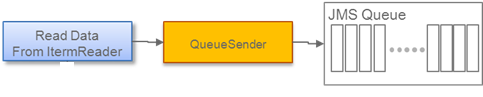
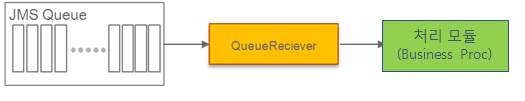
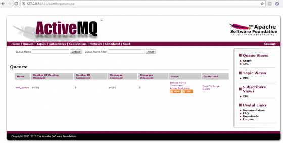

# 센터 컷(CenterCut) 소개

## 개요

전자정부 표준프레임워크에서의 큐(Queue)를 사용하여 대용량 데이터 처리를 위해 센터 컷 방식의 배치 작업수행을 위한 가이드를 제공한다.

## 센터컷 가이드 구조

* Unordered List Item기본적으로 센터컷의 구조는 큐(Queue)를 이용하는 부분을 제외하고는 배치 프로그램과 유사하다.
* Unordered List Item처음 ItemReader를 사용하여 데이터를 읽고 큐에 넣은 Center-Cut Reading Step과, 읽어온 데이터를 가공 후 QueueSender를 통해 Queue에 넣는 구조이다.

    

* Center-Cut Process Step은 큐에서 들어온 데이터를 읽고 처리 모듈(Busineess Proc)를 활용하여 데이터를 처리하는 구조이다.

    

[참고] QueueSender, QueueReciever만 센터컷을 위해 추가되는 모듈을 가이드하며, 나머지는 배치와 동일하다.

### 센터 컷의 가이드 기본 구성

1. Queue를 사용한 센터 컷 배치 처리를 위하여 Apache ActiveMQ를 활용한다.
현재 가이드의 ActiveMQ의 버전은 apache-activemq-5.15.1이며, 관련 프로그램 및 활용 방법은 아래의 ActiveMQ에서 확인할 수 있다. [Apache ActiveMQ](http://activemq.apache.org/)
ActiveMQ를 설치 및 실행 후, http:localhost:8161에서 실행 확인을 할 수 있으며, 관리자 계정(admin/admin) 로그인 후 Queue 메뉴에서 현재 큐의 사황을 확인 할 수 있다.

    

2. 구성 된 ActiveMQ를 활용하여 1개의 배치 Job과 2개의 Step(QueueSender, QueueProc)를 처리하는 가이드 예제를 활용한다.

가이드 예제의 기본 구성
* 큐서버(ActiveMQ)의 접속 Url 등록 : batch.properties에 batch.queue.url에 기술 (예:127.0.0.1:61616)
* 배치 Job 설정 : centerCutJob.xml에 1개의 Job과 2개의 Step의 빈 설정

```xml
<job id="centerCutJob" parent="eGovBaseJob" xmlns="http://www.springframework.org/schema/batch">
	<step id="stepQueueSender" next="stepQueueProc">
		<tasklet ref="taskletQueueSender" />
	</step>
	<step id="stepQueueProc">
		<tasklet ref="taskletQueueProc" />
	</step>
</job>

<bean id="taskletQueueSender" class="egovframework.rte.bat.centercut.TaskletQueueSender" scope="step">
</bean>

<bean id="taskletQueueProc" class="egovframework.rte.bat.centercut.TaskletQueueProc" scope="step">
</bean>
```

* 테스트 파일 : EgovCenterCutJobRunnerTest.java파일을 실행하여 테스트를 진행한다.

### QueueSender

TaskletQueueSender를 통하여 10,000개의 임의 데이터를 전송하고 endSender를 통하여 end message를 전송한다.
(총 전송되는 메시지는 10,000개 메시지와 1개의 end message를 전송)

* 10,000개 임의 데이터 전송

```java
public RepeatStatus execute(StepContribution contribution,
			ChunkContext chunkContext) throws Exception {
 
	LOGGER.debug("TaskletQueueSender execute START ===");

	QueueSenderFactory qf = new QueueSenderFactory("test_queue");
	TextMessage txMessage = qf.getMessage();
	MessageProducer sender = qf.getSender();
	qf.setRemove(true);

	for(int i=0; i<10000; i++){
		LOGGER.debug("Send Value : " + i );
		txMessage.setText(String.valueOf(i));
		sender.send(txMessage);
		senderCount++;
	}

	qf.endSender(sender);
	// * 오류로 주석처리
	qf.close();

	// LOGGER를 사용하는 것과 달리 MessageFormatter를 사용할 경우 Log 레벨과 상관 없이 결과를 로그에 기록함.
	// 따라서 개발/운영계에 로그레벨이 달라지는 경우에도 출력을 보장함
	LOGGER.debug("########## Center-Cut Result ##########");
	LOGGER.debug("## Sender  Count : " + senderCount);
	LOGGER.debug("########################################");

	return RepeatStatus.FINISHED;
}
```

* qf.endSender를 통하여 end message 전송

```java
public void endSender(MessageProducer sender) throws Exception {
	TextMessage message = session.createTextMessage();
	setRemove(true);
	message.setText("End Of QUEUE"); //end message
	sender.send(message);
 
}
```

* 전송 결과 (console출력)

```console
xxxx-xx-xx 11:20:16,566 DEBUG [egovframework.rte.bat.centercut.TaskletQueueSender] Send Value : 9989
xxxx-xx-xx 11:20:16,566 DEBUG [egovframework.rte.bat.centercut.TaskletQueueSender] Send Value : 9990
xxxx-xx-xx 11:20:16,566 DEBUG [egovframework.rte.bat.centercut.TaskletQueueSender] Send Value : 9991
xxxx-xx-xx 11:20:16,566 DEBUG [egovframework.rte.bat.centercut.TaskletQueueSender] Send Value : 9992
xxxx-xx-xx 11:20:16,566 DEBUG [egovframework.rte.bat.centercut.TaskletQueueSender] Send Value : 9993
xxxx-xx-xx 11:20:16,566 DEBUG [egovframework.rte.bat.centercut.TaskletQueueSender] Send Value : 9994
xxxx-xx-xx 11:20:16,566 DEBUG [egovframework.rte.bat.centercut.TaskletQueueSender] Send Value : 9995
xxxx-xx-xx 11:20:16,566 DEBUG [egovframework.rte.bat.centercut.TaskletQueueSender] Send Value : 9996
xxxx-xx-xx 11:20:16,567 DEBUG [egovframework.rte.bat.centercut.TaskletQueueSender] Send Value : 9997
xxxx-xx-xx 11:20:16,567 DEBUG [egovframework.rte.bat.centercut.TaskletQueueSender] Send Value : 9998
xxxx-xx-xx 11:20:16,567 DEBUG [egovframework.rte.bat.centercut.TaskletQueueSender] Send Value : 9999
xxxx-xx-xx 11:20:16,570 DEBUG [org.apache.activemq.transport.tcp.TcpTransport] Stopping transport tcp:///127.0.0.1:61616
xxxx-xx-xx 11:20:26,574 DEBUG [egovframework.rte.bat.queue.QueueRemover] >>>>> amqJmxUrl = service:jmx:rmi:///jndi/rmi://localhost:1099/jmxrmi
xxxx-xx-xx 11:20:26,725 DEBUG [egovframework.rte.bat.queue.QueueRemover] >>>>> init MBeanServerConnection connection = javax.management.remote.rmi.RMIConnector$RemoteMBeanServerConnection@3bcd426c
xxxx-xx-xx 11:20:26,725 DEBUG [egovframework.rte.bat.queue.QueueRemover] >>>>> queue remove - clientServiceName = org.apache.activemq:type=Broker,brokerName=localhost
xxxx-xx-xx 11:20:26,728 DEBUG [egovframework.rte.bat.queue.QueueRemover] >>>>> ConsumerCount = 0
xxxx-xx-xx 11:20:26,728 DEBUG [egovframework.rte.bat.queue.QueueRemover] >>>>> queue remove - clientServiceName = org.apache.activemq:type=Broker,brokerName=localhost
xxxx-xx-xx 11:20:26,728 DEBUG [egovframework.rte.bat.queue.QueueRemover] >>>>> queue remove - queueName = test_queue
xxxx-xx-xx 11:20:26,728 DEBUG [egovframework.rte.bat.queue.QueueRemover] >>>>> queue remove - operationName = removeQueue
xxxx-xx-xx 11:20:26,738 DEBUG [egovframework.rte.bat.centercut.TaskletQueueSender] ########## Center-Cut Result ##########
xxxx-xx-xx 11:20:26,738 DEBUG [egovframework.rte.bat.centercut.TaskletQueueSender] ## Sender  Count : 10000
xxxx-xx-xx 11:20:26,738 DEBUG [egovframework.rte.bat.centercut.TaskletQueueSender] ########################################

```

### Queue Process

또한, 전자정부 표준프레임워크는 TaskletQueueProc를 통하여 10,000개의 데이터를 전송받아 처리하면서, end message를 통하여 배치 처리를 종료한다.
(총 10,000개 메시지를 처리하고 1개의 end message를 통하여 완료한다.)

* 10,000개를 Queue에서 받기

```java
public RepeatStatus execute(StepContribution contribution,
	ChunkContext chunkContext) throws Exception {
 
	LOGGER.debug("TaskletQueueProc execute START ===");
 
	QueueReceiverFactory qf = new QueueReceiverFactory("test_queue");
	MessageConsumer receiver = qf.getReceiver();
 
	LOGGER.debug("=====>>>>> Start");
 
	while (true){
		textMessage = (TextMessage)receiver.receive();
		if(textMessage.getText().equals("End Of QUEUE")){
			LOGGER.debug("**********Receive End Message: " + textMessage.getText());
			qf.sessionCommit();
			break;
		}
		LOGGER.debug("Receive Message: " + textMessage.getText());
		qf.sessionCommit();
		recieveCount++;
	}
	qf.close();
 
	LOGGER.debug("########## Center-Cut Result ##########");
	LOGGER.debug("## Recieve  Count : " + recieveCount);
	LOGGER.debug("########################################");
 
	return RepeatStatus.FINISHED;
}
```

* 전송 결과 (console출력)

```console
xxxx-xx-xx 11:45:27,042 DEBUG [egovframework.rte.bat.centercut.TaskletQueueProc] Receive Message: 9997
xxxx-xx-xx 11:45:27,042 DEBUG [org.apache.activemq.ActiveMQSession] ID:DESKTOP-NV1780L-60402-1518144303940-3:1:1 Transaction Commit :TX:ID:DESKTOP-NV1780L-60402-1518144303940-3:1:9998
xxxx-xx-xx 11:45:27,042 DEBUG [org.apache.activemq.TransactionContext] Commit: TX:ID:DESKTOP-NV1780L-60402-1518144303940-3:1:9998 syncCount: 1
xxxx-xx-xx 11:45:27,043 DEBUG [org.apache.activemq.TransactionContext] Begin:TX:ID:DESKTOP-NV1780L-60402-1518144303940-3:1:9999
xxxx-xx-xx 11:45:27,043 DEBUG [egovframework.rte.bat.centercut.TaskletQueueProc] Receive Message: 9998
xxxx-xx-xx 11:45:27,043 DEBUG [org.apache.activemq.ActiveMQSession] ID:DESKTOP-NV1780L-60402-1518144303940-3:1:1 Transaction Commit :TX:ID:DESKTOP-NV1780L-60402-1518144303940-3:1:9999
xxxx-xx-xx 11:45:27,043 DEBUG [org.apache.activemq.TransactionContext] Commit: TX:ID:DESKTOP-NV1780L-60402-1518144303940-3:1:9999 syncCount: 1
xxxx-xx-xx 11:45:27,044 DEBUG [org.apache.activemq.TransactionContext] Begin:TX:ID:DESKTOP-NV1780L-60402-1518144303940-3:1:10000
xxxx-xx-xx 11:45:27,044 DEBUG [egovframework.rte.bat.centercut.TaskletQueueProc] Receive Message: 9999
xxxx-xx-xx 11:45:27,044 DEBUG [org.apache.activemq.ActiveMQSession] ID:DESKTOP-NV1780L-60402-1518144303940-3:1:1 Transaction Commit :TX:ID:DESKTOP-NV1780L-60402-1518144303940-3:1:10000
xxxx-xx-xx 11:45:27,044 DEBUG [org.apache.activemq.TransactionContext] Commit: TX:ID:DESKTOP-NV1780L-60402-1518144303940-3:1:10000 syncCount: 1
xxxx-xx-xx 11:45:27,045 DEBUG [org.apache.activemq.TransactionContext] Begin:TX:ID:DESKTOP-NV1780L-60402-1518144303940-3:1:10001
xxxx-xx-xx 11:45:27,045 DEBUG [egovframework.rte.bat.centercut.TaskletQueueProc] **********Receive End Message: End Of QUEUE
xxxx-xx-xx 11:45:27,045 DEBUG [org.apache.activemq.ActiveMQSession] ID:DESKTOP-NV1780L-60402-1518144303940-3:1:1 Transaction Commit :TX:ID:DESKTOP-NV1780L-60402-1518144303940-3:1:10001
xxxx-xx-xx 11:45:27,045 DEBUG [org.apache.activemq.TransactionContext] Commit: TX:ID:DESKTOP-NV1780L-60402-1518144303940-3:1:10001 syncCount: 1
xxxx-xx-xx 11:45:27,050 DEBUG [org.apache.activemq.ActiveMQMessageConsumer] remove: ID:DESKTOP-NV1780L-60402-1518144303940-3:1:1:1, lastDeliveredSequenceId:60066
xxxx-xx-xx 11:45:27,052 DEBUG [org.apache.activemq.transport.tcp.TcpTransport] Stopping transport tcp:///127.0.0.1:61616
xxxx-xx-xx 11:45:27,052 DEBUG [egovframework.rte.bat.centercut.TaskletQueueProc] ########## Center-Cut Result ##########
xxxx-xx-xx 11:45:27,052 DEBUG [egovframework.rte.bat.centercut.TaskletQueueProc] ## Recieve  Count : 10000
xxxx-xx-xx 11:45:27,052 DEBUG [egovframework.rte.bat.centercut.TaskletQueueProc] ########################################
```

## 참고자료
* [Apache ActiveMQ](http://activemq.apache.org/)
