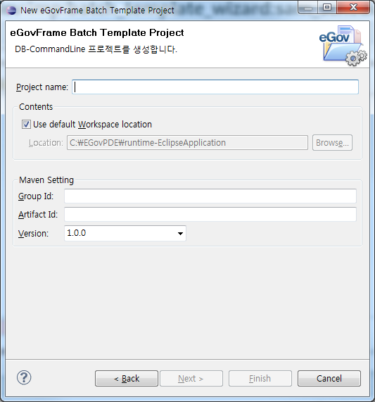
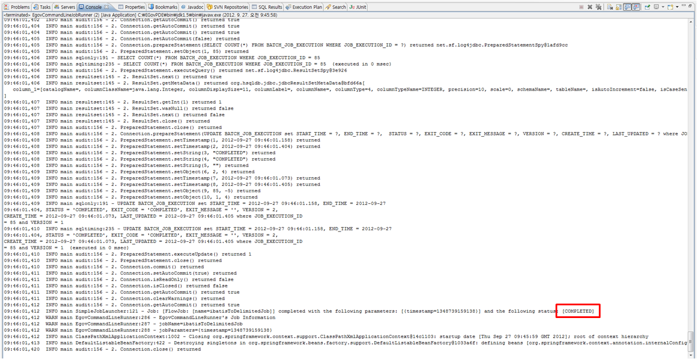

# DB-CommandLine Batch Template Project Wizard 
## 사용법 (Continue)

[<< 이전 과정 보기](https://www.egovframe.go.kr/wiki/doku.php?id=egovframework:dev2:bdev:imp:batch_template_wizard#%EA%B3%84%EC%86%8D_%EC%A7%84%ED%96%89)

 5. 프로젝트 명과 Maven 설정 프로젝트 명과 Maven 설정에 필요한 값들을 입력하고 **Finish**를 클릭한다.  

  

 6. 배치작업 수행 전, 배치작업에 필요한 스키마 정의
- 배치작업 수행을 위해서는 배치작업에 필요한 데이터베이스가 구성되어야 정상적으로 동작한다. 전자정부에서는 데이터베이스 구성용 스크립트를 제공한다.  
- [예제 설치의 3번(HSQL) 또는 HSQL 외 DB 연결 순서(HSQL 외)](./batch-example-setup)을 참고하여 스키마를 정의한다.

7. EgovCommandLineRunner 실행 후 배치 템플릿 프로젝트 실행 확인
**EgovCommandLineRunner** 실행 후, 배치 템플릿 프로젝트가 올바르게 실행되는지 확인한다. [(EgovCommandLineRunner 실행 방법)](./batch-core-egov_commandline_runner_template.md)
- Console 창의 **COMPLETED** 로그를 통해 배치작업의 정상적인 작동을 확인할 수 있다.  

  

### 참고사항
✔ 해당 프로젝트의 입력 리소스 유형은 DB이므로 입력 리소스의 경로가 따로 있지 않다. (입력 리소스 유형이 File인 경우, 경로 필요)  

✔ 배치작업을 통해 생성되는 결과물 파일은 프로젝트의 `target/test-outputs` 경로에 생성되도록 기본 설정되어 있다. (ItemWriter 설정의 resource property를 통해 경로 및 파일명 변경 가능)

#### eGovFrame Batch Template Project 설정 페이지

| 옵션             | 설명                                                                                                     | 기본값                    |
|------------------|----------------------------------------------------------------------------------------------------------|--------------------------|
| Project Name     | 새 프로젝트 이름을 입력한다.                                                                          | 공백                      |
| Contents         | Use default Workspace location 체크 시 기본 작업공간에 프로젝트 명으로 프로젝트 디렉토리가 생성된다. 임의의 디렉토리 선택 시 옵션을 해제하고 Browse 버튼을 클릭하여 위치를 선택한다. | Use default Workspace location |
| Group Id         | Maven에서의 Group Id를 입력한다.                                                                       | 공백                      |
| Artifact Id      | Maven에서의 Artifact Id를 입력한다.                                                                    | 공백                      |
| Version          | Maven에서의 버전이 입력된다.                                                                          | 1.0.0                    |

#### 제공 Sample Job (입력 리소스 유형이 DB인 프로젝트)

| Job                     | Reader                   | Writer                   | Job 설명                                                                                  |
|------------------------|-------------------------|-------------------------|------------------------------------------------------------------------------------------|
| ibatisToDelimitedJob   | [IbatisPagingItemReader](https://www.egovframe.go.kr/wiki/doku.php?id=egovframework:rte2:brte:batch_core:item_reader#database_itemreader)   | [FlatFileItemWriter]((https://www.egovframe.go.kr/wiki/doku.php?id=egovframework:rte2:brte:batch_core:item_writer#flatfile_itemwriter))      | 데이터베이스 테이블에 존재하는 원천 데이터를 iBatis를 이용해 입력받아 배치작업 처리 후, 구분자 방식으로 데이터를 저장하는 Job |
| ibatisToFixedLengthJob | [IbatisPagingItemReader](https://www.egovframe.go.kr/wiki/doku.php?id=egovframework:rte2:brte:batch_core:item_reader#database_itemreader)   | [FlatFileItemWriter](https://www.egovframe.go.kr/wiki/doku.php?id=egovframework:rte2:brte:batch_core:item_writer#flatfile_itemwriter)      | 데이터베이스 테이블에 존재하는 원천 데이터를 iBatis를 이용해 입력받아 배치작업 처리 후, 고정길이 방식으로 데이터를 저장하는 Job |
| ibatisToIbatisJob     | [IbatisPagingItemReader](https://www.egovframe.go.kr/wiki/doku.php?id=egovframework:rte2:brte:batch_core:item_reader#database_itemreader)  | [IbatisBatchItemWriter](https://www.egovframe.go.kr/wiki/doku.php?id=egovframework:rte2:brte:batch_core:item_writer#database_itemwriter)   | 데이터베이스 테이블에 존재하는 원천 데이터를 iBatis를 이용해 입력받아 배치작업 처리 후, iBatis를 이용해 데이터베이스 테이블에 데이터를 저장하는 Job |
| jdbcToJdbcJob         | [JdbcCursorItemReader](https://www.egovframe.go.kr/wiki/doku.php?id=egovframework:rte2:brte:batch_core:item_reader#database_itemreader)     | [JdbcBatchItemWriter](https://www.egovframe.go.kr/wiki/doku.php?id=egovframework:rte2:brte:batch_core:item_writer#database_itemwriter)     | 데이터베이스 테이블에 존재하는 원천 데이터를 JDBC를 이용해 입력받아 배치작업 처리 후, JDBC를 이용해 데이터베이스 테이블에 데이터를 저장하는 Job |

