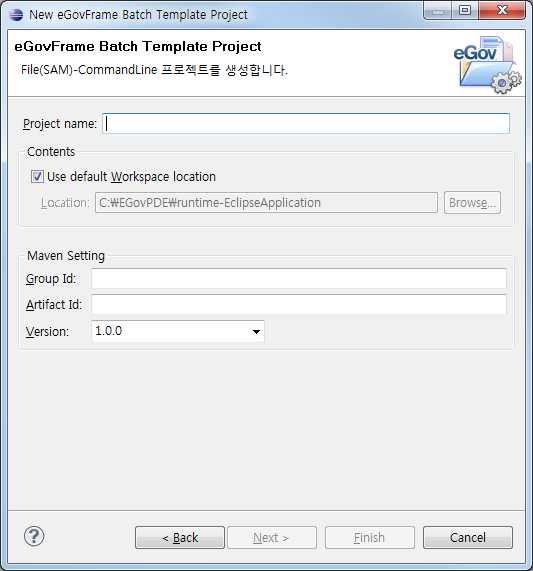
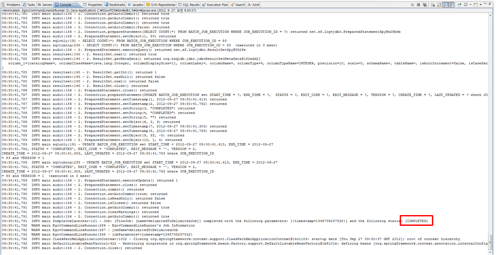

# File(SAM)-CommandLine Batch Template Project Wizard
## 사용법 (Continue)
[<< 이전 과정 보기](https://www.egovframe.go.kr/wiki/doku.php?id=egovframework:dev2:bdev:imp:batch_template_wizard#%EA%B3%84%EC%86%8D_%EC%A7%84%ED%96%89)

5. 프로젝트 명과 Maven 설정에 필요한 값들을 입력하고 **Finish**를 클릭한다.  

6. 배치작업 수행 전, 배치작업에 필요한 스키마를 정의한다.

- 배치작업 수행을 위해서는 배치작업에 필요한 데이터베이스가 구성되어야 정상적으로 동작한다. 전자정부에서는 데이터베이스 구성용 스크립트를 제공한다.  
- [예제 설치의 3번(HSQL) 또는 HSQL 외 DB 연결 순서(HSQL 외)](./batch-example-setup.md))을 참고하여 스키마를 정의한다.

7. **EgovCommandLineRunner** 실행 후, 배치 템플릿 프로젝트가 올바르게 실행되는지 확인한다. ([**EgovCommandLineRunner 실행 방법**](./batch-core-egov_commandline_runner_template.md))

- Console 창의 **COMPLETED** 로그를 통해 배치작업의 정상적인 작동을 확인할 수 있다.  

## 참고사항
✔ 입력 데이터로 사용될 파일은 `/main/resources/egovframework/batch/data/inputs`에 있다. (ItemReader 설정의 resource property를 통해 변경 가능)  
✔ 배치작업을 통해 생성되는 결과물 파일은 프로젝트의 `target/test-outputs` 경로에 생성되도록 기본 설정 되어있다. (ItemWriter 설정의 resource property를 통해 경로 및 파일명 변경 가능)

#### eGovFrame Batch Template Project 설정 페이지

| 옵션                     | 설명                                                                                                            | 기본값                    |
|------------------------|---------------------------------------------------------------------------------------------------------------|-------------------------|
| Project Name           | 새 프로젝트 이름을 입력한다.                                                                                       | 공백                      |
| Contents               | Use default Workspace location 체크시 기본 작업공간에 프로젝트 명으로 프로젝트 디렉토리가 생성된다. 임의의 디렉토리 선택시 옵션을 해제하고 Browse 버튼을 클릭하여 위치를 선택한다. | Use default Workspace location |
| Group Id               | Maven에서의 Group Id를 입력한다.                                                                                  | 공백                      |
| Artifact Id            | Maven에서의 Artifact Id를 입력한다.                                                                               | 공백                      |
| Version                | Maven에서의 버젼을 입력한다.                                                                                     | 1.0.0                   |

#### 제공 Sample Job (입력 리소스 유형이 File(SAM)인 프로젝트)

| Job                             | Reader                      | Writer                     | Job 설명                                                                                      |
|--------------------------------|----------------------------|---------------------------|---------------------------------------------------------------------------------------------|
| delimitedToDelimitedJob        | [FlatFileItemReader](https://www.egovframe.go.kr/wiki/doku.php?id=egovframework:rte2:brte:batch_core:item_reader#flatfile_itemreader)         | [FlatFileItemWriter](https://www.egovframe.go.kr/wiki/doku.php?id=egovframework:rte2:brte:batch_core:item_writer#flatfile_itemwriter)        | File(SAM) 형태의 자료에서 원천 데이터를 구분자 기준으로 입력받아 배치작업 처리 후, 구분자 방식의 데이터를 저장하는 파일로 결과물을 생성하는 Job |
| fixedLengthToFixedLengthJob    | [FlatFileItemReader](https://www.egovframe.go.kr/wiki/doku.php?id=egovframework:rte2:brte:batch_core:item_reader#flatfile_itemreader)        | [FlatFileItemWriter](https://www.egovframe.go.kr/wiki/doku.php?id=egovframework:rte2:brte:batch_core:item_writer#flatfile_itemwriter)        | File(SAM) 형태의 자료에서 원천 데이터를 고정길이 방식으로 입력받아 배치작업 처리 후, 고정길이 지정 방식의 데이터를 저장하는 파일로 결과물을 생성하는 Job |
| fixedLengthToIbatisJob        | [FlatFileItemReader](https://www.egovframe.go.kr/wiki/doku.php?id=egovframework:rte2:brte:batch_core:item_reader#flatfile_itemreader)        | [IbatisBatchItemWriter](https://www.egovframe.go.kr/wiki/doku.php?id=egovframework:rte2:brte:batch_core:item_writer#database_itemwriter)     | File(SAM) 형태의 자료에서 원천 데이터를 고정길이 방식으로 입력받아 배치작업 처리 후, iBatis를 이용해 데이터베이스 테이블에 데이터를 저장하는 Job |
| fixedLengthToJdbcJob          | [FlatFileItemReader](https://www.egovframe.go.kr/wiki/doku.php?id=egovframework:rte2:brte:batch_core:item_reader#flatfile_itemreader)         | [JdbcBatchItemWriter](https://www.egovframe.go.kr/wiki/doku.php?id=egovframework:rte2:brte:batch_core:item_writer#database_itemwriter)       | File(SAM) 형태의 자료에서 원천 데이터를 고정길이 방식으로 입력받아 배치작업 처리 후, JDBC를 이용해 데이터베이스 테이블에 데이터를 저장하는 Job |
