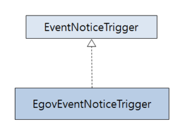

# 이벤트알림 템플릿 관리

## 개요
전자정부 표준프레임워크의 배치 수행중 특정시점에 이벤트가 발생하는 경우 EventNoticeTrigger 인터페이스를 활용하여 SMS, Email 등을 통해 정보를 전달할 수 있는 추상화된 외부알림 access 관리기능이다.

## 설명
### EventNoticeTrigger
EventNoticeTrigger 는 이벤트 알림 기능을 사용하도록 추상화된 인터페이스이다.

메소드는 트리거를 호출하는 invoke 메소드를 파라메터 타입별로 구성하였고, 모든 메소드의 리턴타입은 void 이다.

| 메소드                   | 파라메터          | 설명                                 |
| --------------------- | ------------- | ---------------------------------- |
| invoke()              | 없음            | 파라메터 없이 이벤트호출 ‌로직 구현               |
| invoke(StepExecution) | StepExecution | 파라메터인 StepExecution 정보를 활용하는 로직 구현 |
| invoke(JobExecution)  | JobExecution  | 파라메터인 JobExecution 정보를 활용하는 로직 구현  |
| invoke(Exception)     | Exception     | 파라메터인 Execption 정보를 활용하는 로직 구현     |

### EgovEventNoticeTrigger
EgovEventNoticeTrigger 클래스는 EventNoticeTrigger 인터페이스를 상속받은 형태로, 파라메터 타입별로 이벤트 알림 기능(Email전송, SMS전송)을 호출하기 위한 invoke 메소드를 갖고 있다. 모든 메소드의 리턴타입은 void로 로직수행 후 반환해야 하는 값이 없고, 이는 배치 고유의 수행과정과 별도로 동작하는 부분이다.

사용자는 EgovEventNoticeTrigger 를 상속받아 각각의 파라메터 타입별로 재정의하여 사용한다.



#### 설정
'프로세서(리스너) 설정' 부분과 '트리거 설정' 부분으로 나뉜다.

- 프로세서(리스너) 설정
1. Job 설정에서 이벤트를 호출할 수 있도록 리스너 설정을 하고 관련 클래스를 빈으로 등록한다.

```xml
<job id="eventNoticeTriggerJob" xmlns="http://www.springframework.org/schema/batch">
	<step id="eventNoticeTriggerStep1">
		<tasklet>
			<chunk reader="itemReader" writer="itemWriter" commit-interval="2" />
		</tasklet>
		<listeners>
			<listener ref="EventNoticeCallListener" />
		</listeners>
	</step>
</job>
 
<bean id="EventNoticeCallListener" class="egovframework.brte.sample.example.listener.EgovEventNoticeCallProcessor" />
```

2. 위에서 설정한 프로세서를 구현한다. [작업 전후처리 관리](./batch-core-listener.md#작업-전후처리-관리-egovprepostprocessor)의 프로세서를 상속받아 사용자가 원하는 시점 (아래 예시는 Step수행 후에 호출되는 메소드)에서 invoke 메소드를 호출하도록 구현한다. 
메소드에 invoke 메소드는 EgovEventNoticeTrigger을 상속받아 재정의한 클래스('트리거 설정' 2 에서 구현)를 사용할 수 있다.

✔ 이때 사용자가 정의한 클래스는 Job 설정파일에 빈으로 등록되어 있으므로 어노테이션을 활용한다

```java
public class EgovEventNoticeCallProcessor<T,S> extends EgovStepPostProcessor<T,S> {
 
	//EgovEventNoticeTrigger을 상속받아 재정의한 클래스	
	@Autowired
	EgovEmailEventNoticeTrigger egovEmailEventNoticeTrigger;
 
	public ExitStatus afterStep(StepExecution stepExecution) {
		...
 
		egovEmailEventNoticeTrigger.invoke(stepExecution);
		...
	}
}
```

- 트리거 설정
1. 실제 Email 전송 혹은 SMS 전송을 수행하는 트리거 기능의 클래스를 작성한다. (전자정부 프레임워크 공통컴포넌트 활용 가능)
2. EgovEventNoticeTrigger 클래스 상속받아 invoke 메소드를 구현한다. 파라메터(JobExecution, StepExecution, Exception 등)에 대한 알림 내용을 작성한 뒤, 위 클래스('트리거 설정' 1 에서 구현) 트리거 메소드의 파라메터로 전달하며 호출한다.

아래 예시에서는 StepExecution 파라메터를 활용하였다.

✔ 이때 사용자가 정의한 클래스는 설정파일에서 빈으로 등록되어 있다.

```java
public class EgovEmailEventNoticeTrigger extends EgovEventNoticeTrigger {
 
	public void invoke(StepExecution stepExecution) {
 
		// StepExecution 을 활용하여 알림내용 작성
		// '트리거 설정' 1에서 구현한 트리거를 통해 메시지 전송 수행
	}
}
```

```xml
<-- 프로세서(리스너) 설정 1 의 Job 설정파일 (계속) -->
<bean id="EmailEventNoticeTrigger"
 	class="egovframework.brte.sample.example.event.EgovEmailEventNoticeTrigger" />
```

위 기능을 활용하여 실제 Email을 전송하는 예제를 제공하므로 아래를 참고한다.

#### 사용예시
- [이벤트알림 템플릿(Template) 예제](../../runtime-example/individual-example/batch-layer/batch-example-event_notice_template_mgmt.md)