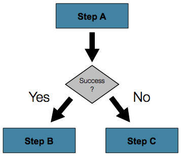

# Flow Control

## 개요

Job 내부에는 여러 Step 들이 존재할 수 있고, 각 Step 사이의 흐름을 관리할 필요가 있다. Step 내의 next 설정과 Desision 설정으로 Job을 수행하다 한 Step의 처리결과에 따라 다른 Step을 선택하여 수행할 수 있고, 특정 Step의 실패가 Job 전체의 실패로 이어지지 않도록 구성할 수 있다.

## 설명

### 흐름 처리(Controlling Step Flow)

#### Sequential Flow

가장 간단한 시나리오의 Job은 모든 Step을 순서대로 실행 하는 것이다.


위와 같은 Job의 실행은 Step 엘리먼트의 'next' 어트리뷰트를 이용해서 설정할 수 있다.

```xml
<job id="job">
    <step id="stepA" parent="s1" next="stepB" />
    <step id="stepB" parent="s2" next="stepC"/>
    <step id="stepC" parent="s3" />
</job>
```

위 시나리오를 실행 하면 Job 설정의 가장 상단에 위치한 'stepA'가 먼저 실행 된다. 'stepA'가 실행 완료 되면 'stepB', 'stepC'의 순서로 실행되게 된다. 하지만 만약 'stepA'의 실행이 실패하게 된다면 전체 Job의 실행은 실패하게 되며 'stepB'는 실행 되지 않는다.

- Note : 스프링 배치의 XML 설정은 Job 설정의 가장 상단 Step이 최초로 실행되게 되며, 그 후의 Step 실행 순서는 XML 설정 순서와는 관계가 없다.

#### Conditional Flow

위 Sequential Flow의 실행 결과는 다음 2가지로 나뉘게 된다.

1. Step이 성공적으로 실행되고, 다음 Step이 실행 된다.
2. Step의 실행이 실패하며 그로인해 Job의 실행 또한 실패한다.

많은 케이스가 위의 내용에 해당하게 된다. 하지만 Step의 실패가 Job의 실패를 유발하는 것이 아니고 다른 Step을 실행하는 경우를 생각해 보자.



스프링 배치에서는 다양한 경우의 시나라오를 설정 할 수 있도록 Step 엘리먼트내에 사용할 수 있는 transition 엘리먼트를 제공 해준다. 그중의 한 엘리먼트로 'next' 엘리먼트가 있다. 'next' 엘리먼트는 'next' 어트리뷰트와 마찬가지로 Job 실행에서 다음에 실행될 Step에 대해 알려준다. 하지만 'next' 어트리뷰트와 다르게 'next' 엘리먼트는 사용 횟수에 제한이 없으며, Step의 실패에 대한 default 설정이 없다. 그러므로 transition 엘리먼트를 사용할 때에는 모든 Step의 Behavior 설정을 충분히 해줘야 한다.

✔ 싱글 Step의 경우 'next' 어트리뷰트와 transition 엘리먼트를 사용할 수 없다.

다음은 'next' 엘리먼트를 사용하는 기본 패턴이다

```xml
<job id="job">
    <step id="stepA" parent="s1">
        <next on="*" to="stepB" />
        <next on="FAILED" to="stepC" />
    </step>
    <step id="stepB" parent="s2" next="stepC" />
    <step id="stepC" parent="s3" />
</job>
```

'next' 엘리먼트의 'on' 어트리뷰트를 이용해서 Step 실행 결과(ExitStatus)에 따라 다음 Step을 설정 할 수 있다.'on' 어트리뷰트에 패턴으로 사용 될 수 있는 특수 문자는 다음 2가지만이 가능하다.

- '*' : 0 또는 그 이상의 문자.
- '?' : 하나의 문자.

예를 들면 'c*t'는 'cat'과 'count'와 모두 매칭 된다. 반면에, 'c?t'는 'cat'과 매칭 되지만 'count'와 매칭 되지 않는다. Step 설정에 transition 엘리먼트의 사용 횟수에는 제한이 없지만, Step의 실행 결과(ExitStatus)가 Step 설정에 정의 되지 않은 경우에는 스프링 배치 프레임워크는 예외를 던지게 되며 Job의 실행은 실패하게 된다. 스프링 배치 프레임워크는 'on' 어트리뷰트 설정 값을 상세한 설정을 우선해서 먼저 적용한다. 위 설정을 예로 들면 Step의 실행 결과로 'FAILED' ExitStatus를 갖게 되면 'StepA'가 아닌 'StepC'로 전이 하게 된다.

##### Batch Status vs. Exit Status

Conditional flow를 사용하는 Job을 설정할때에는 BatchStatus과 ExitStatus의 차이를 아는것이 중요하다. BatchStatus는 Job 또는 Step 의 실행 결과를 스프링 프레임워크에서 기록할 때 사용하는 Property의 집합니다. BatchStatus로 사용 되는 값은 COMPLETED, STARTING, STARTED, STOPPING, STOPPED, FAILED, ABANDONED, UNKNOWN 이다. 대부분의 값들은 단어와 같은 뜻으로 해석하여 이해하면 된다.

다음의 'next' 엘리먼트를 사용하는 예제를 보자.

```xml
<next on="FAILED" to="stepB" />
```

위 예제에서 'on' 어트리뷰트가 BatchStatus를 참조하는 것으로 생각되기 쉽지만 실제 참조되는 값은 Step의 ExitStatus이다. ExitStatus의 이름에서 알 수 있듯이 ExitStatus는 Step의 실행 후 상태를 알려주는 값이다. 위 예제를 좀더 쉽게 풀이 하자면 'exit 코드가 FAILED로 끝나게 되면 StepB로 가라'는 뜻이 된다. 스프링 배치 프레임워크는 디폴트 설정으로 ExitStatus의 exit 코드는 Step의 BatchStatus와 같도록 설정이 되어 있다. 하지만 만약에 exit 코드가 BatchStatus와 달라야 한다면 

```xml
<step id="step1" parent="s1">
    <end on="FAILED" />
    <next on="COMPLETED WITH SKIPS" to="errorPrint1" />
    <next on="*" to="step2" />
</step>
```

위 Step의 실행 결과는 다음 3가지가 될 수 있다.

- Step이 실패하며, Job 또한 실패하게 된다.
- Step이 성공적으로 완료된다.
- Step이 성공적으로 완료되며, 'COMPLETED WITH SKIPS'의 exit 코드로 종료 된다. 이 경우 별도의 Step이 에러를 처리하기 위해 실행 되어져야만 한다.

위 예제의 사용에는 에러가 없지만, 사용자의 의도대로 처리되기 위해서는'COMPLETED WITH SKIPS' exit 코드를 반환하는 별도의 로직이 필요하다.

```java
public class SkipCheckingListener extends StepExecutionListenerSupport {
 
    public ExitStatus afterStep(StepExecution stepExecution) {
        String exitCode = stepExecution.getExitStatus().getExitCode();
        if (!exitCode.equals(ExitStatus.FAILED.getExitCode()) && 
              stepExecution.getSkipCount() > 0) {
            return new ExitStatus("COMPLETED WITH SKIPS");
        }
        else {
            return null;
        }
    }
 
}
```

위코드를 설명하면 StepExecutionListener 에서는 먼저 Step이 성공적으로 수행되었는지 체크한다. 그 후 StepExecution의 skip 횟수가 0.1f보다 클경우 'COMPLETED WITH SKIPS'의 exit 코드를 갖는 ExitStatus를 반환한다.

#### Configuring for Stop

BatchStatus와 ExitStatus가 어떻게 결정되는지 알아 보았다. Step의 Status는 코드의 실행 결과에 의해 결정 되는 반면에 Job의 Status는 스프링 배치 설정에 의해 결정 되어 진다. 모든 Job 설정은 최소 하나의 'transition이 없는 final Step' 을 갖게 된다.
다음의 예는 Step이 실행 되어 진 후에 Job이 종료 되게 된다.

```xml
<step id="stepC" parent="s3"/>
```

transition이 정의 되지 않은 Step의 경우 Job의 Status는 다음과 같이 결정 되게 된다.

- Step의 ExitStatus가 FAILED 일 경우 Job의 BatchStatus와 ExitStatus는 모두 FAILED 가 된다.
- 위 경우와 반대로 Step의 ExitStatus가 COMPLETED 일 경우 Job의 BatchStatus와 ExitStatus는 모두 COMPLETED 가 된다.

단순 Sequential Step의 Job의 경우에는 위 방법만으로도 Job을 설정하기에 충분하지만, 별도의 Job의 중단을 위한 시나리오가 필요한 경우도 존재한다. 이같은 경우를 위해 스프링 배치 프레임워크에서는 Job을 중단시키기 위한 transition 엘리먼트를 제공한다. 이 엘리먼트들은 Job을 특정 BatchStatus와 함께 종료 시킨다.

Stop transition 엘리먼트는 Step의 BatchStatus 또는 ExitStatus에는 영향을 미칠수 없으며, 오로지 Job의 마지막 상태에만 영향을 미칠수 있다. 예를 들어, Job의 모든 Step의 결과가 FAILED이지만 Job의 Status는 COMPLETED가 될 수 있으며 ,그반대 또한 가능하다.

##### The 'End' Element

'end' 엘리먼트는 Job을 COMPLETED BatchStatus와 함께 종료 시킨다. COMPLETED 상태로 종료된 Job은 재실행이 불가능하다(스프링 배치 프레임워크에서 JobInstanceAlreadyCompleteException이 발생됨). 'end' 엘리먼트에는 추가적으로 'exit-code' 어트리뷰트를 사용하면 커스텀 ExitStatus의 정의가 가능하다. 'exit-code' 정의가 없는 경우에는 디폴트 코드로 COMPLETED가 적용되게 된다.

다음의 예제는 Step2가 실패하기 되면 Job은 COMPLETED BatchStatus로 종료되며 Step3은 실행 되지않는다. 이경우 Job이 COMPLETED BatchStatus로 종료 되었기 때문에 재시작이 불가능 하다.(Step2가 성공하는 경우에는 Step3이 실행되게 된다)

```xml
<step id="step1" parent="s1" next="step2">
 
<step id="step2" parent="s2">
    <end on="FAILED"/>
    <next on="*" to="step3"/>
</step>
 
<step id="step3" parent="s3">
```

##### The 'Fail' Element

'fail' 엘리먼트는 Job을 FAILED BatchStatus와 함께 종료 시킨다. 'end'엘리먼트와 다르게 'fail' 엘리먼트를 사용한 경우에는 Job의 재시작이 가능하다. 'fail' 엘리먼트 또한 커스텀 ExitStatus의 정의를 위한 'exit-code' 어트리뷰트를 사용 할 수 있다. 'exit-code' 정의가 없는 경우에는 디폴트 코드로 FAILED가 적용되게 된다.

다음의 예제는 Step2가 실패하기 되면 Job은 FAILED BatchStatus와 EARLY TERMINATION ExitStatus로 종료되며 Step3은 실행 되지 않는다. 이경우 Job의 재시작이 가능하며, 실행은 Step2부터 시작된다.(Step2가 성공하는 경우에는 Step3이 실행되게 된다)

```xml
<step id="step1" parent="s1" next="step2">
 
<step id="step2" parent="s2">
    <fail on="FAILED" exit-code="EARLY TERMINATION"/>
    <next on="*" to="step3"/>
</step>
 
<step id="step3" parent="s3">
```

##### The 'Stop' Element

'stop' 엘리먼트는 Job을 STOPPED BatchStatus와 함께 종료 시킨다. Job이 중단 되면 Job이 재시작 되기전에 오퍼레이터는 추가적인 작업을 수행 할 수 있다. 'stop' 엘리먼트는 다음 Job의 재실행 지점의 설정을 위해 'restart' 어트리뷰트의 정의가 요구된다.

다음의 예제에서는 Step1이 COMPLETED 상태로 종료가 되면 Job은 정지 되게 되며, 정지된 Job의 재실행 지점은 Step2이

```xml
<step id="step1" parent="s1">
    <stop on="COMPLETED" restart="step2"/>
</step>
 
<step id="step2" parent="s2"/>
```

#### Programmatic Flow Decisions

경우에 따라서는 다음에 실행될 Step을 결정하기 위해 ExitStatus 보다 더 많은 정보가 필요할 경우가 있다. 이때에 다음 Step을 결정하기 위해 JobExecutionDecider를 이용 할 수 있다.

```java
public class MyDecider implements JobExecutionDecider {
    public FlowExecutionStatus decide(JobExecution jobExecution, StepExecution stepExecution) 
 
{
        if (someCondition) {
            return "FAILED";
        }
        else {
            return "COMPLETED";
        }
    }
}
```

Job 설정을 위한 'decision' 태그를 다음과 같이 사용한다.

```xml
<job id="job">
    <step id="step1" parent="s1" next="decision" />
 
    <decision id="decision" decider="decider">
        <next on="FAILED" to="step2" />
        <next on="COMPLETED" to="step3" />
    </decision>
 
    <step id="step2" parent="s2" next="step3"/>
    <step id="step3" parent="s3" />
</job>
 
<beans:bean id="decider" class="com.MyDecider"/>
```

#### Split Flows

앞에서 설명한 모드 시나리에서는 Job내의 Step들의 실행이 순서대로 이루어지고 있다. 스프링 배치프레임워크에서는 이외에도 parallel flow를 지원하기 위한 'split' 엘리먼트를 제공한다.

아래의 코드를 보면 'split' 엘리먼트는 하나 이상의 'flow' 엘리먼트를 갖을 수 있으며, 'flow' 엘리먼트는 분리된 flow를 정의한다. 'split' 엘리먼트는 앞에서 설명한 'next' 어트리뷰트, 'next' 엘리먼트, 'end' 엘리먼트, 'fail' 엘리먼트, 'pause' 엘리먼트들을 포함 할 수 있다

```xml
<split id="split1" next="step4">
    <flow>
        <step id="step1" parent="s1" next="step2"/>
        <step id="step2" parent="s2"/>
    </flow>
    <flow>
        <step id="step3" parent="s3"/>
    </flow>
</split>
<step id="step4" parent="s4"/>
```

#### Externalizing Flow Definitions and Dependencies Between Jobs

Job의 flow중 일부는 별도의 bean 설정으로 분리 될 수 있으며, 재사용이 가능하다. 이러한 설정 방법에는 3가지가 있으면 그중 첫 번째는 아래와 같이 별도로 설정된 flow를 참조하는 방법이다.

```xml
<job id="job">
    <flow id="job1.flow1" parent="flow1" next="step3"/>
    <step id="step3" parent="s3"/>
</job>
 
<flow id="flow1">
    <step id="step1" parent="s1" next="step2"/>
    <step id="step2" parent="s2"/>
</flow>
```

위와 같이 flow를 설정하게 되면 간단하게 별도의 Step을 추가 할 수 있다. 이런 방법으로 여러 Job에서 같은 flow 템플릿을 참조 할 수 있으며, flow 템플릿의 조합으로 다른 로직의 flow 설정을 할 수 있다. 위 방법은 통합 테스트를 별도의 flow로 분리하는 데에도 유용하게 사용 될 수 있다.

두번째 flow의 분리 방법은 FlowStep을 사용하는 방법이다. FlowStep은 flow의 처리를 \<flow/> 엘리먼트로 위임하는 Step 인터페이스의 구현체이다.
아래의 FlowStep 설정 예제를 보자.

```xml
<job id="job">
    <step id="job1.flow1" flow="flow1" next="step3"/>
    <step id="step3" parent="s3"/>
</job>
 
<flow id="flow1">
    <step id="step1" parent="s1" next="step2"/>
    <step id="step2" parent="s2"/>
</flow>
```

실제 로직의 수행은 이전 예제와 동일하나, Job Repository에 저장되는 데이터가 다르게 된다. 이러한 설정 방법은 모니터링 과 리포팅 목적으로 유용하게 사용될 수 있으며 partitioned step의 구조를 더욱 다양하게 해줄 수 있다.

세번째 flow의 분리 방법은 JobStep을 사용하는 방법이다. JobStep은 FlowStep과 유사하지만 분리된 Step의 실행을 위해 별도의 Job Execution을 생성하게 된다.

```xml
<job id="jobStepJob" restartable="true">
   <step id="jobStepJob.step1">
      <job ref="job" job-launcher="jobLauncher" 
          job-parameters-extractor="jobParametersExtractor"/>
   </step>
</job>
 
<job id="job" restartable="true">...</job>
 
<bean id="jobParametersExtractor" class="org.spr...DefaultJobParametersExtractor">
   <property name="keys" value="input.file"/>
</bean>
```

위 예제를 보자. job parameters extractor 설정에서 Job이 실행 될때 Step의 ExecutionContext에서 JobParameters를 얻는 방법에 대해 정의한다. JobStep은 Job과 Step의 모니터링을 할때 좀더 세밀한 옵션을 주고 싶을 때 유용하다. JobStep은 "Job 사이의 dependencies를 어떻게 생성하느냐?"의 질문에 대한 좋은 답이 될 수 있다. 위와 같은 설정은 큰 시스템을 작은 모듈로 분리하고 Job의 flow를 컨트롤하는데 유용하게 사용될 수 있다.

#### 관련예제

[Flow Control 활용한 건너뛰기(Skip) 기능 예제](../../runtime-example/individual-example/batch-layer/batch-example-skip_mgmt.md)

## 참고자료
* [Apache ActiveMQ](http://activemq.apache.org/)