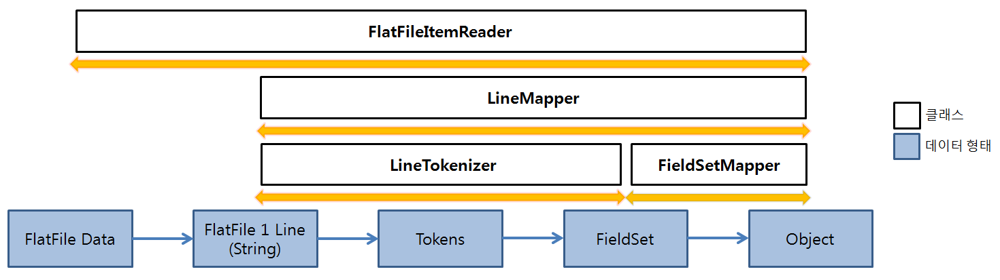
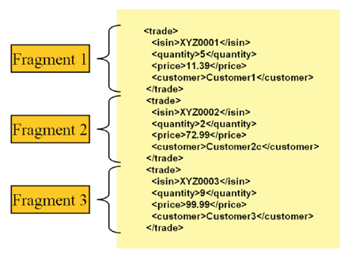
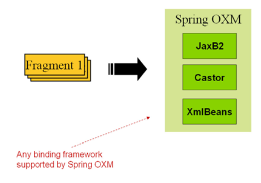
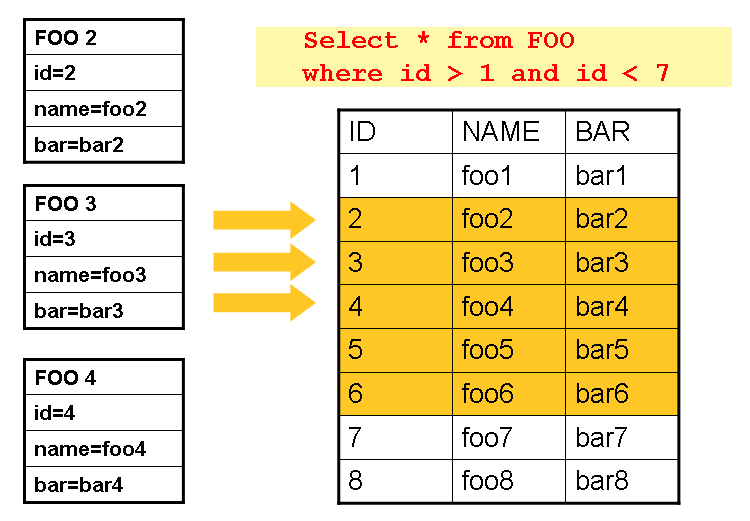
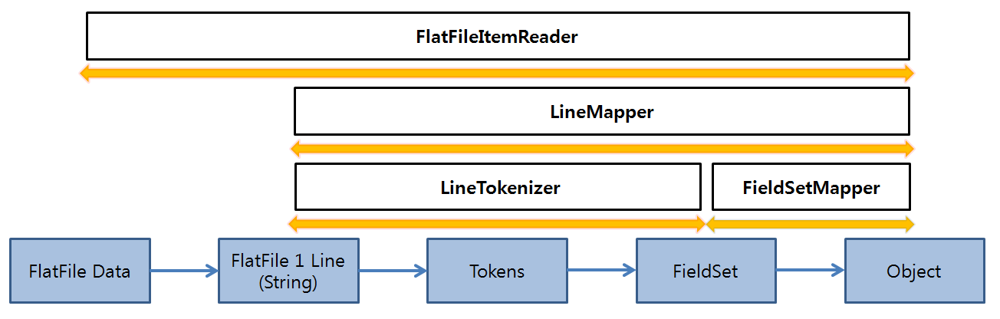
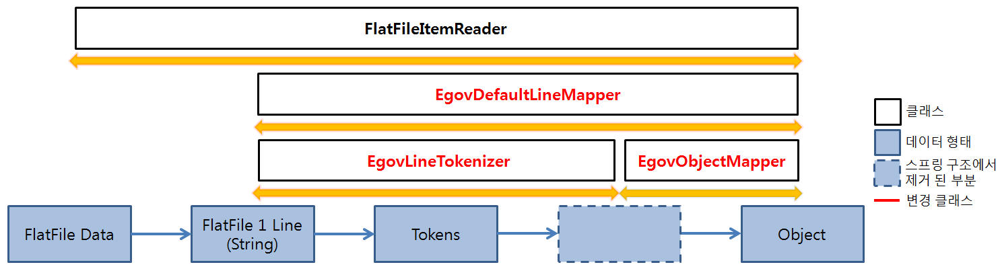
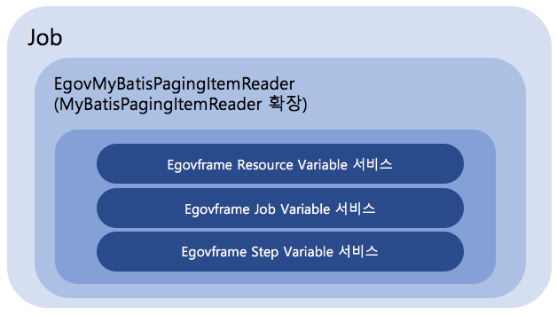

# ItemReader

## 개요
ItemReader는 읽기 대상의 타입에 관계없이 한번에 한 항목을 읽으며 읽을 항목이 모두 소진되면 Null을 반환하는 인터페이스이다.

## 설명
ItemReader는 여러 종류의 데이터 타입을 입력 받을 수 있다. 가장 일반적인 데이터 타입으로 플랫 파일, <Acronym title="Extensible Markup Language">XML</Acronym>, 데이터베이스가 있다.
- 플랫 파일 : 플랫 파일 ItemReader는 일반적으로 고정 위치로 정의된 데이터 필드나 특수 문자에 의해 구별된 데이터의 행을 읽는다.
- XML : XML ItemReader는 파싱, 매핑, 유효성 검증을 XML에서 독립적으로 작업할 수 있도록 처리해준다. 입력 데이터는 <acronym title="XML (Extensible Markup Language) Schema Definition">XSD</acronym> 스키마에 대해 XML 파일의 유효성 검증이 가능하다.
- 데이터베이스 : 데이터베이스 ItemReader는 데이터베이스 리소스에 객체로 맵핑 될 수 있는 resultset으로 반환하여 접근한다. 기본 <acronym title="Structured Query Language">SQL</acronym> ItemReaders는 객체를 반환하는 RowMapper를 호출한다.
  
기본적인 ItemReader 인터페이스는 아래와 같다.

```java
public interface ItemReader<T> {
 
   T read() throws Exception, UnexpectedInputException, ParseException;
 
}
```
read() 메소드는 ItemReader의 필수적인 메소드이며 결과값으로 하나의 item을 반환하고 더이상 반환할 item이 없을 경우 null을 반환한다.
item은 플랫 파일에서의 한 라인, 데이터베이스에서의 한 행, <Acronym title="Extensible Markup Language">XML</Acronym> 파일에서의 엘리먼트를 나타낸다.

### FlatFile ItemReader
플랫파일은 2차원 데이터를 포함하는 유형의 파일이다. 스프링 배치 프레임워크에서는 플랫파일을 읽고 파싱하는 기본적인 기능을 제공하는 FlatFileItemReader 클래스를 통해 플랫파일에 대한 읽기 처리를 한다.

#### FlatFileItemReader
FlatFileItemReader는 Resource, LineMapper, FieldSetMapper, LineTokenizer에 기본적으로 의존성을 갖으며, LineTokenizer에 따라 구분자(Delimited)와 고정길이(Fixed Length) 방식으로 FlatFileItemReader를 사용할 수 있다.



| 구분             | 데이터 형태                     | 설명                                                                                                                                                                                                                                                                                                                                                                              |
| -------------- | -------------------------- | ------------------------------------------------------------------------------------------------------------------------------------------------------------------------------------------------------------------------------------------------------------------------------------------------------------------------------------------------------------------------------- |
| LineMapper     | 플랫파일 1 라인(String) → Object | 플랫파일 데이터에서 읽은 1 라인(String)을 Object로 변환하는 총 과정(LineTokenizer, FieldSetMapper 과정을 포함한다.)                                                                                                                                                                                                                                                                                          |
| LineTokenizer  | String → Tokens → FieldSet | 플랫파일에서 읽은 1 라인(String)을 구분자 방식 또는 고정길이 방식으로 토크나이징 한 후 FieldSet 형태로 변환하는 과정<br>\- **DelimitedLineTokenizer (구분자)** : 1 라인의 String을 구분자 기준으로 나누어 토큰화 하는 방식<br>\- **EgovEscapableDelimitedLineTokenizer** : Escape 문자를 사용하여 Delimiter(구분자) 문자를 문자열에 추가할 수 있는 방식 (예: 1”,000원 → 1,000원 으로 인식)<br>\- **FixedLengthTokenizer (고정길이)** : 1 라인의 String을 사용자가 설정한 고정길이 기준으로 나누어 토큰화 하는 방식 |
| FieldSetMapper | FieldSet → Object          | FieldSet 형태의 데이터를 원하는 Object로 변환하는 과정                                                                                                                                                                                                                                                                                                                                           |

아래 Delimited(구분자), Fixed Length(고정길이) 방식으로 설정한 FlatFileItemReader의 예시를 통해 FlatFileItemReader, LineMapper, LineTokenizer, FieldSetMapper의 의존 관계를 볼 수 있다.

<table class="inline">
	<tbody><tr class="row0">
		<th class="col0 centeralign">  Tokenizing 방식  </th><th class="col1 centeralign">  설정  </th>
	</tr>
	<tr class="row1">
		<th class="col0"> Delimited (구분자) </th><td class="col1"> <pre class="code xml"><span class="sc3"><span class="re1">&lt;bean</span> <span class="re0">id</span>=<span class="st0">"itemReader"</span> <span class="re0">class</span>=<span class="st0">"org.springframework.batch.item.file.FlatFileItemReader"</span> <span class="re0">scope</span>=<span class="st0">"step"</span><span class="re2">&gt;</span></span>
	<span class="sc3"><span class="re1">&lt;property</span> <span class="re0">name</span>=<span class="st0">"resource"</span> <span class="re0">value</span>=<span class="st0">"#{jobParameters[inputFile]}"</span> <span class="re2">/&gt;</span></span>
	<span class="sc3"><span class="re1">&lt;property</span> <span class="re0">name</span>=<span class="st0">"lineMapper"</span><span class="re2">&gt;</span></span>
		<span class="sc3"><span class="re1">&lt;bean</span> <span class="re0">class</span>=<span class="st0">"org.springframework.batch.item.file.mapping.DefaultLineMapper"</span><span class="re2">&gt;</span></span>
			<span class="sc3"><span class="re1">&lt;property</span> <span class="re0">name</span>=<span class="st0">"lineTokenizer"</span><span class="re2">&gt;</span></span>
				<span class="sc3"><span class="re1">&lt;bean</span> <span class="re0">class</span>=<span class="st0">"org.springframework.batch.item.file.transform.DelimitedLineTokenizer"</span><span class="re2">&gt;</span></span>
					<span class="sc3"><span class="re1">&lt;property</span> <span class="re0">name</span>=<span class="st0">"delimiter"</span> <span class="re0">value</span>=<span class="st0">","</span><span class="re2">/&gt;</span></span>
					<span class="sc3"><span class="re1">&lt;property</span> <span class="re0">name</span>=<span class="st0">"names"</span> <span class="re0">value</span>=<span class="st0">"name,credit"</span> <span class="re2">/&gt;</span></span>
				<span class="sc3"><span class="re1">&lt;/bean<span class="re2">&gt;</span></span></span>
			<span class="sc3"><span class="re1">&lt;/property<span class="re2">&gt;</span></span></span>
			<span class="sc3"><span class="re1">&lt;property</span> <span class="re0">name</span>=<span class="st0">"fieldSetMapper"</span><span class="re2">&gt;</span></span>
				<span class="sc3"><span class="re1">&lt;bean</span> <span class="re0">class</span>=<span class="st0">"org.springframework.batch.item.file.mapping.BeanWrapperFieldSetMapper"</span><span class="re2">&gt;</span></span>
					<span class="sc3"><span class="re1">&lt;property</span> <span class="re0">name</span>=<span class="st0">"targetType"</span> <span class="re0">value</span>=<span class="st0">"org.springframework.batch.CustomerCredit"</span> <span class="re2">/&gt;</span></span>	
				<span class="sc3"><span class="re1">&lt;/bean<span class="re2">&gt;</span></span></span>
			<span class="sc3"><span class="re1">&lt;/property<span class="re2">&gt;</span></span></span>
		<span class="sc3"><span class="re1">&lt;/bean<span class="re2">&gt;</span></span></span>
	<span class="sc3"><span class="re1">&lt;/property<span class="re2">&gt;</span></span></span>
<span class="sc3"><span class="re1">&lt;/bean<span class="re2">&gt;</span></span></span></pre></td>
	</tr>
	<tr class="row2">
		<th class="col0 centeralign">  Tokenizing 방식  </th><th class="col1 centeralign">  설정  </th>
	</tr>
	<tr class="row3">
		<th class="col0"> EscapableDelimited </th><td class="col1"> <pre class="code xml"><span class="sc3"><span class="re1">&lt;</span><span class="re1">&lt;bean</span> <span class="re0">id</span>=<span class="st0">"delimitedToDelimitedJob-EscapeCharacter-delimitedItemReader"</span> <span class="re0">class</span>=<span class="st0">"org.springframework.batch.item.file.FlatFileItemReader"</span> <span class="re0">scope</span>=<span class="st0">"step"</span><span class="re2">&gt;</span></span>		
	<span class="sc3"><span class="re1">&lt;property</span> <span class="re0">name</span>=<span class="st0">"resource"</span> <span class="re0">value</span>=<span class="st0">"#{jobParameters[inputFile]}"</span> <span class="re2">/&gt;</span></span>
	<span class="sc3"><span class="re1">&lt;property</span> <span class="re0">name</span>=<span class="st0">"lineMapper"</span><span class="re2">&gt;</span></span>
		<span class="sc3"><span class="re1">&lt;bean</span> <span class="re0">class</span>=<span class="st0">"egovframework.rte.bat.core.item.file.mapping.EgovDefaultLineMapper"</span><span class="re2">&gt;</span></span>
			<span class="sc3"><span class="re1">&lt;property</span> <span class="re0">name</span>=<span class="st0">"lineTokenizer"</span><span class="re2">&gt;</span></span>
			<span class="sc3"><span class="re1">&lt;bean</span> <span class="re0">class</span>=<span class="st0">"egovframework.rte.bat.core.item.file.transform.EgovEscapableDelimitedLineTokenizer"</span><span class="re2">&gt;</span></span>
				<span class="sc3"><span class="re1">&lt;property</span> <span class="re0">name</span>=<span class="st0">"delimiter"</span> <span class="re0">value</span>=<span class="st0">","</span> <span class="re2">/&gt;</span></span>
				<span class="sc3"><span class="re1">&lt;property</span> <span class="re0">name</span>=<span class="st0">"escape"</span> <span class="re0">value</span>=<span class="st0">"true"</span> <span class="re2">/&gt;</span></span>
				<span class="sc3"><span class="re1">&lt;property</span> <span class="re0">name</span>=<span class="st0">"quoteCharacter"</span> <span class="re0">value</span>=<span class="st0">"&amp;quot;"</span> <span class="re2">/&gt;</span></span>						
			<span class="sc3"><span class="re1">&lt;/bean<span class="re2">&gt;</span></span></span>
			<span class="sc3"><span class="re1">&lt;/property<span class="re2">&gt;</span></span></span>
			<span class="sc3"><span class="re1">&lt;property</span> <span class="re0">name</span>=<span class="st0">"objectMapper"</span><span class="re2">&gt;</span></span>
				<span class="sc3"><span class="re1">&lt;bean</span> <span class="re0">class</span>=<span class="st0">"egovframework.rte.bat.core.item.file.mapping.EgovObjectMapper"</span><span class="re2">&gt;</span></span>
					<span class="sc3"><span class="re1">&lt;property</span> <span class="re0">name</span>=<span class="st0">"type"</span> <span class="re0">value</span>=<span class="st0">"egovframework.example.bat.domain.trade.CustomerCreditMore"</span> <span class="re2">/&gt;</span></span>
					<span class="sc3"><span class="re1">&lt;property</span> <span class="re0">name</span>=<span class="st0">"names"</span> <span class="re0">value</span>=<span class="st0">"id,name,credit,serial,tax,amount,createDate,changeDate"</span> <span class="re2">/&gt;</span></span>
				<span class="sc3"><span class="re1">&lt;/bean<span class="re2">&gt;</span></span></span>
			<span class="sc3"><span class="re1">&lt;/property<span class="re2">&gt;</span></span></span>
		<span class="sc3"><span class="re1">&lt;/bean<span class="re2">&gt;</span></span></span>
	<span class="sc3"><span class="re1">&lt;/property<span class="re2">&gt;</span></span></span>
<span class="sc3"><span class="re1">&lt;/bean<span class="re2">&gt;</span></span></span></pre></td>
	</tr>
	<tr class="row4">
		<th class="col0"> Fixed Length (고정길이) </th><td class="col1"> <pre class="code xml"><span class="sc3"><span class="re1">&lt;bean</span> <span class="re0">id</span>=<span class="st0">"itemReader"</span> <span class="re0">class</span>=<span class="st0">"org.springframework.batch.item.file.FlatFileItemReader"</span> <span class="re0">scope</span>=<span class="st0">"step"</span><span class="re2">&gt;</span></span>
	<span class="sc3"><span class="re1">&lt;property</span> <span class="re0">name</span>=<span class="st0">"resource"</span> <span class="re0">value</span>=<span class="st0">"#{jobParameters[inputFile]}"</span> <span class="re2">/&gt;</span></span>
	<span class="sc3"><span class="re1">&lt;property</span> <span class="re0">name</span>=<span class="st0">"lineMapper"</span><span class="re2">&gt;</span></span>
		<span class="sc3"><span class="re1">&lt;bean</span> <span class="re0">class</span>=<span class="st0">"org.springframework.batch.item.file.mapping.DefaultLineMapper"</span><span class="re2">&gt;</span></span>
			<span class="sc3"><span class="re1">&lt;property</span> <span class="re0">name</span>=<span class="st0">"lineTokenizer"</span><span class="re2">&gt;</span></span>
				<span class="sc3"><span class="re1">&lt;bean</span> <span class="re0">class</span>=<span class="st0">"org.springframework.batch.item.file.transform.FixedLengthTokenizer"</span><span class="re2">&gt;</span></span>
					<span class="sc3"><span class="re1">&lt;property</span> <span class="re0">name</span>=<span class="st0">"columns"</span> <span class="re0">value</span>=<span class="st0">"1-9,10-11"</span> <span class="re2">/&gt;</span></span>
					<span class="sc3"><span class="re1">&lt;property</span> <span class="re0">name</span>=<span class="st0">"names"</span> <span class="re0">value</span>=<span class="st0">"name,credit"</span> <span class="re2">/&gt;</span></span>
				<span class="sc3"><span class="re1">&lt;/bean<span class="re2">&gt;</span></span></span>
			<span class="sc3"><span class="re1">&lt;/property<span class="re2">&gt;</span></span></span>
			<span class="sc3"><span class="re1">&lt;property</span> <span class="re0">name</span>=<span class="st0">"fieldSetMapper"</span><span class="re2">&gt;</span></span>
				<span class="sc3"><span class="re1">&lt;bean</span> <span class="re0">class</span>=<span class="st0">"org.springframework.batch.item.file.mapping.BeanWrapperFieldSetMapper"</span><span class="re2">&gt;</span></span>
					<span class="sc3"><span class="re1">&lt;property</span> <span class="re0">name</span>=<span class="st0">"targetType"</span> <span class="re0">value</span>=<span class="st0">"org.springframework.batch.CustomerCredit"</span> <span class="re2">/&gt;</span></span>	
				<span class="sc3"><span class="re1">&lt;/bean<span class="re2">&gt;</span></span></span>
			<span class="sc3"><span class="re1">&lt;/property<span class="re2">&gt;</span></span></span>
		<span class="sc3"><span class="re1">&lt;/bean<span class="re2">&gt;</span></span></span>
	<span class="sc3"><span class="re1">&lt;/property<span class="re2">&gt;</span></span></span>
<span class="sc3"><span class="re1">&lt;/bean<span class="re2">&gt;</span></span></span></pre></td>
	</tr>
</tbody></table>

LineTokenizer와 FieldSetMapper에 아래와 같은 항목을 설정해야한다.

| 설정항목       | 내용                        |
| ---------- | ------------------------- |
| targetType | VO 클래스를 나타낸다.             |
| names      | VO 클래스의 필드를 나타낸다.<br><br> |

✔ 사용하는 LineTokenizer에 따라 설정항목이 다르므로 주의하여 설정해야 한다.

| LineTokenizer                       | 설정항목           | 설명                       | 설정 예                                                 |
| ----------------------------------- | -------------- | ------------------------ | ---------------------------------------------------- |
| DelimitedLineTokenizer              | delimiter      | 토크나이징 할 때 기준이 되는 구분자 설정  | ,                                                    |
| EgovEscapableDelimitedLineTokenizer | delimiter      | 토크나이징 할 때 기준이 되는 구분자 설정  | ,                                                    |
|                                     | escape         | Escape 문자 사용 설정          | true 또는 false                                        |
|                                     | quoteCharacter | 사용 할 Escape 문자 설정        | 쌍따움표(”, &quot;)<br>XML escape문자로 인하여 쌍따움표는 &quot; 표시 |
| FixedLengthTokenizer                | columns        | 토크나이징 할 때 기준이 되는 고정길이 설정 | 1-9,10-11                                            |

### XML ItemReader
스프링 배치는 XML 레코드를 읽고 자바 객체로 매핑하는 작업에 대해 트랜잭션 인프라스트럭쳐를 제공한다.
스프링 배치에서 XML 입력과 출력이 어떻게 작동되는지 더 살펴보면 첫째로 파일 읽기 및 쓰기에 따라 차이가 있지만 스프링 배치 XML 처리 과정은 공통화 돼있다. XML 처리 과정에서 토크나이징이 필요한 레코드(FieldSets) 라인 대신 개별 레코드와 대응되는 'fragments'의 콜렉션으로 가정하고 있다.



위의 시나리오에서 'trade' 태그는 '루트 엘리먼트'로 정의 되었다. '\<trade>'와 '\</trade>' 사이의 모든 내용은 하나의 fragment로 여겨진다. 스프링 배치는 fragment를 객체로 바인드 하는데 Object/XML Mapping (OXM)을 사용한다. 하지만 스프링 배치는 특정 XML 바인딩 기술에 묶여있지 않다. 대표적인 사용방법은 가장 대중적인 OXM 기술에 대한 일관된 추상화를 제공하는 스프링 OXM에 위임하는 방법이다. 스프링 OXM에 대한 의존성은 선택적이며 만일 필요하다면 스프링 배치에서 특정 인터페이스를 구현하도록 선택할 수 있다. XML 지원 관련 기술 관계는 아래 그림과 같다.



#### StaxEventItemReader
StaxEventItemReader 설정은 XML 입력 스트림에서 레코드의 처리를 위한 전형적인 설정을 제공한다. 먼저, StaxEventItemReader가 처리할 수 있는 XML 레코드 집합을 검토해보자.

```xml
<?xml version="1.0" encoding="UTF-8"?>
<records>
   <trade xmlns="http://springframework.org/batch/sample/io/oxm/domain">
      <isin>XYZ0001</isin>
      <quantity>5</quantity>
      <price>11.39</price>
      <customer>Customer1</customer>
   </trade>
   <trade xmlns="http://springframework.org/batch/sample/io/oxm/domain">
      <isin>XYZ0002</isin>
      <quantity>2</quantity>
      <price>72.99</price>
      <customer>Customer2c</customer>
   </trade>
   <trade xmlns="http://springframework.org/batch/sample/io/oxm/domain">
      <isin>XYZ0003</isin>
      <quantity>9</quantity>
      <price>99.99</price>
      <customer>Customer3</customer>
   </trade>
</records>
```

XML 레코드를 처리하기 위해서는 다음 사항이 필요하다.
- 루트 엘리먼트 명 : 매핑되는 객체를 구성하는 fragment의 루트 엘리먼트 명. 위의 예에서는 trade가 루트 엘리먼트 명이다.
- Resource : 읽어들일 데이터의 위치를 지정(파일이나 URL 등)
- FragmentDeserializer : XML fragment를 객체로 매핑하는 스프링 OXM에 의해 제공된 언마샬링 기능
  
```xml
<bean id="itemReader" class="org.springframework.batch.item.xml.StaxEventItemReader">
   <property name="fragmentRootElementName" value="trade" />
   <property name="resource" value="data/iosample/input/input.xml" />
   <property name="unmarshaller" ref="tradeMarshaller" />
</bean>
```

아래 예제에서는 XStreamMarshaller를 사용한다. XStreamMarshaller는 fragment 명과 객체 타입을 바인드 해주기 위해 사용하는 별칭을 키와 값을 포함하는 맵으로 건내주도록 했다. 그 다음 FieldSet과 비슷하게 맵에 엘리먼트 이름과 타입이 키/값 쌍으로 들어가게 된다. 다음처럼 설정 파일에서 필요한 별칭을 기술하는데 스프링 설정 유틸리티를 사용할 수 있다.

```xml
<bean id="tradeMarshaller" class="org.springframework.oxm.xstream.XStreamMarshaller">
   <property name="aliases">
      <util:map id="aliases">
         <entry key="trade" value="org.springframework.batch.sample.domain.Trade" />
         <entry key="price" value="java.math.BigDecimal" />
         <entry key="name" value="java.lang.String" />
      </util:map>
   </property>
</bean>
```

입력 리더는 (기본적으로 태그 이름의 일치에 의해서) 새로운 프레그먼트가 시작하는 것을 인식할 때까지 XML 자원을 읽어 들인다. 리더는 프레그먼트에서 독립적으로 작동하는 XML 문서를 생성하고, XML을 자바 객체로 매핑하기 위해 deserializer에게 이 문서를 전달한다. 정리해보면,

```java
StaxEventItemReader xmlStaxEventItemReader = new StaxEventItemReader()
Resource resource = new ByteArrayResource(xmlResource.getBytes())
 
Map aliases = new HashMap();
aliases.put("trade","org.springframework.batch.sample.domain.Trade");
aliases.put("price","java.math.BigDecimal");
aliases.put("customer","java.lang.String");
Marshaller marshaller = new XStreamMarshaller();
marshaller.setAliases(aliases);
xmlStaxEventItemReader.setUnmarshaller(marshaller);
xmlStaxEventItemReader.setResource(resource);
xmlStaxEventItemReader.setFragmentRootElementName("trade");
xmlStaxEventItemReader.open(new ExecutionContext());
 
boolean hasNext = true
 
CustomerCredit credit = null;
 
while (hasNext) {
   credit = xmlStaxEventItemReader.read();
   if (credit == null) {
      hasNext = false;
   }
   else {
      System.out.println(credit);
   }
}
```

### Database ItemReader
대부분의 엔터프라이즈 애플리케이션처럼 데이터베이스는 배치 저장 메카니즘의 중심이 된다. 그러나 배치는 다른 애플리케이션 스타일과는 다르다. 만일 SQL 문이 백만 행을 반환하는 경우에 결과 집합은 모든 행을 읽을 때까지 메모리에 모든 결과를 보유한다. 스프링 배치는 이 문제를 해결하기 위해 Cursor와 Paging 데이터베이스 ItemReader를 제공한다.

#### 커서(Cursor) 기반 ItemReader
커서 방식을 이용한 데이터베이스 접근 방식은 가장 기본적인 방식이다. 왜냐하면 'streaming' 관계형 데이터의 문제에 대한 해결책이기 때문이다.
Java의 ResultSet 클래스는 커서를 다루는 객체 지향 메커니즘의 필수적인 클래스이다. ResultSet은 데이터의 현재 행에 커서를 유지하며 다음 데이터를 호출하면 다음 행으로 커서를 이동한다.
스프링 배치에서 커서는 커서를 초기화해서 열어주는 ItemReader에 기반하며, read가 호출될 떄마다 커서를 다음 행으로 이동시키며 처리 과정 중에 사용되는 맵핑된 객체를 반환한다.

아래 그림의 예제는 커서 기반의 ItemReader의 작동을 보여준다.
'FOO' 테이블은 ID, NAME, BAR 세 개의 컬럼을 갖는다. SQL문을 통해 ID가 1보다 크고 7보다 작은 행의 결과를 조회한다. 커서는 ID 2에서 시작하며 read()가 호출될 떄마다 FOO 객체로 맵핑되고 커서는 다음 행으로 이동한다.



##### JdbcCursorItemReader
JdbcCursorItemReader는 커서 기반 기술의 JDBC를 구현한 ItemReader이다. 아래의 JdbcCursorItemReader의 설정 예시를 보면 굉장히 쉽게할 수 있음을 알 수 있다.
dataSouce 속성으로 DB connection을 넣어올 수 있는 datasource를 지정하고, sql 속성에 실행할 쿼리, rowMapper 속성에 ResultSet에서 객체를 매핑하는 클래스로 RowMapper 인터페이스를 구현한 클래스가 필요하다.

```xml
<bean id="itemReader" class="org.springframework.batch.item.database.JdbcCursorItemReader">
   <property name="dataSource" ref="dataSource"/>
   <property name="sql" value="select ID, NAME, CREDIT from CUSTOMER"/>
   <property name="rowMapper">
      <bean class="egovframework.brte.sample.domain.trade.CustomerCreditRowMapper"/>
   </property>
</bean>
```

#### 페이징(Paging) 기반 ItemReader
데이터베이스 커서를 사용하는 대신 여러번 쿼리를 실행할 수 있는데 실행되는 각 쿼리는 정해진 크기인 페이지만큼의 결과를 가져오게 된다.
실행되는 각 쿼리는 시작 행 번호를 지정하고 페이지에 반환시키고자 하는 행의 수를 지정한 후 사용한다.

##### JdbcPagingItemReader
페이징 ItemReader의 구현체 중 하나인 JdbcPagingItemReader는 페이지를 형성하는 행을 반환하는데 사용하는 SQL 쿼리를 제공할 책임을 지고 있는 PagingQueryProvider 인터페이스가 필요하다.
데이터베이스 유형 별로 지원하는 OraclePagingQueryProvider, HsqlPagingQueryProvider, MySqlPagingQueryProvider ,SqlServerPagingQueryProvider,SybasePagingQueryProvider 등의 구현를 사용하지만 데이터베이스를 자동으로 식별해주고 적절한 PagingQueryProvider 구현체를 적용해주는데 사용하는 SqlPagingQueryProviderFactoryBean이 있다.
SqlPagingQueryProviderFactoryBean는 환경 설정을 간단히 해주며 추천하는 구현체이다.

아래 예제는 위의 JdbcCursorItemReader 설정과 동일한 설정이다.

```xml
<bean id="itemReader" class="org.springframework.batch.item.database.JdbcPagingItemReader">
   <property name="dataSource" ref="dataSource"/>
   <property name="queryProvider">
      <bean class="org.springframework.batch.item.database.support.SqlPagingQueryProviderFactoryBean">
         <property name="dataSource" ref="dataSource" />
         <property name="selectClause" value="select id, name, credit"/>
         <property name="fromClause" value="from customer"/>
         <property name="whereClause" value="where status=:status"/>
         <property name="sortKey" value="id"/>
      </bean>
   </property>
   <property name="parameterValues">
      <map>
         <entry key="status" value="NEW"/>
      </map>
   </property>
   <property name="pageSize" value="1000"/>
   <property name="rowMapper" ref="customerMapper"/>
</bean>
```

##### IbatisPagingItemReader
iBatis를 사용해 데이터에 접근하는 경우 페이징 ItemReader를 구현한 IbatisPagingItemReader를 사용할 수 있다.
iBatis는 페이지의 행을 읽을 수 있는 직접적인 지원은 하지 않지만 여러 표준화된 변수를 이용해여 쿼리를 추가할 수 있다.

아래 설정은 위에서 설명한 JdbcCursorItemReader, JdbcCursorItemReader 설정과 같은 설정을 보여준다.

```xml
<bean id="itemReader" class="org.springframework.batch.item.database.IbatisPagingItemReader">
   <property name="sqlMapClient" ref="sqlMapClient"/>
   <property name="queryId" value="getPagedCustomerCredits"/>
   <property name="pageSize" value="1000"/>
</bean>
```

위의 IbatisPagingItemReader 설정에서 사용한 queryId 속성의 “getPagedCustomerCredits”의 구성은 아래와 같다.
ex) MySQL

```xml
<select id="getPagedCustomerCredits" resultMap="customerCreditResult">
   select id, name, credit from customer order by id asc LIMIT #_skiprows#, #_pagesize#
</select>
```

### 전자정부에서 제공하는 eGovFlatFileItemReader
스프링 배치에서 제공하는 파일 기반 관련설정을 사용할 경우, 대용량 데이터 처리 시간이 상용 배치프레임워크 대비 성능이 떨어졌다.
이 문제를 해결하기 위해서 전자정부에서는 파일 ItemReader의 요소 중 성능저하 요인인 LineMapper 부분을 개선하여 제공한다.

아래 그림을 보면 전자정부에서는 FieldSet을 사용하지 않는다. 따라서 Tokens → FieldSet으로 변환하는 과정이 없다.
전자정부에서 제공하는 EgovDefaultLineMapper, EgovLineTokenizer, EgovObjectMapper를 사용하는 경우 Tokens 상태에서 Object로 직접 맵핑된다.
|스프링 FlatFileItemReader 구조 |전자정부 eGovFlatFileItemReader 구조|
|---|---|
|||

| 개선사항                       | 설명                                                                                                                  |
| -------------------------- | ------------------------------------------------------------------------------------------------------------------- |
| EgovDefaultLineMapper      | EgovLineTokenizer와 EgovObjectMapper가 변경됨에 따라 LineMapper 총 과정을 제어하는 DefaultLineMapper를 변경하여 EgovDefaultLineMapper 제공 |
| EgovLineTokenizer          | 전자정부에서는 FieldSet을 사용하지 않기때문에 FieldSet을 반환하는 LineTokenizer 인터페이스를 변경하여 EgovLineTokenizer 제공                          |
| EgovAbstractLineTokenizer  | LineTokenizer 인터페이스가 EgovLineTokenizer로 변경됨에 따라 토크나이징만 관여하는 추상 클래스 EgovAbstractLineTokenizer 제공                     |
| EgovDelimitedLineTokenizer | 스프링에서 제공하는 DelimitedLineTokenizer의 성능을 개선한 EgovDelimitedLineTokenizer 제공                                            |
| EgovObjectMapper           | 전자정부에서는 FieldSet을 사용하지 않고 토크나이징 된 값들을 직접 Object에 맵핑하는 EgovObjectMapper를 제공                                          |

아래의 XML 설정은 스프링에서 제공하는 DefaultLineMapper를 적용한 FlatFileItemReader와 전자정부에서 제공하는 EgovDefaultLineMapper를 적용한 FlatFileItemReader 설정 비교이다.

**✔ 주의!** EgovDefaultLineMapper 사용 시, 반드시 EgovTokenizer(EgovFixedLengthTokenizer, EgovByteLengthTokenizer, EgovDelimitedTokenizer)와 EgovObjectMapper를 사용해야 한다.

**✔ 주의!** EgovObjectMapper 사용 시, VO 필드 타입은 String, int, double, float, long, char, boolean, short, BigDecimal로 제한된다.

**✔ 주의!** 스프링의 DefaultLineMapper 사용 시, Tokenizer에서 'names' 속성을 설정하지만 전자정부의 EgovDefaultLineMapper 사용 시, **EgovObjectMapper**에서 **'names' 속성을 설정한다.**

#### EgovObjectMapper 설정항목
##### Delimited(구분자) 방식 설정

읽어들인 문자열에서 구분자를 경계값으로 사용하여 필드를 분리한다.
<table class="inline">
	<tbody><tr class="row0">
		<th class="col0 centeralign">  구분  </th><th class="col1 centeralign">  설정  </th>
	</tr>
	<tr class="row1">
		<th class="col0"> 스프링 FlatFileItemReader </th><td class="col1"><pre class="code xml"><span class="sc3"><span class="re1">&lt;bean</span> <span class="re0">id</span>=<span class="st0">"itemReader"</span> <span class="re0">class</span>=<span class="st0">"org.springframework.batch.item.file.FlatFileItemReader"</span> <span class="re0">scope</span>=<span class="st0">"step"</span><span class="re2">&gt;</span></span>
    <span class="sc3"><span class="re1">&lt;property</span> <span class="re0">name</span>=<span class="st0">"resource"</span> <span class="re0">value</span>=<span class="st0">"#{jobParameters[inputFile]}"</span> <span class="re2">/&gt;</span></span>
    <span class="sc3"><span class="re1">&lt;property</span> <span class="re0">name</span>=<span class="st0">"lineMapper"</span><span class="re2">&gt;</span></span>
        <span class="sc3"><span class="re1">&lt;bean</span> <span class="re0">class</span>=<span class="st0">"org.springframework.batch.item.file.mapping.DefaultLineMapper"</span><span class="re2">&gt;</span></span>
	     <span class="sc3"><span class="re1">&lt;property</span> <span class="re0">name</span>=<span class="st0">"lineTokenizer"</span><span class="re2">&gt;</span></span>
		  <span class="sc3"><span class="re1">&lt;bean</span> <span class="re0">class</span>=<span class="st0">"org.springframework.batch.item.file.transform.DelimitedLineTokenizer"</span><span class="re2">&gt;</span></span>
		       <span class="sc3"><span class="re1">&lt;property</span> <span class="re0">name</span>=<span class="st0">"delimiter"</span> <span class="re0">value</span>=<span class="st0">","</span><span class="re2">/&gt;</span></span>
		       <span class="sc3"><span class="re1">&lt;property</span> <span class="re0">name</span>=<span class="st0">"names"</span> <span class="re0">value</span>=<span class="st0">"name,credit"</span> <span class="re2">/&gt;</span></span>
		  <span class="sc3"><span class="re1">&lt;/bean<span class="re2">&gt;</span></span></span>
	     <span class="sc3"><span class="re1">&lt;/property<span class="re2">&gt;</span></span></span>
	     <span class="sc3"><span class="re1">&lt;property</span> <span class="re0">name</span>=<span class="st0">"fieldSetMapper"</span><span class="re2">&gt;</span></span>
		  <span class="sc3"><span class="re1">&lt;bean</span> <span class="re0">class</span>=<span class="st0">"org.springframework.batch.item.file.mapping.BeanWrapperFieldSetMapper"</span><span class="re2">&gt;</span></span>
		       <span class="sc3"><span class="re1">&lt;property</span> <span class="re0">name</span>=<span class="st0">"targetType"</span> <span class="re0">value</span>=<span class="st0">"egovframework.brte.sample.domain.trade.CustomerCredit"</span> <span class="re2">/&gt;</span></span>	
		  <span class="sc3"><span class="re1">&lt;/bean<span class="re2">&gt;</span></span></span>
	     <span class="sc3"><span class="re1">&lt;/property<span class="re2">&gt;</span></span></span>
	<span class="sc3"><span class="re1">&lt;/bean<span class="re2">&gt;</span></span></span>
    <span class="sc3"><span class="re1">&lt;/property<span class="re2">&gt;</span></span></span>
<span class="sc3"><span class="re1">&lt;/bean<span class="re2">&gt;</span></span></span></pre></td>
	</tr>
	<tr class="row2">
		<th class="col0"> 전자정부 EgovFlatFileItemReader</th><td class="col1"> <pre class="code xml"><span class="sc3"><span class="re1">&lt;bean</span> <span class="re0">id</span>=<span class="st0">"itemReader"</span> <span class="re0">class</span>=<span class="st0">"org.springframework.batch.item.file.FlatFileItemReader"</span> <span class="re0">scope</span>=<span class="st0">"step"</span><span class="re2">&gt;</span></span>
     <span class="sc3"><span class="re1">&lt;property</span> <span class="re0">name</span>=<span class="st0">"resource"</span> <span class="re0">value</span>=<span class="st0">"#{jobParameters[inputFile]}"</span> <span class="re2">/&gt;</span></span>
     <span class="sc3"><span class="re1">&lt;property</span> <span class="re0">name</span>=<span class="st0">"lineMapper"</span><span class="re2">&gt;</span></span>
          <span class="sc3"><span class="re1">&lt;bean</span> <span class="re0">class</span>=<span class="st0">"egovframework.brte.core.item.file.mapping.EgovDefaultLineMapper"</span><span class="re2">&gt;</span></span>
              <span class="sc3"><span class="re1">&lt;property</span> <span class="re0">name</span>=<span class="st0">"lineTokenizer"</span><span class="re2">&gt;</span></span>
                  <span class="sc3"><span class="re1">&lt;bean</span> <span class="re0">class</span>=<span class="st0">"egovframework.brte.core.item.file.transform.EgovDelimitedLineTokenizer"</span><span class="re2">&gt;</span></span>
                      <span class="sc3"><span class="re1">&lt;property</span> <span class="re0">name</span>=<span class="st0">"delimiter"</span> <span class="re0">value</span>=<span class="st0">","</span><span class="re2">/&gt;</span></span>
                  <span class="sc3"><span class="re1">&lt;/bean<span class="re2">&gt;</span></span></span>
              <span class="sc3"><span class="re1">&lt;/property<span class="re2">&gt;</span></span></span>
              <span class="sc3"><span class="re1">&lt;property</span> <span class="re0">name</span>=<span class="st0">"objectMapper"</span><span class="re2">&gt;</span></span>
                  <span class="sc3"><span class="re1">&lt;bean</span> <span class="re0">class</span>=<span class="st0">"egovframework.brte.core.item.file.mapping.EgovObjectMapper"</span><span class="re2">&gt;</span></span>
                      <span class="sc3"><span class="re1">&lt;property</span> <span class="re0">name</span>=<span class="st0">"type"</span> <span class="re0">value</span>=<span class="st0">"egovframework.brte.sample.domain.trade.CustomerCredit"</span> <span class="re2">/&gt;</span></span>
                      <span class="sc3"><span class="re1">&lt;property</span> <span class="re0">name</span>=<span class="st0">"names"</span> <span class="re0">value</span>=<span class="st0">"name,credit"</span> <span class="re2">/&gt;</span></span>
                  <span class="sc3"><span class="re1">&lt;/bean<span class="re2">&gt;</span></span></span>
              <span class="sc3"><span class="re1">&lt;/property<span class="re2">&gt;</span></span></span>        
          <span class="sc3"><span class="re1">&lt;/bean<span class="re2">&gt;</span></span></span>
     <span class="sc3"><span class="re1">&lt;/property<span class="re2">&gt;</span></span></span> 
<span class="sc3"><span class="re1">&lt;/bean<span class="re2">&gt;</span></span></span></pre></td>
	</tr>
</tbody></table>

| EgovFlatFileItemReader 설정항목 | 내용                      | 예시                                       |
| --------------------------- | ----------------------- | ---------------------------------------- |
| delimiter                   | 필드의 경계를 구별해주는 문자를 나타낸다. | , (콤마)                                   |
| type                        | VO 클래스를 나타낸다.           | org.springframework.batch.CustomerCredit |
| names                       | VO 클래스의 필드를 나타낸다.       | name,credit                              |

##### Fixed Length(고정길이) 방식 설정
읽어들인 문자열에서 필드의 경계를 파일 내의 문자열 길이로 판단하여, 필드를 분리한다.

<table class="inline">
	<tbody><tr class="row0">
		<th class="col0 centeralign">  구분  </th><th class="col1 centeralign">  설정  </th>
	</tr>
	<tr class="row1">
		<th class="col0"> 스프링 FlatFileItemReader</th><td class="col1"><pre class="code xml"><span class="sc3"><span class="re1">&lt;bean</span> <span class="re0">id</span>=<span class="st0">"itemReader"</span> <span class="re0">class</span>=<span class="st0">"org.springframework.batch.item.file.FlatFileItemReader"</span> <span class="re0">scope</span>=<span class="st0">"step"</span><span class="re2">&gt;</span></span>
    <span class="sc3"><span class="re1">&lt;property</span> <span class="re0">name</span>=<span class="st0">"resource"</span> <span class="re0">value</span>=<span class="st0">"#{jobParameters[inputFile]}"</span> <span class="re2">/&gt;</span></span>
    <span class="sc3"><span class="re1">&lt;property</span> <span class="re0">name</span>=<span class="st0">"lineMapper"</span><span class="re2">&gt;</span></span>
        <span class="sc3"><span class="re1">&lt;bean</span> <span class="re0">class</span>=<span class="st0">"org.springframework.batch.item.file.mapping.DefaultLineMapper"</span><span class="re2">&gt;</span></span>
	    <span class="sc3"><span class="re1">&lt;property</span> <span class="re0">name</span>=<span class="st0">"lineTokenizer"</span><span class="re2">&gt;</span></span>
		 <span class="sc3"><span class="re1">&lt;bean</span> <span class="re0">class</span>=<span class="st0">"org.springframework.batch.item.file.transform.FixedLengthTokenizer"</span><span class="re2">&gt;</span></span>
		     <span class="sc3"><span class="re1">&lt;property</span> <span class="re0">name</span>=<span class="st0">"columns"</span> <span class="re0">value</span>=<span class="st0">"1-9,10-11"</span> <span class="re2">/&gt;</span></span>
		     <span class="sc3"><span class="re1">&lt;property</span> <span class="re0">name</span>=<span class="st0">"names"</span> <span class="re0">value</span>=<span class="st0">"name,credit"</span> <span class="re2">/&gt;</span></span>
		 <span class="sc3"><span class="re1">&lt;/bean<span class="re2">&gt;</span></span></span>
	    <span class="sc3"><span class="re1">&lt;/property<span class="re2">&gt;</span></span></span>
	    <span class="sc3"><span class="re1">&lt;property</span> <span class="re0">name</span>=<span class="st0">"fieldSetMapper"</span><span class="re2">&gt;</span></span>
		 <span class="sc3"><span class="re1">&lt;bean</span> <span class="re0">class</span>=<span class="st0">"org.springframework.batch.item.file.mapping.BeanWrapperFieldSetMapper"</span><span class="re2">&gt;</span></span>
		     <span class="sc3"><span class="re1">&lt;property</span> <span class="re0">name</span>=<span class="st0">"targetType"</span> <span class="re0">value</span>=<span class="st0">"egovframework.brte.sample.domain.trade.CustomerCredit"</span> <span class="re2">/&gt;</span></span>	
		 <span class="sc3"><span class="re1">&lt;/bean<span class="re2">&gt;</span></span></span>
	    <span class="sc3"><span class="re1">&lt;/property<span class="re2">&gt;</span></span></span>
	<span class="sc3"><span class="re1">&lt;/bean<span class="re2">&gt;</span></span></span>
    <span class="sc3"><span class="re1">&lt;/property<span class="re2">&gt;</span></span></span>
<span class="sc3"><span class="re1">&lt;/bean<span class="re2">&gt;</span></span></span></pre></td>
	</tr>
	<tr class="row2">
		<th class="col0"> 전자정부 EgovFlatFileItemReader </th><td class="col1"> <pre class="code xml"><span class="sc3"><span class="re1">&lt;bean</span> <span class="re0">id</span>=<span class="st0">"itemReader"</span> <span class="re0">class</span>=<span class="st0">"org.springframework.batch.item.file.FlatFileItemReader"</span> <span class="re0">scope</span>=<span class="st0">"step"</span><span class="re2">&gt;</span></span>
    <span class="sc3"><span class="re1">&lt;property</span> <span class="re0">name</span>=<span class="st0">"resource"</span> <span class="re0">value</span>=<span class="st0">"#{jobParameters[inputFile]}"</span> <span class="re2">/&gt;</span></span>
    <span class="sc3"><span class="re1">&lt;property</span> <span class="re0">name</span>=<span class="st0">"lineMapper"</span><span class="re2">&gt;</span></span>
        <span class="sc3"><span class="re1">&lt;bean</span> <span class="re0">class</span>=<span class="st0">"egovframework.brte.core.item.file.mapping.EgovDefaultLineMapper"</span><span class="re2">&gt;</span></span>
            <span class="sc3"><span class="re1">&lt;property</span> <span class="re0">name</span>=<span class="st0">"lineTokenizer"</span><span class="re2">&gt;</span></span>
                <span class="sc3"><span class="re1">&lt;bean</span> <span class="re0">class</span>=<span class="st0">"egovframework.brte.core.item.file.transform.EgovFixedLengthTokenizer"</span><span class="re2">&gt;</span></span>
                    <span class="sc3"><span class="re1">&lt;property</span> <span class="re0">name</span>=<span class="st0">"columns"</span> <span class="re0">value</span>=<span class="st0">"1-9,10-11"</span> <span class="re2">/&gt;</span></span>
                <span class="sc3"><span class="re1">&lt;/bean<span class="re2">&gt;</span></span></span>
            <span class="sc3"><span class="re1">&lt;/property<span class="re2">&gt;</span></span></span>
            <span class="sc3"><span class="re1">&lt;property</span> <span class="re0">name</span>=<span class="st0">"objectMapper"</span><span class="re2">&gt;</span></span>
                <span class="sc3"><span class="re1">&lt;bean</span> <span class="re0">class</span>=<span class="st0">"egovframework.brte.core.item.file.mapping.EgovObjectMapper"</span><span class="re2">&gt;</span></span>
                    <span class="sc3"><span class="re1">&lt;property</span> <span class="re0">name</span>=<span class="st0">"type"</span> <span class="re0">value</span>=<span class="st0">"egovframework.brte.sample.domain.trade.CustomerCredit"</span> <span class="re2">/&gt;</span></span>
                    <span class="sc3"><span class="re1">&lt;property</span> <span class="re0">name</span>=<span class="st0">"names"</span> <span class="re0">value</span>=<span class="st0">"name,credit"</span> <span class="re2">/&gt;</span></span>
                <span class="sc3"><span class="re1">&lt;/bean<span class="re2">&gt;</span></span></span>
            <span class="sc3"><span class="re1">&lt;/property<span class="re2">&gt;</span></span></span>        
        <span class="sc3"><span class="re1">&lt;/bean<span class="re2">&gt;</span></span></span>
    <span class="sc3"><span class="re1">&lt;/property<span class="re2">&gt;</span></span></span>      
<span class="sc3"><span class="re1">&lt;/bean<span class="re2">&gt;</span></span></span></pre></td>
	</tr>
</tbody></table>

| EgovFlatFileItemReader 설정항목 | 내용                | 예시                                       |
| --------------------------- | ----------------- | ---------------------------------------- |
| column                      | 필드 경계의 범위를 나타낸다.  | 1-9,10-11                                |
| type                        | VO 클래스를 나타낸다.     | org.springframework.batch.CustomerCredit |
| names                       | VO 클래스의 필드를 나타낸다. | name,credit                              |

##### ByteLength 방식 설정
전자정부에서는 EgovFixedByteLengthTokenizer를 추가적으로 제공한다.
EgovFixedByteLengthTokenizer는 기본적으로 FixedLengthTokenizer와 유사하나, byte 문자열을 기준으로 필드의 경계값을 구해 필드를 분리한다.
<table class="inline">
	<tbody><tr class="row0">
		<th class="col0 centeralign">  구분  </th><th class="col1 centeralign">  설정  </th>
	</tr>
	<tr class="row1">
		<th class="col0"> 전자정부 EgovFlatFileItemReader </th><td class="col1"> <pre class="code xml"><span class="sc3"><span class="re1">&lt;bean</span> <span class="re0">id</span>=<span class="st0">"itemReader"</span> <span class="re0">class</span>=<span class="st0">"org.springframework.batch.item.file.FlatFileItemReader"</span> <span class="re0">scope</span>=<span class="st0">"step"</span><span class="re2">&gt;</span></span>
    <span class="sc3"><span class="re1">&lt;property</span> <span class="re0">name</span>=<span class="st0">"resource"</span> <span class="re0">value</span>=<span class="st0">"#{jobParameters[inputFile]}"</span> <span class="re2">/&gt;</span></span>
    <span class="sc3"><span class="re1">&lt;property</span> <span class="re0">name</span>=<span class="st0">"lineMapper"</span><span class="re2">&gt;</span></span>
        <span class="sc3"><span class="re1">&lt;bean</span> <span class="re0">class</span>=<span class="st0">"egovframework.brte.core.item.file.mapping.EgovDefaultLineMapper"</span><span class="re2">&gt;</span></span>
            <span class="sc3"><span class="re1">&lt;property</span> <span class="re0">name</span>=<span class="st0">"lineTokenizer"</span><span class="re2">&gt;</span></span>
                <span class="sc3"><span class="re1">&lt;bean</span> <span class="re0">class</span>=<span class="st0">"egovframework.brte.core.item.file.transform.EgovFixedByteLengthTokenizer"</span><span class="re2">&gt;</span></span>
                    <span class="sc3"><span class="re1">&lt;property</span> <span class="re0">name</span>=<span class="st0">"byteEncoding"</span> <span class="re0">value</span>=<span class="st0">"utf-8"</span><span class="re2">/&gt;</span></span>
                    <span class="sc3"><span class="re1">&lt;property</span> <span class="re0">name</span>=<span class="st0">"columns"</span> <span class="re0">value</span>=<span class="st0">"1-9,10-11"</span> <span class="re2">/&gt;</span></span>
                <span class="sc3"><span class="re1">&lt;/bean<span class="re2">&gt;</span></span></span>
            <span class="sc3"><span class="re1">&lt;/property<span class="re2">&gt;</span></span></span>
            <span class="sc3"><span class="re1">&lt;property</span> <span class="re0">name</span>=<span class="st0">"objectMapper"</span><span class="re2">&gt;</span></span>
                <span class="sc3"><span class="re1">&lt;bean</span> <span class="re0">class</span>=<span class="st0">"egovframework.brte.core.item.file.file.mapping.EgovObjectMapper"</span><span class="re2">&gt;</span></span>
                    <span class="sc3"><span class="re1">&lt;property</span> <span class="re0">name</span>=<span class="st0">"type"</span> <span class="re0">value</span>=<span class="st0">"egovframework.brte.sample.domain.trade.CustomerCredit"</span> <span class="re2">/&gt;</span></span>
                    <span class="sc3"><span class="re1">&lt;property</span> <span class="re0">name</span>=<span class="st0">"names"</span> <span class="re0">value</span>=<span class="st0">"name,credit"</span> <span class="re2">/&gt;</span></span>
                <span class="sc3"><span class="re1">&lt;/bean<span class="re2">&gt;</span></span></span>
            <span class="sc3"><span class="re1">&lt;/property<span class="re2">&gt;</span></span></span>        
        <span class="sc3"><span class="re1">&lt;/bean<span class="re2">&gt;</span></span></span>
    <span class="sc3"><span class="re1">&lt;/property<span class="re2">&gt;</span></span></span>      
<span class="sc3"><span class="re1">&lt;/bean<span class="re2">&gt;</span></span></span></pre></td>
	</tr>
</tbody></table>

| EgovFlatFileItemReader 설정항목 | 내용                      | 예시                                       |
| --------------------------- | ----------------------- | ---------------------------------------- |
| column                      | 필드 경계의 길이를 나타낸다.        | 1-9,10-11                                |
| byteEncoding                | byte 문자열의 인코딩 타입을 나타낸다. | utf-8                                    |
| type                        | VO 클래스를 나타낸다.           | org.springframework.batch.CustomerCredit |
| names                       | VO 클래스의 필드를 나타낸다.       | name,credit                              |

### 전자정부에서 제공하는 eGovIndexFileReader
배치 Job 정의 시 Resource 엘리먼트의 shell step에 shell script에 포함된 파일명에서 일련번호(index)를 사용할 수 있는 Reader를 제공한다.

Index 파일명을 사용하면 파일의 일련번호를 기준으로 동적인 파일명 생성이 가능하다.

Index(NDX) 파일명 치환 로직

```
NDX File : 파일 이름이 “[이름]_NDX_[YYYYMMDDhhmmss]” 형식으로 이루어진 파일
           ex) Sample_NDX_20121126151237

NDX 일련번호 : 파일명 끝에 14자리 수의 생성시간(년월일시분초)

NDX 파일명 치환 : “[이름]_NDX(Index)” 형식의 파일명은 해당 디렉터리의 NDX 파일에 대해 Index에 해당하는 실제 파일명으로 치환됨

(-2 ) : 일련번호 기준 마지막 파일에서 두 번째 이전 파일명으로 치환됨
(-1 ) : 일련번호 기준 마지막 파일에서 첫 번째 이전 파일명으로 치환됨
( 0 ) : 일련번호 기준 마지막 파일명으로 치환됨
(+1 ) : 일련번호 기준 마지막 파일에서 Index를 1 증가시켜 새로운 파일 생성
```

NDX 파일목록 중 잘못된 파일명이 존재할 경우 에러를 발생한다.

| 구분 | 예시                    | 비고                   |
| -- | --------------------- | -------------------- |
| 에러 | Sample_NDX_20180104   | index 자릿수가 10자리      |
| 에러 | Sample_NDX_000A       | index는 숫자만 허용함       |
| 무시 | Sample_20180104123456 | NDX 파일이 아닌 일반 파일로 인식 |

#### Index(NDX) Reader 방식 설정
Property(indexResource)의 파일을 NDX파일 설정에 따라 읽어드린다.

```xml
<bean id="fileIndex-delimitedItemReader" class="egovframework.rte.bat.core.item.file.EgovIndexFileReader">
	<property name="indexResource" value="file:./src/main/resources/egovframework/batch/data/inputs/csvData_NDX(0)" />
	   <property name="lineMapper">
		<bean class="org.springframework.batch.item.file.mapping.DefaultLineMapper">
			<property name="lineTokenizer">
				<bean class="org.springframework.batch.item.file.transform.DelimitedLineTokenizer">
					<property name="delimiter" value="," />
					<property name="names" value="name,credit" />
				</bean>
				</property>
				<property name="fieldSetMapper">
				<bean class="org.springframework.batch.item.file.mapping.BeanWrapperFieldSetMapper">
					<property name="targetType" value="egovframework.example.bat.domain.trade.CustomerCredit" />
				</bean>
			</property>
		</bean>
	</property>
</bean>
```

| EgovIndexFileReader 설정항목 | 내용                      | 예시                      |
| ------------------------ | ----------------------- | ----------------------- |
| indexResource            | 읽어올 index(NDX)파일을 설정한다. | Index(NDX) 파일명 치환 로직 참조 |

### 전자정부에서 제공하는 EgovMyBatisPagingItemReader
배치 처리시 Paging방식으로 mybatis에서 데이터를 읽기 위해 EgovMyBatisPagingItemReader 서비스를 제공합니다.(mybatis MyBatisPagingItemReader 클래스를 확장한 서비스)
실행환경 제공 Resource Variable, Step Variable, Job Variable 서비스와 함께 사용 가능하지만 parameterValues 서비스와 함께 사용은 불가능하다.



#### EgovMyBatisPagingItemReader 설정항목
| 설정항목              | 내용                                             | 예시                      |
| ----------------- | ---------------------------------------------- | ----------------------- |
| sqlSessionFactory | reader에 별도로 구현한 sessionFactory                 | sqlSession              |
| parameterValues   | 파라미터 전달을 위한 설정                                 | parameterValues         |
| queryId           | 네임스페이스를 가진 매퍼 파일을 Query Id.                    | EmpMapper.selectEmpList |
| scope             | 해당 Reader가 적용될 Bean Scope                      | step, job               |
| pageSize          | 배치가 처리할 페이지 사이즈 크기                             | #{100}                  |
| resourceVariable  | 표준프레임워크 실행환경 Resource Variable 서비스를 사용하기 위한 설정 | resourceVariable        |
| jobVariable       | 표준프레임워크 실행환경 Step Variable 서비스를 사용하기 위한 설정     | jobVariable             |
| stepVariable      | 표준프레임워크 실행환경 Job Variable 서비스를 사용하기 위한 설정      | stepVariable            |

#### EgovMyBatisPagingItemReader 설정항목 설정
```xml
<bean id="mybatisJobStep.mybatisItemReader" class="egovframework.rte.bat.item.database.EgovMyBatisPagingItemReader" scope="step">
	<property name="sqlSessionFactory" ref="sqlSession" />
	<property name="resourceVariable" ref="resourceVariable" />
	<property name="jobVariable" ref="jobVariable" />
	<property name="stepVariable" ref="stepVariable" />
	<property name="queryId" value="EmpMapper.selectEmpList" />
	<property name="pageSize" value="#{100}" />
</bean>
```

## 참고자료
- http://static.springsource.org/spring-batch/reference/html/readersAndWriters.html
- http://www.mybatis.org/spring/ko/batch.html