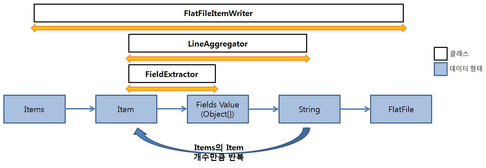
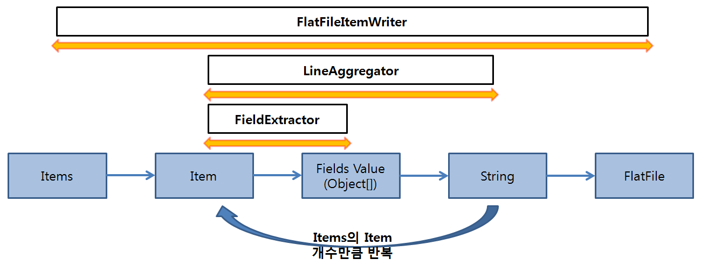
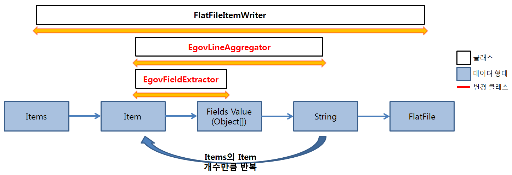
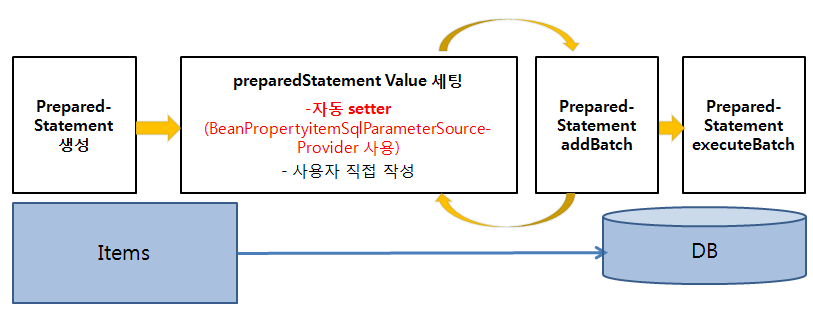
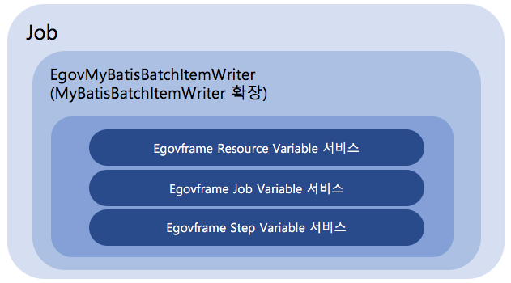

# ItemWriter

## 개요
ItemWriter는 대상 타입에 관계없이 한번에 항목의 묶음(Chunk)을 쓰는 동작의 인터페이스이다.

## 설명
ItemWriter의 기능은 ItemReader와 유사하지만 정반대의 동작을 한다.
기본적인 ItemWriter 인터페이스는 아래와 같다.

```java
public interface ItemWriter<T> {
 
   void write(List<? extends T> items) throws Exception;
 
}
```

write() 메소드는 ItemWriter의 필수적인 메소드이며 인자로 건넨 객체가 열려 있는 동안 쓰기 작업을 시도한다.

### FlatFile ItemWriter
FlatFileItemWriter는 Resource, LineAggregator에 기본적으로 의존성을 갖으며, LineAggregator에 따라 구분자(Delimited)와 고정길이(Fixed Length) 방식으로 쓸 수 있다.



| 구분             | 데이터 형태        | 설명                                                                                                                                                                                                                                                                                          |
| -------------- | ------------- | ------------------------------------------------------------------------------------------------------------------------------------------------------------------------------------------------------------------------------------------------------------------------------------------- |
| LineAggregator | Item → String | ItemReader, ItemProcessor 과정을 거친 Item을 1 라인의 String으로 변환하는 총 과정(FieldExtractor 과정을 포함한다.)<br>\- **DelimitedLineAggregator (구분자)** : Item의 Field와 Field 사이에 구분자를 삽입하여 1라인의 String으로 변환하는 과정<br>\- **FormatterLineAggregator(고정길이 포맷)** : Item의 Field를 사용자가 설정한 포맷 기준으로 1라인의 String으로 변환하는 과정 |
| FieldExtractor | Item → Fields | Item에서 Field 값들을 꺼내어 Object[]로 변환하는 과정 |

아래 Delimited(구분자), Fixed Length(고정길이) 방식으로 설정한 FlatFileItemWriter의 예시를 통해 FlatFileItemWriter, LineAggregator, FieldExtractor의 의존 관계를 볼 수 있다.

<table class="inline">
	<tbody><tr class="row0">
		<th class="col0 centeralign">  Aggregate 방식  </th><th class="col1 centeralign">  설정  </th>
	</tr>
	<tr class="row1">
		<th class="col0"> Delimited (구분자) </th><td class="col1"> <pre class="code xml"><span class="sc3"><span class="re1">&lt;bean</span> <span class="re0">id</span>=<span class="st0">"itemWriter"</span> <span class="re0">class</span>=<span class="st0">"org.springframework.batch.item.file.FlatFileItemWriter"</span> <span class="re0">scope</span>=<span class="st0">"step"</span><span class="re2">&gt;</span></span>
    <span class="sc3"><span class="re1">&lt;property</span> <span class="re0">name</span>=<span class="st0">"resource"</span> <span class="re0">value</span>=<span class="st0">"#{jobParameters[outputFile]}"</span> <span class="re2">/&gt;</span></span>
    <span class="sc3"><span class="re1">&lt;property</span> <span class="re0">name</span>=<span class="st0">"lineAggregator"</span><span class="re2">&gt;</span></span>
	<span class="sc3"><span class="re1">&lt;bean</span> <span class="re0">class</span>=<span class="st0">"org.springframework.batch.item.file.transform.DelimitedLineAggregator"</span><span class="re2">&gt;</span></span>
	    <span class="sc3"><span class="re1">&lt;property</span> <span class="re0">name</span>=<span class="st0">"delimiter"</span> <span class="re0">value</span>=<span class="st0">","</span><span class="re2">/&gt;</span></span>
	    <span class="sc3"><span class="re1">&lt;property</span> <span class="re0">name</span>=<span class="st0">"fieldExtractor"</span><span class="re2">&gt;</span></span>
		<span class="sc3"><span class="re1">&lt;bean</span> <span class="re0">class</span>=<span class="st0">"org.springframework.batch.item.file.transform.BeanWrapperFieldExtractor"</span><span class="re2">&gt;</span></span>
		    <span class="sc3"><span class="re1">&lt;property</span> <span class="re0">name</span>=<span class="st0">"names"</span> <span class="re0">value</span>=<span class="st0">"name,credit"</span><span class="re2">/&gt;</span></span>					
		<span class="sc3"><span class="re1">&lt;/bean<span class="re2">&gt;</span></span></span>
	    <span class="sc3"><span class="re1">&lt;/property<span class="re2">&gt;</span></span></span>
	<span class="sc3"><span class="re1">&lt;/bean<span class="re2">&gt;</span></span></span>
    <span class="sc3"><span class="re1">&lt;/property<span class="re2">&gt;</span></span></span>
<span class="sc3"><span class="re1">&lt;/bean<span class="re2">&gt;</span></span></span></pre></td>
	</tr>
	<tr class="row2">
		<th class="col0"> Fixed Length (고정길이) </th><td class="col1"> <pre class="code xml"><span class="sc3"><span class="re1">&lt;bean</span> <span class="re0">id</span>=<span class="st0">"itemWriter"</span> <span class="re0">class</span>=<span class="st0">"org.springframework.batch.item.file.FlatFileItemWriter"</span> <span class="re0">scope</span>=<span class="st0">"step"</span><span class="re2">&gt;</span></span>
    <span class="sc3"><span class="re1">&lt;property</span> <span class="re0">name</span>=<span class="st0">"resource"</span> <span class="re0">value</span>=<span class="st0">"#{jobParameters[outputFile]}"</span> <span class="re2">/&gt;</span></span>
    <span class="sc3"><span class="re1">&lt;property</span> <span class="re0">name</span>=<span class="st0">"lineAggregator"</span><span class="re2">&gt;</span></span>
	<span class="sc3"><span class="re1">&lt;bean</span> <span class="re0">class</span>=<span class="st0">"org.springframework.batch.item.file.transform.FormatterLineAggregator"</span><span class="re2">&gt;</span></span>
	    <span class="sc3"><span class="re1">&lt;property</span> <span class="re0">name</span>=<span class="st0">"format"</span> <span class="re0">value</span>=<span class="st0">"%-9s%-2s"</span> <span class="re2">/&gt;</span></span>
	    <span class="sc3"><span class="re1">&lt;property</span> <span class="re0">name</span>=<span class="st0">"fieldExtractor"</span><span class="re2">&gt;</span></span>
		<span class="sc3"><span class="re1">&lt;bean</span> <span class="re0">class</span>=<span class="st0">"org.springframework.batch.item.file.transform.BeanWrapperFieldExtractor"</span><span class="re2">&gt;</span></span>
		    <span class="sc3"><span class="re1">&lt;property</span> <span class="re0">name</span>=<span class="st0">"names"</span> <span class="re0">value</span>=<span class="st0">"name,credit"</span><span class="re2">/&gt;</span></span>					
		<span class="sc3"><span class="re1">&lt;/bean<span class="re2">&gt;</span></span></span>
	    <span class="sc3"><span class="re1">&lt;/property<span class="re2">&gt;</span></span></span>
	<span class="sc3"><span class="re1">&lt;/bean<span class="re2">&gt;</span></span></span>
    <span class="sc3"><span class="re1">&lt;/property<span class="re2">&gt;</span></span></span>
<span class="sc3"><span class="re1">&lt;/bean<span class="re2">&gt;</span></span></span></pre></td>
	</tr>
</tbody></table>

BeanWrapperFieldExtractor에 아래와 같은 항목을 설정해야한다.

| 설정항목  | 내용                        |
| ----- | ------------------------- |
| names | VO 클래스의 필드를 나타낸다. |

✔ 사용하는 LineAggregator에 따라 설정항목이 다르므로 주의하여 설정해야 한다.

| LineAggregator          | 설정항목      | 설명                                                  | 설정 예     |
| ----------------------- | --------- | --------------------------------------------------- | -------- |
| DelimitedLineAggregator | delimiter | Item의 필드 값들을 1 Line의 String으로 만들 때 경계가 되는 구분자 지정    | ,(콤마)    |
| FormatterLineAggregator | format    | Item의 필드 값들을 1 Line의 String으로 만들 때 필드값의 형식과 고정길이 지정 | %-9s%-2s |

### XML ItemWriter

#### StaxEventItemWriter
XML 쓰는 과정은 읽기 과정에 대칭적이다. StaxEventItemWriter는 Resource, marshaller, rootTagName가 필요하다.
Java 객체는 marshaller에 전달되서 OXM 도구에 의해 각 fragment마다 StartDocument와 EndDocument 이벤트를 필터링하고 커스텀 이벤트 writer를 사용해 Resource를 쓰게 된다.

아래 XStreamMarshaller를 사용한 StaxEventItemWriter 설정 예가 있다.

```xml
<bean id="itemWriter" class="org.springframework.batch.item.xml.StaxEventItemWriter">
   <property name="resource" ref="outputResource" />
   <property name="marshaller" ref="customerCreditMarshaller" />
   <property name="rootTagName" value="customers" />
   <property name="overwriteOutput" value="true" />
</bean>
```

marshaller가 의존성 참조를 하고 있는 customerCreditMarshaller는 다음처럼 설정하면 된다.

```xml
<bean id="customerCreditMarshaller" class="org.springframework.oxm.xstream.XStreamMarshaller">
   <property name="aliases">
      <util:map id="aliases">
         <entry key="customer" value="egovframework.brte.sample.domain.trade.CustomerCredit" />
         <entry key="credit" value="java.math.BigDecimal" />
         <entry key="name" value="java.lang.String" />
      </util:map>
   </property>
</bean>
```

### Database ItemWriter
플랫파일 및 <Acronym title="Extensible Markup Language">XML</Acronym> 모두 특정 ItemWriter가 있지만 데이터베이스는 다르다. 왜냐하면 트랜잭션이 필요한 모든 기능을 제공하기 때문이다.
파일은 트랜잭션이 있는 것처럼 적절한 시점에 작성된 item을 추적하고 삭제하는 작업해야 하기 때문에 ItemWriter가 필요하다. 하지만 데이터베이스는 쓰기가 이미 트랜잭션에 포함되어 있기때문에 이 기능을 필요로 하지 않는다.
사용자는 ItemWriter 인터페이스를 구현해서 DAO를 만들거나 일반적인 처리 과정 관점에서 작성된 커스텀 ItemWriter 중 하나를 사용하면 된다.

#### JdbcBatchItemWriter
아래 XML 설정은 JDBC를 이용한 JdbcBatchItemWriter의 설정 예시이다.
JdbcCursorItemReader 설정과 마찬가지로 dataSouce 속성으로 DB connection을 넣어올 수 있는 datasource를 지정하고, sql 속성에 실행할 쿼리를 설정한다.

```xml
<bean id="itemWriter" class="org.springframework.batch.item.database.JdbcBatchItemWriter">
	<property name="assertUpdates" value="true" />
	<property name="itemSqlParameterSourceProvider">
		<bean class="org.springframework.batch.item.database.BeanPropertyItemSqlParameterSourceProvider" />
	</property>
	<property name="sql" value="UPDATE CUSTOMER set credit = :credit where id = :id" />
	<property name="dataSource" ref="dataSource" />
</bean>
```

#### IbatisBatchItemWriter
아래 XML 설정은 iBatis를 이용한 IbatisBatchItemWriter의 설정 예시이다.

```xml
<bean id="itemWriter"
	class="org.springframework.batch.item.database.IbatisBatchItemWriter">
	<property name="statementId" value="updateCredit" />
	<property name="sqlMapClient" ref="sqlMapClient" />
</bean>
```

sqlMapClient의 참조는 아래와 같다. configLocation 속성에 iBatis를 통해 쿼리를 작성해둔 파일의 경로를 설정한다.

```xml
<bean id="sqlMapClient" class="org.springframework.orm.ibatis.SqlMapClientFactoryBean">
	<property name="dataSource" ref="dataSource" />
	<property name="configLocation" value="ibatis-config.xml" />	
</bean>
```

### 전자정부에서 제공하는 eGovFlatFileItemWriter
스프링 배치에서 제공하는 파일 기반 관련설정을 사용할 경우, 대용량 데이터 처리 시간이 상용 배치프레임워크 대비 성능이 떨어졌다. 이 문제를 해결하기 위해서 전자정부에서는 파일 ItemWriter의 요소 중 성능저하 요인인 LineAggregator 부분을 개선하여 제공한다

스프링에서 제공하는 BeanWrapperFieldExtractor를 경량화 한 **EgovFieldExtractor와** FormatterLineAggreagotor의 기능을 경량화 한 **EgovFixedLineAggregator를** 제공한다.

|스프링 FlatFileItemWriter 구조|전자정부 EgovFlatFileItemWriter 구조|
|---|---|
|||

| 개선사항                 | 설명                        |
| ----------------------- | --------------------------- |
| EgovFieldExtractor      | 스프링에서 제공하는 BeanWrapperFieldExtractor를 개선하여 item에서 field 값을 추출하는 과정의 성능을 개선한 FieldExtractor 제공 |
| EgovFixedLineAggregator | 스프링에서 제공하는 FormatterLineAggregator는 Java의 format() 메소드를 이용하여 String을 다양한 format으로 변환할 수 있지만 가장 기본 설정인 문자열 길이만 지정할 때 성능이 떨어지는 단점이 있다.<br>따라서 사용자가 문자열 길이만 지정할 때를 고려해 경량화하여 성능의 초점을 둔 LineAggregator 제공<br>(format 지정이 필요한 경우, format을 VO에서 직접 적용하여 FormatterLineAggregator와 같은 기능이지만 성능 개선 된 EgovFixedLineAggregator 사용 가능) |

✔ 스프링에서 제공하는 FormatterLineAggregator, DelimitedLineAggregator와 EgovFieldExtractor는 동시 사용이 가능하므로 BeanWrapperFieldExtractor 대신 EgovFieldExtractor 사용 시, 보다 좋은 성능으로 write 할 수 있다.

BeanWrapperFieldExtractor, FormatterLineAggregator(or DelimitedLineAggregator)를 사용한 설정과 EgovFieldExtractor, EgovFixedLineAggregator(or DelimitedLineAggregator)를 사용한 FlatFileItemWriter 설정 비교는 아래와 같다.

#### Fixed Length(고정길이) 방식 설정
<table class="inline">
	<tbody><tr class="row0">
		<th class="col0 centeralign">  구분  </th><th class="col1 centeralign">  설정  </th>
	</tr>
	<tr class="row1">
		<th class="col0"> 스프링 FlatFileItemWriter </th><td class="col1"> <pre class="code xml"><span class="sc3"><span class="re1">&lt;bean</span> <span class="re0">id</span>=<span class="st0">"itemWriter"</span> <span class="re0">class</span>=<span class="st0">"org.springframework.batch.item.file.FlatFileItemWriter"</span> <span class="re0">scope</span>=<span class="st0">"step"</span><span class="re2">&gt;</span></span>
   <span class="sc3"><span class="re1">&lt;property</span> <span class="re0">name</span>=<span class="st0">"resource"</span> <span class="re0">value</span>=<span class="st0">"#{jobParameters[outputFile]}"</span> <span class="re2">/&gt;</span></span>
   <span class="sc3"><span class="re1">&lt;property</span> <span class="re0">name</span>=<span class="st0">"lineAggregator"</span><span class="re2">&gt;</span></span>
      <span class="sc3"><span class="re1">&lt;bean</span> <span class="re0">class</span>=<span class="st0">"org.springframework.batch.item.file.transform.FormatterLineAggregator"</span><span class="re2">&gt;</span></span>
         <span class="sc3"><span class="re1">&lt;property</span> <span class="re0">name</span>=<span class="st0">"fieldExtractor"</span><span class="re2">&gt;</span></span>
	    <span class="sc3"><span class="re1">&lt;bean</span> <span class="re0">class</span>=<span class="st0">"org.springframework.batch.item.file.transform.BeanWrapperFieldExtractor"</span><span class="re2">&gt;</span></span>
		<span class="sc3"><span class="re1">&lt;property</span> <span class="re0">name</span>=<span class="st0">"names"</span> <span class="re0">value</span>=<span class="st0">"name,credit"</span> <span class="re2">/&gt;</span></span>
	    <span class="sc3"><span class="re1">&lt;/bean<span class="re2">&gt;</span></span></span>
	 <span class="sc3"><span class="re1">&lt;/property<span class="re2">&gt;</span></span></span>
	 <span class="sc3"><span class="re1">&lt;property</span> <span class="re0">name</span>=<span class="st0">"format"</span> <span class="re0">value</span>=<span class="st0">"%-9s%-2s"</span> <span class="re2">/&gt;</span></span>
      <span class="sc3"><span class="re1">&lt;/bean<span class="re2">&gt;</span></span></span>
   <span class="sc3"><span class="re1">&lt;/property<span class="re2">&gt;</span></span></span>
<span class="sc3"><span class="re1">&lt;/bean<span class="re2">&gt;</span></span></span></pre></td>
	</tr>
	<tr class="row2">
		<th class="col0"> 전자정부 EgovFlatFileItemWriter </th><td class="col1"> <pre class="code xml"><span class="sc3"><span class="re1">&lt;bean</span> <span class="re0">id</span>=<span class="st0">"itemWriter"</span> <span class="re0">class</span>=<span class="st0">"org.springframework.batch.item.file.FlatFileItemWriter"</span> <span class="re0">scope</span>=<span class="st0">"step"</span><span class="re2">&gt;</span></span>
   <span class="sc3"><span class="re1">&lt;property</span> <span class="re0">name</span>=<span class="st0">"resource"</span> <span class="re0">value</span>=<span class="st0">"#{jobParameters[outputFile]}"</span> <span class="re2">/&gt;</span></span>
   <span class="sc3"><span class="re1">&lt;property</span> <span class="re0">name</span>=<span class="st0">"lineAggregator"</span><span class="re2">&gt;</span></span>
      <span class="sc3"><span class="re1">&lt;bean</span> <span class="re0">class</span>=<span class="st0">"egovframework.brte.core.item.file.transform.EgovFixedLengthLineAggregator"</span><span class="re2">&gt;</span></span>
         <span class="sc3"><span class="re1">&lt;property</span> <span class="re0">name</span>=<span class="st0">"fieldExtractor"</span><span class="re2">&gt;</span></span>
	    <span class="sc3"><span class="re1">&lt;bean</span> <span class="re0">class</span>=<span class="st0">"egovframework.brte.core.item.file.transform.EgovFieldExtractor"</span><span class="re2">&gt;</span></span>
	       <span class="sc3"><span class="re1">&lt;property</span> <span class="re0">name</span>=<span class="st0">"names"</span> <span class="re0">value</span>=<span class="st0">"name,credit"</span> <span class="re2">/&gt;</span></span>
	    <span class="sc3"><span class="re1">&lt;/bean<span class="re2">&gt;</span></span></span>
	 <span class="sc3"><span class="re1">&lt;/property<span class="re2">&gt;</span></span></span>
	 <span class="sc3"><span class="re1">&lt;property</span> <span class="re0">name</span>=<span class="st0">"fieldRanges"</span> <span class="re0">value</span>=<span class="st0">"9,2"</span> <span class="re2">/&gt;</span></span>						
      <span class="sc3"><span class="re1">&lt;/bean<span class="re2">&gt;</span></span></span>
   <span class="sc3"><span class="re1">&lt;/property<span class="re2">&gt;</span></span></span>
<span class="sc3"><span class="re1">&lt;/bean<span class="re2">&gt;</span></span></span></pre></td>
	</tr>
</tbody></table>

| EgovFlatFileItemWriter 설정항목 | 설명                                                  |
| --------------------------- | --------------------------------------------------- |
| fieldRanges                 | Item의 필드 값들을 1 Line의 String으로 만들 때 필드값의 범위(고정길이) 지정 |
| names                       | VO 클래스의 필드를 나타낸다.                                   |
| padding                     | 공백 패턴 설정                                            |

#### Delimited(구분자) 방식 설정
<table class="inline">
	<tbody><tr class="row0">
		<th class="col0 centeralign">  구분  </th><th class="col1 centeralign">  설정  </th>
	</tr>
	<tr class="row1">
		<th class="col0"> 스프링 FlatFileItemWriter </th><td class="col1"> <pre class="code xml"><span class="sc3"><span class="re1">&lt;bean</span> <span class="re0">id</span>=<span class="st0">"itemWriter"</span> <span class="re0">class</span>=<span class="st0">"org.springframework.batch.item.file.FlatFileItemWriter"</span> <span class="re0">scope</span>=<span class="st0">"step"</span><span class="re2">&gt;</span></span>
   <span class="sc3"><span class="re1">&lt;property</span> <span class="re0">name</span>=<span class="st0">"resource"</span> <span class="re0">value</span>=<span class="st0">"#{jobParameters[outputFile]}"</span> <span class="re2">/&gt;</span></span>
   <span class="sc3"><span class="re1">&lt;property</span> <span class="re0">name</span>=<span class="st0">"lineAggregator"</span><span class="re2">&gt;</span></span>
      <span class="sc3"><span class="re1">&lt;bean</span> <span class="re0">class</span>=<span class="st0">"org.springframework.batch.item.file.transform.DelimitedLineAggregator"</span><span class="re2">&gt;</span></span>
	 <span class="sc3"><span class="re1">&lt;property</span> <span class="re0">name</span>=<span class="st0">"fieldExtractor"</span><span class="re2">&gt;</span></span>
	    <span class="sc3"><span class="re1">&lt;bean</span> <span class="re0">class</span>=<span class="st0">"org.springframework.batch.item.file.transform.BeanWrapperFieldExtractor"</span><span class="re2">&gt;</span></span>
	       <span class="sc3"><span class="re1">&lt;property</span> <span class="re0">name</span>=<span class="st0">"names"</span> <span class="re0">value</span>=<span class="st0">"name,credit"</span><span class="re2">/&gt;</span></span>					
	    <span class="sc3"><span class="re1">&lt;/bean<span class="re2">&gt;</span></span></span>
	 <span class="sc3"><span class="re1">&lt;/property<span class="re2">&gt;</span></span></span>
         <span class="sc3"><span class="re1">&lt;property</span> <span class="re0">name</span>=<span class="st0">"delimiter"</span> <span class="re0">value</span>=<span class="st0">","</span><span class="re2">/&gt;</span></span>
      <span class="sc3"><span class="re1">&lt;/bean<span class="re2">&gt;</span></span></span>
    <span class="sc3"><span class="re1">&lt;/property<span class="re2">&gt;</span></span></span>
<span class="sc3"><span class="re1">&lt;/bean<span class="re2">&gt;</span></span></span></pre></td>
	</tr>
	<tr class="row2">
		<th class="col0"> 전자정부 EgovFlatFileItemWriter </th><td class="col1"> <pre class="code xml"><span class="sc3"><span class="re1">&lt;bean</span> <span class="re0">id</span>=<span class="st0">"itemWriter"</span> <span class="re0">class</span>=<span class="st0">"org.springframework.batch.item.file.FlatFileItemWriter"</span> <span class="re0">scope</span>=<span class="st0">"step"</span><span class="re2">&gt;</span></span>
   <span class="sc3"><span class="re1">&lt;property</span> <span class="re0">name</span>=<span class="st0">"resource"</span> <span class="re0">value</span>=<span class="st0">"#{jobParameters[outputFile]}"</span> <span class="re2">/&gt;</span></span>
   <span class="sc3"><span class="re1">&lt;property</span> <span class="re0">name</span>=<span class="st0">"lineAggregator"</span><span class="re2">&gt;</span></span>
      <span class="sc3"><span class="re1">&lt;bean</span> <span class="re0">class</span>=<span class="st0">"org.springframework.batch.item.file.transform.DelimitedLineAggregator"</span><span class="re2">&gt;</span></span>
	 <span class="sc3"><span class="re1">&lt;property</span> <span class="re0">name</span>=<span class="st0">"fieldExtractor"</span><span class="re2">&gt;</span></span>
	    <span class="sc3"><span class="re1">&lt;bean</span> <span class="re0">class</span>=<span class="st0">"egovframework.brte.core.item.file.transform.EgovFieldExtractor"</span><span class="re2">&gt;</span></span>
		<span class="sc3"><span class="re1">&lt;property</span> <span class="re0">name</span>=<span class="st0">"names"</span> <span class="re0">value</span>=<span class="st0">"name,credit"</span><span class="re2">/&gt;</span></span>					
	    <span class="sc3"><span class="re1">&lt;/bean<span class="re2">&gt;</span></span></span>
	 <span class="sc3"><span class="re1">&lt;/property<span class="re2">&gt;</span></span></span>
         <span class="sc3"><span class="re1">&lt;property</span> <span class="re0">name</span>=<span class="st0">"delimiter"</span> <span class="re0">value</span>=<span class="st0">","</span><span class="re2">/&gt;</span></span>
      <span class="sc3"><span class="re1">&lt;/bean<span class="re2">&gt;</span></span></span>
   <span class="sc3"><span class="re1">&lt;/property<span class="re2">&gt;</span></span></span>
<span class="sc3"><span class="re1">&lt;/bean<span class="re2">&gt;</span></span></span></pre></td>
	</tr>
</tbody></table>

| EgovFlatFileItemWriter 설정항목 | 설명              |
| --------------------------- | ------------------------------------------------ |
| delimiter                   | Item의 필드 값들을 1 Line의 String으로 만들 때 경계가 되는 구분자 지정 |
| names                       | VO 클래스의 필드를 나타낸다. |

사용하는 LineAggregator에 따라 설정항목이 다르다.

| LineAggregator                | 설정항목        | 설명                | 설정 예     |
| ----------------------------- | ----------- | ----------------- | -------- |
| DelimitedLineAggregator       | delimiter   | 필드의 경계를 구별해주는 문자  | , (콤마)   |
| FormatterLineAggregator       | format      | 필드의 형식과 필드 경계의 범위 | %-9s%-2s |
| EgovFixedLengthLineAggregator | fieldRanges | 필드 경계의 범위         | 9,2      |

### 전자정부에서 제공하는 eGovDBItemWriter
스프링에서 제공하는 JdbcBatchItemWriter는 사용자가 PreparedStatement를 setter하기 위한 클래스를 직접 작성하지 않고, XML 설정시 쿼리의 파라미터값을 지정만으로 자동으로 PreparedStatement를 setter해주는 기능을 제공한다. 하지만, 이 기능을 이용하면 대용량 데이터 처리 시간이 상용 배치프레임워크과 비교하여 큰 차이가 발생한다. 이러한 차이를 개선하고자 전자정부프레임워크에서는 EgovJdbcBatchItemWriter를 제공한다.

|스프링 JdbcBatchItemWriter구조|전자정부 EgovJdbcBatchItemWriter 구조|
|---|---|
|||

자동으로 PreparedStatement를 setter 할 경우 JdbcBatchItemWriter는 BeanPropertyItemSqlParameterSourceProvider클래스를 사용하고 EgovJdbcBatchItemWriter는 EgovMethodMapItemPreparedStatementSetter클래스를 사용한다. 설정은 아래와 같다.

<table class="inline">
	<tbody><tr class="row0">
		<th class="col0 centeralign">  구분  </th><th class="col1 centeralign">  설정  </th>
	</tr>
	<tr class="row1">
		<th class="col0">JdbcBatchItemWriter</th><td class="col1"><pre class="code xml">	<span class="sc3"><span class="re1">&lt;bean</span> <span class="re0">id</span>=<span class="st0">"itemWriter"</span> <span class="re0">class</span>=<span class="st0">"org.springframework.batch.item.database.JdbcBatchItemWriter"</span><span class="re2">&gt;</span></span>
		<span class="sc3"><span class="re1">&lt;property</span> <span class="re0">name</span>=<span class="st0">"assertUpdates"</span> <span class="re0">value</span>=<span class="st0">"true"</span> <span class="re2">/&gt;</span></span>
		<span class="sc3"><span class="re1">&lt;property</span> <span class="re0">name</span>=<span class="st0">"itemSqlParameterSourceProvider"</span><span class="re2">&gt;</span></span>
			<span class="sc3"><span class="re1">&lt;bean</span> <span class="re0">class</span>=<span class="st0">"org.springframework.batch.item.database.BeanPropertyItemSqlParameterSourceProvider"</span> <span class="re2">/&gt;</span></span>
		<span class="sc3"><span class="re1">&lt;/property<span class="re2">&gt;</span></span></span>
		<span class="sc3"><span class="re1">&lt;property</span> <span class="re0">name</span>=<span class="st0">"sql"</span> <span class="re0">value</span>=<span class="st0">"UPDATE CUSTOMER set credit = :credit where id = :id"</span> <span class="re2">/&gt;</span></span>
		<span class="sc3"><span class="re1">&lt;property</span> <span class="re0">name</span>=<span class="st0">"dataSource"</span> <span class="re0">ref</span>=<span class="st0">"dataSource"</span> <span class="re2">/&gt;</span></span>
	<span class="sc3"><span class="re1">&lt;/bean<span class="re2">&gt;</span></span></span></pre></td>
	</tr>
	<tr class="row2">
		<th class="col0">EgovJdbcBatchItemWriter</th><td class="col1"><pre class="code xml">	<span class="sc3"><span class="re1">&lt;bean</span> <span class="re0">id</span>=<span class="st0">"itemWriter"</span> <span class="re0">class</span>=<span class="st0">"egovframework.brte.core.item.database.EgovJdbcBatchItemWriter"</span><span class="re2">&gt;</span></span>
		<span class="sc3"><span class="re1">&lt;property</span> <span class="re0">name</span>=<span class="st0">"assertUpdates"</span> <span class="re0">value</span>=<span class="st0">"true"</span> <span class="re2">/&gt;</span></span>
		<span class="sc3"><span class="re1">&lt;property</span> <span class="re0">name</span>=<span class="st0">"itemPreparedStatementSetter"</span><span class="re2">&gt;</span></span>
			<span class="sc3"><span class="re1">&lt;bean</span> <span class="re0">class</span>=<span class="st0">"egovframework.brte.core.item.database.support.EgovMethodMapItemPreparedStatementSetter"</span> <span class="re2">/&gt;</span></span>
		<span class="sc3"><span class="re1">&lt;/property<span class="re2">&gt;</span></span></span>
		<span class="sc3"><span class="re1">&lt;property</span> <span class="re0">name</span>=<span class="st0">"sql"</span> <span class="re0">value</span>=<span class="st0">"UPDATE CUSTOMER set credit =? where id =?"</span><span class="re2">/&gt;</span></span>
		<span class="sc3"><span class="re1">&lt;property</span> <span class="re0">name</span>=<span class="st0">"params"</span> <span class="re0">value</span>=<span class="st0">"credit,id"</span><span class="re2">/&gt;</span></span>
		<span class="sc3"><span class="re1">&lt;property</span> <span class="re0">name</span>=<span class="st0">"dataSource"</span> <span class="re0">ref</span>=<span class="st0">"dataSource"</span> <span class="re2">/&gt;</span></span>
	<span class="sc3"><span class="re1">&lt;/bean<span class="re2">&gt;</span></span></span></pre></td>
	</tr>
</tbody></table>

✔ EgovMethodMapItemPreparedStatementSetter에는 파라미터의 값둘을 params의 value 값으로 설정한다.

보다 자세히 설명하면,

| writer                  | 설정                                         | 설명                                                    |
| ----------------------- | ------------------------------------------ | ----------------------------------------------------- |
| JdbcBatchItemWriter     | 사용자가 작성한 class                             | 사용자가 setValues 메소드를 직접 작성하여 PreparedStatement의 데이터 설정 |
|                         | BeanPropertyItemSqlParameterSourceProvider | sql에 파라미터 설정으로 PreparedStatement의 데이터 설정              |
| EgovJdbcBatchItemWriter | 사용자가 작성한 class                             | 사용자가 setValues 메소드를 직접 작성하여 PreparedStatement의 데이터 설정 |
|                         | EgovMethodMapItemPreparedStatementSetter   | sql과 params의 설정으로 PreparedStatement의 데이터 설정           |

또한 EgovJdbcBatchItemWriter도 사용자가 직접 작성한 class를 PreparedStatementSetter로 설정할 수 있다. 클래스 작성시에는 EgovItemPreparedStatementSetter를 상속하여 사용한다. 아래의 EmployeeItemPreparedStatementSetter 클래스는 EgovItemPreparedStatementSetter를 상속받아서 사용자가 직접 작성한 것이다.

```xml
<bean id="itemWriter" class="org.springframework.batch.item.database.EgovJdbcBatchItemWriter">
	<property name="itemPreparedStatementSetter">
		<bean class="egovframework.brte.sample.example.support.EmployeeItemPreparedStatementSetter" />
	</property>
	<property  name="sql“  value="update into UIP_EMPLOYEE (num, name, sex) values (?, ?, ?)" />
	<property name="dataSource" ref="dataSource" />
</bean>
```

### 전자정부에서 제공하는 eGovIndexFileWriter
배치 Job 정의 시 Resource 엘리먼트의 shell step에 shell script에 포함된 파일명에서 일련번호(index)를 사용할 수 있는 Writer를 제공한다.
Index 파일명을 사용하면 파일의 일련번호를 기준으로 동적인 파일명 생성이 가능하다.

Index(NDX) 파일명 치환 로직

```
NDX File : 파일 이름이 “[이름]_NDX_[YYYYMMDDhhmmss]” 형식으로 이루어진 파일
           ex) Sample_NDX_20121126151237

NDX 일련번호 : 파일명 끝에 14자리 수의 생성시간(년월일시분초)

NDX 파일명 치환 : “[이름]_NDX(Index)” 형식의 파일명은 해당 디렉터리의 NDX 파일에 대해 Index에 해당하는 실제 파일명으로 치환됨

(-2 ) : 일련번호 기준 마지막 파일에서 두 번째 이전 파일명으로 치환됨
(-1 ) : 일련번호 기준 마지막 파일에서 첫 번째 이전 파일명으로 치환됨
( 0 ) : 일련번호 기준 마지막 파일명으로 치환됨
(+1 ) : 일련번호 기준 마지막 파일에서 Index를 1 증가시켜 새로운 파일 생성
```

NDX 파일목록 중 잘못된 파일명이 존재할 경우 에러를 발생한다.

| 구분 | 예시                    | 비고                   |
| -- | --------------------- | -------------------- |
| 에러 | Sample_NDX_20180104   | index 자릿수가 10자리      |
| 에러 | Sample_NDX_000A       | index는 숫자만 허용함       |
| 무시 | Sample_20180104123456 | NDX 파일이 아닌 일반 파일로 인식 |

#### Index(NDX) Writer 방식 설정
Index Reader을 통해 읽어드린 파일을 NDX파일 설정에 따라 동적으로 새로운 파일을 생성한다.

```xml
<bean id="fileIndex-delimitedItemWriter" class="egovframework.rte.bat.core.item.file.EgovIndexFileWriter" scope="step">
	<property name="indexResource" value="file:./src/main/resources/egovframework/batch/data/inputs/csvData_NDX(+1)" />
	<property name="lineAggregator">
		<bean class="org.springframework.batch.item.file.transform.DelimitedLineAggregator">
			<property name="delimiter" value="," />
			<property name="fieldExtractor">
				<bean class="egovframework.rte.bat.core.item.file.transform.EgovFieldExtractor">
					<property name="names" value="name,credit" />
				</bean>
			</property>
		</bean>
	</property>
</bean>
```

| EgovIndexFileWriter 설정항목 | 내용                           | 예시                      |
| ------------------------ | ---------------------------- | ----------------------- |
| indexResource            | 설정된 index(NDX)에 따른 동적인 파일 생성 | Index(NDX) 파일명 치환 로직 참조 |

### 전자정부에서 제공하는 EgovMyBatisBatchItemWriter
배치 처리시 mybatis에서 데이터를 쓰기 위해 EgovMyBatisBatchItemWriter 서비스를 제공합니다.(mybatis MyBatisBatchItemWriter 클래스를 확장한 서비스)
실행환경 제공 Resource Variable, Step Variable, Job Variable 서비스와 함께 사용 가능하다.



#### EgovMyBatisBatchItemWriter 설정항목
| 설정항목              | 내용                                             | 예시                      |
| ----------------- | ---------------------------------------------- | ----------------------- |
| sqlSessionFactory | reader에 별도로 구현한 sessionFactory                 | sqlSession              |
| statementId       | 네임스페이스를 가진 매퍼 파일을 Query Id                     | EmpMapper.selectEmpList |
| resourceVariable  | 표준프레임워크 실행환경 Resource Variable 서비스를 사용하기 위한 설정 | resourceVariable        |
| jobVariable       | 표준프레임워크 실행환경 Step Variable 서비스를 사용하기 위한 설정     | jobVariable             |
| stepVariable      | 표준프레임워크 실행환경 Job Variable 서비스를 사용하기 위한 설정      | stepVariable            |

#### EgovMyBatisBatchItemWriter 설정항목 설정
```xml
<bean id="mybatisJobStep.mybatisItemWriter" class="egovframework.rte.bat.item.database.EgovMyBatisBatchItemWriter">
	<property name="resourceVariable" ref="resourceVariable" />
	<property name="jobVariable" ref="jobVariable" />
	<property name="stepVariable" ref="stepVariable" />
	<property name="sqlSessionFactory" ref="sqlSession" />
	<property name="statementId" value="EmpMapper.updateEmp" />
</bean>
```

## 참고자료
- http://static.springsource.org/spring-batch/reference/html/readersAndWriters.html
- http://www.mybatis.org/spring/ko/batch.html
