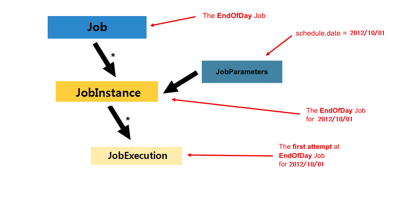
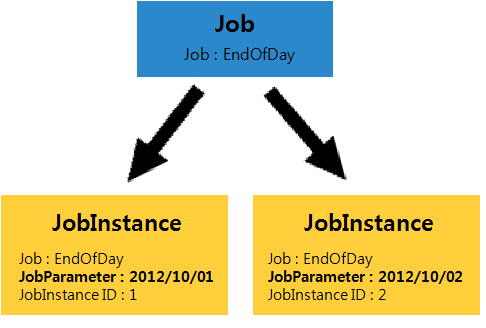
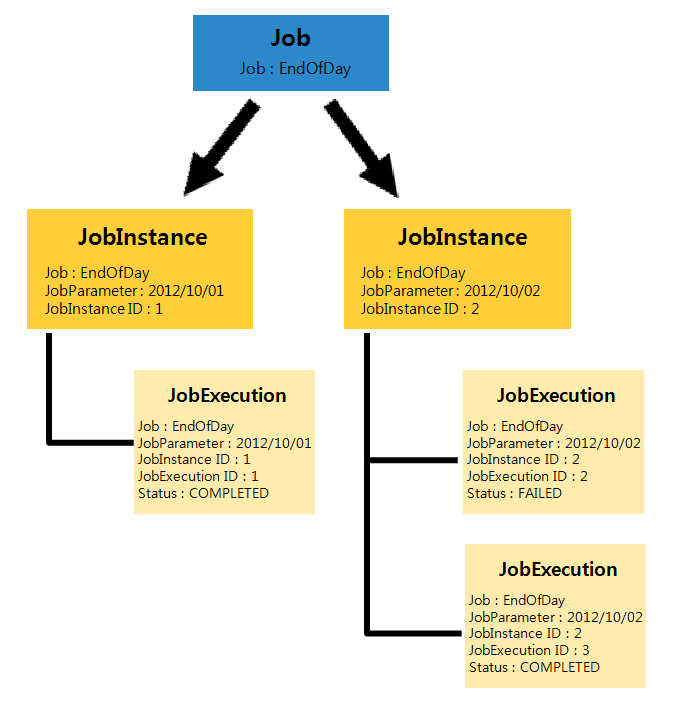

# Job

## 개요

Job은 배치작업 전체의 중심 개념으로 배치작업 자체를 의미한다. Job은 실제 프로세스가 진행되는 [Step](./batch-core-step.md) 들을 최상단에서 포함하고 있으며, Job의 실행은 배치작업 전체의 실행을 의미한다.

## 설명

- Job은 배치작업 과정 전체를 캡슐화하는 개념이며, 전체 계층 구조의 최상단이다.
- 특정 Job은 각각의 JobParameters에 따라 JobInstance를 생성하며, 한번의 Job 시도마다 JobExecution을 생성한다.
- Job은 반드시 한개 이상의 Step으로 구성된다.

아래 그림을 보면, 'EndOfDay'라는 Job이 있고 '2012/10/01'이라는 JobParameter를 통해 JobInstance가 생성되었다. 그리고 'EndOfDay' Job의 첫번째 시도를 의미하는 JobExecution이 생성되는 것을 볼 수 있다.



Job 인터페이스의 기본적인 구현은 SimpleJob 클래스로 스프링 배치에서 제공된다. SimpleJob 클래스는 모든 Job에서 유용하게 사용할 수 있는 표준 기능을 갖고있다. Job은 아래와 같이 \<job> 태그를 사용하여 설정할 수 있다.

```xml
<job id="footballJob">
   <step id="playerload" next="gameLoad"/>
   <step id="gameLoad" next="playerSummarization"/>
   <step id="playerSummarization"/>
</job>
```
### JobInstance

JobInstance는 논리적 Job 실행의 개념으로 JobInstance = Job + JobParameters로 표현할 수 있다.
다시 말해, JobInstance는 동일한 Job이 각기 다른 JobParameter를 통해 실행 된 Job의 실행 단위이다. (Job과 JobParameters가 같으면 동일한 JobInstance이다



위의 그림을 예로 설명하면 매일 한번씩 실행되는 'EndOfDay'라는 Job이 있다고 가정한다.
'EndOfDay'라는 Job은 하나지만 매일 실행되는 각각의 'EndOfDay' Job은 구별되어야 한다.
'2012/10/01'에 실행 된 'EndOfDay' Job과 '2012/10/02'에 실행 된 'EndOfDay' Job은 같은 Job이지만 JobInstance가 다르다.
이런 특성을 이용해 JobInstance는 Job의 Restart에 이용할 수 있다. JobInstance를 Restart하는 것은 해당 JobInstance의 정보(Execution Context)를 재사용하는 것이므로 새로운 JobInstance를 생성하지 않는다.(새로운 JobExecution이 생성된다.)

아래 표는 'EndOfDay'라는 하나의 Job이 JobParameter로 구별되어 각기 다른 JobInstance를 생성할 수 있음을 보여준다.

| JobInstance ID | Job Name | JobParameters |
|----------------|----------|---------------|
| 1 | EndOfDay | 2012/10/01 |
| 2 | EndOfDay | 2012/10/02 |

### JobParameters

JobParameters는 하나의 Job에 존재할 수 있는 여러개의 JobInstance를 구별하기 위한 Parameter 집합이며, Job을 시작하는데 사용하는 Parameter 집합이다.
또한 Job이 실행되는 동안에 Job을 식별하거나 Job에서 참조하는 데이터로 사용된다. 위의 그림(JobInstance 부분)으로 예를들면 'EndOfDay' Job으로 2개의 JobInstance가 생성됐다. 이 2개의 JobInstance는 각기 다른 JobParameters('2012/10/01', '2012/10/02')를 통해 생성된 것이다.
아래 표에서 JobInstance는 각각의 JobParameters를 갖고 있음을 볼 수 있다.

| JobInstance ID | JobParameters | Job Name |
|----------------|----------|---------------|
| 1 | 2012/10/01 | EndOfDay |
| 2 | 2012/10/02 | EndOfDay |

#### JobParameter 구조

- JobParameter클래스에는 실제 parameter의 내용과 ParameterType이 존재한다.
  
```java
public class JobParameter implements Serializable {
 
	private final Object parameter;
 
	private final ParameterType parameterType;
 
}
```
- ParameterType은 enum 형태로 String, Date, Long, Double을 받아들일 수 있다.
  
```java
public enum ParameterType {
 
	STRING, DATE, LONG, DOUBLE;
}
```

- JobParameters는 Map 형태로 관리된다.
  
```java
public class JobParameters implements Serializable {
 
	private final Map<String,JobParameter> parameters;
 
	public JobParameters() {
		this.parameters = new LinkedHashMap<String, JobParameter>();
	}
 
	public JobParameters(Map<String,JobParameter> parameters) {
        	this.parameters = new LinkedHashMap<String,JobParameter>(parameters);
	}
```

#### JobParameter 생성 방법

- JobParameterBuilder 클래스 사용
  
```java
protected JobParameters getUniqueJobParameters() {
		return new JobParametersBuilder(super.getUniqueJobParameters())
		.addString("inputFile","data/iosample/input/delimited.csv")
		.addString("outputFile","file:./target/test-outputs/delimitedOutput.csv").toJobParameters();
}
```
- DefaultJobParametersConverter 클래스 사용
  
```java
new DefaultJobParametersConverter()
		.getJobParameters(PropertiesConverter
	.stringToProperties("run.id(long)=1,parameter=true,run.date=20121001"));
```

#### 생성된 JobParameters는 XML에서 사용할 수 있다.

- ex) FlatFileItemReader  
resource에 JobParameter에 'inputFile'이라는 Parameter 이름(Key 값)을 통해 입력 받을 수 있다.
  
```xml
<bean id="itemReader" class="org.springframework.batch.item.file.FlatFileItemReader" >
	<property name="resource" value="#{jobParameters[inputFile]}" />
                    (중략...)
</bean>
```
- ex) FlatFileItemWriter  
  resource에 JobParameter에 'outputFile'이라는 Parameter 이름(Key 값)을 통해 입력 받을 수 있다.
  
  
```xml
<bean id="itemReader" class="org.springframework.batch.item.file.FlatFileItemWriter" >
	<property name="resource" value="#{jobParameters[outputFile]}" />
                    (중략...)
</bean>
```

### JobExecution

JobExecution은 한번의 Job 시도를 의미하는 기술적인 개념이다. JobExecution은 'FAILED' 또는 'COMPLETED'로 Job의 시도 결과를 나타낸다.
이외에, JobExecution은 주로 Job이 실행 중에 어떤 일이 일어났는지에 대한 속성들을 저장하는 저장 메커니즘 역할을 한다. ([JobExecution 속성 자세히 보기](./batch-core-history_management.md))   
아래의 그림을 예로들면, 'EndOfDay' Job은 2개의 JobInstance를 갖고 3개의 JobExecution이 존재하는 것을 볼 수 있다. JobInstance가 매일 한번 실행되는 Job을 구분하는 논리적인 개념이라면, JobExecution은 3번의 Job 시도 자체를 의미한다.
'2012/10/02'라는 JobParameter로 실행된 'EndOfDay' Job은 ID가 2인 JobInstance를 생성하게 된다. 첫번째 Job의 시도는 FAILED로 끝나게 됐고 두번째 시도는 COMPLETED로 완료하게 된다.
즉, '2012/10/02'에 'EndOfDay' Job은 총 2번의 Job 시도로 2개의 JobExecution이 생성됐다.
✔ Status가 COMPLETED 인 JobExecution을 가진 JobInstance는 restart를 할 수 없다.(해당 JobInstance는 정상적으로 배치작업을 완료)



아래의 표를 보면 'EndOfDay' Job이 각각 다른 '2012/10/01', '2012/10/02' JobParameter로 두 번 실행결과 JobInstance는 2개가 생성 됐고, Job의 3번 시도에 따라 3개의 JobExecution이 생성된 것을 볼 수 있다.
여기서 중요한 점은 JobExecution은 매 시도마다 새로 생성되지만 JobInstance가 같은 JobExecution은 동일한 JobParameter로 시도 됐다는 점이다.

| JobExecution ID | JobInstance ID | Start Time | End Time | Status |
|----------------|---------------|---------------|---------------|---------------|
| 1 | 1 | 2012.10.01.12:00 | 2012.10.01.12:10 | COMPLETED |
| 2 | 2 | 2012.10.02.12:00 | 2012.10.02.12:10 | FAILED |
| 3 | 2 | 2012.10.02.12:30 | 2012.10.02.12:40 | COMPLETED |

### Job Configuration

일반적인 스프링 프로젝트에서 Job은 XML 설정 파일을 통해 표현되며, 의존성을 맺게 되고 이 설정 파일은 “Job 설정”이라 한다.

#### Job 필수 설정
 
```xml
<job id="footballJob" job-repository="specialRepository">
	<step id="playerload" parent="s1" next="gameLoad"/>
	<step id="gameLoad" parent="s3" next="playerSummarization"/>
	<step id="playerSummarization" parent="s3"/>
</job>
```

- ID : Job의 식별자
- \<step> : Job은 적어도 하나 이상의 Step을 정의해야 한다.
- job-repository : 배치작업 중 JobExecution을 주기적으로 저장하기 위한 저장소 (default 설정은 'jobRepository'로 생략 가능)
  
#### 상속을 이용한 설정

##### parent

'parent' 속성은 Job을 상속하여 유사한 설정의 Job이 여러 개일 경우 유용하게 사용할 수 있다. Java에서 클래스 상속과 유사하게 자식 Job은 부모 Job의 속성들과 자신의 속성들을 결합한다. 또한 부모 Job의 속성을 오버라이드 하여 사용할 수도 있다.

##### abstract

Java의 Abstract 클래스와 동일한 개념으로 때로는 완전한 Job을 구성하지 않는 부모 Job의 정의가 필요할 때가 있다. 'abstract' 속성은 Job 설정이 추상레벨인지 여부를 지정한다.

아래 예제에서 “baseJob”은 abstract 선언되었으며 자식 Job인 “job1”에서는 Job 설정의 필수요소인 '\<step>'을 정의해야 하며 'Job1'은 “baseJob”의 “listenerOne”도 상속받아 설정된다.

```xml
<job id="baseJob" abstract="true">
	<listeners>
		<listener ref="listenerOne"/>
	<listeners>
</job>
 
<job id="job1" parent="baseJob">
	<step id="step1" parent="standaloneStep"/>
	<listeners merge="true">
		<listener ref="listenerTwo"/>
	<listeners>
</job>
```
#### Restart 가능 여부 설정

##### restartable

Job은 완료되지 않은 JobInstance를 재시작할 수 있다. Job 설정 시, 해당 Job에 만들어진 JobInstance들의 재시작 가능 여부를 'restartable' 속성을 통해 설정할 수 있다
  
```xml
<job id="footballJob" restartable="false">
   ...
</job>
```

#### Job Variable

변수 선언 후 Listeners를 통해서 모든 Job에서 사용자 정의 변수를 사용할 수 있도록 EgovJobVariableListener를 통해서 지원한다.

[job Variable 설정 자세히 보기](./batch-core-job_variable.md) 
  
## 참고자료
* http://static.springsource.org/spring-batch/reference/html/domain.html#domainJob
* http://static.springsource.org/spring-batch/reference/html/configureJob.html#configuringAJob