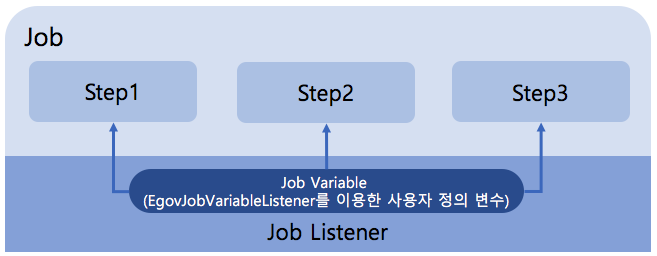

# Job Variable

## 개요

변수 선언 후 Job Listeners를 통해서 모든 Job에서 사용자 정의 변수를 사용할 수 있도록 EgovJobVariableListener를 통해서 지원한다.  
사용자가 변수를 정의하여 여러 job에서 해당 변수를 공유하여 사용 가능한 기능으로 이루어져있다.



## 설명

### Job Variable 설정

배치실행환경에서 제공하는 EgovJobVariableListener 사용하여 사용자 정의 변수를 설정한다.

```xml
<bean id="egovJobVariableListener" class="egovframework.rte.bat.support.EgovJobVariableListener">
<property name="pros">
<props>
	<prop key="JobVariableKey1">JobVariableValue1</prop>
	<prop key="JobVariableKey2">JobVariableValue2</prop>
	<prop key="JobVariableKey3">JobVariableValue3</prop>
</props>
</property>
</bean>
```

### job 설정

job 설정시 listener를 사용하여 공유변수 서비스를 설정한다.

```xml
<job id="delimitedToDelimitedJob-JobVariable" parent="eGovBaseJob" xmlns="http://www.springframework.org/schema/batch">
	<listeners>
		<listener ref="egovJobVariableListener" />
	</listeners>
	<step id="step1">
		<tasklet ref="taskletJob" />
	</step>
</job>
```

### job에서 tasklet 선언시 Step에서 Job Variable 사용

setter 방식으로 공유변수 사용시 아래와 같이 응용하여 설정한다.

```xml
<bean id="taskletJob" class="egovframework.example.bat.step.TaskletJob" scope="step">
	<property name="jobVariable" value="#{jobExecutionContext[JobVariableKey1]}" />
</bean>
```

### Setp 처리시 Job Variable 사용

```java
public class TaskletJob implements Tasklet, InitializingBean {
 
	private String jobVariable;
 
	@Value("#{jobExecutionContext[JobVariableKey2]}")
	private String vJobVariable;
 
	public String getJobVariable() {
		return jobVariable;
	}
 
	public void setJobVariable(String jobVariable) {
		this.jobVariable = jobVariable;
	}
 
	@Override
	public RepeatStatus execute(StepContribution contribution,
	               ChunkContext chunkContext) throws Exception {
 
		//Tasklelt 선언시 setter의해 선언된  Job Variable : jobVariable
 
		//annotation @Value 통해 선언된  Job Variable : vJobVariable
 
		//direct 접근을 통한 Job Variable 사용 : chunkContext.getStepContext().getJobExecutionContext().get("JobVariableKey3")
		return RepeatStatus.FINISHED;
	}
}
```
