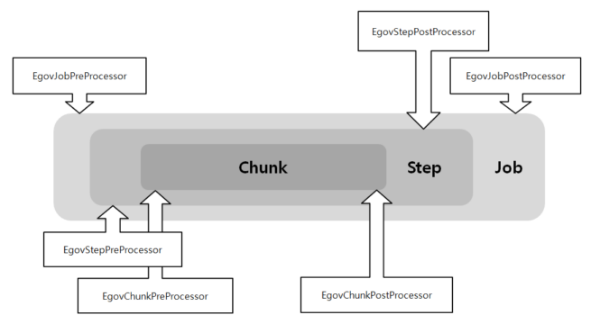

# Listener (Pre/Post Processing)

## 개요

 배치 수행시 Job을 구성하는 각 단계(Job, Step, Chunk, Read, Process, Write)에서 이벤트설정을 통해 다양한 추가구성을 할 수 있다. 이벤트는 Listener를 활용하여 설정하고, 배치 수행중 설정한 Listener를 접하게 되면 관련된 이벤트를 수행하게 된다.

## 설명

### JobListener(Intercepting Job Execution)

 Job 실행 과정에서, 사용자가 정의한 코드가 실행 될 수 있도록 Job의 라이프사이클에서 다양한 이벤트로 알려주는 것은 유용하다.SimpleJob는 적절한 시간에 JobListener를 호출하도록 한다.

```java
public interface JobExecutionListener {
	void beforeJob(JobExecution jobExecution);
	void afterJob(JobExecution jobExecution);
}
```

 JobListeners는 Job의 리스너들을 통해 SimpleJob에 추가 될 수 있다.

```xml
<job id="footballJob">
	<step id="playerload" parent="s1" next="gameLoad"/>
	<step id="gameLoad" parent="s2" next="playerSummarization"/>
	<step id="playerSummarization" parent="s3"/>
	<listeners>
		<listener ref="sampleListener"/>
	</listeners>
</job>
```

 Job의 성공, 실패에 관계없이 afterJob이 호출되어야한다. 만약 성공과 실패의 결정이 필요하다면 JobExecution에서 얻을 수 있다.

```java
public void afterJob(JobExecution jobExecution){
	if( jobExecution.getStatus() == BatchStatus.COMPLETED ){
		//job success
	}
	else if(jobExecution.getStatus() == BatchStatus.FAILED){
		//job failure
	}
}
```

 ✔ JobExecutionListener 인터페이스에 해당하는 Annotations

| Annotations | 설명 |
| --- | --- |
| @BeforeJob | Job수행 전에 호출 |
| @AfterJob | Job수행 후에 호출 |

### StepListener(Intercepting Step Execution)

#### StepExecutionListener

 StepExecutionListener는 Step 실행에서 가장 일반적인 리스너이다. Step에 대한 정보를 Step 시작전과 종료후에 알려준다.

```java
public interface StepExecutionListener extends StepListener {
	void beforeStep(StepExecution stepExecution);
	ExitStatus afterStep(StepExecution stepExecution);
}
```

 afterStep의 반환 리턴타입인 ExitStatus는 청리스너에게 단계 완료시 반환되는 exit-code를 수정 할 수있는 기회를 준다.

 이 인터페이스에 해당하는 주석입니다

 ✔ StepExecutionListener 인터페이스에 해당하는 Annotations

| Annotations | 설명 |
| --- | --- |
| @BeforeStep | Step 수행 전에 호출 |
| @AfterStep | Step 수행 후에 호출 |

#### ChunkListener

 Chunk는 트랜잭션 범위 내에서 아이템을 처리하는 것이다. 트랙잭션을 커밋하고, commit interval 단위로 Chunk를 커밋한다. ChunkListener는 Chunk 처리를 시작하기 전에 또는 성공적으로 완료 한 후 구현로직을 수행한다.

```java
public interface ChunkListener extends StepListener {
	void beforeChunk();
	void afterChunk();
}
```

 beforeChunk 메소드는 트랜잭션이 시작해서 ItemReader의 read 수행되기전에 불린다. 반대로, afterChunk 메소드는 rollback이 일어나지 않고 Chunk가 커밋된 후에 불린다.

 ✔ ChunkListener 인터페이스에 해당하는 Annotations

| Annotations | 설명 |
| --- | --- |
| @BeforeChunk | Chunk 수행 전에 호출 |
| @AfterChunk | Chunk 수행 후에 호출 |

 ✔ TaskletStep 수행같은 Chunk 선언이 없는 경우에는 ChunListener을 적용할 수 없다.

#### ItemReadListener

 Skip 로직 설명에서, 나중에 처리 할 수 있도록 Skip로그를 기록할 수 있다고 언급했다. read 오류의 경우, ItemReaderListener 가 이 작업을 수행한다.

```java
public interface ItemReadListener<T> extends StepListener {
	void beforeRead();
	void afterRead(T item);
	void onReadError(Exception ex);
}
```

 beforeRead 메소드는 ItemReader에서 read 수행 전에 호출된다.  
afterRead 메소드는 read 수행이 성공했을때 호출되고, 읽은 item을 전달한다.  
Read 수행중 오류가 발생하는 경우 onReadError 메서드가 호출된다. 기록을 위해 발생한 예외정보가 전달된다.

 ✔ ItemReadListener인터페이스에 해당하는 Annotations

| Annotations | 설명 |
| --- | --- |
| @BeforeRead | Read수행 전에 호출 |
| @AfterRead | Read수행 후에 호출 |
| @OnReadError | Read 수행중 오류발생시 호출 |

#### ItemProcessListener

 ItemReadListener 처럼, item 처리에서도 리스너가 있다.

```java
public interface ItemProcessListener<T, S> extends StepListener {
	void beforeProcess(T item);
	void afterProcess(T item, S result);
	void onProcessError(T item, Exception e);
}
```

 beforeProcess 메소드는 ItemProcessor의 process 과정 이전에 호출이 되고, 처리되는 item 을 전달한다.  
afterProcess 메소드는 item 이 성공적으로 처리된 후에 호출된다.  
만약 처리과정에서 에러가 발생한다면, onProcessError가 호출되는데 예외정보와 item을 전달하므로 기록을 남길 수 있다.

 ✔ ItemProcessListener 인터페이스에 해당하는 Annotations

| Annotations | 설명 |
| --- | --- |
| @BeforeProcess | Process 수행 전에 호출 |
| @AfterProcess | Process 수행 후에 호출 |
| @OnProcessError | Process 수행중 오류발생시 호출 |

#### ItemWriteListener

 ItemWriteListener로 item을 쓰는 과정에서 리스너를 호출할 수 있다.

```java
public interface ItemWriteListener<S> extends StepListener {
	void beforeWrite(List<? extends S> items);
	void afterWrite(List<? extends S> items);
	void onWriteError(Exception exception, List<? extends S> items);
}
```

 beforeWrite 메소드는 ItemWriter에서 write 수행 전에 호출되고 쓰여진 item을 전달한다.  
afterWrite 메소드는 write 수행이 성공했을때 호출되고, 읽은 아이템을 전달한다.  
write 수행중 오류가 발생하는 경우 onWriteError 메소드가 호출된다. 기록을 위해 발생한 예외정보와 item들이 리스트형식으로 전달된다.

 ✔ ItemWriteListener 인터페이스에 해당하는 Annotations

| Annotations | 설명 |
| --- | --- |
| @BeforeWrite | Write 수행 전에 호출 |
| @AfterWrite | Write 수행 후에 호출 |
| @OnWriteError | Write 수행중 오류 발생시 호출 |

#### SkipListener

 itemReadListener, ItemProcessListener, ItemWriteListner 에서 에러발생을 알려주는 메카니즘을 제공하지만, item 처리가 Skip 될 경우에는 아무도 알려주지 않는다. 이를 위해 Skip된 item을 추적하는 인터페이스가 있다.

```java
public interface SkipListener<T,S> extends StepListener {
	void onSkipInRead(Throwable t);
	void onSkipInProcess(T item, Throwable t);
	void onSkipInWrite(S item, Throwable t);
}

```

 onSkipInRead 메소드는 read 수행중 Skip 발생할경우 언제나 호출된다. 주의할 점은 한 번 이상 Skip 되었기에 롤백은 동일한 항목이 등록될 수 있다는 것을 알려야 한다.  
onSkipInWrite 메소드는 write 수행중 Skip 이 발생한 경우 호출되는데, 여기서 해당 item은 성공적으로 read 되었기 때문에 item 그 자체를 인수로 제공한다.

 ✔ SkipListener 인터페이스에 해당하는 Annotations

| Annotations | 설명 |
| --- | --- |
| @OnSkipInRead | Read 수행중 Skip 발생시 호출 |
| @OnSkipInWrite | Write 수행중 Skip 발생시 호출 |
| @OnSkipInProcess | Process 수행중 Skip 발생시 호출 |

##### SkipListeners and Transactions

 SkipListener에 대한 가장 일반적인 사용 사례 중 하나는 다른 일괄 처리나 사람이 직접 처리할 때 사용할 수 있도록 Skip된 item을 기록하는 것이다.

 ✔ 트랜잭션에서 롤백 될 수 있는 경우가 많기 때문에 스프링에서는 다음 두가지를 보장한다.

 1\. 적절한 Skip 방법은(오류에 따라) 항목 당 한 번만 호출된다.  
2\. SkipListener는 항상 트랜잭션 커밋 전에 호출된다. 그러므로 리스너에 의해 호츨된 트랜잭션 자원은 ItemWriter에서 실패하여 롤백되지 않는다.

#### 관련 예시

- 어노테이션 사용

```java
public class EventNoticeListener {
	@Autowired
	EgovEmailEventNoticeTrigger egovEmailEventNoticeTrigger;
 
 
	// Job 수행완료 후 수행
	@AfterJob
	public ExitStatus sendJobNotice(JobExecution jobExecution) {
 
		egovEmailEventNoticeTrigger.invoke(jobExecution);
		...
	}
 
	 // Step 수행완료 후 수행
	@AfterStep
	public ExitStatus sendStepNotice(StepExecution stepExecution) {
 
		egovEmailEventNoticeTrigger.invoke(stepExecution);
		...
	}
 
	// Read 중 Error 발생시 수행
	@OnReadError
	public void sendErrorNotice(Exception e) {
 
		egovEmailEventNoticeTrigger.invoke(e);
		...
	}
}
```

### 작업 전후처리 관리 (EgovPre/PostProcessor)

 전자정부 표준프레임워크에서는 스프링에서 제공하는 다양한 Listener를 배치작업의 구성요소(Job, Step, Chunk)별로 나누고 각 단계의 전/후로 나누어, 클래스 이름만으로 독립적인 역할을 명확히 알 수 있는 Processor를 제공한다. Processor 들은 Job 설정파일의 &lt;listener&gt;가 호출하며, 각각의 Processor가 호출되는 위치는 다음 그림을 참조한다.

   
✔ 그림의 EgovSampleXXXProcessor는 예시 클래스이며, 전자정부 표준프레임워크에서 제공하는 Processor를 상속받아 구현된 클래스이다.

 

#### Job Processor

##### 종류

| 클래스명 | 제공메소드명 | 파라미터 | 설명 |
| --- | --- | --- | --- |
| EgovJobPreProcessor | beforeJob() | JobExecution | Job 단계 이전에 호출 |
| EgovJobPostProcessor | afterJob() | JobExecution | Job 단계 이후에 호출 |

```java
public class EgovJobPreProcessor extends JobExecutionListenerSupport {
	/**
	 * Job 수행 이전에 호출되는 부분
	 */
	public void beforeJob(JobExecution jobExecution) {
 
	}
}
```

```java
public class EgovJobPostProcessor extends JobExecutionListenerSupport {
	/**
	 * Job 수행 이후에 호출되는 부분 
	 */
	public void afterJob(JobExecution jobExecution) {
 
	}
}
```

##### 설정

 위 클래스를 상속받아 사용자가 정의한 Job Processor는 설정파일에서 &lt;listeners&gt;를 이용해 다음과 같은 위치에 설정한다.

```xml
<job id="ProcessorJob" xmlns="http://www.springframework.org/schema/batch">
	<listeners>
		<listener ref="jobListener" />
	</listeners>
	<step id="ProcessorStep">
		<tasklet>
			<chunk reader="itemReader" writer="itemWriter" commit-interval="2"/>
		</tasklet>
	</step>
</job>
 
<bean id="jobListener" class="사용자가 정의한 Job Processor 클래스" />
```

#### Step Processor

##### 종류

| 클래스명 | 제공메소드명 | 파라미터 | 설명 |
| --- | --- | --- | --- |
| EgovStepPreProcessor | beforeStep() | StepExecution | Step 단계 이전에 호출 |
| EgovStepPostProcessor | afterStep() | StepExecution | Step 단계 이후에 호출 |

```java
public class EgovStepPreProcessor<T, S> extends StepListenerSupport<T, S> {
	/**
	 * Step 수행 이전에 호출되는 부분
	 */
	public void beforeStep(StepExecution stepExecution) {
 
	}
}
```

```java
public class EgovStepPostProcessor<T, S> extends StepListenerSupport<T, S> {
	/**
	 * Step 수행 이후에 호출되는 부분
	 */
	public ExitStatus afterStep(StepExecution stepExecution) {
		return null;
	}
}
```

##### 설정

 위 클래스를 상속받아 사용자가 정의한 Step Processor는 설정파일에서 &lt;listeners&gt; 를 이용해 다음과 같은 위치에 설정한다.

```xml
<job id="ProcessorJob" xmlns="http://www.springframework.org/schema/batch">
	<step id="ProcessorStep">
		<tasklet>
			<chunk reader="itemReader" writer="itemWriter" commit-interval="2"/>
		</tasklet>
		<listeners>
			<listener ref="stepListener" />
		</listeners>
	</step>
</job>
 
<bean id="stepListener" class="사용자가 정의한 Step Processor 클래스" />
```

#### Chunk Processor

##### 종류

| 클래스명 | 제공메소드명 | 파라미터 | 설명 |
| --- | --- | --- | --- |
| EgovChunkPreProcessor | beforeChunk() | 없음 | Chunk 단계 이전에 호출 |
| EgovChunkPostProcessor | afterChunk() | 없음 | Chunk 단계 이후에 호출 |

```java
public class EgovChunkPreProcessor extends ChunkListenerSupport {
	/**
	 * Chunk 수행 이전에 호출되는 부분
	 */
	public void beforeChunk() {
 
	}
}
```

```java
public class EgovChunkPostProcessor extends ChunkListenerSupport {
	/**
	 * Chunk 수행 이후에 호출되는 부분
	 */
	public void afterChunk() {
 
	}
}
```

##### 설정

 위 클래스를 상속받아 사용자가 정의한 Chunk Processor는 설정파일에서 &lt;listeners&gt; 를 이용해 다음과 같은 위치에 설정한다.

```xml
<job id="ProcessorJob" xmlns="http://www.springframework.org/schema/batch">
	<step id="ProcessorStep">
		<tasklet>
			<chunk reader="itemReader" writer="itemWriter" commit-interval="2">
				<listeners>
					<listener ref="chunkListener" />
				</listeners>
			</chunk>	
		</tasklet>
	</step>
</job>
 
<bean id="chunkListener" class="사용자가 정의한 Chunk Processor 클래스" />
```

#### 사용예시

 [작업 전후처리 예제](./batch-example-pre-post-process-mgmt.md)

## 참고자료

 [http://static.springsource.org/spring-batch/reference/html/configureJob.html#interceptingJobExecution](http://static.springsource.org/spring-batch/reference/html/configureJob.html#interceptingJobExecution)  
[http://static.springsource.org/spring-batch/reference/html/configureStep.html#interceptingStepExecution](http://static.springsource.org/spring-batch/reference/html/configureStep.html#interceptingStepExecution)