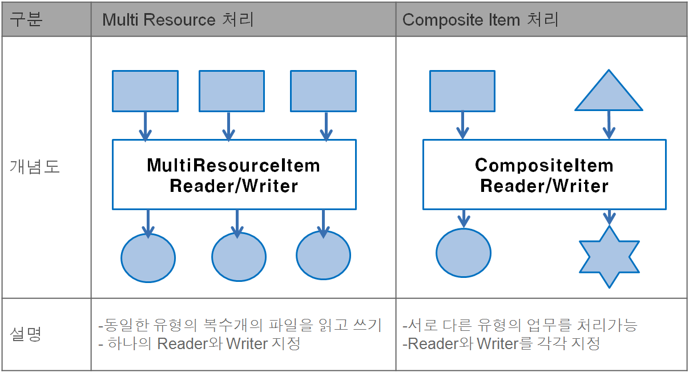
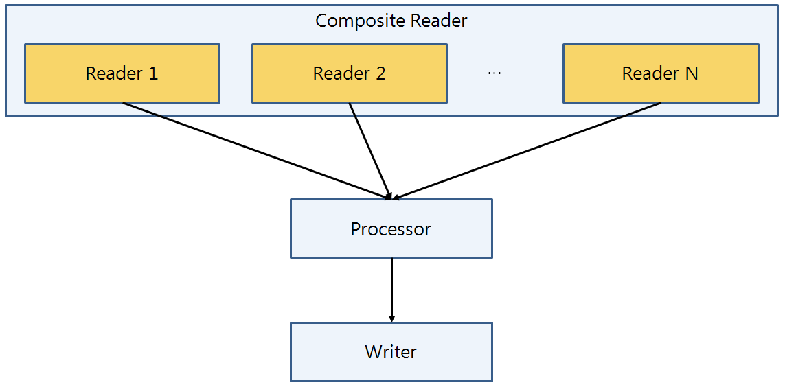
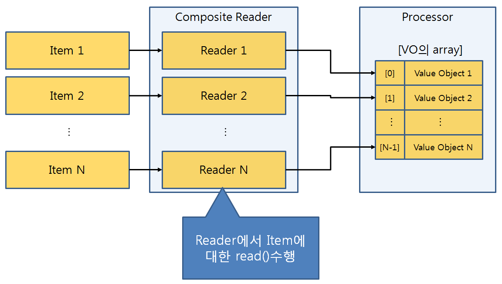
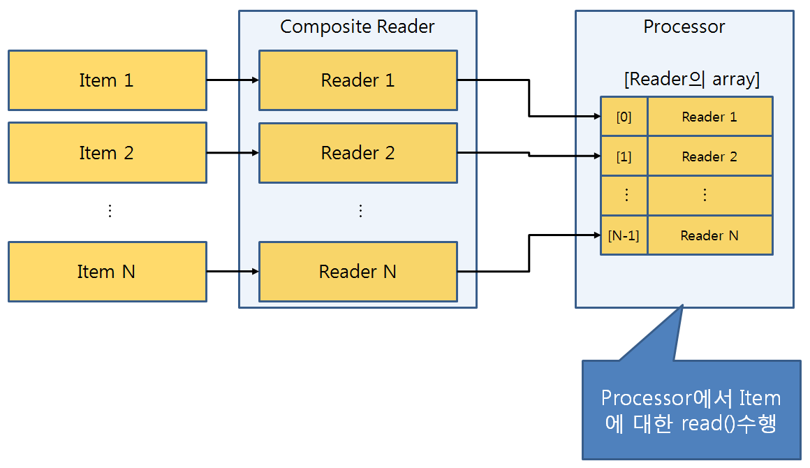

# MultiDataProcessing

## 개요

 배치 수행시 다수의 리소스를 처리하고자 할 경우에는 일반적인 Job설정으로 처리할 수 없다. 전자정부 배치프레임워크에서는 MultiData Processing을 통해 다수의 리소스를 읽어 다수의 결과로 처리하거나 다수의 리소스를 읽어 하나의 결과로 처리하는 기능을 제공한다.

## 설명

 다수(N개)의 리소스를 처리하는 방식은 N→1, N→N으로 구분된다.  

- MultiResourceItem처리: N개의 대상을 읽은 후, 읽은 개수만큼의 결과물을 만들어낸다.
- CompositeItem처리: N개의 대상을 읽은 후, 하나의 결과물을 만들어낸다.

두 방식을 개념적으로 비교하면 아래와 같다.



### MultiResourceItem 처리

 다수의 파일을 대상으로 동일한 유형의 Batch처리를 하고자 할 경우 MultiResourceItemReader를 사용하면 편리하다.  
예를 들어, 아래와 같이 'file~'로 시작하는 파일명을 가진 파일들에 대해 일괄 변경을 수행하고자 할 경우에도 적용 가능하다.  

```bash
file-1.txt  file-2.txt  ignored.txt

```

#### Job 설정

 Job수행에 사용되는 Reader및 Writer설정은 일반적인 Job과 동일하다.  

```xml
<job id="multiResourceIoJob" xmlns="http://www.springframework.org/schema/batch">
    <step id="multiResourceIoStep1">		
        <tasklet>
	    <chunk reader="itemReader" processor="itemProcessor" writer="itemWriter" commit-interval="2"/>
	</tasklet>	
    </step>
</job>
```

#### Reader 설정

 MultiResourceItemReader를 통해 여러 개의 리소스를 읽어온 다음, 1개의 리소스를 처리하는 Reader에게 데이터처리를 위임한다.  
이 때, input resource경로에 \*를 사용하여 다수의 파일을 처리 가능하다.

```xml
<bean id="itemReader" class="org.springframework.batch.item.file.MultiResourceItemReader" scope="step">
    <property name="delegate">
        <bean class="org.springframework.batch.item.file.FlatFileItemReader">
            <property name="lineMapper">
	        <bean class="org.springframework.batch.item.file.mapping.DefaultLineMapper">
		    <property name="lineTokenizer">
		        <bean class="org.springframework.batch.item.file.transform.DelimitedLineTokenizer">
			    <property name="delimiter" value="," />
			    <property name="names" value="name,credit" />
			</bean>
		    </property>
		    <property name="fieldSetMapper">
			<bean class="org.springframework.batch.item.file.mapping.BeanWrapperFieldSetMapper">
			    <property name="targetType" 
                               value="egovframework.brte.sample.common.domain.trade.CustomerCredit" />
			</bean>
         	    </property>
		 </bean>
	     </property>
	 </bean>
    </property>
    <property name="resources" value="classpath:data/input/file-*.txt" />
</bean>
```

#### Writer 설정

 MultiResourceItemWriter를 통해 출력파일의 개수를 지정한 다음, 1개의 리소스를 처리하는 Writer에게 데이터처리를 위임한다.

```xml
<bean id="itemWriter" class="org.springframework.batch.item.file.MultiResourceItemWriter" scope="step">
    <property name="resource" value="#{jobParameters['output.file.path']}" />
    <property name="itemCountLimitPerResource" value="6" />
    <property name="delegate" ref="delegateWriter" />
</bean>
 
<bean id="delegateWriter" class="org.springframework.batch.item.file.FlatFileItemWriter">
    <property name="lineAggregator">
        <bean class="org.springframework.batch.item.file.transform.DelimitedLineAggregator">
            <property name="delimiter" value="," />
            <property name="fieldExtractor">
                <bean class="org.springframework.batch.item.file.transform.BeanWrapperFieldExtractor">
                    <property name="names" value="name,credit" />
		 </bean>
            </property>
        </bean>
    </property>
</bean>
```

### CompositeItem처리

 스프링 배치에서는 Composite처리와 관련하여 CompositeWriter만을 제공하고 있다. 이에 전자정부 배치프레임워크에서는 CompositeReader를 추가적으로 제공한다.  

#### 처리 프로세스

CompositeReader의 일반적인 처리 프로세스는 아래와 같다.  

  

✔ **주의!** CompositeReader는 등록된 모든 Reader로부터 데이터를 한 라인씩 순서대로 읽어와서 배열에 넣어주는 역할까지 수행한다.따라서,Writer를 바로 사용하면 안되고 Processor에서 배열을 읽어서 처리하는 과정이 반드시 필요하다.  

#### 처리 유형

 CompositeReader에는 Reader에서 리소스를 처리해서 Processor로 VO를 전달하는 유형과 Reader자체를 그대로 Processor로 전달하는 유형으로 나뉘며,  
Processor에서는 전달된 데이터 타입에 맞게 비즈니스 로직을 구현할 수 있다.  

| 유형 I - VO(ValueObject)를 Processor에 전달하는 유형 | 유형 II - Reader를 Processor에 전달하는 유형 |
| --- | --- |
|  |  |
| 
```xml
<bean id="compositeItemReader"
   class="egovframework.brte.core.item.composite.reader.EgovCompositeFileReader">
    <property name="itemsMapper">
        <bean
           class="egovframework.brte.core.item.composite.EgovCompositeItemMapper" />
    </property>
    <property name="returnType" value="vo" />
    <property name="itemReaderList">
        <list>
            <ref bean="itemReader1" />
            <ref bean="itemReader2" />
        </list>
    </property>
</bean>
``` | 

```xml
<bean id="compositeItemReader"
   class="egovframework.brte.core.item.composite.reader.EgovCompositeFileReader">
    <property name="itemsMapper">
        <bean
           class="egovframework.brte.core.item.composite.EgovCompositeItemMapper" />
    </property>
    <property name="returnType" value="reader" />
    <property name="itemReaderList">
        <list>
            <ref bean="itemReader1" />
            <ref bean="itemReader2" />
        </list>
    </property>
</bean>
``` |

#### Job 설정

 CompositeItem처리를 위한 Job설정은 reader에 compositeItemReader를 설정하고, processor를 지정해야 한다.  

```xml
<job id="compositeItemJob" xmlns="http://www.springframework.org/schema/batch">
    <step id="compositeItemStep">
        <tasklet>
	    <chunk reader="compositeItemReader" processor="itemProcessor" writer="itemWriter"
	       commit-interval="5" />
        </tasklet>
    </step>
</job>
```

#### Reader 설정

 ComposteItemReader를 설정하기 위해서는 Reader로 사용할 Class, returnType, itemReaderList 항목을 작성해야 한다.  

```xml
<bean id="compositeItemReader"
   class="egovframework.brte.core.item.composite.reader.EgovCompositeFileReader">
    <property name="itemsMapper">
        <bean
           class="egovframework.brte.core.item.composite.EgovCompositeItemMapper" />
    </property>
    <property name="returnType" value="vo" />
    <property name="itemReaderList">
        <list>
            <ref bean="itemReader1" />
            <ref bean="itemReader2" />
        </list>
    </property>
</bean> 
 
<bean id="itemReader1" class="org.springframework.batch.item.file.FlatFileItemReader" scope="step">
    <property name="resource" value="#{jobParameters[inputFile]}" />
    <property name="lineMapper">
        <bean class="org.springframework.batch.item.file.mapping.DefaultLineMapper">
            <property name="lineTokenizer">
                <bean class="org.springframework.batch.item.file.transform.FixedLengthTokenizer">
                    <property name="names" value="name,credit" />
                    <property name="columns" value="1-9,10-11" />
                </bean>
            </property>
            <property name="fieldSetMapper">
                <bean class="org.springframework.batch.item.file.mapping.BeanWrapperFieldSetMapper">
                    <property name="targetType" value="egovframework.brte.sample.common.domain.trade.CustomerCredit" />
                </bean>
            </property>
        </bean>
    </property>
</bean>	
 
<bean id="itemReader2" class="org.springframework.batch.item.file.FlatFileItemReader" scope="step">
    <property name="lineMapper">
        <bean class="org.springframework.batch.item.file.mapping.DefaultLineMapper">
	    <property name="lineTokenizer">
                <bean class="org.springframework.batch.item.file.transform.DelimitedLineTokenizer">
                    <property name="delimiter" value=","/>
                    <property name="names" value="name,credit" />
                </bean>
            </property>
            <property name="fieldSetMapper">
                <bean class="org.springframework.batch.item.file.mapping.BeanWrapperFieldSetMapper">
                    <property name="targetType" value="egovframework.brte.sample.common.domain.trade.CustomerCredit" />	
                </bean>
            </property>
        </bean>
    </property>
    <property name="resource" value="#{jobParameters[inputFile]}" />
</bean>
```

 ✔ CompositeItemReader에서 사용가능한 Class는 총 3개가 존재하며 각 Class별 특징은 다음과 같다.  

| 종류 | 설명 |
| --- | --- |
| EgovCompositeFileReader | FlatFile(FixedLength,Delimited), XMLFile 등 파일처리를 위한 용도로 사용 |
| EgovCompositeCursorReader | JdbcCursorItemReader를 통해 DB리소스 처리를 하고자 할 경우에 사용 |
| EgovCompositePagingReader | JdbcPagingItemReader, IbatisPagingItemReader 등 Paging단위로 DB리소스 처리를 하고자 할 경우에 사용 |

#### Processor 설정

 CompositeItemReader를 통해 넘어온 VO 또는 Reader를 Processor에서 꺼내와서 처리하는 로직을 구현해야 한다.  

```java
public class FileItemProcessor implements ItemProcessor<EgovCompositeDataProvider, TargetVO> {
 
    public TargetVO process(EgovCompositeDataProvider eprovider) throws Exception {
        Object[] obj = eprovider.getMapItems();
 
        //배열에서 항목을 꺼내오는 로직	
        CustomerCredit vo1 = (CustomerCredit)obj[0];
        CustomerCredit vo2 = (CustomerCredit)obj[1];
 
 
        //비즈니스 로직 처리 가능 
        TargetVO vo = new TargetVO();
 
        if(vo1 !=null) {
            vo.setId(vo1.getId());
        }
        if(vo2 != null) {
            vo.setName(vo2.getName());
        }
        return vo;
    }
}
```

 ✔ **주의!**  

- 배열에서 object를 꺼내오는 순서는 ItemList에 설정한 순서이며, 꺼내올 때 Object의 타입에 주의한다.
- Processor에서 Writer로 넘겨줄 VO타입을 작성하는 부분에 주의한다.
- ItemReader에서 읽어온 데이터의 길이가 항상 같지는 않기 때문에 읽어온 VO가 null이 아닐 때까지 처리되도록 null체크를 위한 분기문을 넣어준다.
- 결과 VO는 반드시 1개가 되어야 하므로 위와 같이 처리할 수 없는 비즈니스 로직은 다른 방식으로 처리해야 한다.

## 참고자료

- [CompositItem 예제](https://www.egovframe.go.kr//wiki/doku.php?id=egovframework:rte2:brte:batch_example:composite_item)
- [MultiResource예제](https://www.egovframe.go.kr//wiki/doku.php?id=egovframework:rte2:brte:batch_example:multi_resource)
- MultiItemReader[http://static.springsource.org/spring-batch/reference/html/readersAndWriters.html#multiFileInput](http://static.springsource.org/spring-batch/reference/html/readersAndWriters.html#multiFileInput)
- CompositeItemWriter[http://static.springsource.org/spring-batch/reference/html/readersAndWriters.html#delegatePatternAndRegistering](http://static.springsource.org/spring-batch/reference/html/readersAndWriters.html#delegatePatternAndRegistering)