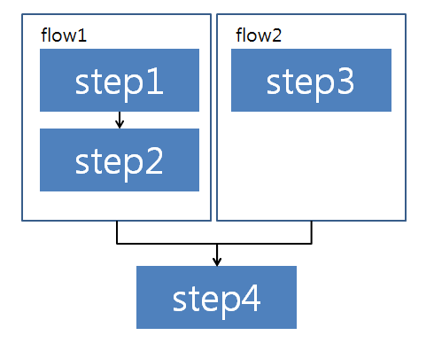
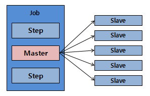
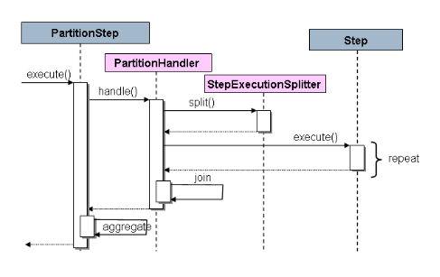

# 병행처리

## 개요


대용량 데이터를 처리하는 배치수행에서 병렬처리를 이용하면, Job의 구성요소들이 여러 쓰레드 분산수행되어 빠른 시간 내에 효율적으로 작업을 완료할 수 있다.
스프링 배치에서 병렬처리 방식은 실행 유형별로 멀티쓰레드 방식, Parallel 방식, 파티셔닝 방식 등이 있다.

## 설명

### 멀티쓰레드(Multi-threaded Step)

병렬처리를 시작하는 간단한 방법은 Step 구성요소중 \<tasklet> 속성에 TaskExecutor를 추가하는 것이다.

```xml
<step id="loading">
    <tasklet task-executor="taskExecutor">...</tasklet>
</step>
```


TaskExecutor 예제에서 TaskExecutor 인터페이스를 구현하기 위해 빈을 정의한다. TaskExecutor 는 스프링 인터페이스 표준이므로 상세한 내용은 스프링 가이드를 참고한다. 가장 간단한 멀티쓰레드 TaskExecutor 는 SimpleAsyncTaskExecutor 이다. 위 Step 구성으로 수행한 결과 각 청크단위의 reading, processing, writing 과정이 분리된 쓰레드에서 수행된다. 즉, 처리시 순서를 보장하지 않으며 Chunk는 단일 쓰레드 수행과 비교해 item 들이 연속적이지 않다.(commit-Interval의 영향으로 Chunk 내의 순서는 같을 수 있다.)

✔ 쓰레드 수는 기본값으로 4가 설정되어 있으나, 필요하다면 다음처럼 증가시켜 사용한다.

```xml
<step id="loading"> 
	<tasklet task-executor="taskExecutor" throttle-limit="20">
		...
	</tasklet>
</step>
```

✔ DataSource 처럼 Step에서 사용되는 풀이 리소스들에 의해 대체될 수 있다. 그러므로 Step에서 병행처리 되는 쓰레드 수를 원하는 만큼 최대한 풀을 설정해야 한다.

#### 관련 예제

[멀티쓰레드 예제](./batch-example-multi_process.md)

### Parallel Steps

병행처리가 필요한 응용프로그램 로직은 서로 다른 책임으로 분할될 뿐만 아니라, 각 단계에서 할당되면 그것이 한 프로세스에서 병행처리가 될 수 있다. Parallel Step 수행은 사용하고 구성하기 쉽다.
예를 들어, step3 와 병행처리할 스텝들(step1, step2)은 다음처럼 흐름을 설정하면 된다.

```xml
<job id="job1">
    <split id="split1" task-executor="taskExecutor" next="step4">
        <flow>
            <step id="step1" parent="s1" next="step2"/>
            <step id="step2" parent="s2"/>
        </flow>
        <flow>
            <step id="step3" parent="s3"/>
        </flow>
    </split>
    <step id="step4" parent="s4"/>
</job>
 
<beans:bean id="taskExecutor" class="org.spr...SimpleAsyncTaskExecutor"/>
```

task-executor 속성은 각각의 흐름을 실행하는데 필요한 TaskExecutor 구현을 지정하기 위해 사용한다. 기본 설정은 SyncTaskExecutor 이고, 비동기로 실행하려면 이 설정을 AsyncTaskExecutor 로 변경해 주어야 한다.

✔ 각 작업 분할은 최종 종료 상태로 통합되기 전에 모두 완료하도록 구성해야 한다. 아래 그림처럼 분리된 flow들이 모두 완료해야만 다음 step으로 진행가능하다.




#### 관련 예제

[Parallel 예제](./batch-example-multi_process.md)

### 파티셔닝(Partitioning)

스프링배치는 Step의 파티셔닝 수행을 원격으로 파티셔닝하기 위하여 SPI를 제공한다. 다음 수행 패턴을 그림으로 표현했다.



Job은 왼쪽부터 Step의 흐름대로 진행된다. Step들 중에서 하나는 마스터 라벨로 지정되어 있다. 이 그림에서 슬레이브 라벨들은 Step의 인스턴스로 식별되고, 그 결과가 마스터의 결과로 귀속된다. 슬레이브는 전형적으로 원격서비스로 이루어지며 로칼쓰레드로 전달된다. JobRepository 의 스프링배치 meta-data에서 각각의 슬레이브가 Job에서 각각 한번 수행되는 것을 보장한다.

스프링배치의 SPI는 Step의 특별한 구현(PartitionStep)으로 구성되어있다. PartitionHandler와 StepExecutionSplitter 라는 두개의 인터페이스가 있고 이 역할은 아래 그림을 참고한다.



오른쪽의 Step은 잠재적으로 여러 객체를 갖고 있고 각 역할을 수행하는 remote 슬레이브이다. Partition Step은 다음과 같이 구성되어 있다.

```xml
<step id="step1.master">
    <partition step="step1" partitioner="partitioner">
        <handler grid-size="10" task-executor="taskExecutor"/>
    </partition>
</step>
```

✔ 멀티쓰레드 스텝의 throttle-limit 속성과 유사하게 grid-size 속성이 있어서, 이것이 각 Step의 요청이 포화상태가 되는 것을 방지한다.

#### PartitionHandler

PartitionHandler 는 Remote 환경이나 Grid 환경의 구조를 알고있는 컴포넌트이다.
이것은 DTO 같은 포맷으로 감싸 StepExecution을 원격에 있는 Step에 보낼 수 있다. 여기에서는 입력데이터들이 어떻게 나누어지는지, 멀티 Step 수행결과들이 어떻게 합쳐지는지 알 필요가 없다.
하지만 스프링 배치는 TaskExecutor 전략을 이용하여 분리된 쓰레드에서 Step들을 수행시키는 유용한 PartitionHandler 도 제공한다. 이런 구현체를 TaskExecutorPartitionHandler라고 하는데 XML 로 구성된 Step에 기본값으로 정해져 있다. 또한, 다음처럼 구성할 수 있다.

```xml
<step id="step1.master">
    <partition step="step1" handler="handler"/>
</step>
 
<bean class="org.spr...TaskExecutorPartitionHandler">
    <property name="taskExecutor" ref="taskExecutor"/>
    <property name="step" ref="step1" />
    <property name="gridSize" value="10" />
</bean>
```

✔ gridSize는 새로 생성할 분리된 Step의 수를 의미하는데, TaskExecutor에서 쓰레드풀 갯수와 같다. gridSize는 사용가능한 쓰레드 수 이상으로 설정이 될 수 있는데, 이 경우 작은 수가 적용이 된다.

#### Partitioner

Partitioner는 새로운 Step Execution을 위한 입력 파라미터와 같은 유사한 역할을 한다.(재시작에 대해 걱정할 필요가 없다.) 아래와 같은 인터페이스가 있으며 메소드는 partition 메소드 하나뿐이다.

```java
public interface Partitioner {
    Map<String, ExecutionContext> partition(int gridSize);
}
```

여기서 메소드의 리턴값은 ExecutionContext 타입과 String 타입의 유일한 이름인 stepExecution이다. 여기서 이름은 파티션된 StepExecution의 Step 이름으로 이후에 배치의 meta data에서 보여준다. ExecutionContext 는 이름, 값으로 구성된 여러 쌍들이 담긴 가방이며 기본키, line 수, 입력 파일의 위치등의 정렬을 포함할 수도 있다.

StepExecution 들의 이름은 Job의 StepExecution이 서로 달라야 한다. 가장좋은 방법은 prefix+suffix 의 형태로 사용자를 위한 의미있는 이름을 만드는 것이다. 여기서 prefix는 실행되는 Step의 이름이고, suffix는 카운터이다. SimplePartitioner가 이와 같은 형태의 StepExecution 이름을 지정한다.

#### Step에 입력리소스 등록하기(Binding Input Data to Steps)

Step이 동일한 구성을 갖는 것은 PartitionHandler에 의해 실행하는 Step과 ExecutionContext에서 런타임에 바인딩하기 위한 입력 매개 변수에 매우 효율적이다. 이것은 스프링 배치의 기능인 [Step Scope](http://static.springsource.org/spring-batch/trunk/reference/html/configureStep.html#step-scope)기능과 비슷하다.

예를 들어, Partitioner 가 fileName 키 속성을 갖고 있는 ExecutionContext 인스턴스를 생성한다면, 각 Step들은 서로다른 파일들을 바라보게 되고 출력결과는 다음처럼 다.

| Step Execution Name (key) | ExecutionContext (value)  |
|---------------------------|---------------------------|
| filecopy:partition0       | fileName=/home/data/one   |
| filecopy:partition1       | fileName=/home/data/two   |
| filecopy:partition2       | fileName=/home/data/three |

#### 관련 예제

[파티셔닝 예제](../../runtime-example/individual-example/batch-layer/batch-example-multi_process.md)

## 참고자료

- http://static.springsource.org/spring-batch/reference/html/scalability.html
