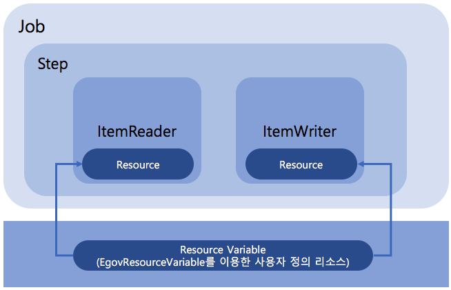

# Resource Variable

## 개요
사용자 정의 리소스 변수 선언 후 Setp에서 ItemReader, ItemWriter에서 사용자  정의 리소스를 사용할 수 있도록 EgovResourceVariable를 통해서 지원한다.



## 설명

### EgovResourceVariable 설정
배치실행환경에서 제공하는 EgovResourceVariable 사용하여 사용자 정의 리소스를 설정한다.

```xml
<bean id="egovResourceVariable" class="egovframework.rte.bat.support.EgovResourceVariable">
	<property name="pros">
	<props>
		<prop key="input.resource">file:./src/main/resources/egovframework/batch/data/inputs/csvData.csv</prop>
		<prop key="writer.resource">file:./target/test-outputs/csvOutput_ResourceVariable_#{new java.text.SimpleDateFormat('yyyyMMddHHmmssSS').format(new java.util.Date())}.csv</prop>
	</props>
	</property>
</bean>
```

### step 정의 시 리소스 사용
Setp에서 ItemReader, ItemWriter 사용시 사용자 정의 리소스 변수를 사용하여 resource 설정이 가능하다.

```xml
<bean id="delimitedToDelimitedJob-ResourceVariable.delimitedToDelimitedStep.delimitedItemReader"
	class="org.springframework.batch.item.file.FlatFileItemReader" scope="step">
	<property name="resource" value="#{egovResourceVariable.getVariable('input.resource')}" />
	<property name="lineMapper">
		<bean class="egovframework.rte.bat.core.item.file.mapping.EgovDefaultLineMapper">
			<property name="lineTokenizer">
				<bean class="egovframework.rte.bat.core.item.file.transform.EgovDelimitedLineTokenizer">
					<property name="delimiter" value="," />
				</bean>
			</property>
			<property name="objectMapper">
				<bean class="egovframework.rte.bat.core.item.file.mapping.EgovObjectMapper">
					<property name="type"
						value="egovframework.example.bat.domain.trade.CustomerCredit" />
					<property name="names" value="name,credit" />
				</bean>
			</property>
		</bean>
	</property>
</bean>
 
<bean id="delimitedToDelimitedJob-ResourceVariable.delimitedToDelimitedStep.delimitedItemWriter"
	class="org.springframework.batch.item.file.FlatFileItemWriter" scope="step">
	<property name="resource" value="#{egovResourceVariable.getVariable('writer.resource')}" />
	<property name="lineAggregator">
		<bean class="org.springframework.batch.item.file.transform.DelimitedLineAggregator">
			<property name="delimiter" value="," />
			<property name="fieldExtractor">
				<bean class="egovframework.rte.bat.core.item.file.transform.EgovFieldExtractor">
					<property name="names" value="name,credit" />
				</bean>
			</property>
		</bean>
	</property>
</bean>
```