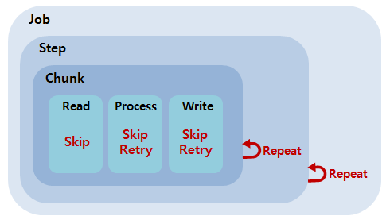

# Skip/Retry/Repeat

## 개요

Skip, Retry, Repeat은 효율적인 배치수행을 위해 필요한 기능들이다. Repeat 정책에 따라 Step과 Chunk가 반복적으로 수행되면서 데이터 Read, Process, Write 과정이 일어나는데, 여기서 Skip과 Retry 이용해 배치작업을 효율적으로 수행할 수 있다. 각 기능이 쓰이는 위치는 다음 그림을 참고한다.



## 설명

### Skip

 Skip은 데이터를 처리하는 동안 설정된 Exception이 발생했을 경우, 해당 데이터 처리를 건너뛰는 기능이다. 데이터의 사소한 오류에 대해 Step의 실패처리 대신 Skip을 함으로써, 배치수행의 빈번한 실패를 줄일 수 있게 한다.

#### Skip 로직 구성(Configuring Skip Logic)

 Skip설정은 Job설정파일의 &lt;chunk&gt; 내부에서 이루어진다. 일반 chunk 설정(reader, processor, writer, commit-interval)에 추가로 skip-limit 을 지정한다. 또한 &lt;skippable-exception-classes&gt;를 지정할 수 있으며 (이것은 옵션?) 상세설명은 다음 표를 참고한다.

| 항목 | 설명 | |
| --- | --- | --- |
| skip-limit | Skip 할 수 있는 최대 횟수를 지정  <br> default=0 이므로 꼭 지정해줘야 Skip기능 사용 할 수 있음 (확인필요) |
| &lt;skippable-exception-classes&gt; | &lt;include&gt; | skip 해야하는 Exception 범위를 지정 |
| &lt;skippable-exception-classes&gt; | &lt;exclude&gt; | include로 지정한 exception의 하위 exception 중, Skip하지 않을 Exception 지정 |

 ✔ &lt;skippable-exception-classes&gt; 항목의 Exception 범위 지정은 데이터 성격에 대해 잘 알고 있는 사람이 결정해야 한다.  
예를 들어 공급업체의 데이터 처리는 Skip 하도록 설정할 수 있지만 금융거래에서 데이터 처리는 Skip이 되어선 안되기 때문이다.

   
다음 예시는 FlatFileItemReader로 데이터를 읽는 과정에서 &lt;include&gt; 로 설정된 FlatFileParseException 발생 시 Skip이 일어나도록 설정이 되어 있고, 이렇게 발생한 Skip은 10번까지만 허용한다. 그 이상의 Skip이 발생한다면 Step을 실패처리한다.

```xml
<step id="step1">
 <tasklet>
  <chunk reader="flatFileItemReader" writer="itemWriter" commit-interval="10" skip-limit="10">
   <skippable-exception-classes>
    <include class="org.springframework.batch.item.file.FlatFileParseException"/>
   </skippable-exception-classes>
  </chunk>
 </tasklet>
</step>
```

   
✔ 내부적으로 Skip의 횟수를 관리하는 Counter가 있는데 read, process, write 별로 분리되어 있으며, skip-limit에는 각 Counter의 합계가 적용된다. 데이터 성격에 따라 Skip관리를 위해 Counter를 유용하게 사용할 수 있다.  
  
위 예시에서 한가지 문제가 있는데 FlatFileItemReader을 제외한 Exception이 발생하는 경우 Job을 실패로 처리하는 것이다. 이러한 처리가 옳을 수도 있지만, 다음예시 처럼 &lt;exclude&gt;를 설정하여 지정한 Exception클래스와 그 하위에러가 발생할 경우에 Skip하지 않고, 에러를 발생시키도록 표현하는 것이 명확하다.

```xml
<step id="step1">
 <tasklet>
  <chunk reader="flatFileItemReader" writer="itemWriter" commit-interval="10" skip-limit="10">
   <skippable-exception-classes>
    <include class="java.lang.Exception"/>
    <exclude class="java.io.FileNotFoundException"/>
   </skippable-exception-classes>
  </chunk>
 </tasklet>
</step>
```

#### 관련예제

 [건너뛰기(Skip) 기능 예제](../../runtime-example/individual-example/batch-layer/batch-example-skip_mgmt.md)

### Retry

 Retry는 데이터를 Processing, Writing 하는 동안 설정된 Exception이 발생했을 경우, 지정한 정책에 따라 데이터 처리를 재시도하는 기능이다. Skip 과 마찬가지로 Retry를 함으로써, 배치수행의 빈번한 실패를 줄일 수 있게 한다.

#### Retry 로직 구성 (Configuring Retry Logic)

 Retry설정은 Job설정파일의 &lt;chunk&gt; 내부에서 이루어진다. 일반 chunk 설정(reader, processor, writer, commit-interval)에 추가로 retry-limit 을 지정한다. 또한 &lt;retryable-exception-classes&gt;를 지정할 수 있으며 상세설명은 하단 표를 참고한다.

| 항목 | | 설명 |
| --- | --- | --- |
| retry-limit | |Retry 할 수 있는 최대 횟수를 지정 |
| &lt;retryable-exception-classes&gt; | &lt;include&gt; | Retry 해야하는 Exception 범위를 지정 |
| &lt;retryable-exception-classes&gt; | &lt;exclude&gt; | include로 지정한 exception의 하위 exception 중, Retry하지 않을 Exception 지정 |

 ✔ Item Processing과 Item Writing 과정에서만 Retry 된다.  
  
데이터를 처리하는 Read과정에서 주로 발생하는 FlatFileParseException 대한 문제는 대부분 Skip에서 처리가 된다.  
반면에, Process 과정과 Write과정에서 발생하는 데이터 선점에 대한 DeadlockLoserDataAccessException 등은 Retry를 통해 해결할 수 있다. 즉, 다른 프로세스에서 처리중인 데이터에 새로운 프로세스가 접근하는 경우 Lock이 걸려 있어 에러가 발생하는데 잠시 후 재시도 하면 성공할 수 있는 것이다.  
  
✔ Read과정까지 성공한 데이터는 캐쉬에 저장된다. 그러므로 재시도가 일어날 경우 캐쉬의 데이터를 가져와 Process 과정부터 다시 수행한다.  
  
✔ retryable exception은 기본적으로 rollback을 유발하므로 너무 많은 Retry는 성능을 저하시킬 수 있으므로 주의해야 한다.

   
다음 예시는 데이터를 처리하는 과정에서 &lt;include&gt; 로 설정된 DeadlockLoserDataAccessException 발생 시 Retry가 일어나도록 설정이 되어 있고, 이렇게 발생한 Retry는 3번까지만 허용한다. 그 이상의 Retry가 발생한다면 Step을 실패처리한다. 최초 데이터를 읽는 것부터 한번의 시도로 취급하므로, 예제에서는 두번의 시도를 더 할 수 있다.

```xml
<step id="step1">
 <tasklet>
  <chunk reader="itemReader" writer="itemWriter" commit-interval="2" retry-limit="3">
   <retryable-exception-classes>
    <include class="org.springframework.dao.DeadlockLoserDataAccessException"/>
   </retryable-exception-classes>
  </chunk>
 </tasklet>
</step>
```

#### 기타 설정

- retry-policy : <chunk>에서 retry-limit등을 직접 입력하지 않고, 사용자가 상세하게 작성한 Retry 정책을 적용

```xml
<job id="retryPolicyJob" xmlns="http://www.springframework.org/schema/batch">
 <step id="retryPolicyStep">
  <tasklet>
    <chunk reader="reader" writer="writer" commit-interval="100" retry-policy="retryPolicy" />
  </tasklet>
 </step>
</job>
 
<bean id="retryPolicy" class="org.springframework.batch.retrypolicy.SimpleRetryPolicy">
 <property name="maxAttempts" value="3" /> 							
</bean>
```

- backOffPolicy : 다시 Retry를 시도하기까지의 지연시간 (단위:ms), 처리시간이 긴 데이터가 있을 경우 backOffPolicy로 재시도의 시간간격을 조절하여 Retry 설정 변경 가능

```xml
<job id="job1" job-repository="jobRepository"> 
 <step id="step1" parent="stepParent"> 
     ... 
 </step> 
</job>
 
<bean id="stepParent" class="org.springframework.batch.core.step.item.FaultTolerantStepFactoryBean" abstract="true"> 
 <property name="backOffPolicy"> 
  <bean class="org.springframework.batch.retry.backoff.FixedBackOffPolicy" 
   <property name="backOffPolicy" value="2000" /> 
  </bean> 
 </property> 
</bean>
```

#### Retry 템플릿(RetryTemplate)

 조금 더 견고하게 실패를 처리하고, 바로 이어서 시도해서 데이터 처리를 성공할 수 있다고 생각되는 경우, 자동으로 실패한 연산을 재시도하는 것이 도움이 된다. 예를 들어, 네트웍 문제로 실패한 웹 서비스나 ROM 서비스나 데이터베이스 갱신에서 발생한 DeadLockLoserException을 예로 들 수 있다. 스프링 배치에서는 이러한 연산을 자동으로 재시도 하기 위한 RestryOperations 전략을 갖고 있다.

```java
public interface RetryOperations {
 
    <T> T execute(RetryCallback<T> retryCallback) throws Exception;
 
    <T> T execute(RetryCallback<T> retryCallback, RecoveryCallback<T> recoveryCallback) 
        throws Exception;
 
    <T> T execute(RetryCallback<T> retryCallback, RetryState retryState) 
        throws Exception, ExhaustedRetryException;
 
    <T> T execute(RetryCallback<T> retryCallback, RecoveryCallback<T> recoveryCallback, 
        RetryState retryState) throws Exception;
 
}
```

 콜백은 재시도하는 비즈니스 로직을 넣을 수 있는 간단한 인터페이스다.

```java
public interface RetryCallback<T> {
 
    T doWithRetry(RetryContext context) throws Throwable;
 
}
```

 콜백이 실행되고 예외가 발생해서 실패하는 경우, 성공할때까지 재시도 하게 된다. 또는 구현 여부에 따라 취소 여부를 결정한다.  
가장 간단한 일반적으로 목적의 RetryOperations의 구현은 RetryTemplate이다.

```java
RetryTemplate template = new RetryTemplate();
 
template.setRetryPolicy(new TimeoutRetryPolicy(30000L));
 
Foo result = template.execute(new RetryCallback<Foo>() {
 
    public Foo doWithRetry(RetryContext context) {
        // Do stuff that might fail, e.g. webservice operation
        return result;
    }
 
});
```

 위 예제에서는 웹 서비스 호출을 실행하고 결과를 사용자에게 반환한다. 만약 호출이 실패하면 타임아웃이 될 때까지 재시도한다.

##### RetryContext

 RetryCallback의 파라메터로 RetryContext가 있다. 콜백에서는 이 context를 무시하지만, 만약 필요하다면 반복되는 동안에 데이터를 저장하는 속성 가방(Attribute Bag)으로 사용할 수 있다.

##### RecoveryCallback

 Retry가 모두 사용되면, RetryOperation 은 다른 콜백(RecoveryCallback)에게 콜백 제어권을 넘길 수 있다. 이런 기능을 사용하려면 같은 방법으로 콜백에 전달하면 된다.

```java
Foo foo = template.execute(new RetryCallback<Foo>() {
    public Foo doWithRetry(RetryContext context) {
        // business logic here
    },
  new RecoveryCallback<Foo>() {
    Foo recover(RetryContext context) throws Exception {
          // recover logic here
    }
});
```

 비즈니스로직이 템플릿 중단을 결정하기 전에 성공되지 못한다면, 클라이언트는 RecoveryCall을 통해 다른 처리를 할 기회가 주어진다.

##### Stateless Retry

 단순한 Retry 방법은 RetryTemplate이 성공이나 실패를 할때까지 계속 시도하는 루프이다. RetryContext는 재시도 할건지 취소할 건지를 결정하는데 사용하는 상태를 포함하지만, 이 상태는 스택에 저장되고, 어디서나 접근하도록 글로벌하게 저장할 필요는 없다. 그러므로 우리는 이 방법을 무상태 재시도(Stateless Retry)라고 부른다. 무상태 재시도와 상태 유지 재시도 사이의 차이는RetryPolicy의 구현여부이다. (RetryTemplate은 둘 다 제어할 수 있다.) 무상태 재시도에서 Retry가 실패될 때, 콜백은 항상 동일한 쓰레드에서 수행된다.

##### Stateful Retry

 트랜잭션 처리하는 자원을 무효화 시키는 실패는 몇가지 고려사항이 있다. (일반적으로)트랜잭션 처리가 없기 때문에 간단한 원격호출에 적용될 뿐만아니라 하이버네이트를 사용처럼 데이터베이스 갱신에도 적용된다. 이럴 경우 트랜잭션이 롤백되서, 다시 유효한 트랜잭션으로 시작할 수 있도록 실패가 되자마자 예외를 다시 던지는게 상황에 맞다.

   
예외를 다시 던지고(re-throw) 롤백하는 것은 남겨진 RetryOperations.execute메소드와 잠재적으로 스택에 있는 context를 손실하게 되기 때문에, 이런경우 무상태 재시도는 좋은 방법이 아니다. 이 손실을 피하기 위해서는 스택에서 context를 빼내서, 힙 저장 영역에 넣어두는 저장 전략을 도입해야 한다. 이러한 목적으로 스프링 배치는 RetryContextCache를 제공한다. RetryContextCache의 기본 구현은 단순하게 Map을 사용해서 메모리에 저장한다. (비록 클러스터 환경에서는 지나칠지라도) 클러스터 환경에서 다수의 프로세스를 처리하는 고급 사용법은 여러 종류의 클러스터 캐시를 사용하는 RetryContextCache 구현을 고려하자.

   
RetryOperations의 책임의 일부는 새로운 실행 (그리고 일반적으로 새 트랜잭션에 싸여)에 돌아 왔을 때 실패한 작업을 인식하는 것이다. 이 원할히 하기 위해, 스프링 배치는 RetryState 추상화를 제공한다. 실패한 작업을 인식하는 방법은 재시도의 여러 호출에 대한 상태를 식별하는 것이다. 상태를 확인하기 위해, 사용자는 Item을 식별하는 고유키를 리턴하는 RetryState객체를 제공해야 한다. 식별자는 RetryContextCache에서 키로 사용된다.

##### ✔ 주의

 RertyState에 이해 리턴되는 키에서 Object.equals()와 Object.hashCode() 구현은 매우 조심해야 한다. 가장 추천하고 싶은 것은 Item을 구분할 수 있는 비즈니스키를 사용하는 것이다. JMS 메시지 경우에 messageID 가 사용될 수 있다.

#### Retry 정책(Retry Policies)

 RetryTemplate에서 execute 메소드의 재시도나 실패를 결정하는건 RetryPolicy에 의해서 결정된다. RetryPolicy는 RetryContext의 팩토리가 되기도 한다. RetryTemplate은 RetryContext를 만들기 위해서 현재 정책을 사용해야 할 책임을 갖으며, 시도마다 RetryCallback에 이를 전달한다. 콜백이 실패한 후에 RetryTemplate은 상태를 갱신하려고 RetryPolicy를 호출하며(RetryContext에 저장된다), 그 다음으로 또 다른 시도를 할 수 있는 경우에 RetryPolicy를 호출해서 정책을 문의하게 된다. (예를 들어, 제한에 걸렸거나 타입아웃이 되버린 것처럼) 또 다른 시도를 하지 못하게 되면, 정책은 다 사용된 상태를 관리하는 책임을 진다. 단순히 구현하자면 RetryExhastedException을 던지게 되고, 관련된 트랜잭션은 롤백된다. 좀 더 정교하게 구현하자면,트랜잭션을 손상하지 않고 유지할 수 있는 경우에 복구 행동을 시도할 수 있다.

##### ✔ Tip

 실패는 태생적으로 재시도 여부가 결정된다. 일부 예외에서는 언제나 비지니스 로직 문제로 던져지므로 재시작 하는데 전혀 도움이 되지 못한다. 그러므로 모든 예외 타입에 대해서 재시도를 하면 안된다. 오로지 재시도를 할 수 있는 예외에만 집중해야 한다. 일반벅으로 더 공격적으로 재시도를 처리하는 것은 비즈니스 로직에 해가 되지는 않지만, 미리 실패를 알고 있는 것을 재시도하면서 시간을 소비하는 경우라면 비경제적이다.

 스프링 배치는 범용목적의 statelses RetryPolicy의 구현을 제공한다. 예를 들어 SimpleRetryPolicy,TimeoutRetryPolicy 가 아래의 예에서 사용된다. SimpleRetryPolicy는 정해진 최대횟수만큼 예외유형의 리스트에 있는 재시도를 허락한다. SimpleRetryPolicy는 재시도되면 안되는 “치명적”예외 목록을 가지고 있으며, 재시도 동작 그 이상의 미세한 제어를 사용할 수 있도록 재시도가능한 목록에 덮어쓰기된다.

```java
SimpleRetryPolicy policy = new SimpleRetryPolicy(5);
// Retry on all exceptions (this is the default)
policy.setRetryableExceptions(new Class[] {Exception.class});
// ... but never retry IllegalStateException
policy.setFatalExceptions(new Class[] {IllegalStateException.class});
// Use the policy...
RetryTemplate template = new RetryTemplate();
template.setRetryPolicy(policy);
template.execute(new RetryCallback<Foo>() {
   public Foo doWithRetry(RetryContext context) {
      // business logic here
}
});
```

 사용자는 더 많은 재정의된 결정에 자신의 재시도 정책을 구현해야 할 수도 있다.

#### Backoff 정책(Backoff Policies)

 일시적인 실패 후에 재시도되 때, 실패의 원인이 되는 일부 문제들은 단지 잠시 기다리기만 해도 해결되는 경우가 있기 때문에, 많은 경우 다시 시도하기 전에 잠시 기다리는게 도움이 되기도 한다. RetryCallback이 실패한 경우,

```java
public interface BackoffPolicy {
 
    BackOffContext start(RetryContext context);
 
    void backOff(BackOffContext backOffContext) 
        throws BackOffInterruptedException;
 
}
```

 BackoffPolicy 는 자유롭게 방법을 선택해 구현하면 된다. 스프링 배치에서 제공되는 정책은 특별히 Object.waite()를 사용한다. 공통적인 사용은 두 재시도가 락에 걸리고 둘다 실패하는 것을 피하기 위해 긴 기다림이 증가하는 BackOff가 있다. 이러한 목적으로 스프링배치에서 ExponentialBackoffPolicy를 제공한다.

#### 리스너(Listeners)

 종종 서로 다른 다수의 반복에서 공통으로 걸리는하는 추가적인 콜백을 받아오는 것이 유용할 때가 있다. 이러한 목적으로 스프링 배치는 RetryListener 인터페이스를 제공한다. RetryTemplate은 사용자가 RetryListener를 등록하도록 해주며, 반복 동안에 이용할 수 있는 RetryContext와 Throwable 와 함께 콜백에 전해진다.

```java
public interface RetryListener {
 
    void open(RetryContext context, RetryCallback<T> callback);
 
    void onError(RetryContext context, RetryCallback<T> callback, Throwable e);
 
    void close(RetryContext context, RetryCallback<T> callback, Throwable e);
}
```

 open과 close콜백이 모든 재시도 전후에 호출되며, onError()는 개별적인 RetryCallback 호출에 적용된다. 또한 close메소드는 RetryCallback에 의해서 마지막에 던저진 에러가 있는 경우에 Throwable을 받아올 수 있다. 다수의 리스너를 리스트로 갖으며 이는 순서가 있다. open메소드의 경우 동일한 순서로 호출되며,onError()와 close()는 역순으로 호출된다.

#### 선언적 Retry(Declarative Retry)

 때때로 발생할 때마다 재시작하고 싶은 비즈니스 처리과정이 있다. 고전적인 예로 원격 서비스 호출이 있다. 스프링 배치는 이러한 목적에 딱 맞는 RetryOperations에서 호출되는 메소드를 감싸는 AOP 인터셉터를 제공한다.RetryOperationsInterceptor는 가로챈 메소드를 실행하고, 제공된 RetryTemplate에 있는 RetryPolicy에 따라서 실패를 재시도 한다.  
아래는 remoteCall을 호출하는 메소드 서비스 호출을 재시도 하는데 스프링 AOP 네임스페이스를 사용하는 선언적인 재시도의 예제다.

```xml
<aop:config>
    <aop:pointcut id="transactional" expression="execution(* com..*Service.remoteCall(..))" />
    <aop:advisor pointcut-ref="transactional" advice-ref="retryAdvice" order="-1"/>
</aop:config>
 
<bean id="retryAdvice" class="org.springframework.batch.retry.interceptor.RetryOperationsInterceptor"/>
```

 이 예에서는 인터셉터 내에 있는 기본 RetryTemplate을 사용한다. 리스너나 정책을 변경하기 위해 인터셉터에 RetryTemplate을 적용하는 것이 필요하다.

#### 관련예제

 [재시도(Retry) 예제](../../runtime-example/individual-example/batch-layer/batch-example-retry_mgmt.md)

### Repeat

 배치는 작업의 구성요소인 Step과 그 하위의 Chunk의 지속적인 반복수행으로 이루어진다. 여기서 반복수행은 Repeat정책을 따르며 구성요소별로 반복을 발생시킴으로써 배치를 수행하는 기능이다.

#### Repeat 템플릿(RepeatTemplate)

 배치 처리 과정은 단순하게 최적화되거나 Job의 일부요소의 반복적인 행동이다. 스프링 배치는 반복을 전략적으로 일반화하고, iterator 프레임워크를 제공하기 위해 RepeatOperations 인터페이스를 가지고 있다.  
RepeatOperations 인터페이스는 다음과 같다.

```java
 public interface RepeatOperations {
    RepeatStatus iterate(RepeatCallback callback) throws RepeatException;
}
```

 콜백은 반복되는 비즈니스 로직을 추가하도록 해주는 간단한 인터페이스다.

```java
public interface RepeatCallback {
    RepeatStatus doInIteration(RepeatContext context) throws Exception;
}
```

 콜백은 반복이 끝났다고 결정될 때까지 반복적으로 실행된다. 이 인터페이스에서 반환하는 값은 RepeatStatus.CONTINUABLE 또는 RepeatStatus.FINISHED 이다. RepeatStatus는 더 수행할 작업이 있는지에 대한 repeat 수행 호출정보를 전달한다. 일반적으로 RepeatOperations의 구현은 RepeatStatus를 확인하고, 이것을 이용해 수행을 종료할지 반복할지에 대한 결정을 내린다. 호출자에게 더 이상 할 일이 없다는 신호를 보내고자 하는 모든 콜백은 ExistStatus.FINISHED를 반환하면 된다.  
RepeatOperations의 가장 간단하고 일반적인 구현은 RepeatTemplate이다. 다음처럼 사용한다.

```java
RepeatTemplate template = new RepeatTemplate(); 
template.setCompletionPolicy(new FixedChunkSizeCompletionPolicy(2)); 
template.iterate(new RepeatCallback() {
		public ExitStatus doInIteration(RepeatContext context) {
		// Do stuff in batch...
		return ExitStatus.CONTINUABLE;
		} 
});
```

 이 예에서는 계속 할 일이 있다는 것을 보여주는 ExitStatus.CONTINUABLE을 반환한다. 더 이상 수행할 것이 없다는 요청을 보내고 싶다면 ExitStatus.FINISHED 을 반환한다.

- RepeatContext

 RepeatContext는 RepeatCallback의 메소드 인자다. 많은 콜백들은 단순하게 context를 무시하지만, 반복 하는 동안에 일시적으로 사용할 필요가 있는 데이터를 저장하는 속성 가방 (Attribute Bag)으로서 사용될 수 있다. iterate 메소드가 결과 를 반환한 후에, context는 더 이상 존재하지 않게 된다. RepeatContext는 처리 과정에서 내제된 반복이 필요한 경우 부모 context를 갖게 된다. 종종 부모 context는 반복되는 호출 사이에 공유할 필요가 있는 데이터를 저장하는데 유용하다.

- RepeatStatus

 ExitStatus는 스프링 배치에서 처리 과정이 끝났고, 처리가 성공인지 아닌지를 지정하는 목적으로 사용한다. 또는 배치나 반복의 종료 상태에 대한 정보(textual information)를 전달하는데 사용된다. 이 정보는 종료 코드의 형태와 자유로운 형식의 문자상태에 대한 설명이 된다.

| 프로퍼티 이름 | 설명 |
| --- | --- |
| CONTINUABLE | 작업이 남아 있음 |
| FINISHED | 더 이상의 반복 없음 |

 RepeatStatus 값은 and 메소드를 사용해 논리 AND수행과 결합될 수 있다. 즉, 어떤 수행의 상태가 FINISHED 면 결과는 FINISHED 다.

#### 완료 정책(Completion Policies)

 RepeatTemplate 내에서 iterate 메소드에 있는 루프의 종료는 CompletionPolicy에 의해서 결정된다. CompletionPolicy 는 RepeatContext에 대한 팩토리도 된다. RepeatTemplate은 RepeatContext를 생성하는 정책을 이용해 반복 중 모든 단계에서 RepeatCallback에게 전달해야 하는 책임을 가지고 있다. 콜백이 완료된 후에 RepeatTemplate의 doInIteration는 상태를 갱신해야 하는지(RepeatContext에 저장될 것인지) 여부를 CompletionPolicy에게 물어보게 된다. 그 다음으로 반복이 완료된 경우에 정책을 요청하게 된다.

   
스프링 배치는 일반적인 목적으로 사용되는 간단한 CompletionPolicy 구현체를 제공한다. 위 예에서 사용한 SimpleCompletionPolicy을 예로 들 수 있다. SimpleCompletionPolicy는 고정된 시간만큼만 실행을 허용한다. (ExistStatus.FINISHED로 정해진 시간보다 강제적으로 일찍 완료할 수 있다.)

#### 예외 핸들링(Exception Handling)

 RepeatCallback 내에서 예외가 던져지는 경우, RepeatTemplate은 예외를 다시 던져야 하는지를 결정하는데 ExceptionHandler에게 의견을 묻게 된다.

```java
public interface ExceptionHandler {
	void handleException(RepeatContext context, Throwable throwable)
		throws RuntimeException;
}
```

 일반적인 사용방법은 주어진 타입의 예외발생 횟수를 세고, 한도에 도달했을때 실패한다. 이러한 목적에 맞게 스프링 배치는 SimpleLimitExceptionHandler와 조금 더 유연한 RethrowOnThresholdExceptionHandler를 제공한다. SimpleLimitExceptionHandler는 limit 프로퍼티와 현재 예외를 비교하는 예외 타입을 가지고 있다. 이 때 제공된 타입의 모든 하위 클래스들도 처리에 포함시킨다. 주어진 타입의 예외는 한계에 도달할 때까지는 무시되었다가 다시 던져지게 된다. 이러한 다른 예외 타입들도 항상 다시 던진다.  
SimpleLimitExceptionHandler의 선택 가능한 중요한 프로퍼티는 useParent boolean 표시다. 기본값은 false기 때문에, 한계는 현재 RepeatContext에서만 설명된다. true로 설정되었을 때 한계는 내제된 반복(nested iteration)에서 형제context에 걸쳐 유지된다.

#### 리스너(Listeners)

 종종 서로 다른 다수의 반복에서 공통으로 걸리는 추가 콜백을 받아오는 것이 유용한 경우가 있다. 이러한 목적으로 스프링 배치는 RpeatListener 인터페이스를 제공한다. RepeatTemplate은 사용자가 RepeatListener를 등록할 수 있게 해준다. 그리고 콜백 반복 중에 이용할 수 있도록 RepeatContext와 RepeatStatus를 전달한다.

```java
public interface RepeatListener {
	void before(RepeatContext context);
	void after(RepeatContext context, RepeatStatus result);
	void open(RepeatContext context);
	void onError(RepeatContext context, Throwable e);
	void close(RepeatContext context);
}
```

 open과 close 콜백은 개별적언 RepeatCallback 호출에 적용되어 before, after, onError 전후에 호출된다. 또한 다수의 리스너를 리스트로 갖으며 이는 순서가 있다. open과 before는 동일한 순서로 호출되며 after(), onError(), close()는 역순으로 호출된다.

#### 병렬처리(Parallel Processing)

 RepeatOperations의 구현은 순차적으로 콜백을 실행하도록 제한하지 못한다. 구현은 동시에 콜백이 실행할 수 있도록 하는 건 제일 중요하다. 이 때문에 스프링 배치는 RepeatCallback을 실행하는데 TaskExecutor 전략을 사용하는 TaskExecutorRepeatTemplate을 제공한다. 기본적으로 (일반 RepeatTemplate과 같은) 동일한 쓰레드에 있는 전체반복을 수행하는 SynchronousTaskExecutor를 사용한다.

#### 선언적 반복(Declarative Iteration)

 때때로 발생할 때마다 반복하고 싶은 비즈니스 처리과정이 있다. 고전적인 예제로 메세지 파이프라인의 최적화가 있다.메세지를 자주 받게 되는 경우, 매세지 마다 개별적인 트랜잭션으로 처리하는 비용을 참기 보다는 메세지를 배치로 처리 하는게 좀더 효율적이다. 스프링 배치는 이 목적에 맞게 RepeatOperations에서 메소드 호출을 감싸는 AOP 인터셉터를 제공한다. RepeatOperationsInterceptor는 가로챈 메소드를 실행해여 제공된 RepeatTemplate의 CompetionPolicy에 따라서 반복하게 된다.  
여기서는 스프링 AOP 네임스페이스를 사용해서 호출되는 processMessage 메소드를 호출하는 서비스를 반복하는데 선언적인 반복의 예를 보자.

```xml
 <aop:config>
    <aop:pointcut id="transactional"
        expression="execution(* com..*Service.processMessage(..))" />
    <aop:advisor pointcut-ref="transactional"
        advice-ref="retryAdvice" order="-1"/>
</aop:config>
 
<bean id="retryAdvice" class="org.spr...RepeatOperationsInterceptor"/>
```

 이 예에서는 인터셉터 내에 있는 기본 RetryTemplate을 사용한다. 리스너나 정책을 변경하기 위해 인터셉터에 RetryTemplate을 적용하는 것이 필요하다.  
가로챈 메소드가 void 반환 타입이라면, 인터셉터는 언제나 ExistStatus.CONTINUABLE을 반환한다. (그렇기 때문에 CompletionPolicy가 한정된 종료 지점이 없는 경우라면 무한 반복의 위험이 있다.) 만약 그렇지 않다면 가로챈 메소드에서 ExitStatus.FINISHED를 반환하는 지점이 되는 null을 반환할 때까지 ExitStatus.CONTINUABLE을 반환한다. 그래서 대상 메소드 내에 있는 비즈니스 로직은 null을 반환하거나 RepeatTemplate에서 제공하는 ExceptionHandler에 의해서 다시 던진 예외를 던져서 더 할 일이 없다는 신호를 보낼 수 있다.

## 참고자료

 Skip : [http://static.springsource.org/spring-batch/reference/html/configureStep.html#configuringSkip](http://static.springsource.org/spring-batch/reference/html/configureStep.html#configuringSkip)  
Retry : [http://static.springsource.org/spring-batch/reference/html/configureStep.html#retryLogic](http://static.springsource.org/spring-batch/reference/html/configureStep.html#retryLogic) [http://static.springsource.org/spring-batch/reference/html/retry.html](http://static.springsource.org/spring-batch/reference/html/retry.html)  
Repeat : [http://static.springsource.org/spring-batch/reference/html/repeat.html](http://static.springsource.org/spring-batch/reference/html/repeat.html)