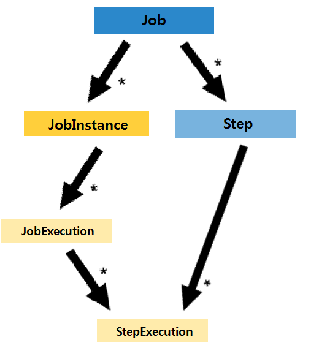
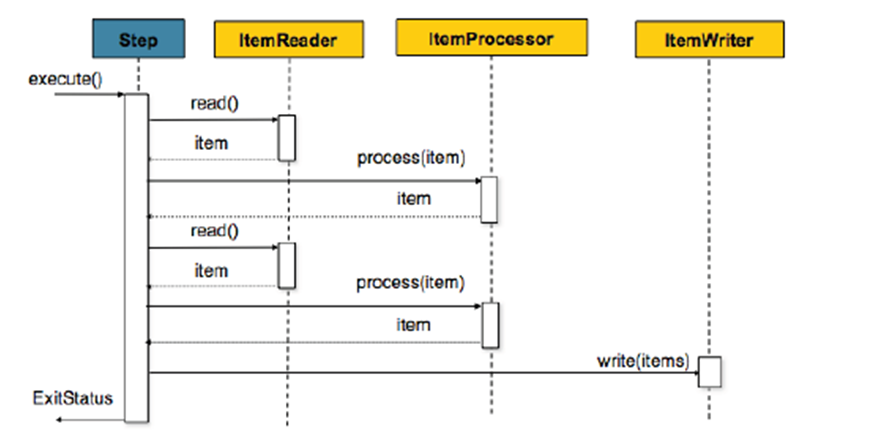
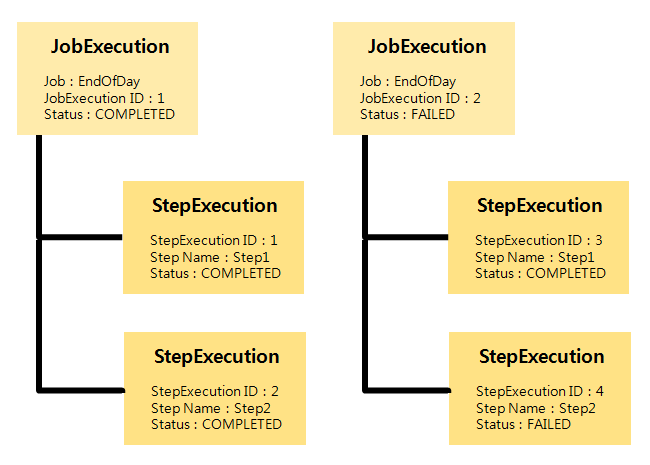

# Step

## 개요

Step은 Job 내부에 구성되어 실제 배치작업 수행을 위해 작업을 정의하고 제어한다. 즉, Step에서는 입력 자원을 설정하고 어떤 방법으로 어떤 과정을 통해 처리할지 그리고 어떻게 출력 자원을 만들 것인지에 대한 모든 설정을 포함한다.

## 설명

Step은 Job의 독립적이고 순차적 단계를 캡슐화하는 도메인 객체다. 그러므로 모든 Job은 적어도 하나 이상의 Step으로 구성되며 Step에 실제 배치작업을 처리하고 제어하기 위해 필요한 모든 정보가 포함된다.
여러개의 Step 중 하나의 Step은 순차적으로 실행되는 과정 중 하나의 흐름으로 생각할 수 있다. Step에는 JobExecution에 대응되는 StepExecution이 있다.



### Step 유형

#### Bean Scope

스프링 빈 선언시 Bean Scope 기본 전략을 singleton를 사용하고 있지만, 스프링 배치에서는 step에서 Bean Scope에 대해 job, step 설정이 가능하다.

##### Step Scope

scope step : 하나의 빈 정의에 대해 step 안에서 lifecycle이 유효하다.	

```xml
<bean id="..." class="..." scope="step">
```

##### Job Scope

scope job : 하나의 빈 정의에 대해 job 안에서 lifecycle이 유효하다.

```xml
<bean id="..." class="..." scope="job">
```

#### Chunk 기반 처리(Chunk-Oriented Processing)

Chunk 기반 처리는 스프링 배치에서 가장 일반적으로 사용하는 Step 유형이다. Chunk 기반 처리는 data를 한번에 하나씩 읽고, 트랜잭션 범위 내에서 'Chunk'를 만든 후 한번에 쓰는 방식이다.
즉, 하나의 item이 ItemReader를 통해 읽히고, Chunk 단위로 묶인 item들이 한번에 ItemWriter로 전달 되어 쓰이게 된다.

Chunk 단위로 Item 읽기 → 처리/변환 → 쓰기의 단계를 거치는 Chunk 기반 처리 매커니즘은 다음과 같다



아래 코드는 위의 그림과 같은 개념의 코드이다.

```java
List items = new Arraylist();
for(int i = 0; i < commitInterval; i++){
    Object item = itemReader.read()

    Object processedItem = itemProcessor.process(item);

    items.add(processedItem);
}

itemWriter.write(items);
```

- 구성요소: ItemReader, ItemWriter, PlatformTransactionManager, JobRepository, (ItemProcessor는 옵션)
- 중요속성: commit-interval(하나의 트랜잭션당 처리 개수), startLimit(step의 실행 제한 횟수)

#### TaskletStep

배치작업을 적용한 업무 환경에 따라 ItemReader와 ItemWriter를 활용한 구조가 맞지 않는 경우도 있을 것이다.
예를들어 단순히 DB의 프로시저 호출만으로 끝나는 배치처리가 있다면 단순히 메소드 하나로 기능을 구현하고 싶어질 것이다. 이런 경우를 위해 스프링 배치에서는 TaskletStep을 제공한다.
Tasklet은 RepeatStatus.FINISHED를 반환하거나 에러가 발생하기 전까지 계속 실행하는 execute() 하나의 메소드를 갖는 간단한 인터페이스로 저장 프로시저, 스크립트, 또는 간단한 SQL 업데이트 문을 호출 할 수 있다.

TaskletStep을 구성하기 위해서는 \<tasklet> 태그의 'ref'속성을 통해 Tasklet 객체를 참조해야한다. \<chunk> 태그는 \<tasklet> 내에서 사용되지 않는다.(\<Chunk> 태그는 Chunk-Oriented Processing에서 사용된다.)

```xml
<step id="step1">
   <tasklet ref="myTasklet"/>
</step>
```

##### Tasklet 의 execute() 메소드를 Implement해서 구현

Tasklet 인터페이스를 구현한 SystemCommandTasklet 클래스를 이용해서 "echo hello"라는 명령어를 5초 동안의 timeout시간을 두고 실행시키는 설정의 예

```xml
<bean id="myTasklet">
    <property name="tasklet">
        <bean class="org.springframework.batch.sample.tasklet.SystemCommandTasklet">
              <property name="command" value="echo hello" />
              <property name="timeout" value="5000" />
        </bean>
    </property>
</bean>
```

##### 관련 예제

[단순처리(Tasklet) 예제](./batch-example-tasklet_mgmt.md)

### StepExecution

Job의 JobExecution과 대응되는 단위로 Step 또한 StepExecution을 갖고 있다.
JobExecution과 마찬가지로 StepExecution은 Step을 수행하기 위한 단 한번의 Step 시도를 의미하며 매번 시도될 떄마다 생성된다.
또한, StepExecution은 주로 Step이 실행 중에 어떤 일이 일어났는지에 대한 속성들을 저장하는 저장 메커니즘 역할을 하며 commit count, rollback count, start time, end time 등의 Step 상태정보를 저장한다. ([StepExecution 속성 자세히 보기](./batch-core-history_management.md))

아래의 그림에서 'Step1', 'Step2' 2개의 Step을 갖는 'EndOfDay' Job이 두번 실행되었다고 가정하자.(두번 시도 결과 JobExecution은 2개 생성) 'EndOfDay' Job을 시도할 때마다 'Step1', 'Step2'도 시도 되기때문에 StepExecution은 2개 씩 생성된다. 그래서 총 4개의 StepExecution이 생성된 것을 볼 수 있다.

✔ StepExecution 4번이 FAILED로 종료 됐으므로 StepExecution 3번, 4번을 포함한 JobExecution 2번은 FAILED로 종료한다.(Step이 모두 정상적으로 완료해야 Step으로 구성된 Job이 정상적으로 완료된다.)



위의 그림을 정리해보면 아래와 같다.

StepExecution ID	Step Name	JobExecution ID	Status

| StepExecution ID | Step Name | JobExecution ID | Status |
|----------------|----------|---------------|---------------|
| 1 | Step1 | 1 | COMPLETED |
| 2 | Step2 | 1 | COMPLETED |
| 3 | Step1 | 2 | COMPLETED |
| 4 | Step2 | 2 | FAILED |

### Step Configuration

Step 구성은 개발자에 따라 간단하거나 아주 복잡하게 구성할 수 있다. 다만 구성을 쉽게하기 위해 스프링 배치 네임스페이스를 사용할 수 있다.

#### Chunk 기반 Step 필수 설정

```xml
<job id="sampleJob" job-repository="jobRepository">
	<step id="step1">
		<tasklet transaction-manager="transactionManager">
			<chunk reader="itemReader" writer="itemWriter" commit-interval="10"/>
		<tasklet>
	</step>
</job>
```
- reader : 배치작업을 위해 item을 읽는 ItemReader
- writer : ItemReader에 의해 읽힌 item을 쓰는 ItemWriter
- transaction-manager : 스프링의 PlatformTransactionManager로 배치작업 중 트랜잭션을 시작하고 커밋하는데 사용 (default 설정은 “transactionManger”이며 생략 가능)
- job-repository : 배치작업 중 StepExecution과 ExecutionContext을 주기적으로 저장하기 위한 저장소 (default 설정은 “jobRepository”이며 생략 가능)
- commit-interval : 트랜잭션이 커밋되기 전 처리되어야할 item의 수

✔ ItemProcessor 속성은 옵션이며 ItemProcessor가 없는 경우 reader에서 writer로 직접 전달된다.

#### 상속을 이용한 설정

##### parent

'parent' 속성은 Step을 상속하여 유사한 설정의 Step이 여러 개일 경우 유용하게 사용할 수 있다. Java에서 클래스 상속과 유사하게 자식 Step은 부모 Step의 속성들과 자신의 속성들을 결합한다. 또한 부모 Step의 속성을 오버라이드 하여 사용할 수도 있다.
아래 예제에서 "parentStep"을 상속받은 "concreteStep1"은 'itemReader', 'itemProcessor', 'itemWriter', startLimit=5, allowStartIfComplete=true로 설정되며, commit-interval은 5로 오버라이드하여 설정된다.

```xml
<step id="parentStep">
	<tasklet allow-start-if-complete="true">
		<chunk reader="itemReader" writer="itemWriter" commit-interval="10"/>
	</tasklet>
</step>

<step id="concreteStep1" parent="parentStep">
	<tasklet start-limit="5">
		<chunk processor="itemProcessor" commit-interval="5"/>
	</tasklet>
</step>
```

##### abstract

Java의 Abstract 클래스와 동일한 개념으로 때로는 완전한 Step을 구성하지 않는 부모 Step의 정의가 필요할 때가 있다. 'abstract' 속성은 Step 설정이 추상레벨인지 여부를 지정한다.
아래 예제에서 "abstractParentStep"은 abstract 선언되었으며 자식 Step인 "concreteStep2"에서는 Step 설정의 필수요소인 'itemReader', 'itemWriter', 'commitInterval'를 정의해야 한다.

```xml
<step id="abstractParentStep" abstract="true">
	<tasklet>
		<chunk commit-interval="10"/>
	</tasklet>
</step>

<step id="concreteStep2" parent="abstractParentStep">
	<tasklet>
		<chunk reader="itemReader" writer="itemWriter"/>
	</tasklet>
</step>
```

##### merge

부모 Step을 상속받아 자식 Step에서 동일한 속성을 정의하는 경우 기본적으로 오버라이딩된다. 그러나 'merge' 속성을 이용해 자녀 Step이 부모 Step에 의해 정의 된 리스너에 추가 리스너를 추가 할 수 있다.(\<listeners>를 포함한 list 속성에서 사용 가능)
아래 예제에서 “concreteStep3” Step은 “listenerTwo”와 “listenerOne”를 모두 사용할 수 있다

```xml
<step id="listenersParentStep" abstract="true">
	<listeners>
		<listener ref="listenerOne"/>
	<listeners>
</step>

<step id="concreteStep3" parent="listenersParentStep">
	<tasklet>
		<chunk reader="itemReader" writer="itemWriter" commit-interval="5"/>
	</tasklet>
	<listeners merge="true">
	<listener ref="listenerTwo"/>
	<listeners>
</step>
```

#### Restart를 위한 Step 설정

##### start-limit

각 Step 실행 횟수를 설정한다. default는 SimpleStepFactoryBean 클래스에서 셋팅 되며 Integer.MAX_VALUE로 설정 되있다.

##### allow-start-if-complete

Job의 Restart 시, “COMPLETED”로 완료한 Step의 실행 여부를 설정한다. true로 설정 시, “COMPLETED”로 완료한 Step도 다시 실행되며 이전 시도의 결과를 오버라이드 한다. (false 설정 시, “COMPLETED”로 완료한 Step은 skip)

아래 예제에서 “step1” Step은 10번만 실행 가능하며 Job을 Restart 했을 시, 이전 시도와 관계없이 재실행 된다.있다

```xml
<step id="step1">
	<tasklet allow-start-if-complete="true" start-limit="10">
		<chunk reader="itemReader" writer="itemWriter" commit-interval="10"/>
	</tasklet>
</step>
```

#### Skip/Retry/Repeat 설정

##### Skip

[Skip 설정 자세히 보기](./batch-core-skip_repeat_retry.md)

##### Retry

[Retry 설정 자세히 보기](./batch-core-skip-repeat-retry.md)

#### Step 흐름제어

[Step 흐름제어(Flow Control) 자세히 보기](./batch-core-flow_control.md) 

#### Step 흐름제어

변수 선언 후 Listeners를 통해서 모든 Setp에서 사용자 정의 변수를 사용할 수 있도록 EgovStepVariableListener를 통해서 지원한다.

[Step Variable 설정 자세히 보기](./batch-core-step_variable.md) 


## 참고자료
* http://static.springsource.org/spring-batch/reference/html/domain.html#domainStep
* http://static.springsource.org/spring-batch/reference/html/configureStep.html