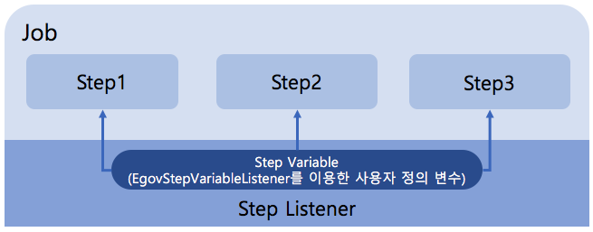

# Step Variable

## 개요

변수 선언 후 Listeners를 통해서 모든 Setp에서 사용자 정의 변수를 사용할 수 있도록 EgovStepVariableListener를 통해서 지원한다.
사용자가 변수를 정의하여 여러 step에서 해당 변수를 공유하여 사용 가능한 기능으로 이루어져있다.



## 설명

### Step Variable 설정

배치실행환경에서 제공하는 EgovJobVariableListener 사용하여 사용자 정의 변수를 설정한다.

```xml
<bean id="egovStepVariableListener" class="egovframework.rte.bat.support.EgovStepVariableListener">
<property name="pros">
<props>
	<prop key="StepVariableKey1">StepVariableValue1</prop>
	<prop key="StepVariableKey2">StepVariableValue2</prop>
	<prop key="StepVariableKey3">StepVariableValue3</prop>
</props>
</property>
</bean>
```

### job, step 설정

step 설정시 listener를 사용하여 공유변수 서비스를 설정한다.

```xml
<job id="delimitedToDelimitedJob-StepVariable" parent="eGovBaseJob" xmlns="http://www.springframework.org/schema/batch">
	<step id="step1">
		<tasklet ref="taskletStep" />
		<listeners>
			<listener ref="egovStepVariableListener" />
		</listeners>
	</step>
</job>
```

### step에서 tasklet 선언시 Step Variable 사용

setter 방식으로 공유변수 사용시 아래와 같이 응용하여 설정한다.

```xml
<bean id="taskletStep" class="egovframework.example.bat.step.TaskletStep" scope="step">
	<property name="stepVariable" value="#{stepExecutionContext[StepVariableKey1]}" />
</bean>
```

### Setp 처리시 Step Variable 사용

```java
public class TaskletStep implements Tasklet, InitializingBean {
 
	private String stepVariable;
 
	@Value("#{stepExecutionContext[StepVariableKey2]}")		
	private String vStepVariable;
 
	public String getStepVariable() {
		return stepVariable;
	}
 
	public void setStepVariable(String stepVariable) {
		this.stepVariable = stepVariable;
	}
 
	@Override
	public RepeatStatus execute(StepContribution contribution,
	               ChunkContext chunkContext) throws Exception {
 
		//Tasklelt 선언시 setter의해 선언된  Step Variable : stepVariable
 
		//annotation @Value 통해 선언된  Step Variable : vStepVariable
 
		//direct 접근을 통한 Step Variable 사용 : chunkContext.getStepContext().getStepExecutionContext().get("StepVariableKey3")
 
		return RepeatStatus.FINISHED;

```

