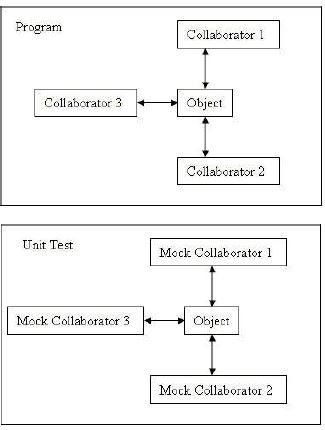
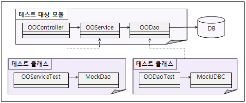

# Mock Support

## 개요
Unit Test Case 작성 시 Mock 객체(모의 객체)를 사용하는 방법에 대해 가이드한다.

## 설명

### Mock 객체의 의미
Mock 객체([Mock Object - Wikipedia](https://en.wikipedia.org/wiki/Mock_object), [mock - 네이버 영어사전](https://en.dict.naver.com/#/main))는 Unit Test의 독립성(isolation)을 높여주기 위해 사용된다.  
테스트하고자 하는 코드와 관련이 있는 객체(collaborator)를 흉내내어 Unit Test를 수행할 수 있도록 도와주는 객체다.

예를 들어, 다음과 같이 프로그램에서 `Object`라는 객체를 테스트하고자 할 경우, 그 `Object`는 다른 클래스와 관계를 갖게 마련이다.   
만약 개발자가 `Object` 하나만을 테스트하고 싶고, 여러 가지 이유로 `Collaborator1`, `Collaborator2`, `Collaborator3` 객체를 사용할 수 없다면, 다음과 같은 방법을 사용할 수 있다:

1. **Mock 객체 생성**: `MockCollaborator1`, `MockCollaborator2`, `MockCollaborator3`와 같은 Mock 객체를 생성한다.
2. **동작 정의**: `Object`가 사용하는 메소드에 대해 원하는 동작을 정의한다.
3. **테스트 수행**: 이렇게 정의된 Mock 객체를 사용하여 `Object`를 테스트한다.

이 과정을 통해, 테스트 대상 객체와의 의존성을 최소화하고, 원하는 기능만을 집중적으로 검증할 수 있다.  
  


  


좀 더 쉬운 예를 들면, 테스트 대상 클래스의 컴파일 오류를 없애기 위해 임시로 Mock 객체를 생성할 수 있다. 또는 웹 컨테이너나 DB 환경을 사용해야 하는데, 그 환경을 구성하기가 어려운 경우, 해당 환경을 흉내내는 Mocking 환경을 만들거나 이미 Mocking한 환경 <a href="#footnote1"><sup>1)</sup></a> 을 사용할 수 있다. 이러한 모든 것을 Mock이라 한다.


다음과 같은 경우에 Mock 객체를 사용할 수 있다:

1. **진짜 객체를 준비하기 어려운 경우**:   
테스트를 위해 실제 객체를 설정하기 힘든 경우.  

2. **진짜 객체가 유발시키기 어려운 동작을 하는 경우**: 
특정 상황을 테스트하기 위해 필요하지만, 실제로는 발생하기 힘든 경우.  

3. **진짜 객체가 느린 경우**:  
 성능을 고려해야 할 때.  

4. **진짜 객체가 사용자 인터페이스를 가지거나, 사용자 인터페이스 자체인 경우**:  
 UI에 의존하는 테스트를 피하고 싶을 때.  

5. **테스트가 진짜 객체에게 어떻게 사용되었는지 물어봐야 하는 경우**:  
 인터랙션을 검증하고 싶을 때.  

6. **진짜 객체가 아직 존재하지 않는 경우**:  
 다른 팀이나 새로운 하드웨어 시스템과 함께 일할 때 자주 발생하는 문제.  


### 실행환경 기반의 TestCase 개발 시 Mock 작성 가이드

실행 환경을 사용할 경우, 개발자는 다음 그림과 같이 **Controller, Service, DAO 등 Tier별로 코드를 작성하게 되며 DB를 사용하는 환경이 구성**하게 될 것이다. 이 때, Mock을 이용하여 TestCase를 작성하여 독립성을 높일 수 있다. 

- 각 테스트 대상에 대해 `OOServiceTest`, `OODaoTest`와 같은 테스트 코드를 작성한다.  

- 대상 코드가 사용하는 Collaborator (`OODao`, `DB`)에 대해 각각 `MockDao`, `MockJDBC`와 같은 Mock 객체를 작성한다. 


혹시 더 관련있는 클래스가 있다면 해당 클래스에 대해서도 Mock을 작성하거나 코드 내에서 Mocking하여 대상 코드의 테스트에 집중할 수 있다.   

특히, DB의 경우 실제 DB를 사용하여 테스트하고자 한다면 [DB Support](https://www.egovframe.go.kr/wiki/doku.php?id=egovframework:dev2:tst:db_support)를 참조하면 되고, 드물게 JDBC 코딩 관련하여 Mock을 사용하여 DB 자체에 대한 테스트를 배제하고 DAO에 대한 테스트에만 집중할 수도 있다.  
   


  

### Mock 객체 구현 종류

개발자가 Mock을 사용할 경우, 다음과 같은 3가지 경우가 있을 수 있다.

#### 1. 이미 구현된 Mock 객체 사용
JEE 환경의 웹 컨테이너나 DB, 메일 서버 등은 테스트하기 어려운 환경이다.  
이러한 것들은 이미 오픈소스나 상용 소프트웨어로 Mock 환경이나 Mock 객체를 구현하여 제공하기도 한다.  
특히 실행 환경에서 채택한 Spring에서는 테스트 클래스를 작성하기 쉽도록 다양한 Mock 객체와 유틸리티를 제공한다.

**예시**: 
- Spring Test (web, JNDI)
- [Mockrunner](https://mockrunner.sourceforge.net/)

✔ 사용법과 샘플에 대한 설명은 [이미 구현된 Mock 객체 사용](#이미-구현된-mock-객체-사용)을 참조한다.


#### 2. Mock 라이브러리 사용
간단한 클래스나 인터페이스가 있는 경우, 컴파일 오류를 방지하기 위해서나 타 객체에 대한 의존성을 줄이기 위해 자신의 TestCase 코드 내에서 잠시 타 객체를 Mocking할 수 있도록 제공하는 [다양한 오픈소스](https://www.noyescutler.com/)가 있다. 본 개발 환경에서는 [EasyMock](https://easymock.org/)을 사용한다.

**예시**: 
- [mockobjects.com](http://www.mockobjects.com/)
- [EasyMock](https://easymock.org/)
- [JMock](http://jmock.org/)
- [Mockito](https://code.google.com/archive/p/mockito/)

✔ 사용법과 샘플에 대한 설명은 [Mock 라이브러리 사용](#Mock-라이브러리-사용)을 참조한다.

---

#### 3. Mock으로 사용할 Collaborator를 직접 구현
코드 내에서 자주 Mocking되거나 여러 곳에서 사용되는 클래스나 테스트를 위한 환경을 별도로 작성해놓고 싶은 경우<a href="#footnote2"><sup>2)</sup></a>에 직접 Mock 클래스를 생성할 수 있다.

**예시**: 
- Commons-mail Mock
- SMS Mock

✔ 사용법과 샘플에 대한 설명은 [Mock으로 사용할 Collaborator를 직접 구현](#Mock으로-사용할-Collaborator를-직접-구현)을 참조한다.

---

## 환경설정

Maven Project인 경우 아래와 같은 dependency를 설정하면 된다.

```xml
<dependency>
    <groupId>junit</groupId>
    <artifactId>junit</artifactId>
    <version>4.4</version>
    <scope>test</scope>
</dependency>

<dependency>
    <groupId>org.easymock</groupId>
    <artifactId>easymock</artifactId>
    <version>2.4</version>
    <scope>test</scope>
</dependency>

<dependency>
    <groupId>org.easymock</groupId>
    <artifactId>easymockclassextension</artifactId>
    <version>2.4</version>
    <scope>test</scope>
</dependency>

<dependency>
    <groupId>org.dbunit</groupId>
    <artifactId>dbunit</artifactId>
    <version>2.4.3</version>
    <scope>test</scope>
</dependency>

<dependency>
    <groupId>org.unitils</groupId>
    <artifactId>unitils</artifactId>
    <version>2.2</version>
    <scope>test</scope>
</dependency>

<dependency>
    <groupId>org.springframework</groupId>
    <artifactId>spring-mock</artifactId>
    <version>2.0.8</version>
</dependency>
```

### 주의 사항
✔  **JUnit 버전**: Spring Framework 2.5에서는 JUnit 4.5 버전이 동작하지 않으므로, JUnit 4.4 버전을 사용해야 한다.
✔  **테스트 자동화**: [Test Automation](https://www.egovframe.go.kr/wiki/doku.php?id=egovframework:dev2:tst:test_automation), [Test Reporting](https://www.egovframe.go.kr/wiki/doku.php?id=egovframework:dev2:tst:test_reporting), [Test Coverage](https://www.egovframe.go.kr/wiki/doku.php?id=egovframework:dev2:tst:test_coverage) 관련 사항은 해당 문서를 참조하자.
✔  **Maven 업데이트**: 필요 시 Maven > Update project configuration을 수행하여 변경 사항을 반영할 수 있다.

## 사용법
Mock을 사용한 예에 대해 가이드 프로그램에 샘플 코드를 포함하였다. [Mock 객체 구현 종류](#Mock-객체-구현-종류)에서 설명한 것과 같이 각각에 맞는 샘플에 대해 설명하도록 하겠다.

### 이미 구현된 Mock 객체 사용
이미 구현된 Mock 객체는 특정 클래스라기보다 환경을 구성하는 클래스군이다. 예를 들어, JDBC API에 대한 Mock, Servlet API에 대한 Mock 등이 있다.  
여기에서는 Spring Test에서 제공하는 Servlet API Mock과 JNDI Mock 사용에 대한 샘플을 설명하다. 자세한 내용은 [Spring Reference - 8. Testing](https://docs.spring.io/spring-framework/docs/2.5.6/reference/testing.html)과 [Spring 2.5.6 API](https://docs.spring.io/spring-framework/docs/2.5.6/javadoc-api/)를 참조하기 바란다.

- **Servlet API Mock**  
웹 컨테이너의 Http Request/Response 및 HttpSession과 같은 Servlet API에 대한 다양한 Mock 객체를 제공하여 웹 컨테이너를 Mocking하고 단위 테스트에 집중할 수 있게 해준다.

- **JNDI Mock**  
JNDI Lookup을 사용하는 클래스를 테스트하기 위해 WAS 제품과 같은 Container의 기동 없이 JNDI 서비스를 이용할 수 있도록 JNDI 등록/바인딩/룩업/해지 등의 기능을 제공한다.

#### Servlet API Mock 사용
Controller를 테스트하고자 할 때 기본적으로 웹 컨테이너가 필요하지만, Spring Test에서는 Servlet API를 Mocking한 객체를 제공합니다. 전체 샘플은 [`HttpRequestMockTest` 소스](https://www.egovframe.go.kr/wiki/doku.php?id=egovframework:dev2:tst:mock:httprequestmocktest_%EC%86%8C%EC%8A%A4) 에서 확인할 수 있다.

#### 예시
다음과 같은 Servlet 혹은 Controller 클래스를 테스트한다고 가정하자.

```java
public class Servlet extends HttpServlet {
 
    public void service(HttpServletRequest request, HttpServletResponse response)
            throws ServletException {
        request.setAttribute("res", this.getClass().getSimpleName());
    }
}
```

만약 위와 같이 `HttpServletRequest`와 `HttpServletResponse`를 사용하는 객체를 테스트하려면, 웹 컨테이너가 필요하다. 그러나 웹 컨테이너를 준비하고 설정하는 것은 번거로운 작업일 수 있다.  
이러한 경우, Mock 클래스를 사용하여 테스트를 수행할 수 있다. Spring에서는 웹 관련 다양한 Mock 클래스를 제공하여 이러한 상황을 쉽게 해결할 수 있다.


그래서, Servlet을 테스트하기 위한 Mock 클래스를 사용하여 다음과 같은 테스트 코드를 작성할 수 있다.

```java
private MockHttpServletRequest request;
private MockHttpServletResponse response;
```

테스트 대상 클래스도 test fixture로 선언한다.
```java
private Servlet servlet;
```

실제로 테스트 대상 코드에서 사용하는 HttpServletRequest와 HttpServletResponse는 Mock 클래스로 대체하여 준비한다.

```java
@Before
public void setUp() {
    servlet  = new Servlet();
 
    request  = new MockHttpServletRequest();
    response = new MockHttpServletResponse();
}
```
이제 Mock 클래스가 준비되었으니 이를 이용하여 원하는 테스트 코드를 작성하면 된다.

```java
    @Test
    public void testCallMyServlet() throws Exception {
        servlet.service(request, response);
        assertEquals(servlet.getClass().getSimpleName(), (String) request.getAttribute("res"));
    }
```

#### JNDI Mock 사용

웹 서비스나 DB 연결 정보를 JNDI로부터 가져오는 경우, JNDI가 등록된 WAS 환경이 필요하다.  
Spring Test에서는 JNDI를 Mocking한 간단한 객체를 제공하여 이러한 요구를 충족합니다. 전체 샘플은 [JNDIMockTest](https://www.egovframe.go.kr/wiki/doku.php?id=egovframework:dev2:tst:mock:jndimocktest_%EC%86%8C%EC%8A%A4) 소스에서 확인할 수 있다.


예를 들어,  
다음과 같은 JNDI를 사용하여 DB 연결 정보를 가져오는 클래스를 테스트한다고 가정하자.

```java
private static final String name = "java:comp/env/jdbc/myDS";

public DataSource createDataSource() {
    DriverManagerDataSource dataSource = new DriverManagerDataSource();
    dataSource.setDriverClassName("org.hsqldb.jdbcDriver");
    dataSource.setUrl("jdbc:hsqldb:sampledb");
    dataSource.setUsername("sa");
    return dataSource;
}
```

테스트 코드는 다음과 같이 작성할 수 있다.

```java
<code:java>
    /**
     * Binding 하고자 하는 객체를 얻어와 주어진 이름으로 바인딩을 하는 테스트 초기 셋업 메소드
     */
    @BeforeClass
    public static void setUp() throws Exception {
        Object objectToBind = createDataSource();
 
        SimpleNamingContextBuilder.emptyActivatedContextBuilder().bind(name, objectToBind);
    }
 
    /**
     * Binding 한 객체에 대한 lookup 이 제대로 실행되는지 확인하는 테스트
     * 
     * @throws Exception
     */
    @Test
    public void testBindedObjectIsNull() throws Exception {
        DataSource dataSource;
 
        dataSource = (DataSource) new InitialContext().lookup(name);
        Assert.assertNotNull("Binded object is dataSource.", dataSource);
    }
```

JNDI 부분은 위와 같이 작성하고, 계속해서 필요한 테스트 코드를 작성해 나가면 된다.  

## Mock 라이브러리 사용

테스트 대상 코드가 사용하는 간단한 클래스나 인터페이스에 대해 Mock 클래스를 직접 작성하기보다는, 관심 있는 메소드만 Mocking할 수 있는 Mock Framework들이 있습니다. 그 중 EasyMock을 사용할 수 있으며, 본 개발환경에서는 EasyMock과 함께 Unitils를 사용하여 더욱 간단하게 Mocking할 수 있습니다. EasyMock 사용에 대한 자세한 내용은 [EasyMock Documentation](http://easymock.org/) 및 관련 블로그를 참조하시기 바란다.


#### EasyMock 사용 예

여기에서는 EasyMock과 Unitils를 함께 사용한 코드에 대해 설명하도록 하겠다. EasyMockTest 소스에서 전체 소스를 확인하고 비교해보기 바란다. Unitils의 Mock 지원 관련해서는 [Unitils Tutorial - Testing with Mock objects](http://unitils.org/tutorials/mocks.html)와 [EasyMock Support](http://unitils.org/tutorials/easymock.html)를 참조하기 바란다.

같은 경우에 대해 EasyMock만을 사용하여 개발한 경우에 대해서는 [EasyMock만 사용한 경우](http://easymock.org/)를 참조하여 비교해보기 바란다.


본 샘플에서는 `CollaboratorDao`를 사용하고 있는 `EasyMockService`에 대한 테스트 코드 예를 담았다. Mock으로 만드는 대상은 인터페이스만 있으면 충분하므로 `CollaboratorDao`는 인터페이스이고 그 구현 클래스는 어떤 것이 와도 상관이 없다.


`EasyMockService`는 `selectList`와 `insert` 메소드를 갖고 있고, 각각 `CollaboratorDao`의 `selectList`와 `insert` 메소드를 호출하고 있다.

```java
@Service("easyMockService")
public class EasyMockService {

    @Resource(name="collaboratorDao")
    private CollaboratorDao collaboratorDao;

    public List<BoardVO> selectList() throws Exception {
        List<BoardVO> result = collaboratorDao.selectList();
        return result;
    }

    public void insert(BoardVO vo) throws Exception {
        collaboratorDao.insert(vo);
    }
}
```

CollaboratorDao는 다음과 같은 인터페이스이다.


```java
public interface CollaboratorDao {
    List<BoardVO> selectList();
    void insert(BoardVO vo);
}
```

#### 테스트 클래스 설정
1. Unitils 기반 하에 테스트를 수행할 것임을 선언한다.

```java
@RunWith(UnitilsJUnit4TestClassRunner.class)
public class EasyMockTest {
 . . .
}
```
2. Mock 대상을 선언한다.
- @Mock : Mock으로 정의함
- @InjectIntoByType : CollaboratorDao가 Service 클래스에 Inject됨.<a href="#footnote1"><sup>3)</sup></a>

```java
    @Mock
    @InjectIntoByType
    private CollaboratorDao mockDao;
```

 3. 테스트 대상 클래스를 선언한다.  
 - @TestedObject : 테스트 대상 클래스로 Mock 객체가 Inject될 대상이다.
 ```java  
    @TestedObject
    private EasyMockService service;
```

4. Mocking하고자 하는 메소드를 정의한다.  

이는 테스트 대상 메소드와 관련된 메소드에 대해 미리 정의를 해두는 것이다.  
해당 메소드의 signature를 정의하고 리턴값이 있는 경우 리턴값을 정해놓고 그 데이터를 이용하여 테스트를 진행하는 것이다.  

- Mocking 대상 메소드가 리턴값을 갖지 않는 경우는 다음과 같이 한다.

```java
  mockDao.insert(board);
  EasyMockUnitils.replay();
```
- Mocking 대상 메소드가 리턴값을 갖는 경우는 다음과 같이 한다.  

```java
   expect(mockDao.selectList()).andReturn(Arrays.asList(new BoardVO(101), new BoardVO(102)));
        EasyMockUnitils.replay();
```

5. 테스트 대상 메소드를 실행하고 이후 테스트를 확인하는 등의 코드를 작성한다.
```java
 // 테스트 대상 메소드를 실행한다.
        List<BoardVO> selectList = service.selectList();
 
// 결과를 확인한다.
        assertNotNull("테스트 대상이 잘 생성되었는지 확인", selectList);
        assertPropertyLenientEquals("id", Arrays.asList(101, 102), selectList);
```


## Mock으로 사용할 Collaborator를 직접 구현
가이드 프로그램에는 프로젝트에서 필요로 하는 공통된 Mock 클래스를 작성하는 경우에 대해 샘플 코드를 담았다.   
EmailMockTest와 JDBCMockTest가 그것인데, 그 내용을 일일이 설명하기보다는 Mock을 직접 작성하는 경우의 일반적인 방법에 대해서만 간단히 언급하도록 하겠다.  

그 외에는 일반적인 코드를 작성하는 것과 다르지 않다.

1. Mocking하고자 하는 인터페이스를 상속받는 클래스를 생성한다.
2. 인터페이스에 정의된 메소드를 구현하되 테스트 대상에서 사용하는 메소드만 구현한다.  

    이 때, 구현 내용은 원하는 데이터를 단순히 리턴하거나 일부 필요한 로직만 구현하는 정도이면 된다.


## 참고자료
- Mock Objects : http://www.mockobjects.com
- EasyMock : http://www.easymock.org
- EasyMock Documentation : http://www.easymock.org/Documentation.html
- Spring 2.5.6 Reference - 8.Testing : http://static.springframework.org/spring/docs/2.5.6/reference/testing.html
- Spring 2.5.6 API : http://static.springframework.org/spring/docs/2.5.6/api/
- Unitils Tutorial - Testing with Mock objects : http://unitils.sourceforge.net/tutorial.html#Testing_with_mock_objects
- Unitils Tutorial - EasyMock Support : http://unitils.sourceforge.net/tutorial.html#EasyMock_support
- Unitils Guildelines http://unitils.sourceforge.net/guidelines.html


## 각주
<a id="footnote1"></a>
<sup>1)</sup> 예를 들어, JEE 서버 환경을 흉내내주는 Cactus나, 다양한 형태의 Mock 환경을 제공하는 Mockrunner와 같은 오픈소스 프레임워크 등이 있다.  

<a id="footnote2"></a>
<sup>2)</sup> 상용이거나 특정 S/W를 사용할 경우 그 인터페이스에 맞는 Mock 클래스를 작성해 두고, 그것을 이용하여 테스트 클래스를 작성함으로써 해당 S/W로부터 의존성을 제거할 수 있다.  

<a id="footnote3"></a>
<sup>3)</sup> 이 annotation을 사용하지 않을 경우, Service 클래스에 Dao setter 메소드가 있어야 한다.  
setter 메소드를 따로 두지 않고도 inject가 가능하도록 해주는 Unitils annotation이다. [Unitils Tutorial - Testing with Mock objects의 Mock injection](https://unitils.sourceforge.net/tutorial.html#Testing_with_mock_objects)을 참조하라.
