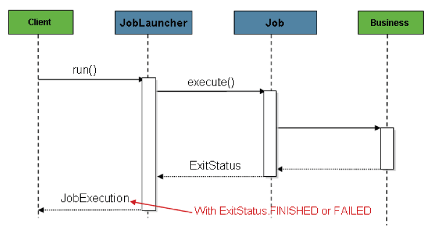
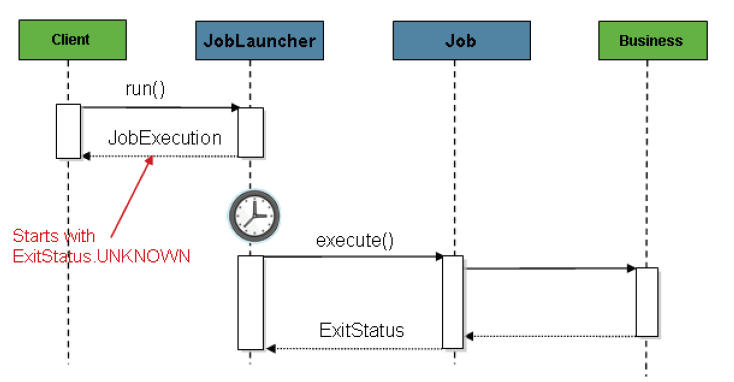

# JobLauncher

## 개요
JobLauncher는 배치작업을 실행시키는 역할을 한다. Job과 Job Parameters를 이용하여 요청된 배치 작업을 수행한 후 JobExecution을 반환한다.

## 설명
JobLauncher 인터페이스를 보면 Job과 Job Parameter를 이용하여 요청된 Job을 수행한 후 JobExecution을 반환되는 run메소드가 정의되어 있다.

```java
public interface JobLauncher {
 
	public JobExecution run(Job job, JobParameters jobParameters) throws JobExecutionAlreadyRunningException,
			JobRestartException, JobInstanceAlreadyCompleteException, JobParametersInvalidException;
 
}
```

JobLauncher 인터페이스의 기본 구현 클래스로는 SimpleJobLauncher이 제공된다. SimpleJobLauncher클래스는 JobName과 JobParameter를 이용하여 JobRepository에서 Job의 실행시도를 나타내는 JobExecution을 획득하고 작업을 수행한다.

이를 이용한 jobLauncher 설정은 아래와 같다. JobExecution을 획득하기 위한 [jobRepository](./batch-execution-job-repository.md)의 설정이 필수이다.

```xml
<bean id="jobLauncher" class="org.springframework.batch.core.launch.support.SimpleJobLauncher">
       <property name="jobRepository" ref="jobRepository" />
</bean>
```

JobLauncher는 taskExecutor 설정을 통해 Job을 동기적, 혹은 비동기적으로 실행할 수 있다. 별도로 설정하지 않으면 syncTaskExecutor클래스가 디폴트로 설정되어 동기적으로 아래와 같이 실행된다. client에게 배치작업의 요청을 받게 되면 JobLauncher는 하나의 JobExecution을 획득하고, 그것을 배치작업을 실행하는 메소드에 전달하여 최종적으로 배치 작업 후 Client에게 JobExecution을 반환한다.

- 동기
  


위의 흐름은 간단하며 스케줄러에서 실행하면 잘 동작하지만, HTTP 요청에서 시작하려고 할 때 문제가 발생한다. 배치 작업의 특성상 처리시간이 오래 걸리는 작업이 많을 것이고,그 작업시간동안 <Acronym title="Hyper Text Transfer Protocol">HTTP</Acronym> 응답을 계속 기다리는 것은 좋지 않다. 이 경우에는 아래와 같이 SimpleJobLauncher가 Client에게 즉시 JobExecution을 반환하는 비동기식 동작 방법이 필요하다.
- 비동기



JobLauncher 설정에서 SimpleAsyncTaskExecutor클래스를 통해 비동기로도 쉽게 설정할 수 있다.

```xml
<bean id="jobLauncher" class="org.springframework.batch.core.launch.support.SimpleJobLauncher">
       <property name="jobRepository" ref="jobRepository" />
       <property name="taskExecutor">
                <bean class="org.springframework.core.task.SimpleAsyncTaskExecutor" />
       </property>
</bean>
```
Spring의 TaskExecutor 인터페이스의 모든 구현은 비동기로 실행하는 배치작업에 대한 제어의 목적으로 사용된다.

## 참고자료
- [동기/비동기 처리 예제](./batch-example-sync_async.md)
- http://static.springsource.org/spring-batch/reference/html/configureJob.html#configuringJobLauncher