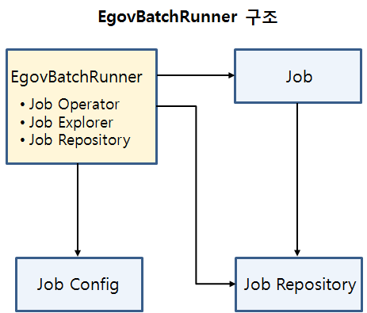
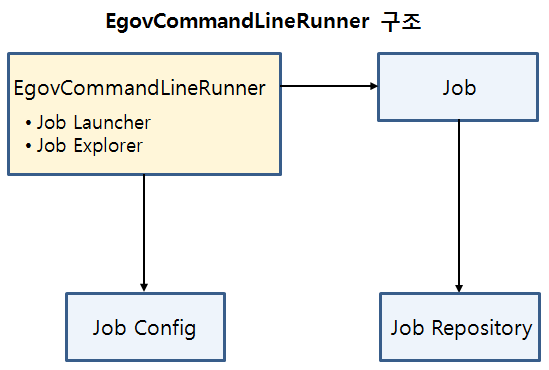
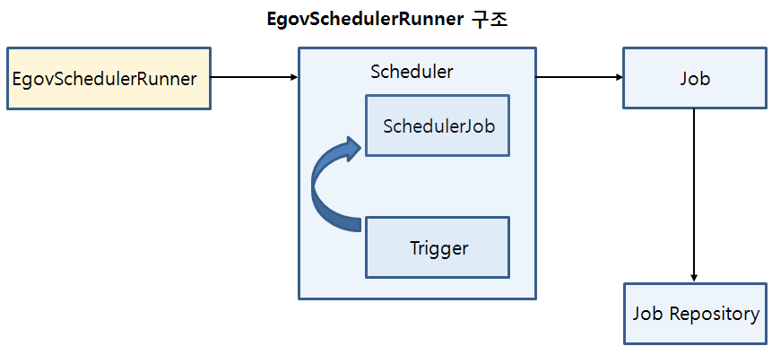

# JobRunner

## 개요
JobRunner는 외부 실행 모듈과 JobLauncher를 연결해주는 모듈로, 용도에 맞게 구현이 필요하다. 전자정부 표준프레임워크에서는 작업실행 유형에 따라 미리 JobRunner를 미리 구현한 표준 Batch Runner를 제공한다.

## 설명
배치작업의 실행 유형에 따라 아래와 같이 3가지의 Batch Runner를 제공한다.

- EgovBatchRunner: Web, Java Application 등을 이용하여 범용적으로 실행되는 일괄처리 작업에 사용한다.
- EgovCommandLineRunner: 외부 프로그램(Windows: / Unix/Linux: crontab 등)이나 명령 프롬프트(Windows: bat / Unix/Linux: Shell)에서 독립적으로 실행되는 배치작업에 사용한다.
- EgovSchedulerRunner: 주기적으로 실행되어야 하는 일괄처리 작업에 사용한다.

각 Batch Runner가 제공하는 기능은 아래와 같다.

| Batch Runner 종류       | Java Application 실행 | Web 실행 | Job 상태 모니터링 | Scheduling 기능 | 명령 프롬프트 연동 지원 |
| --------------------- | ------------------- | ------ | ----------- | ------------- | ------------- |
| EgovBatchRunner       | O                   | O      | O           | X             | △             |
| EgovCommandLineRunner | O                   | X      | O           | X             | O             |
| EgovSchedulerRunner   | O                   | O      | X           | O             | △             |

✔ EgovBatchRunner, EgovSchedulerRunner에서 명령 프롬프트 연동을 위해서는 추가적인 구현이 필요하다.

### EgovBatchRunner

#### 구조
EgovBatchRunner를 이용하여 Job Operator 및 Job Explorer를 이용하여 Job Config에 등록된 Job을 실행하고, 실행 상태를 변경할 수 있다. 또한 Job Repository에 접근할 수 있는 기능을 제공한다.



#### 설정방법
EgovBatchRunner를 사용하기 위해서는 XML 파일에 JobOperator, JobExplorer 그리고 JobRepository가 정의되어야 한다. 그리고 JobOperator를 생성하기 위해서는 JobLauncher와 JobRegistry의 정의가 필요하다.

```xml
<bean id="jobOperator"
	class="org.springframework.batch.core.launch.support.SimpleJobOperator"
	p:jobLauncher-ref="jobLauncher" p:jobExplorer-ref="jobExplorer"
	p:jobRepository-ref="jobRepository" p:jobRegistry-ref="jobRegistry" />
 
<bean id="jobLauncher"
	class="org.springframework.batch.core.launch.support.SimpleJobLauncher">
	<property name="jobRepository" ref="jobRepository" />
</bean>
 
<bean id="jobRepository"
	class="org.springframework.batch.core.repository.support.JobRepositoryFactoryBean"
	p:dataSource-ref="egov.dataSource" p:transactionManager-ref="transactionManager"
	p:lobHandler-ref="lobHandler" />
 
<bean id="jobExplorer"
	class="org.springframework.batch.core.explore.support.JobExplorerFactoryBean"
	p:dataSource-ref="egov.dataSource" />
 
<bean id="jobRegistry"
	class="org.springframework.batch.core.configuration.support.MapJobRegistry" />
```

EgovBatchRunner의 생성자에 JobOperator, JobExplorer, JobRepository를 전달한다.

```xml
<bean id="jobBatchRunner" class="egovframework.brte.core.launch.support.EgovBatchRunner">
	<constructor-arg ref="jobOperator" />
	<constructor-arg ref="jobExplorer" />
	<constructor-arg ref="jobRepository" />
</bean>
```

#### 제공기능
EgovBatchRunner에서는 Job Operator, Job Explorer에서 제공하는 주요 메소드를 기반으로 하여 Job Config에 등록된 Job 이름 조회, Job 시작, 재시작, 정지 등의 기능을 제공한다. Job Repository는 메소드를 직접 제공하지 않는 대신, 필요에 따라 Job Repository 객체에 접근할 수 있도록 하였다.

| 메소드명    | 설명                                                                                                             | 파라미터                  |
| ------- | --------------------------------------------------------------------------------------------------------------- | --------------------- |
| start   | 각각 문자열 형태의 Job 이름, Job Parameter를 이용하여 Job을 시작한다. 이 때, Job Parameter는 기존에 실행했던 Job Parameter와 다른 고유한 값을 가져야 한다. | Job 이름, Job Parameter |
| restart | Job의 Execution ID를 이용하여, 정지되었거나 이미 종료 된 Job 중 재실행 가능한 Job 을 재시작한다.                                              | Job의 Execution ID     |
| stop    | Job의 Execution ID를 이용하여, 실행 중인 Job을 정지시킨다.                                                                      | Job의 Execution ID     |

#### Job Parameter의 생성
EgovBatchRunner에서 사용할 Job Parameter를 생성하기 위해서 제공하는 메소드로, Job Parameter를 문자열 형태로 생성한다.

| 메소드명                      | 설명                                                 | 파라미터                                              |
| ------------------------- | --------------------------------------------------- | ------------------------------------------------- |
| createUniqueJobParameters | Timestamp를 이용하여 유일한 값을 지니는 Job Parameter 문자열을 생성한다. | 없음                                                |
| addJobParameter           | 이미 생성된 Job Parameter 문자열에 Job Parameter 문자열을 추가한다.  | 기존 Job Parameter 변수 ,추가할 Job Parameter 이름(키), 값 , |

Job Parameter 생성 예제는 아래와 같다.

1. Job Parameter를 생성한다. 이 때, 생성되는 Job Parameter는 Timestamp 값을 지니고 있어 유일성이 보장된다.
1. 생성한 Job Parameter 변수에 “inputFile”이라는 Job Parameter 이름을 지닌 Job Parameter를 추가하고, ”/egovframework/batch/data/inputs/csvData.csv”라는 값을 할당한다.

```java
	String jobParameters = egovBatchRunner.createUniqueJobParameters();
 
	jobParameters = egovBatchRunner.addJobParameter(jobParameters, "inputFile", "/egovframework/batch/data/inputs/csvData.csv");
```

이렇게 생성된 JobParameters는 XML에서 사용할 수 있다. 자세한 내용은 [Job Parameters](./batch-core-job#jobparameters) 항목을 참조한다.

#### 사용방법
EgovBatchRunner 예제

### EgovCommandLineRunner

#### 구조
EgovCommandLineRunner는 Job Launcher 및 Job Explorer를 이용하여 Job Config에 등록된 Job을 실행할 수 있으며, 실행할 수 있도록 하는 기능을 제공한다.



#### 제공기능
EgovCommandLineRunner에서는 start 메소드를 이용하여 Job을 시작한다. start 메소드에 필요한 파라미터는 아래와 같으며, 배치실행을 위해서는 Job Path와 Job Identifier는 반드시 필요하다.

| 파라미터           | 설명                               |
| -------------- | --------------------------------- |
| Job Path       | Job 실행에 필요한 context 정보가 들어있는 xml  |
| Job Identifier | 실행할 Job의 이름, 혹은 Job의 Execution ID |
| Parameters     | Job Parameter                     |
| Option         | 실행옵션                              |

실행옵션을 지정하지 않았을 경우 Job을 시작한다. 그리고 실행옵션을 지정했을 경우 해당하는 동작을 수행하며, Job Identifier의 지정 방식도 달라진다. 실행옵션의 종류 및 Job Identifier 지정방식은 아래와 같다.

| 실행옵션      | 설명                                       | Job Identifier    |
| --------- | ----------------------------------------- | ----------------- |
| 미지정       | Job을 시작한다.                                | Job의 이름           |
| \-restart | 정지되었거나 이미 종료 된 Job 중 재실행 가능한 Job 을 재시작한다. | Job의 Execution ID |
| \-stop    | 실행 중인 Job을 정지시킨다.                         | Job의 Execution ID |
| \-next    | Job을 JobParameter만 변경하여 실행한다.             | Job의 Execution ID |
| \-abandon | 정지된 Job의 상태를 “ABANDONED”으로 변경한다.          | Job의 Execution ID |

#### 사용방법
[배치 템플릿을 이용한 EgovCommandLineRunner 예제](../../runtime-example/individual-example/batch-layer/batch-core-egov_commandline_runner_template.md)

### EgovSchedulerRunner

#### 구조
기존의 Batch Runner와는 다르게, EgovSchedulerRunner는 Job을 직접 실행하는 것이 아니라 Scheduler를 실행한다. 이 Scheduler가 설정되어 있는 시간 및 주기 간격으로 Job을 실행하게 된다. Scheduler는 Quartz를 사용하고 있으며, Quartz의 자세한 사용법 및 설정 방법은 [Scheduling](../foundation-layer/scheduling-service.md) 서비스를 참고한다.



#### 설정 및 사용방법
[배치 템플릿을 이용한 EgovSchedulerRunner 예제](../../runtime-example/individual-example/batch-layer/batch-core-egov_scheduler_runner_template.md)