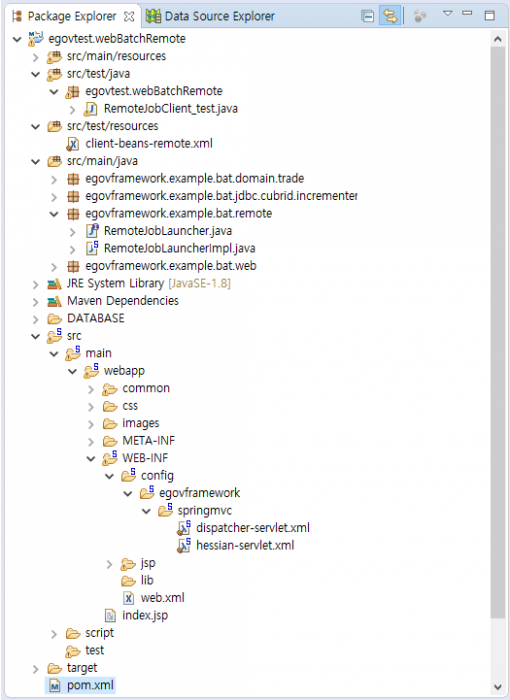

# Remote JobLauncher

## 개요
Remote JobLauncher는 온라인 상에서 별도의 배치 서버의 Batch Job작업을 실행시키는 역할을 한다.
온라인 상의 Client와 Server를 이용하여 요청된 배치 작업을 수행한다.

## 구성
온라인상의 Remote JobLauncher를 구현하기 위하여 Hessian Binary Web Service를 사용한다.
Hessian 웹서비스는 별도의 대형 프레임워크를 설치하지 않고도 간편하게 사용할 수 있은 웹서비스이며, HTTP기반의 경량 바이러리 프로토콜로 별도의 확장없이 바이너리 데이터를 전송하는데 적합하다.
또한, 스피링의 HessianProxyFactoryBean과 HessianServiceExporter를 사용하여 편리한 Integration을 지원한다.

Hessian을 사용하기 위하여 아래와 같이 라이브러리 디펜던시를 설정한다.

```xml
<dependency>
    <groupId>com.caucho</groupId>
    <artifactId>hessian</artifactId>
    <version>4.0.38</version>
</dependency>
```

아래의 예제는 표준프레임워크 개발환경(v3.7)의 배치 템플릿 (SAM파일 Web 기반)을 사용하여 기존의 JobLauncher를 웹서비스에 등록하여 외부(Client)에서 호출하여 실행한다.
본 가이드의 실행 예제는 <a href="https://maven.egovframe.go.kr/publist/HDD1/public/egovframework_v3.7/example/egovtest.webBatchRemote.zip" class="urlextern" title="https://maven.egovframe.go.kr/publist/HDD1/public/egovframework_v3.7/example/egovtest.webBatchRemote.zip" rel="nofollow">RemoteJobLauncher 예제</a>에서 다운로드하여 확인할 수 있다.

Remote JobLauncher의 예제 작성 방법을 다음과 같다.

**Web 서비스 (Server)**
- (Step 1) 표준프레임워크 개발환경에서 배치 템플릿을 생성한다.
템플릿의 대상은 SAM파일 형식의 Web 프로젝트이다.
관련 템플릿 생성 방법은 [배치 템플릿 위저드](https://www.egovframe.go.kr/wiki/doku.php?id=egovframework:dev2.5:imp:editor:batch_template_wizard)를 참조한다.
- (Step 2) 생성된 배치 템플릿에 Hessain Web Service의 라이브러리를 등록한다.
- (Step 3) 서버의 RemoteJobLauncher를 작성한다. (interface 및 Implement 클래스 작성)
RemoteJobLauncher의 구현체는 Template의 BatchRunController의 batchRun을 참조한다.
- (Step 4) 작성된 RemoteJobLauncher를 스프링의 HessianServletExporter을 이용하여 빈생성과 새로운 Servlet을 작성한다.
  
**테스트 (Client)**
- (Step 1) Client에서는 HessianProxyFactoryBean을 사용하여 서버의 웹서비스 Url을 등록한다.
- (Step 2) 등록된 웹서비스를 통하여 RemoteJobLauncher를 실행한다.



## 설명

### Remote 웹 서비스 (Sever-side)
**Step 1** 개발환경의 배치 템플릿 생성
개발환경의 “New Batch Template Project”를 이용하여 SAM파일 형식의 Web 기반 템플릿을 생성한다.
배치 템플릿 관련 자세한 사항은 배치 템플릿 위저드를 참조한다.

**Step 2** Hessain Web Service의 라이브러리 등록
작성할 Batch JobLauncher를 온라인상에서 실행하기 위하여 바이너리 형식의 간편한 Web Service인 Hessian을 사용하며, 해당 라이브러리를 pom.xml에 등록한다.

```xml
<dependency>
    <groupId>com.caucho</groupId>
    <artifactId>hessian</artifactId>
    <version>4.0.38</version>
</dependency>
```

**Step 3** RemoteJobLaucher 작성
RemoteJobLauncher는 웹서비스에 호출할 수 있는 인터페이스이며 이를 통하여 작성된 배치를 실행하고, 또한 필요한 경우 결과값을 넘겨주는 역활을 한다.
작성된 RemoteJobLauncher를 HessianServiceExporter에 등록하기 위하여 인터페이스 클래스와 구현체(Implement)클래스를 작성하여야 한다.

```java
package egovframework.example.bat.remote;
 
import java.util.HashMap;
 
public interface RemoteJobLauncher {
 
	public HashMap<String,Object> callRemoteBatchRunner(String jobName);	
 
}
```

```java
package egovframework.example.bat.remote;
 
import java.util.ArrayList;
...
import egovframework.rte.bat.core.launch.support.EgovBatchRunner;
 
public class RemoteJobLauncherImpl implements RemoteJobLauncher {
 
	...
 
	@Override
	public HashMap<String,Object> callRemoteBatchRunner(String jobName) {
 
        //배치 템플릿의 BatchRunController.java의 batchRun메소드를 참조한다.
        ...
 
        return resultMap;
        }
```

- callRemoteBatchRunner메소드는 배치 템플릿의 BatchRunController클래스의 batchRun메소드를 참조하여 작성한다.

**Step 4** RemoteJobLauncher로 빈생성 및 서블릿 등록
- 빈등록을 위하여 HessianServiceExporter를 사용하며, 인자값으로 service와 serviceInterface를 작성한다.
HassianServiceExporter의 name(EgovJobLauncher.remote)은 요청 Url 서비스의 매핑 주소이며, 별도의 명시적 매핑 핸들러를 지정하지 않고도 DispatcherServlet의 매핑에 해당 Bean의 이름을 통하여 서비스를 제공한다.

```xml
<bean name="/EgovJobLauncher.remote" class="org.springframework.remoting.caucho.HessianServiceExporter">
	<property name="service" ref="remoteJobLauncher" />
	<property name="serviceInterface" value="egovframework.example.bat.remote.RemoteJobLauncher" />
</bean>
<bean id="remoteJobLauncher" class="egovframework.example.bat.remote.RemoteJobLauncherImpl" />
```

```
** 웹서비스 호출 예시 **
http://<domain_address>/<context_path>/EgovJobLauncher.remote
```

- 서블릿 설정은 web.xml에 별도로 작성한다.
본 가이드에서는 *.remote사용하여 별도의 url-pattern을 작성하였다.

```xml
<servlet>
	<servlet-name>remoting</servlet-name>
	<servlet-class>org.springframework.web.servlet.DispatcherServlet</servlet-class>
	<init-param>
		<param-name>contextConfigLocation</param-name>
		<param-value>/WEB-INF/config/egovframework/springmvc/hessian-servlet.xml</param-value>
	</init-param>
	<load-on-startup>1</load-on-startup>
</servlet>
<servlet-mapping>
	<servlet-name>remoting</servlet-name>
	<url-pattern>*.remote</url-pattern>
</servlet-mapping>
```

### 테스트 (Client-side)
Remote 배치 서비스를 호출하기 위하여 스프링의 HessianProxyFactoryBean을 사용하며 배치 실행 후 결과 값으로 배치 실행정보를 출력한다.
- 본 테스트 예제는 프로젝트의 src/test영역에 자바 클래스(RemoteJobClient_test)와 빈설정(client-beans-remote)파일로 구성되어 있다.
  
**Step 1** HessainProxyFactoryBean에 RemoteJobLanucher를 등록한다.
인자값으로 serviceUrl을 지정할 수 있으며, serviceInterface를 지정하여 런처의 메소드를 실행할 수 있다.

```xml
<bean id="remoteHessianJobLauncher" 
      class="org.springframework.remoting.caucho.HessianProxyFactoryBean">		
	<property name="serviceUrl"
                  value="http://localhost:8080/egovframework.example.bat.template.sam.web/EgovJobLauncher.remote" />
	<property name="serviceInterface" value="egovframework.example.bat.remote.RemoteJobLauncher" />
</bean>
```

**Step 2** 테스트 파일을 작성하여 등록된 웹서비스를 호출한다.
아래와 같이 테스트 파일을 작성하여 웹서비스를 호출하며 템플릿 예제의 “delimitedToDelimitedJob” 배치 job을 실행하여 결과로 Job Instance 및 step Info를 출력한다.

```java
package egovtest.webBatchRemote;
 
import org.springframework.context.ApplicationContext;
...
import egovframework.example.bat.remote.RemoteJobLauncher;
 
public class RemoteJobClient_test {
 
public static void main(String[] args) {
		ApplicationContext context = new ClassPathXmlApplicationContext("client-beans-remote.xml");
		RemoteJobLauncher remoteJobLauncher = (RemoteJobLauncher) context.getBean("remoteHessianJobLauncher");
		String jobName = "delimitedToDelimitedJob";
 
		HashMap<String,Object> map = (HashMap<String, Object>)remoteJobLauncher.callRemoteBatchRunner(jobName);
 
		HashMap<String, Object> jobInstances = (HashMap<String, Object>) map.get("jobInstances");
		List<HashMap<String, Object>> stepsInfo = (ArrayList<HashMap<String, Object>>)map.get("stepsInfo");
 
		System.out.println("[jobInstance] ===============================================================");
		System.out.println("job id = "+jobInstances.get("id"));
		System.out.println("job name = "+jobInstances.get("name"));
		System.out.println("parameters = "+jobInstances.get("parameters"));
		System.out.println("startTime = "+jobInstances.get("startTime"));
		System.out.println("endTime = "+jobInstances.get("endTime"));
		System.out.println("isRunning = "+ ((boolean)jobInstances.get("isRunning") ? "Running" : "Ready"));
		System.out.println("exitStatus = "+jobInstances.get("exitStatus"));
 
		System.out.println("[stepsInfo] ===============================================================");
		for(HashMap<String,Object> stepInfo : stepsInfo) {
			System.out.println("stepId = "+stepInfo.get("stepId"));
			System.out.println("stepName = "+stepInfo.get("stepName"));
			System.out.println("readCount = "+stepInfo.get("readCount"));
			System.out.println("writeCount = "+stepInfo.get("writeCount"));
			System.out.println("readSkipCount = "+stepInfo.get("readSkipCount"));
			System.out.println("processSkipCount = "+stepInfo.get("processSkipCount"));
			System.out.println("writeSkipCount = "+stepInfo.get("writeSkipCount"));
			System.out.println("totalSkipCount = "+stepInfo.get("totalSkipCount"));
			System.out.println("commitCount = "+stepInfo.get("commitCount"));
			System.out.println("rollbackCount = "+stepInfo.get("rollbackCount"));
			System.out.println("exitStatus = "+stepInfo.get("exitStatus"));
		}
	}
}
```

출력 결과

```
[jobInstance] ===============================================================
job id = 0
job name = delimitedToDelimitedJob
parameters = {inputFile=classpath:/egovframework/batch/data/inputs/csvData.csv, outputFile=file:xxxxx/remote-batch-output/csvOutput_xxxx.csv, timestamp=xxxxxxxxxxx}
startTime = 201x-xx-xx xx:xx:xx.xxx
endTime = 201x-xx-xx xx:xx:xx.xxx
isRunning = Ready
exitStatus = COMPLETED
[stepsInfo] ===============================================================
stepId = 0
stepName = delimitedToDelimitedStep
readCount = 4
writeCount = 4
readSkipCount = 0
processSkipCount = 0
writeSkipCount = 0
totalSkipCount = 0
commitCount = 3
rollbackCount = 0
exitStatus = COMPLETED
```

## 참고자료
- [스프링의 Hessian Remotely call servcies](https://docs.spring.io/spring-framework/docs/3.0.0.M4/reference/html/ch19s03.html)
- [Hessian Binary Web Service Protocol](http://hessian.caucho.com/)
