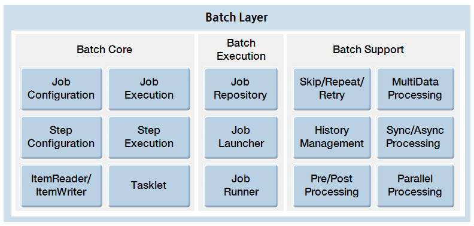

# 배치 실행환경 소개

## 개요

전자정부 표준프레임워크에서의 대용량 데이터 처리 지원을 위해 작업수행 및 결과 관리 및 스케줄링 관리 기능을 제공한다.

## 목표

배치 실행환경은 대용량 데이터 처리를 위한 기반 환경을 제공함으로써 배치 실행에 필요한 핵심 기능을 제공한다.

## 배치 실행환경 수행 과정

전자정부 표준프레임워크 실행환경에 추가된 배치 실행환경은 3-Tier(Run, Job, Application Tier)로 구성되며, 대용량 데이터 처리를 위한 기반 환경을 제공한다.

### Run Tier

Run Tier는 배치 응용프로그램의 실행을 담당하고 있다. 실행 방식에 따라 Scheduler, Http/Web service, CommandLine으로 나눌 수 있다.
✔ Spring 배치에서는 Scheduler 실행을 위해서 Quartz나 Cron을 이용하도록 권고하고 있다.

Run Tier에서 이뤄지는 동작의 순서는 아래와 같다.

1. Job Configuration은 xml 형태이며, Job을 수행하는데 필요한 Job 설정 정보가 담겨있다.
2. Scheduler, Http/Web service, CommandLine 등의 외부 모듈이 JobRunner를 호출한다.
3. JobRunner는 JobLocator(***JobExplorer***)를 통해 Job Configuration에 등록되어 있는 Application Context 정의를 참조하여, Job Tier의 JobLauncher가 Job을 실행할 수 있도록 정보를 전달한다.

### Job Tier

Job Tier 전체적인 Job의 수행을 책임진다. Job내의 각 Step들을 지정한 상태와 정책에 따라 순차적으로 수행한다.

Job Tier에서 이뤄지는 동작의 순서는 아래와 같다.

1. eGovJob과 eGovStep은 각각 Spring 배치의 Job과 Step을 참조한 것으로, xml 형태로 기술되어 있다.
2. JobLauncher는 JobRunner부터 전달 받은 Job 설정 정보와 Job 정의 내용을 바탕으로 실제 Job을 수행한다.
3. JobRepository는 수행되는 Job의 정보를 담고 있으며, 수행 단계에 따라 변경되는 Job의 상태 정보를 저장한다.

### Application Tier

Application Tier는 Job과 Step을 수행하는데 필요한 component로 구성된다.

Application Tier에서 이뤄지는 동작의 순서는 아래와 같다.

1. eGovStep은 Spring 배치의 Step을 참조한 것으로, xml 형태로 기술되어 있다. 하나의 Job은 하나 혹은 복수의 Step으로 구성된다
2. eGovStepReader / eGovStepWriter는 Spring Batch의 ItemReader / ItemWriter를 참조한 것으로, 일반적인 Step 동작에 반드시 필요하다.
3. Step에서는 ItemReader를 이용하여 File / DB로 부터 데이터를 읽어들이고 ItemProcessor로 데이터를 가공하고 ItemWriter로 가공한 데이터를 다시 File / DB로 쓴다.

## 배치 실행환경 수행 과정

전자정부 표준프레임워크 실행환경에 포함되는 대용량 데이터 처리 Layer는 Job의 구조를 정의하는 Batch Core, Job의 실행을 지원하는 Batch Support, 여러 실행환경을 지원하는 Batch Execution 부분으로 구성되어 있다. 배치 실행환경 기술요소 및 기능은 아래 그림과 같다.

### 배치 실행환경 지원

- [SQLite ↑](./brte-batch-core-sqllite.md)   
SQLite를 이용한 경량화된 Repository를 사용하기 위한 사용법에 대해 설명한다.
- [Logback logging ↑](./brte-batch-core-logback-logging.md)   
SQLite를 이용한 경량화된 로깅 처리에 대한 기본사용법에 대해 설명한다.
