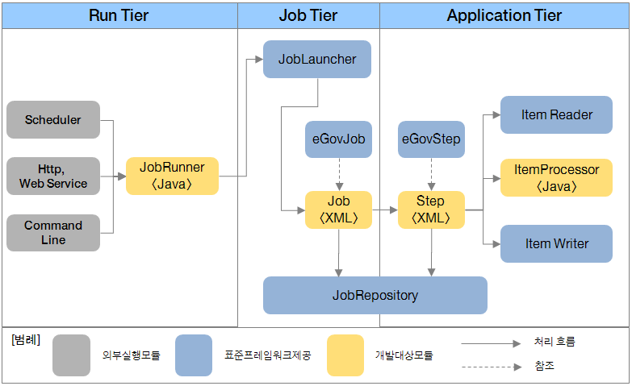
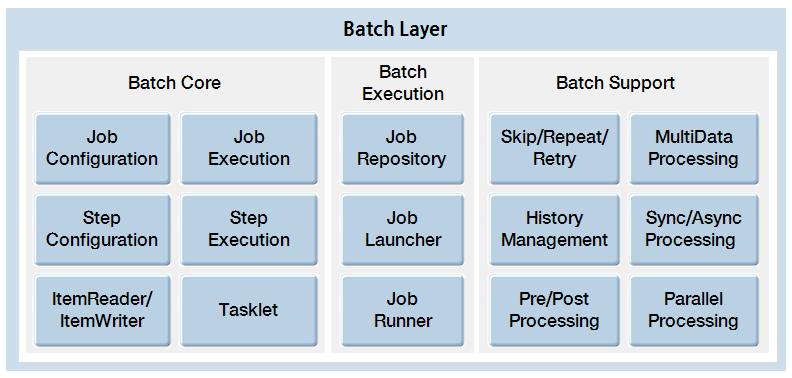

# 배치 실행환경 소개

## 개요
전자정부 표준프레임워크에서 대용량 데이터 처리 지원을 위해 작업 수행, 결과 관리, 스케줄링 관리 기능을 제공한다.

## 목표
배치 실행환경은 대용량 데이터 처리를 위한 기반 환경을 제공함으로써 배치 실행에 필요한 핵심 기능을 제공한다.

## 배치 실행환경 수행 과정  

전자정부 표준프레임워크 실행환경에 추가된 배치 실행환경은 3-Tier(Run, Job, Application Tier)로 구성되며, 대용량 데이터 처리를 위한 기반 환경을 제공한다.  

## Run Tier
Run Tier는 배치 응용 프로그램의 실행을 담당한다. 실행 방식에 따라 **Scheduler**, **Http/Web service**, **CommandLine**으로 나눌 수 있다.  

✔ Spring 배치에서는 Scheduler 실행을 위해 **Quartz**나 **Cron**을 이용하도록 권고하고 있다.

Run Tier에서의 동작 순서는 다음과 같다:

1. **Job Configuration**은 XML 형태로, Job을 수행하는 데 필요한 설정 정보를 담고 있다.
2. **Scheduler**, **Http/Web service**, **CommandLine** 등의 외부 모듈이 **JobRunner**를 호출한다.
3. **JobRunner**는 **JobLocator**(JobExplorer)를 통해 Job Configuration에 등록된 **Application Context** 정의를 참조하여, **Job Tier**의 **JobLauncher**가 Job을 실행할 수 있도록 정보를 전달한다.

---

## Job Tier
Job Tier는 전체적인 Job 수행을 책임지며, 각 Step을 지정된 상태와 정책에 따라 순차적으로 수행한다.

Job Tier에서의 동작 순서는 다음과 같다:

1. **eGovJob**과 **eGovStep**은 각각 Spring 배치의 Job과 Step을 참조한 것으로, XML 형태로 작성되어 있다.
2. **JobLauncher**는 **JobRunner**로부터 전달받은 Job 설정 정보와 정의된 내용을 바탕으로 실제 Job을 수행한다.
3. **JobRepository**는 수행되는 Job의 정보를 담고 있으며, Job 수행 단계에 따라 상태 정보를 저장한다.

---

## Application Tier
Application Tier는 Job과 Step을 수행하는 데 필요한 컴포넌트로 구성된다.

Application Tier에서의 동작 순서는 다음과 같다:

1. **eGovStep**은 Spring 배치의 Step을 참조한 것으로, XML 형태로 기술되어 있다. 하나의 Job은 하나 혹은 여러 Step으로 구성된다.
2. **eGovStepReader** / **eGovStepWriter**는 Spring Batch의 **ItemReader** / **ItemWriter**를 참조한 것으로, 일반적인 Step 동작에 필수적이다.
3. Step은 **ItemReader**를 이용해 **File/DB**에서 데이터를 읽고, **ItemProcessor**로 데이터를 가공한 후, **ItemWriter**를 통해 가공된 데이터를 다시 **File/DB**로 쓴다.

---

## 배치 실행환경 기술 요소 구성
전자정부 표준프레임워크 실행환경에 포함된 대용량 데이터 처리 계층은 Job 구조를 정의하는 **Batch Core**, Job 실행을 지원하는 **Batch Support**, 다양한 실행환경을 지원하는 **Batch Execution**으로 구성되어 있다. 배치 실행환경의 기술 요소와 기능은 다음 그림과 같다.

---

## 배치 실행환경 지원

- [SQLite ↑](./batch-core-sqllite.md)  
**SQLite**를 사용한 경량화된 Repository 사용법을 설명한다.

- [Logback logging ↑](./batch-support-logback_logging.md)  
**SQLite**를 사용한 경량화된 로깅 처리의 기본 사용법을 설명한다.
